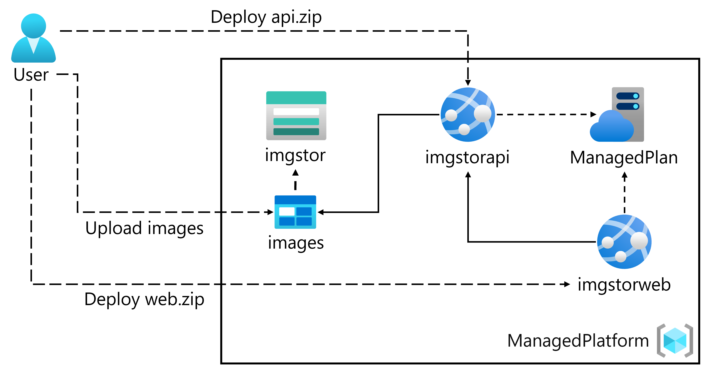

---
lab:
  az204Title: 'Lab 01: Build a web application on Azure platform as a service offerings'
  az204Module: 'Learning Path 01: Implement Azure App Service Web Apps'
---

# Laboratorio 01: Compilación de una aplicación web en ofertas de plataforma como servicio de Azure

## Interfaz de usuario de Microsoft Azure

Dada la naturaleza dinámica de las herramientas en la nube de Microsoft, puede experimentar cambios en la interfaz de usuario de Azure que se producen después del desarrollo de este contenido de entrenamiento. Como resultado, es posible que las instrucciones y los pasos del laboratorio no se alineen correctamente.

Microsoft actualiza este curso de entrenamiento cuando la comunidad nos alerta de los cambios necesarios. Sin embargo, las actualizaciones en la nube se producen con frecuencia, por lo que es posible que se produzcan cambios en la interfaz de usuario antes de que se actualice este contenido de entrenamiento. **Si esto ocurre, adáptese a los cambios y, a continuación, trabaje con ellos en los laboratorios según sea necesario.**

## Instructions

### Antes de comenzar

#### Inicio de sesión al entorno de laboratorio

Inicie sesión en la máquina virtual (VM) de Windows 11 con las credenciales siguientes:

- Nombre de usuario: `Admin`
- Contraseña: `Pa55w.rd`

> **Nota**: El instructor le proporcionará instrucciones para conectarse al entorno de laboratorio virtual.

#### Revisión de las aplicaciones instaladas

Busque la barra de tareas en el escritorio de Windows 11. La barra de tareas contiene los iconos de las aplicaciones que usará en este laboratorio, entre los que se incluyen:

- Microsoft Edge
- Explorador de archivos
- Terminal
- Visual Studio Code

## Escenario de laboratorio

En este laboratorio, explorará cómo crear una aplicación web en Azure mediante el modelo PaaS. Una vez creada la aplicación web, aprenderá a cargar los archivos de aplicación web existentes mediante la opción de implementación zip de Apache Kudu. A continuación, verá y probará la aplicación web recién implementada.

<em>Para ver este vídeo, haga clic con el botón derecho sobre este **[vínculo de vídeo](https://youtu.be/EiSEcU9qjfo)** y seleccione "Abrir vínculo en una pestaña nueva o una ventana nueva".</em>


## Diagrama de la arquitectura



### Ejercicio 1: Compilación de una API de back-end mediante Azure Storage y la característica de Web Apps de Azure App Service

#### Tarea 1: Apertura de Azure Portal

1. En la barra de tareas, seleccione el icono de **Microsoft Edge**.

1. En la ventana del explorador, vaya a Azure Portal en `https://portal.azure.com` y, a continuación, inicie sesión con la cuenta que va a usar para este laboratorio.

   > **Nota**: Si es la primera vez que inicia sesión en Azure Portal, se le ofrecerá un paseo por el portal. Si prefiere omitir esta visita, seleccione **Quizás más adelante** para empezar a usar el portal.

#### Tarea 2: Creación de una cuenta de almacenamiento

1. En Azure Portal, use el cuadro de texto **Buscar recursos, servicios y documentos** para buscar **Cuentas de almacenamiento** y, a continuación, en la lista de resultados, seleccione **Cuentas de almacenamiento**.

1. En la hoja  **Cuentas de almacenamiento** , seleccione **+ Crear**.

1. En la hoja  **Crear una cuenta de almacenamiento** , en la pestaña **Aspectos básicos**, realice las acciones siguientes y seleccione **Revisar**:

    | Configuración | Acción |
    |--|--|
    | Lista desplegable de **Suscripción** | Conserve los valores predeterminados |
    | Sección **Grupo de recursos** | Seleccione **Crear nuevo**, escriba **ManagedPlatform** y seleccione **Aceptar**. |
    | Cuadro de texto **Nombre de la cuenta de almacenamiento**  | Escribir **imgstor** _[sunombre]_ |
    | Lista desplegable de **región** | Seleccione **(EE.UU.) Este de EE. UU.** |
    | **Servicio principal** | Sin cambios |
    | Sección **Rendimiento** | Seleccione la opción **Estándar** |
    | Lista desplegable de **Redundancia** | Seleccione **Almacenamiento con redundancia local (LRS)**. |

   En la captura de pantalla siguiente, se muestran los valores configurados en la pestaña **Aspectos básicos** de la hoja **Crear una cuenta de almacenamiento**.

   

1. En la pestaña **Revisar**, revise las opciones que seleccionó en los pasos anteriores.

1. Seleccione **Crear** para crear la cuenta de almacenamiento mediante la configuración especificada.

   > **Nota**: Espere a que se complete la tarea de creación antes de continuar con este laboratorio.

1. En la hoja **Información general**, seleccione el botón **Ir al recurso** para ir a la hoja de la cuenta de almacenamiento recién creada.

1. En la hoja  **Cuenta de almacenamiento** , en la sección  **Seguridad y redes** , seleccione **Claves de acceso**.

1. En la hoja  **Claves de acceso** , revise cualquiera de las **Cadenas de conexión** (mediante el botón **Mostrar**) y, a continuación, registre el valor de cualquiera de los cuadros **Cadena de conexión**  en el Bloc de notas. Las **Clave**s son claves de cifrado administradas por la plataforma y **no** se usan para este laboratorio.

   > **Nota**: No importa la cadena de conexión que elija. Son intercambiables.

1. Abra Bloc de notas y pegue el valor de la cadena de conexión copiada en Bloc de notas. Usará este valor más adelante en este laboratorio.

#### Tarea 3: Carga de un blob de ejemplo

1. En la hoja **Cuenta de almacenamiento**, en la sección **Almacenamiento de datos**, seleccione el vínculo **Contenedores**.

1. En la hoja **Contenedores**, seleccione **+ Contenedor**.

1. En la ventana **Nuevo contenedor**, realice las siguientes acciones y, a continuación, seleccione **Crear**.

   | Configuración | Acción |
   | --- | --- |
   | Cuadro de texto de **nombre** | Escribir **images** |

1. En la hoja **Contenedores**, vaya al contenedor de **imágenes** recién creado.

1. En la hoja **imágenes**, seleccione **Cargar**.

1. En la ventana **Cargar blob**, realice las siguientes acciones:

    | Configuración | Acción |
    |--|--|
    | Sección **Archivos** | Seleccione **Buscar archivos** o use la característica de arrastrar y colocar. |
    | Ventana **Explorador de archivos** | Vaya a **Allfiles (F):\\Allfiles\\Labs\\01\\Starter\\Images**, seleccione el archivo **grilledcheese.jpg** y, a continuación, seleccione **Abrir**. |
    | Casilla **Sobrescribir si ya hay archivos** | Asegúrese de que la casilla está seleccionada y, a continuación, seleccione **Cargar**. |

    > **Nota**: Espere a que se cargue el blob antes de continuar con este laboratorio.

#### Tarea 4: Creación de una aplicación web

1. En el panel de navegación de Azure Portal, seleccione **Crear un recurso**.

1. En la hoja **Crear un recurso**, en el cuadro de texto **Buscar Servicios y Marketplace**, escriba **Aplicación web** y, a continuación, seleccione ENTRAR.

1. En la hoja de resultados de búsqueda de **Marketplace**, seleccione el resultado de **Aplicación web**.

1. En la hoja **Aplicación web**, haga clic en **Crear**.

1. En la hoja **Crear aplicación web**, en la pestaña **Aspectos básicos**, realiza las acciones siguientes y, después, selecciona la pestaña **Supervisión y seguridad**:

   | Configuración                            | Acción                                                                                                  |
   | ---------------------------------- | ------------------------------------------------------------------------------------------------------- |
   | Lista desplegable de **Suscripción**    | Conserve los valores predeterminados                                                                                |
   | Sección **Grupo de recursos**         | Seleccionar **ManagedPlatform**                                                                              |
   | Cuadro de texto **Nombre**                   | Escribir **imgapi** _[sunombre]_                                                                            |
   | Sección **Publicar**                | Seleccione **Código**.                                                                                         |
   | Lista desplegable de la **pila en tiempo de ejecución**   | Seleccionar **.NET 8 (LTS)**                                                                                 |
   | Sección **Sistema operativo**       | Seleccione **Windows**                                                                                      |
   | Lista desplegable de **Región**          | Seleccionar la región **Este de EE. UU.**                                                                           |
   | Sección **Plan de Windows (Este de EE. UU.)** | Seleccione **Crear nuevo**, escriba **ManagedPlan** en el cuadro de texto **Nombre** y seleccione **Aceptar**. |
   | Sección **Plan de precios**           | Seleccione **Estándar S1**.                                                                                  |

   En la captura de pantalla siguiente, se muestran los valores configurados en la hoja **Crear aplicación web**.

   

1. En la pestaña **Supervisión y seguridad**, en la sección **Habilitar Application Insights**, selecciona **No** y luego selecciona **Revisar y crear**.

1. En la pestaña **Revisar y crear**, revise las opciones que seleccionó durante los pasos anteriores.

1. Seleccione **Crear** para crear la aplicación web mediante la configuración especificada.

   > **Nota**: Espere a que se cree la aplicación web antes de continuar con este laboratorio.

1. En la hoja **Información general**, seleccione el botón **Ir al recurso** para ir a la hoja de la aplicación web recién creada.

#### Tarea 5: Configuración de la aplicación web

1. En la hoja **App Service**, en la sección **Configuración**, seleccione el vínculo **Variables de entorno**.

1. En la pestaña **Configuración de la aplicación**, seleccione **+ Agregar**. Introduzca la siguiente información en el cuadro de diálogo emergente **Agregar o editar configuración de la aplicación**:

    | Configuración | Acción |
    |--|--|
    | Cuadro de texto de **nombre** | Introduzca **StorageConnectionString** |
    | Cuadro de texto **Valor** | Pegue la cadena de conexión de almacenamiento que copió anteriormente en Bloc de notas. |
    | Casilla **Configuración de la ranura de implementación** | Conserve los valores predeterminados |

1. Seleccione **Aplicar** para cerrar el cuadro de diálogo emergente y vuelva a la sección **Configuración de la aplicación**.

1. En la parte inferior de la sección **Configuración de la aplicación**, seleccione **Aplicar**.

   >**Nota:** Es posible que reciba una advertencia de que su aplicación puede reiniciarse al actualizar la configuración de la aplicación. Seleccione **Confirmar**. Espere a que se guarde la configuración de la aplicación antes de continuar con el laboratorio.

1. Para obtener la dirección URL de App Service, vaya al vínculo **Información general**, copie el valor de la sección **Dominio predeterminado** y péguelo en el Bloc de notas. Anteponga `https://` al nombre de dominio en el Bloc de notas. Usará este valor más adelante en este laboratorio.

   > **Nota**: En este momento, el servidor web de esta dirección URL devolverá una página web de marcador de posición. Aún no ha implementado ningún código en la aplicación web. Implementará código en la aplicación web más adelante en este laboratorio.

#### Tarea 6: Implementación de una aplicación web de `ASP.NET` en Web Apps

1. En la barra de herramientas, seleccione el icono **Visual Studio Code**.

1. En el menú **Archivo**, seleccione **Abrir carpeta**.

1. En la ventana **Explorador de archivos**, vaya a **Allfiles (F):\\Allfiles\\Labs\\01\\Starter\\API** y, a continuación, seleccione **Seleccionar carpeta**.

   > **Nota**: Ignore los mensajes para agregar los recursos necesarios para compilar y depurar, así como para ejecutar el comando restore y solucionar las dependencias sin resolver.

1. En el panel  **Explorador**  de la ventana **Visual Studio Code**, expanda la carpeta  **Controladores** y, a continuación, seleccione el archivo **ImagesController.cs** para abrir el archivo en el editor.

1. En el editor, en la clase **ImagesController** de la línea 26, observe el método **GetCloudBlobContainer** y el código usado para recuperar un contenedor.

1. En la clase **ImagesController** de la línea 36, observe el método **Get** y el código usado para recuperar todos los blobs de forma asincrónica del contenedor de **imágenes**.

1. En la clase **ImagesController** de la línea 68, observa el método **Post** y el código usado para conservar una imagen cargada en Storage.

1. En la barra de tareas, seleccione el icono **Terminal**.

1. En el terminal abierto, escriba el siguiente comando y, a continuación, seleccione ENTRAR para iniciar sesión en la interfaz de la línea de comandos (CLI) de Azure:

   ```
   az login
   ```

1. En la ventana del explorador **Microsoft Edge**, escriba la dirección de correo electrónico y la contraseña de su cuenta Microsoft y, a continuación, seleccione **Iniciar sesión**.

1. Vuelva a la ventana de **Terminal** abierta actualmente. Espere a que finalice el proceso de inicio de sesión.

1. En el terminal, escriba el siguiente comando y, a continuación, seleccione ENTRAR para enumerar todas las aplicaciones del grupo de recursos **ManagedPlatform**:

   ```
   az webapp list --resource-group ManagedPlatform
   ```

1. Escriba el siguiente comando y, a continuación, seleccione ENTRAR para buscar las aplicaciones que tienen el prefijo **imgapi\*** :

   ```
   az webapp list --resource-group ManagedPlatform --query "[?starts_with(name, 'imgapi')]"
   ```

1. Escriba el siguiente comando y, a continuación, seleccione ENTRAR para representar solo el nombre de la aplicación única que tiene el prefijo **imgapi\*** :

   ```
   az webapp list --resource-group ManagedPlatform --query "[?starts_with(name, 'imgapi')].{Name:name}" --output tsv
   ```

1. Escriba el siguiente comando y, a continuación, seleccione ENTRAR para cambiar el directorio actual al directorio **Allfiles (F):\\Allfiles\\Labs\\01\\Starter\\API** que contiene los archivos de laboratorio:

   ```
   cd F:\Allfiles\Labs\01\Starter\API\
   ```

1. Escriba el siguiente comando y, a continuación, seleccione ENTRAR para implementar el archivo **api.zip** en la aplicación web que creó anteriormente en este laboratorio:

   ```
   az webapp deployment source config-zip --resource-group ManagedPlatform --src api.zip --name <name-of-your-api-app>
   ```

   > **Nota**: Reemplace el marcador de posición *\<name-of-your-api-app\>* por el nombre de la aplicación web que creó anteriormente en este laboratorio. Recientemente ha consultado el nombre de esta aplicación en los pasos anteriores.

   Espere a que se complete la operación de implementación antes de continuar con este laboratorio.

1. En el **panel de navegación** de Azure Portal, seleccione el vínculo **Grupos de recursos**.

1. En la hoja **Grupos de recursos**, seleccione el grupo de recursos **ManagedPlatform** que creó anteriormente en este laboratorio.

1. En la hoja **ManagedPlatform**, seleccione la aplicación web **imgapi** _[yourname]_ que creó anteriormente en este laboratorio.

1. En la hoja de **App Service**, seleccione **Examinar**.

   > **Nota**: El comando **Examinar** realizará una solicitud GET a la raíz del sitio web, que devuelve una notación de objetos JavaScript (JSON). Esta matriz debe contener la dirección URL de la única imagen cargada en la cuenta de almacenamiento.

1. Vuelva a la ventana del explorador que contiene Azure Portal.

1. Cierre las aplicaciones de Visual Studio Code y Terminal actualmente en ejecución.

#### Revisar

En este ejercicio, ha creado una aplicación web en Azure y, a continuación, ha implementado la aplicación web de `ASP.NET` en Web Apps mediante la utilidad de implementación de archivos ZIP de la CLI de Azure y Apache Kudu.

### Ejercicio 2: Compilación de una aplicación web front-end mediante Azure Web Apps

#### Tarea 1: Creación de una aplicación web

1. En el panel de **navegación** de Azure Portal, seleccione **Crear un recurso**.

1. En la hoja **Crear un recurso**, en el cuadro de texto **Buscar Servicios y Marketplace**, escriba **Aplicación web** y, a continuación, seleccione ENTRAR.

1. En la hoja de resultados de búsqueda de **Marketplace**, seleccione **Aplicación web**.

1. En la hoja **Aplicación web**, haga clic en **Crear**.

1. En la hoja **Crear aplicación web**, en la pestaña **Aspectos básicos**, realiza las acciones siguientes y, después, selecciona la pestaña **Supervisión y seguridad**:

   | Configuración                            | Acción                        |
   | ---------------------------------- | ----------------------------- |
   | Lista desplegable de **Suscripción**    | Conserve los valores predeterminados      |
   | Sección **Grupo de recursos**         | Seleccionar **ManagedPlatform**    |
   | Cuadro de texto **Nombre**                   | Escribir **imgweb** _[sunombre]_  |
   | Sección **Publicar**                | Seleccione **Código**.               |
   | Lista desplegable de la **pila en tiempo de ejecución**   | Seleccionar **.NET 8 (LTS)**       |
   | Sección **Sistema operativo**       | Seleccione **Windows**            |
   | Lista desplegable de **Región**          | Seleccionar la región **Este de EE. UU.** |
   | Sección **Plan de Windows (Este de EE. UU.)** | Seleccionar **ManagedPlan (S1)**   |

En la captura de pantalla siguiente, se muestran los valores configurados en la hoja **Crear aplicación web**.


1. En la pestaña **Supervisión y seguridad**, en la sección **Habilitar Application Insights**, selecciona **No** y luego selecciona **Revisar y crear**.

1. En la pestaña **Revisar y crear**, revise las opciones que seleccionó durante los pasos anteriores.

1. Seleccione **Crear** para crear la aplicación web mediante la configuración especificada.

   > **Nota**: Espere a que se complete la tarea de creación antes de continuar con este laboratorio.

1. En la hoja **Información general**, seleccione el botón **Ir al recurso** para ir a la hoja de la aplicación web recién creada.

#### Tarea 2: Configuración de una aplicación web

1. En la hoja **App Service**, en la sección **Configuración**, seleccione el vínculo **Variables de entorno**.

1. En la sección **Variables de entorno**, realice las siguientes acciones, seleccione **Guardar**, y a continuación, seleccione **Continuar**:

    | Configuración | Acción |
    |--|--|
    | Pestaña **Configuración de la aplicación** | Haga clic en **Nueva configuración de la aplicación**. |
    | Cuadro de diálogo emergente **Agregar o editar la configuración de la aplicación** | En el cuadro de texto **Nombre**, escriba **ApiUrl**. |
    | Cuadro de texto **Valor** | Escriba la dirección URL de la aplicación web que copió anteriormente en este laboratorio. **Nota**: Asegúrese de incluir el protocolo **https://** en la dirección URL que copia en el cuadro de texto **Valor** de esta configuración de la aplicación. |
    | Casilla **Configuración de la ranura de implementación** | Conserve el valor predeterminado y seleccione **Aceptar**. |
    | Haga clic en **Guardar** en el menú superior | Esto guardará el valor de configuración que acabas de escribir. |

   > **Nota**: Espere a que se guarde la configuración de la aplicación antes de continuar con este laboratorio.

#### Tarea 3: Implementación de una aplicación web de `ASP.NET` en Web Apps

1. En la barra de herramientas, seleccione el icono **Visual Studio Code**.

1. En el menú **Archivo**, seleccione **Abrir carpeta**.

1. En la ventana **Explorador de archivos**, vaya a **Allfiles (F):\\Allfiles\\Labs\\01\\Starter\\Web** y, a continuación, seleccione **Seleccionar carpeta**.

   > **Nota**: Ignore los mensajes para agregar los recursos necesarios para compilar y depurar, así como para ejecutar el comando restore y solucionar las dependencias sin resolver.

1. En el panel  **Explorador**  de la ventana **Visual Studio Code**, expanda la carpeta  **Páginas** y, a continuación, seleccione el archivo **Index.cshtml.cs** para abrir el archivo en el editor.

1. En el editor, en la clase **IndexModel** de la línea 30, observe el método **OnGetAsync** y el código usado para recuperar la lista de imágenes de la API.

1. En la clase **IndexModel** de la línea 41, observe el método **OnPostAsync** y el código usado para transmitir una imagen cargada a la API de back-end.

1. En la barra de tareas, seleccione el icono **Terminal**.

1. En el terminal abierto, escriba el siguiente comando y seleccione Entrar para iniciar sesión en la CLI de Azure:

   ```
   az login
   ```

1. En la ventana del explorador **Microsoft Edge**, escriba la dirección de correo electrónico y la contraseña de su cuenta Microsoft y, a continuación, seleccione **Iniciar sesión**.

1. Vuelva a la ventana de **Terminal** abierta actualmente. Espere a que finalice el proceso de inicio de sesión.

1. Escriba el siguiente comando y, a continuación, seleccione ENTRAR para enumerar todas las aplicaciones del grupo de recursos **ManagedPlatform**:

   ```
   az webapp list --resource-group ManagedPlatform
   ```

1. Escriba el siguiente comando y, a continuación, seleccione ENTRAR para buscar las aplicaciones que tienen el prefijo **imgweb\*** :

   ```
   az webapp list --resource-group ManagedPlatform --query "[?starts_with(name, 'imgweb')]"
   ```

1. Escriba el siguiente comando y, a continuación, seleccione ENTRAR para representar solo el nombre de la aplicación única que tiene el prefijo **imgweb\*** :

   ```
   az webapp list --resource-group ManagedPlatform --query "[?starts_with(name, 'imgweb')].{Name:name}" --output tsv
   ```

1. Escriba el siguiente comando y, a continuación, seleccione ENTRAR para cambiar el directorio actual al directorio **Allfiles (F):\\Allfiles\\Labs\\01\\Starter\\Web** que contiene los archivos de laboratorio:

   ```
   cd F:\Allfiles\Labs\01\Starter\Web\
   ```

1. Escriba el siguiente comando y, a continuación, seleccione ENTRAR para implementar el archivo **web.zip** en la aplicación web que creó anteriormente en este laboratorio:

   ```
   az webapp deployment source config-zip --resource-group ManagedPlatform --src web.zip --name <name-of-your-web-app>
   ```

   > **Nota**: Reemplace el marcador de posición *\<name-of-your-web-app\>* por el nombre de la aplicación web que creó anteriormente en este laboratorio. Recientemente ha consultado el nombre de esta aplicación en los pasos anteriores.

   Espere a que se complete la operación de implementación antes de continuar con este laboratorio.

1. En el panel de **navegación** de Azure Portal, seleccione **Grupos de recursos**.

1. En la hoja **Grupos de recursos**, seleccione el grupo de recursos **ManagedPlatform** que creó anteriormente en este laboratorio.

1. En la hoja **ManagedPlatform**, seleccione la aplicación web **imgweb** _[sunombre]_ que creó anteriormente en este laboratorio.

1. En la hoja de **App Service**, seleccione **Examinar**.

1. Observe la lista de imágenes de la galería. La galería debe enumerar una sola imagen que se cargó en Storage anteriormente en el laboratorio.

1. En la página web **Galería de fotos de Contoso**, en la sección **Cargar una nueva imagen**, realice las siguientes acciones:

   a. Haga clic en **Examinar**.

   b. En la ventana **Explorador de archivos**, ve a **Allfiles (F):\\Allfiles\\Labs\\01\\Starter\\Images**, selecciona el archivo **banhmi.jpg** y luego selecciona **Abrir**.

   c. Seleccione **Cargar**.

1. Observe que la lista de imágenes de la galería se ha actualizado con la nueva imagen.

   > **Nota**: En algunos casos poco frecuentes, es posible que tenga que actualizar la ventana del explorador para recuperar la nueva imagen.

1. Vuelva a la ventana del explorador que contiene Azure Portal.

1. Cierre las aplicaciones de Visual Studio Code y Terminal actualmente en ejecución.

#### Revisar

En este ejercicio, ha creado una aplicación web de Azure e implementado el código de una aplicación web existente en el recurso en la nube.
