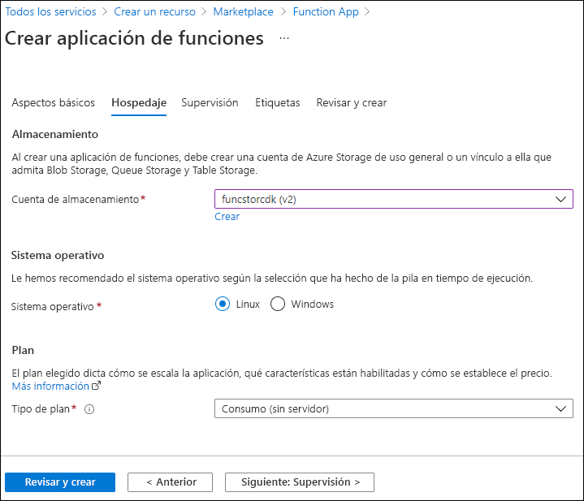

---
lab:
  az204Title: 'Lab 02: Implement task processing logic by using Azure Functions'
  az020Title: 'Lab 02: Implement task processing logic by using Azure Functions'
  az204Module: 'Module 02: Implement Azure Functions'
  az020Module: 'Module 02: Implement Azure Functions'
ms.openlocfilehash: 2372fa6cc60c5f06f26fbca7d97f64fb93d1753f
ms.sourcegitcommit: d2d374fffa4fcbf92b9c4bdc9c9ecc470152e033
ms.translationtype: HT
ms.contentlocale: es-ES
ms.lasthandoff: 11/16/2021
ms.locfileid: "132626176"
---
# <a name="lab-02-implement-task-processing-logic-by-using-azure-functions"></a>Laboratorio 02: Implementación de la lógica de procesamiento de tareas mediante Azure Functions

## <a name="microsoft-azure-user-interface"></a>Interfaz de usuario de Microsoft Azure

Dada la naturaleza dinámica de las herramientas en la nube de Microsoft, puede experimentar cambios en la interfaz de usuario de Azure que se producen después del desarrollo de este contenido de entrenamiento. Como resultado, es posible que las instrucciones y los pasos del laboratorio no se alineen correctamente.

Microsoft actualiza este curso de entrenamiento cuando la comunidad nos alerta de los cambios necesarios. Sin embargo, las actualizaciones en la nube se producen con frecuencia, por lo que es posible que se produzcan cambios en la interfaz de usuario antes de que se actualice este contenido de entrenamiento. **Si esto ocurre, adáptese a los cambios y, a continuación, trabaje con ellos en los laboratorios según sea necesario.**

## <a name="instructions"></a>Instructions

### <a name="before-you-start"></a>Antes de comenzar

#### <a name="sign-in-to-the-lab-environment"></a>Inicio de sesión en el entorno de laboratorio

Inicie sesión en la máquina virtual (VM) de Windows 10 con las credenciales siguientes:

- Nombre de usuario: **Admin**
- Contraseña: **Pa55w.rd**.

> **Nota**: El instructor le proporcionará instrucciones para conectarse al entorno de laboratorio virtual.

#### <a name="review-the-installed-applications"></a>Revisión de las aplicaciones instaladas

Busque la barra de tareas en el escritorio de Windows 10. La barra de tareas contiene los iconos de las aplicaciones que usará en este laboratorio, entre los que se incluyen:

- Microsoft Edge
- Explorador de archivos
- Terminal Windows
- Visual Studio Code

## <a name="architecture-diagram"></a>Diagrama de la arquitectura


### <a name="exercise-1-create-azure-resources"></a>Ejercicio 1: Creación de recursos de Azure

#### <a name="task-1-open-the-azure-portal"></a>Tarea 1: Apertura de Azure Portal

1. En la barra de tareas, seleccione el icono de **Microsoft Edge**.
1. En la ventana del explorador, vaya a Azure Portal (<https://portal.azure.com>) y, a continuación, inicie sesión con la cuenta que va a usar para este laboratorio.

    > **Nota**: Si es la primera vez que inicia sesión en Azure Portal, se le ofrecerá un paseo por el portal. Si prefiere omitir esta visita, seleccione **Introducción** para empezar a usar el portal.

#### <a name="task-2-create-an-azure-storage-account"></a>Tarea 2: Creación de una cuenta de Azure Storage

1. En Azure Portal, use el cuadro de texto **Buscar recursos, servicios y documentos** para buscar **Cuentas de almacenamiento** y, a continuación, en la lista de resultados, seleccione **Cuentas de almacenamiento**.

1. En la hoja **Cuentas de almacenamiento**, seleccione **+ Crear**.

1. En la hoja **Crear una cuenta de almacenamiento**, en la pestaña **Aspectos básicos**, realice las siguientes acciones y seleccione **Revisar y crear**:

    | Configuración                           | Acción                                                       |
    | --------------------------------- | ------------------------------------------------------------ |
    | Lista desplegable de **Suscripción**   | Conserve los valores predeterminados.                                    |
    | Sección **Grupo de recursos**        | Seleccione **Crear nuevo**, escriba **Sin servidor** y seleccione **Aceptar**. |
    | Cuadro de texto **Nombre de la cuenta de almacenamiento** | Escriba **funcstor** _[yourname]_ .                              |
    | Lista desplegable de **Región**         | Seleccione **(EE. UU.) Este de EE. UU.** .                                     |
    | Sección **Rendimiento**           | Seleccione la opción **Estándar**.                              |
    | Lista desplegable de **Redundancia**     | Seleccione **Almacenamiento con redundancia local (LRS)** .                  |

    En la captura de pantalla siguiente, se muestran los valores configurados en la hoja **Crear una cuenta de almacenamiento**.

    

1. En la pestaña **Revisar y crear**, revise las opciones que seleccionó durante los pasos anteriores.

1. Seleccione **Crear** para crear la cuenta de almacenamiento mediante la configuración especificada.

    > **Nota**: Espere a que se complete la tarea de creación antes de continuar con este laboratorio.

1. En la hoja **Información general**, seleccione el botón **Ir al recurso** para ir a la hoja de la cuenta de almacenamiento recién creada.

1. En la hoja **Cuenta de almacenamiento**, en la sección **Seguridad y redes**, seleccione **Claves de acceso**.

1. En la hoja **Claves de acceso**, seleccione **Mostrar claves**.

1. Revise cualquiera de las claves y copie el valor de cualquiera de los cuadros **Cadena de conexión** en el Portapapeles.

     > **Nota**: No importa la cadena de conexión que elija. Son intercambiables.

1. Abra Bloc de notas y pegue el valor de la cadena de conexión copiada en Bloc de notas. Usará este valor más adelante en este laboratorio.

#### <a name="task-3-create-a-function-app"></a>Tarea 3: Creación de una aplicación de funciones

1. En el panel de navegación de Azure Portal, seleccione el vínculo **Crear un recurso**.

1. En la hoja **Crear un recurso**, en el cuadro de texto **Servicios Search y Marketplace**, escriba **Función** y, a continuación, seleccione ENTRAR.

1. En la hoja de resultados de búsqueda de **Marketplace**, seleccione el resultado de **Aplicación de funciones**.

1. En la hoja **Aplicación de funciones**, seleccione **Crear**.

1. En la hoja **Crear aplicación de funciones**, en la pestaña **Aspectos básicos**, realice las siguientes acciones y, a continuación, seleccione **Siguiente: Hosting**:

    | Configuración                          | Acción                           |
    | -------------------------------- | -------------------------------- |
    | Lista desplegable de **Suscripción**  | Conserve los valores predeterminados.        |
    | Sección **Grupo de recursos**       | Seleccione **Sin servidor**.           |
    | Cuadro de texto del **nombre de la aplicación de funciones**   | Escriba **funclogic** _[yourname]_ . |
    | Sección **Publicar**              | Seleccione **Código**.                 |
    | Lista desplegable de la **pila en tiempo de ejecución** | Seleccione **.NET**.                |
    | Lista desplegable de **Versión**       | Seleccione **3.1**.                  |
    | Lista desplegable de **Región**        | Seleccione la región **Este de EE. UU.**   |

    En la captura de pantalla siguiente, se muestran los valores configurados en la hoja **Crear aplicación de funciones**.

    

1. En la pestaña **Hosting**, realice las siguientes acciones y, a continuación, seleccione **Revisar y crear**:

    | Configuración                            | Acción                                             |
    | ---------------------------------- | -------------------------------------------------- |
    | Lista desplegable de **cuenta de almacenamiento** | Seleccione la cuenta de almacenamiento **funcstor** _[yourname]_ . |
    | Sección del **sistema operativo**       | Seleccione **Linux**.                                  |
    | Lista desplegable del **Tipo de plan**       | Seleccione **Consumo (sin servidor)** .               |

    En la captura de pantalla siguiente, se muestran los valores configurados en la pestaña **Hosting** en la hoja **Crear aplicación de funciones**.

    

1. En la pestaña **Revisar y crear**, revise las opciones que seleccionó durante los pasos anteriores.

1. Seleccione **Crear** para crear la aplicación de funciones mediante la configuración especificada.

    > **Nota**: Espere a que se complete la tarea de creación antes de continuar con este laboratorio.

#### <a name="review"></a>Revisar

En este ejercicio, ha creado todos los recursos que usará en este laboratorio.

### <a name="exercise-2-configure-a-local-azure-functions-project"></a>Ejercicio 2: Configuración de un proyecto de Azure Functions local

#### <a name="task-1-initialize-a-function-project"></a>Tarea 1: Inicialización de un proyecto de función

1. En la barra de tareas, seleccione el icono **Terminal Windows**.

1. Ejecute el siguiente comando para cambiar el directorio actual al directorio vacío **Allfiles (F):\\Allfiles\\Labs\\02\\Starter\\func**:

    ```powershell
    cd F:\Allfiles\Labs\02\Starter\func
    ```

1. Ejecute el siguiente comando para usar **Azure Functions Core Tools** para crear un nuevo proyecto de Azure Functions local en el directorio actual mediante el entorno de ejecución **dotnet**:

    ```powershell
    func init --worker-runtime dotnet --force
    ```

    > **Nota**: Puede revisar la documentación para [crear un proyecto][azure-functions-core-tools-new-project] mediante **Azure Functions Core Tools**.
    
1. Cierre la aplicación de **Terminal Windows**.

#### <a name="task-2-configure-a-connection-string"></a>Tarea 2: Configuración de la cadena de conexión

1. En la pantalla **Inicio**, seleccione el icono **Visual Studio Code**.
1. En el menú **Archivo**, seleccione **Abrir carpeta**.
1. En la ventana **Explorador de archivos** que se abre, vaya a **Allfiles (F):\\Allfiles\\Labs\\02\\Starter\\func** y, a continuación, seleccione **Seleccionar carpeta**.
1. En el panel **Explorador** de la ventana **Visual Studio Code**, abra el archivo **local.settings.json**.
1. Observe el valor actual de la configuración **AzureWebJobsStorage**:

    ```json
    "AzureWebJobsStorage": "UseDevelopmentStorage=true",
    ```

1. Actualice el valor de **AzureWebJobsStorage** estableciéndolo en la **cadena de conexión** de la cuenta de almacenamiento que registró anteriormente en este laboratorio.
1. Guarde el archivo **local.settings.json**.

#### <a name="task-3-build-and-validate-a-project"></a>Tarea 3: Compilación y validación de un proyecto

1. En la barra de tareas, seleccione el icono **Terminal Windows**.
1. Ejecute el siguiente comando para cambiar el directorio actual al directorio vacío **Allfiles (F):\\Allfiles\\Labs\\02\\Starter\\func**:

    ```powershell
    cd F:\Allfiles\Labs\02\Starter\func
    ```

1. Ejecute el siguiente comando para **compilar** el proyecto de .NET Core 3.1:

    ```powershell
    dotnet build
    ```

#### <a name="review"></a>Revisar

En este ejercicio, ha creado un proyecto local que usará para el desarrollo de Azure Functions.

### <a name="exercise-3-create-a-function-thats-triggered-by-an-http-request"></a>Ejercicio 3: Creación de una función que desencadena una solicitud HTTP

#### <a name="task-1-create-an-http-triggered-function"></a>Tarea 1: Creación de una función desencadenada por HTTP

1. En la barra de tareas, seleccione el icono **Terminal Windows**.
1. Ejecute el siguiente comando para cambiar el directorio actual al directorio vacío **Allfiles (F):\\Allfiles\\Labs\\02\\Starter\\func**:

    ```powershell
    cd F:\Allfiles\Labs\02\Starter\func
    ```

1. Ejecute el siguiente comando para usar **Azure Functions Core Tools** para crear una nueva función denominada **Echo** mediante la plantilla de **desencadenador HTTP**:

    ```powershell
    func new --template "HTTP trigger" --name "Echo"
    ```

    > **Nota**: Puede revisar la documentación para [crear una nueva función][azure-functions-core-tools-new-function] mediante **Azure Functions Core Tools**.

1. Cierre la aplicación que ejecuta **Terminal Windows** actualmente.

#### <a name="task-2-write-http-triggered-function-code"></a>Tarea 2: Escritura de código de función desencadenado por HTTP

1. En la pantalla **Inicio**, seleccione el icono **Visual Studio Code**.
1. En el menú **Archivo**, seleccione **Abrir carpeta**.
1. En la ventana **Explorador de archivos** que se abre, vaya a **Allfiles (F):\\Allfiles\\Labs\\02\\Starter\\func** y, a continuación, seleccione **Seleccionar carpeta**.
1. En el panel **Explorador** de la ventana **Visual Studio Code**, abra el archivo **Echo.cs**.
1. En el editor de código, observe la implementación de ejemplo:

    ```csharp
    using System;
    using System.IO;
    using System.Threading.Tasks;
    using Microsoft.AspNetCore.Mvc;
    using Microsoft.Azure.WebJobs;
    using Microsoft.Azure.WebJobs.Extensions.Http;
    using Microsoft.AspNetCore.Http;
    using Microsoft.Extensions.Logging;
    using Newtonsoft.Json;

    namespace func
    {
        public static class Echo
        {
            [FunctionName("Echo")]
            public static async Task<IActionResult> Run(
                [HttpTrigger(AuthorizationLevel.Function, "get", "post", Route = null)] HttpRequest req,
                ILogger log)
            {
                log.LogInformation("C# HTTP trigger function processed a request.");

                string name = req.Query["name"];

                string requestBody = await new StreamReader(req.Body).ReadToEndAsync();
                dynamic data = JsonConvert.DeserializeObject(requestBody);
                name = name ?? data?.name;

                string responseMessage = string.IsNullOrEmpty(name)
                    ? "This HTTP triggered function executed successfully. Pass a name in the query string or in the request body for a personalized response."
                    : $"Hello, {name}. This HTTP triggered function executed successfully.";

                return new OkObjectResult(responseMessage);
            }
        }
    }
    ```

1. Elimine todo el contenido del archivo **Echo.cs**.
1. Agregue las siguientes líneas de código para agregar **directivas using** para los espacios de nombres **Microsoft.AspNetCore.Mvc**, **Microsoft.Azure.WebJobs**, **Microsoft.AspNetCore.Http** y **Microsoft.Extensions.Logging**:

    ```csharp
    using Microsoft.AspNetCore.Mvc;
    using Microsoft.Azure.WebJobs;
    using Microsoft.AspNetCore.Http;
    using Microsoft.Extensions.Logging;
    ```

1. Cree una nueva clase **estática pública** denominada **Echo**:

    ```csharp
    public static class Echo
    { }
    ```

1. Observe de nuevo el archivo **Echo.cs**, que ahora debe incluir:

    ```csharp
    using Microsoft.AspNetCore.Mvc;
    using Microsoft.Azure.WebJobs;
    using Microsoft.AspNetCore.Http;
    using Microsoft.Extensions.Logging;

    public static class Echo
    { }
    ```

1. Dentro de la clase **Echo**, agregue el siguiente bloque de código para crear un nuevo método **estático público** denominado **Run** que devuelve una variable de tipo **IActionResult** y que también toma variables de tipo **HttpRequest** y **ILogger** como parámetros denominados *request* y *logger*:

    ```csharp
    public static IActionResult Run(
        HttpRequest request,
        ILogger logger)
    { }
    ```

1. Agregue el código siguiente para anexar un atributo al método **Run** de tipo **FunctionNameAttribute** que tiene su parámetro **name** establecido en un valor de **Echo**:

    ```csharp
    [FunctionName("Echo")]
    public static IActionResult Run(
        HttpRequest request,
        ILogger logger)
    { }
    ```

1. Agregue el código siguiente para anexar un atributo al parámetro **request** de tipo **HttpTriggerAttribute** que tiene su matriz de parámetros de **métodos** establecida en un valor único de **POST**:

    ```csharp
    [FunctionName("Echo")]
    public static IActionResult Run(
        [HttpTrigger("POST")] HttpRequest request,
        ILogger logger)
    { }
    ```

1. Observe de nuevo el archivo **Echo.cs**, que ahora debe incluir el código siguiente:

    ```csharp
    using Microsoft.AspNetCore.Mvc;
    using Microsoft.Azure.WebJobs;
    using Microsoft.AspNetCore.Http;
    using Microsoft.Extensions.Logging;

    public static class Echo
    {
        [FunctionName("Echo")]
        public static IActionResult Run(
            [HttpTrigger("POST")] HttpRequest request,
            ILogger logger)
        { }
    }
    ```

1. En el método **Run**, escriba la siguiente línea de código para registrar un mensaje fijo:

    ```csharp
    logger.LogInformation("Received a request");
    ```

1. Escriba la siguiente línea de código para hacer eco del cuerpo de la solicitud HTTP como respuesta HTTP:

    ```csharp
    return new OkObjectResult(request.Body);
    ```

1. Observe de nuevo el archivo **Echo.cs**, que ahora debe incluir el código siguiente:

    ```csharp
    using Microsoft.AspNetCore.Mvc;
    using Microsoft.Azure.WebJobs;
    using Microsoft.AspNetCore.Http;
    using Microsoft.Extensions.Logging;

    public static class Echo
    {
        [FunctionName("Echo")]
        public static IActionResult Run(
            [HttpTrigger("POST")] HttpRequest request,
            ILogger logger)
        {
            logger.LogInformation("Received a request");
            return new OkObjectResult(request.Body);
        }
    }
    ```

1. Seleccione **Guardar** para guardar los cambios en el archivo **Echo.cs**.

#### <a name="task-3-test-the-http-triggered-function-by-using-httprepl"></a>Tarea 3: Prueba de la función desencadenada por HTTP mediante httprepl

1. En la barra de tareas, seleccione el icono **Terminal Windows**.
1. Ejecute el siguiente comando para cambiar el directorio actual al directorio vacío **Allfiles (F):\\Allfiles\\Labs\\02\\Starter\\func**:

    ```powershell
    cd F:\Allfiles\Labs\02\Starter\func
    ```

1. Ejecute el siguiente comando para ejecutar el proyecto de la aplicación de funciones:

    ```powershell
    func start --build
    ```

    > **Nota**: Puede revisar la documentación para [iniciar el proyecto de la aplicación de funciones localmente][azure-functions-core-tools-start-function] mediante **Azure Functions Core Tools**.
    
1. En la barra de tareas, vuelva a seleccionar el icono **Terminal Windows** para abrir una nueva instancia de la aplicación.
1. Cuando reciba el símbolo del sistema abierto, ejecute el siguiente comando para iniciar la herramienta **httprepl**, estableciendo el identificador uniforme de recursos (URI) base en ``http://localhost:7071``:

    ```powershell
    httprepl http://localhost:7071
    ```

    > **Nota**: La herramienta **httprepl** muestra un mensaje de error. Este mensaje se produce porque la herramienta está buscando un archivo de definición de Swagger que se usará para atravesar la API. Dado que el proyecto de la función no genera un archivo de definición de Swagger, deberá recorrer la API manualmente.
1. Cuando reciba el símbolo del sistema de la herramienta, ejecute el siguiente comando para ir al directorio de **api** relativo:

    ```powershell
    cd api
    ```

1. Ejecute el siguiente comando para ir al directorio **echo** relativo:

    ```powershell
    cd echo
    ```

1. Ejecute el siguiente comando para ejecutar el comando **post** y envíe un cuerpo de solicitud HTTP establecido en un valor numérico de **3** mediante la opción **\-\-content**:

    ```powershell
    post --content 3
    ```

1. Ejecute el siguiente comando para ejecutar el comando **post** y envíe un cuerpo de solicitud HTTP establecido en un valor numérico de **5** mediante la opción **\-\-content**:

    ```powershell
    post --content 5
    ```

1. Ejecute el siguiente comando para ejecutar el comando **post** y envíe un cuerpo de solicitud HTTP establecido en un valor de **Hello** mediante la opción **\-\-content**:

    ```powershell
    post --content "Hello"
    ```

1. Ejecute el siguiente comando para ejecutar el comando **post** y envíe un cuerpo de solicitud HTTP a un valor de notación de objetos JavaScript (JSON) de **{"msg": "Successful"}** mediante la opción **\-\-content**:

    ```powershell
    post --content "{"msg": "Successful"}"
    ```

1. Ejecute el comando siguiente para salir de la herramienta **httprepl**:

    ```powershell
    exit
    ```

1. Cierre todas las instancias actualmente en ejecución de la aplicación **Terminal Windows**.

#### <a name="review"></a>Revisar

En este ejercicio, ha creado una función básica que devuelve el contenido enviado a través de una solicitud HTTP POST.

### <a name="exercise-4-create-a-function-that-triggers-on-a-schedule"></a>Ejercicio 4: Creación de una función que se desencadena según una programación

#### <a name="task-1-create-a-schedule-triggered-function"></a>Tarea 1: Creación de una función desencadenada por programación

1. En la barra de tareas, seleccione el icono **Terminal Windows**.
1. Ejecute el siguiente comando para cambiar el directorio actual al directorio vacío **Allfiles (F):\\Allfiles\\Labs\\02\\Starter\\func**:

    ```powershell
    cd F:\Allfiles\Labs\02\Starter\func
    ```

1. Cuando reciba el símbolo del sistema abierto, ejecute el siguiente comando para usar **Azure Functions Core Tools** para crear una nueva función denominada **Recurring** mediante la plantilla de **desencadenador de temporizador**:

    ```powershell
    func new --template "Timer trigger" --name "Recurring"
    ```

    > **Nota**: Puede revisar la documentación para [crear una nueva función][azure-functions-core-tools-new-function] mediante **Azure Functions Core Tools**.
    
1. Cierre la aplicación que ejecuta **Terminal Windows** actualmente.

#### <a name="task-2-observe-function-code"></a>Tarea 2: Observación del código de función

1. En la pantalla **Inicio**, seleccione el icono **Visual Studio Code**.
1. En el menú **Archivo**, seleccione **Abrir carpeta**.
1. En la ventana **Explorador de archivos** que se abre, vaya a **Allfiles (F):\\Allfiles\\Labs\\02\\Starter\\func** y, a continuación, seleccione **Seleccionar carpeta**.
1. En el panel **Explorador** de la ventana **Visual Studio Code**, abra el archivo **Recurring.cs**.
1. En el editor de código, observe la implementación:

    ```csharp
    using System;
    using Microsoft.Azure.WebJobs;
    using Microsoft.Azure.WebJobs.Host;
    using Microsoft.Extensions.Logging;
    
    namespace func
    {
        public static class Recurring
        {
            [FunctionName("Recurring")]
            public static void Run([TimerTrigger("0 */5 * * * *")]TimerInfo myTimer, ILogger log)
            {
                log.LogInformation($"C# Timer trigger function executed at: {DateTime.Now}");
            }
        }
    }
    ```

#### <a name="task-3-observe-function-runs"></a>Tarea 3: Observación de las ejecuciones de funciones

1. En la barra de tareas, seleccione el icono **Terminal Windows**.
1. Ejecute el siguiente comando para cambiar el directorio actual al directorio vacío **Allfiles (F):\\Allfiles\\Labs\\02\\Starter\\func**:

    ```powershell
    cd F:\Allfiles\Labs\02\Starter\func
    ```

1. Cuando reciba el símbolo del sistema abierto, ejecute el siguiente comando para ejecutar el proyecto de aplicación de funciones:

    ```powershell
    func start --build
    ```

    > **Nota**: Puede revisar la documentación para [iniciar el proyecto de la aplicación de funciones localmente][azure-functions-core-tools-start-function] mediante **Azure Functions Core Tools**.
1. Observe la ejecución de la función que se produce aproximadamente cada cinco minutos. Cada ejecución de función debe representar un mensaje simple en el registro.
1. Cierre la aplicación que ejecuta **Terminal Windows** actualmente.

#### <a name="task-4-update-the-function-integration-configuration"></a>Tarea 4: Actualización de la configuración de integración de funciones

1. En la pantalla **Inicio**, seleccione el icono **Visual Studio Code**.
1. En el menú **Archivo**, seleccione **Abrir carpeta**.
1. En la ventana **Explorador de archivos** que se abre, vaya a **Allfiles (F):\\Allfiles\\Labs\\02\\Starter\\func** y, a continuación, seleccione **Seleccionar carpeta**.
1. En el panel **Explorador** de la ventana **Visual Studio Code**, abra el archivo **Recurring.cs**.
1. En el editor de código, observe la firma del método **Run** existente:

    ```csharp
    [FunctionName("Recurring")]
    public static void Run([TimerTrigger("0 */5 * * * *")]TimerInfo myTimer, ILogger log)
    ```

1. Actualice el bloque de código de firma del método **Ejecutar** para cambiar la programación para que se ejecute una vez cada **30 segundos**:

    ```csharp
    [FunctionName("Recurring")]
    public static void Run([TimerTrigger("*/30 * * * * *")]TimerInfo myTimer, ILogger log)
    ```

1. Seleccione **Guardar** para guardar los cambios en el archivo **Recurring.cs**.

#### <a name="task-5-observe-function-runs"></a>Tarea 5: Observación de las ejecuciones de funciones

1. En la barra de tareas, seleccione el icono **Terminal Windows**.

1. Ejecute el siguiente comando para cambiar el directorio actual al directorio vacío **Allfiles (F):\\Allfiles\\Labs\\02\\Starter\\func**:

    ```powershell
    cd F:\Allfiles\Labs\02\Starter\func
    ```

1. Cuando reciba el símbolo del sistema abierto, ejecute el siguiente comando para ejecutar el proyecto de aplicación de funciones:

    ```powershell
    func start --build
    ```
    
    > **Nota**: Puede revisar la documentación para [iniciar el proyecto de la aplicación de funciones localmente][azure-functions-core-tools-start-function] mediante **Azure Functions Core Tools**.
    
1. Observe la ejecución de la función que se produce aproximadamente cada 30 segundos. Cada ejecución de función debe representar un mensaje simple en el registro.

1. Cierre la aplicación que ejecuta **Terminal Windows** actualmente.

1. Cierre la ventana de Visual Studio Code.

#### <a name="review"></a>Revisar

En este ejercicio, ha creado una función que se ejecuta automáticamente según una programación fija.

### <a name="exercise-5-create-a-function-that-integrates-with-other-services"></a>Ejercicio 5: Creación de una función que se integra con otros servicios

#### <a name="task-1-upload-sample-content-to-azure-blob-storage"></a>Tarea 1: Carga del contenido de ejemplo en Azure Blob Storage

1. En el **panel de navegación** de Azure Portal, seleccione el vínculo **Grupos de recursos**.
1. En la hoja **Grupos de recursos**, seleccione el grupo de recursos **Sin servidor** que creó anteriormente en este laboratorio.
1. En la hoja **Sin servidor**, seleccione la cuenta de almacenamiento **funcstor** _[yourname]_ que creó anteriormente en este laboratorio.
1. En la hoja **Cuenta de almacenamiento**, en la sección **Almacenamiento de datos**, seleccione el vínculo **Contenedores**.
1. En la sección **Contenedores**, seleccione **+ Contenedor**.
1. En la ventana emergente **Nuevo contenedor**, realice las siguientes acciones y, a continuación, seleccione **Crear**:

    | Configuración                          | Acción                           |
    | -------------------------------- | -------------------------------- |
    | Cuadro de texto de **nombre**  | Escriba **contenido**.     |
    | Lista desplegable de **nivel de acceso público**  | Seleccione **Privado (sin acceso anónimo)** .     |

1. Vuelva a la sección **Contenedores** y, a continuación, seleccione el contenedor de **contenido** recién creado.
1. En la hoja **Contenedor**, seleccione **Cargar**.
1. En la ventana **Cargar blob**, realice las siguientes acciones y, a continuación, seleccione **Cargar**:

    | Configuración                          | Acción                           |
    | -------------------------------- | -------------------------------- |
    | Sección **Archivos**  | Seleccione el icono **Carpeta**.    |
    | Ventana **Explorador de archivos**  | Vaya a **Allfiles (F):\\Allfiles\\Labs\\02\\Starter**, seleccione el archivo **settings.json** y, a continuación, seleccione **Abrir**.    |
    | Casilla **Sobrescribir si ya hay archivos**  | Asegúrese de que esta casilla está activada.   |

      > **Nota**: Espere a que se cargue el blob antes de continuar con este laboratorio.

#### <a name="task-2-create-an-http-triggered-function"></a>Tarea 2: Creación de una función desencadenada por HTTP

1. En la barra de tareas, seleccione el icono **Terminal Windows**.
1. Ejecute el siguiente comando para cambiar el directorio actual al directorio vacío **Allfiles (F):\\Allfiles\\Labs\\02\\Starter\\func**:

    ```powershell
    cd F:\Allfiles\Labs\02\Starter\func
    ```

1. Cuando reciba el símbolo del sistema abierto, ejecute el siguiente comando para usar **Azure Functions Core Tools** para crear una nueva función denominada **GetSettingInfo** mediante la plantilla de **desencadenador HTTP**:

    ```powershell
    func new --template "HTTP trigger" --name "GetSettingInfo"
    ```

    > **Nota**: Puede revisar la documentación para [crear una nueva función][azure-functions-core-tools-new-function] mediante **Azure Functions Core Tools**.
1. Cierre la aplicación que ejecuta **Terminal Windows** actualmente.

#### <a name="task-3-write-http-triggered-and-blob-inputted-function-code"></a>Tarea 3: Escritura de código de función desencadenado por HTTP e introducido por blob

1. En la pantalla **Inicio**, seleccione el icono **Visual Studio Code**.
1. En el menú **Archivo**, seleccione **Abrir carpeta**.
1. En la ventana **Explorador de archivos** que se abre, vaya a **Allfiles (F):\\Allfiles\\Labs\\02\\Starter\\func** y, a continuación, seleccione **Seleccionar carpeta**.
1. En el panel **Explorador** de la ventana **Visual Studio Code**, abra el archivo **GetSettingInfo.cs**.
1. En el editor de código, observe la implementación de ejemplo:

    ```csharp
    using System;
    using System.IO;
    using System.Threading.Tasks;
    using Microsoft.AspNetCore.Mvc;
    using Microsoft.Azure.WebJobs;
    using Microsoft.Azure.WebJobs.Extensions.Http;
    using Microsoft.AspNetCore.Http;
    using Microsoft.Extensions.Logging;
    using Newtonsoft.Json;
    
    namespace func
    {
        public static class GetSettingInfo
        {
            [FunctionName("GetSettingInfo")]
            public static async Task<IActionResult> Run(
                [HttpTrigger(AuthorizationLevel.Function, "get", "post", Route = null)] HttpRequest req,
                ILogger log)
            {
                log.LogInformation("C# HTTP trigger function processed a request.");
    
                string name = req.Query["name"];
    
                string requestBody = await new StreamReader(req.Body).ReadToEndAsync();
                dynamic data = JsonConvert.DeserializeObject(requestBody);
                name = name ?? data?.name;
    
                string responseMessage = string.IsNullOrEmpty(name)
                    ? "This HTTP triggered function executed successfully. Pass a name in the query string or in the request body for a personalized response."
                    : $"Hello, {name}. This HTTP triggered function executed successfully.";
    
                return new OkObjectResult(responseMessage);
            }
        }
    }
    ```

1. Elimine todo el contenido del archivo **GetSettingInfo.cs**.

1. Agregue las siguientes líneas de código para agregar **directivas using** para los espacios de nombres **Microsoft.AspNetCore.Http**, **Microsoft.AspNetCore.Mvc** y **Microsoft.Azure.WebJobs**:

    ```csharp
    using Microsoft.AspNetCore.Http;
    using Microsoft.AspNetCore.Mvc;
    using Microsoft.Azure.WebJobs;
    ```

1. Cree una nueva clase **estática pública** denominada **GetSettingInfo**:

    ```csharp
    public static class GetSettingInfo
    { }
    ```

1. Observe de nuevo el archivo **GetSettingInfo.cs**, que ahora debe incluir el código siguiente:

    ```csharp
    using Microsoft.AspNetCore.Http;
    using Microsoft.AspNetCore.Mvc;
    using Microsoft.Azure.WebJobs;

    public static class GetSettingInfo
    { }
    ```

1. Dentro de la clase **GetSettingInfo**, agregue el siguiente bloque de código para crear un nuevo método **estático público** con forma de expresión denominado **Run** que devuelve una variable de tipo **IActionResult** y que también toma variables de tipo **HttpRequest** y **string** como parámetros denominados *request* y *json*:

    ```csharp
    public static IActionResult Run(
        HttpRequest request,
        string json)
        => null;
    ```

    > **Nota**: Solo va a establecer temporalmente el valor devuelto en **null**.

1. Agregue el código siguiente para anexar un atributo al método **Run** de tipo **FunctionNameAttribute** que tiene su parámetro **name** establecido en un valor de **GetSettingInfo**:

    ```csharp
    [FunctionName("GetSettingInfo")]
    public static IActionResult Run(
        HttpRequest request,
        string json)
        => null;
    ```

1. Agregue el código siguiente para anexar un atributo al parámetro **request** de tipo **HttpTriggerAttribute** que tiene su matriz de parámetros de **métodos** establecida en un valor único de **GET**:

    ```csharp
    [FunctionName("GetSettingInfo")]
    public static IActionResult Run(
        [HttpTrigger("GET")] HttpRequest request,
        string json)
        => null;
    ```

1. Agregue el código siguiente para anexar un atributo al parámetro **json** de tipo **BlobAttribute** que tiene su parámetro **blobPath** establecido en un valor de **content/settings.json**:

    ```csharp
    [FunctionName("GetSettingInfo")]
    public static IActionResult Run(
        [HttpTrigger("GET")] HttpRequest request,
        [Blob("content/settings.json")] string json)
        => null;
    ```

1. Agregue el código siguiente para actualizar el método **Run** con forma de expresión para devolver una nueva instancia de la clase **OkObjectResult** pasando el valor del parámetro de método **json** como único parámetro de constructor:

    ```csharp
    [FunctionName("GetSettingInfo")]
    public static IActionResult Run(
        [HttpTrigger("GET")] HttpRequest request,
        [Blob("content/settings.json")] string json)
        => new OkObjectResult(json);
    ```

1. Observe de nuevo el archivo **GetSettingInfo.cs**, que ahora debe incluir el código siguiente:

    ```csharp
    using Microsoft.AspNetCore.Http;
    using Microsoft.AspNetCore.Mvc;
    using Microsoft.Azure.WebJobs;

    public static class GetSettingInfo
    {
        [FunctionName("GetSettingInfo")]
        public static IActionResult Run(
            [HttpTrigger("GET")] HttpRequest request,
            [Blob("content/settings.json")] string json)
            => new OkObjectResult(json);
    }
    ```

1. Seleccione **Guardar** para guardar los cambios en el archivo **GetSettingInfo.cs**.

#### <a name="task-4-register-azure-storage-blob-extensions"></a>Tarea 4: Registro de extensiones de Azure Storage Blob

1. En la barra de tareas, seleccione el icono **Terminal Windows**.
1. Ejecute el siguiente comando para cambiar el directorio actual al directorio vacío **Allfiles (F):\\Allfiles\\Labs\\02\\Starter\\func**:

    ```powershell
    cd F:\Allfiles\Labs\02\Starter\func
    ```

1. Cuando reciba el símbolo del sistema abierto, ejecute el siguiente comando para registrar la extensión [Microsoft.Azure.WebJobs.Extensions.Storage](https://www.nuget.org/packages/Microsoft.Azure.WebJobs.Extensions.Storage/4.0.4):

    ```powershell
    func extensions install --package Microsoft.Azure.WebJobs.Extensions.Storage --version 4.0.4
    ```

1. Ejecute el siguiente comando para compilar el proyecto de .NET y validar que las extensiones se instalaron correctamente:

    ```powershell
    dotnet build
    ```

1. Cierre todas las instancias actualmente en ejecución de la aplicación **Terminal Windows**.

#### <a name="task-5-test-the-function-by-using-httprepl"></a>Tarea 5: Prueba de la función mediante httprepl

1. En la barra de tareas, seleccione el icono **Terminal Windows**.
1. Ejecute el siguiente comando para cambiar el directorio actual al directorio vacío **Allfiles (F):\\Allfiles\\Labs\\02\\Starter\\func**:

    ```powershell
    cd F:\Allfiles\Labs\02\Starter\func
    ```

1. Cuando reciba el símbolo del sistema abierto, ejecute el siguiente comando para ejecutar el proyecto de aplicación de funciones:

    ```powershell
    func start --build
    ```

    > **Nota**: Puede revisar la documentación para [iniciar el proyecto de la aplicación de funciones localmente][azure-functions-core-tools-start-function] mediante **Azure Functions Core Tools**.
1. En la barra de tareas, vuelva a seleccionar el icono **Terminal Windows** para abrir una nueva instancia de la aplicación **Terminal Windows**.
1. Cuando reciba el símbolo del sistema abierto, ejecute el siguiente comando para iniciar la herramienta **httprepl**, estableciendo el identificador uniforme de recursos (URI) base en ``http://localhost:7071``:

    ```powershell
    httprepl http://localhost:7071
    ```

    > **Nota**: La herramienta **httprepl** muestra un mensaje de error. Este mensaje se produce porque la herramienta está buscando un archivo de definición de Swagger que se usará para atravesar la API. Dado que el proyecto de la función no genera un archivo de definición de Swagger, deberá recorrer la API manualmente.

1. Cuando reciba el símbolo del sistema de la herramienta, ejecute el siguiente comando para ir al punto de conexión de **api** relativo:

    ```powershell
    cd api
    ```

1. Ejecute el siguiente comando para ir al punto de conexión **getsettinginfo** relativo:

    ```powershell
    cd getsettinginfo
    ```

1. Ejecute el siguiente comando para ejecutar el comando **get** para el punto de conexión actual:

    ```powershell
    get
    ```

1. Observe el contenido JSON de la respuesta de la aplicación de funciones, que ahora debe incluir:

    ```json
    {
        "version": "0.2.4",
        "root": "/usr/libexec/mews_principal/",
        "device": {
            "id": "21e46d2b2b926cba031a23c6919"
        },
        "notifications": {
            "email": "joseph.price@contoso.com",
            "phone": "(425) 555-0162 x4151"
        }
    }
    ```

1. Ejecute el comando siguiente para salir de la herramienta **httprepl**:

    ```powershell
    exit
    ```

1. Cierre todas las instancias actualmente en ejecución de la aplicación **Terminal Windows**.

#### <a name="review"></a>Revisar

En este ejercicio, ha creado una función que devuelve el contenido de un archivo JSON en Storage.

### <a name="exercise-6-deploy-a-local-function-project-to-an-azure-functions-app"></a>Ejercicio 6: Implementación de un proyecto de función local en una aplicación Azure Functions

#### <a name="task-1-deploy-using-the-azure-functions-core-tools"></a>Tarea 1: Implementación mediante Azure Functions Core Tools

1. En la barra de tareas, seleccione el icono **Terminal Windows**.
1. Ejecute el siguiente comando para cambiar el directorio actual al directorio vacío **Allfiles (F):\\Allfiles\\Labs\\02\\Starter\\func**:

    ```powershell
    cd F:\Allfiles\Labs\02\Starter\func
    ```

1. Cuando reciba el símbolo del sistema abierto, ejecute el siguiente comando para iniciar sesión en la interfaz de la línea de comandos (CLI) de Azure:

    ```powershell
    az login
    ```

1. En la ventana del explorador **Microsoft Edge**, escriba la dirección de correo electrónico y la contraseña de su cuenta Microsoft y, a continuación, seleccione **Iniciar sesión**.
1. Vuelva a la ventana de **Terminal Windows** abierta actualmente. Espere a que finalice el proceso de inicio de sesión.
1. Ejecute el siguiente comando para publicar el proyecto de la aplicación de funciones:

    ```powershell
    func azure functionapp publish <function-app-name>
    ```

    > **Nota**: Por ejemplo, si el **nombre de la aplicación de funciones** es **funclogicstudent**, el comando sería ``func azure functionapp publish funclogicstudent``. Puede revisar la documentación para [publicar el proyecto de la aplicación de funciones local][azure-functions-core-tools-publish-azure] mediante **Azure Functions Core Tools**.
1. Espere a que la implementación se finalice antes de avanzar con el laboratorio.
1. Cierre la aplicación que ejecuta **Terminal Windows** actualmente.

#### <a name="task-2-validate-deployment"></a>Tarea 2: Validación de la implementación

1. En la barra de tareas, seleccione el icono **Microsoft Edge** y, a continuación, seleccione la pestaña que contiene Azure Portal (<https://portal.azure.com>).
1. En el **panel de navegación** de Azure Portal, seleccione el vínculo **Grupos de recursos**.
1. En la hoja **Grupos de recursos**, seleccione el grupo de recursos **Sin servidor** que creó anteriormente en este laboratorio.
1. En la hoja **Sin servidor**, seleccione la cuenta de almacenamiento **funclogic** _[yourname]_ que creó anteriormente en este laboratorio.
1. En la hoja de **App Service**, en la sección **Funciones**, seleccione la opción **Funciones**.
1. En el panel **Funciones**, seleccione la función **GetSettingInfo** existente.
1. En la hoja **Función**, seleccione la opción **Código y prueba** en la sección **Desarrollador**.
1. En el editor de funciones, seleccione **Probar o ejecutar**.
1. En el cuadro de diálogo emergente que aparece, realice las siguientes acciones: <!--Conan, as there is only sub step here, can we just combine the two as follows: In the popup dialog that appears, in the **HTTP method** list, select **GET**.-->
    - En la lista **método HTTP**, seleccione **GET**.
1. Seleccione **Ejecutar** para probar la función.
1. Observe los resultados de la serie de pruebas. El contenido JSON debe incluir ahora el código siguiente:

    ```json
    {
        "version": "0.2.4",
        "root": "/usr/libexec/mews_principal/",
        "device": {
            "id": "21e46d2b2b926cba031a23c6919"
        },
        "notifications": {
            "email": "joseph.price@contoso.com",
            "phone": "(425) 555-0162 x4151"
        }
    }
    ```

#### <a name="review"></a>Revisar

En este ejercicio, ha implementado un proyecto de función local para Azure Functions y ha validado que las funciones funcionan en Azure.

### <a name="exercise-7-clean-up-your-subscription"></a>Ejercicio 7: Limpieza de la suscripción

#### <a name="task-1-open-azure-cloud-shell-and-list-resource-groups"></a>Tarea 1: Apertura de Azure Cloud Shell y enumeración de grupos de recursos

1.  En Azure Portal, seleccione el icono **Cloud Shell**, , para abrir una nueva sesión de Bash. Si el valor predeterminado de Cloud Shell es una sesión de PowerShell, seleccione **PowerShell** y, en el menú desplegable, seleccione **Bash**.

    > **Nota**: Si es la primera vez que inicia **Cloud Shell**, cuando se le pida que seleccione **Bash** o **PowerShell**, seleccione **PowerShell**. Si aparece el mensaje **No tiene ningún almacenamiento montado**, seleccione la suscripción que utiliza en este laboratorio y, luego, seleccione **Crear almacenamiento**.

#### <a name="task-2-delete-a-resource-group"></a>Tarea 2: Eliminación de un grupo de recursos

1. En el panel de **Cloud Shell**, ejecute el comando siguiente para eliminar el grupo de recursos **Sin servidor**:

    ```powershell
    az group delete --name Serverless --no-wait --yes
    ```
     > **Nota**: El comando se ejecuta de forma asincrónica (según determina el parámetro *--no-wait*). Aunque podrá ejecutar otro comando de la CLI de Azure inmediatamente después en la misma sesión de Bash, los grupos de recursos tardarán unos minutos en quitarse.

1. Cierre el panel de **Cloud Shell** en el portal.

#### <a name="task-3-close-the-active-application"></a>Tarea 3: Cierre de la aplicación activa

- Cierre la aplicación que ejecuta Microsoft Edge actualmente.

#### <a name="review"></a>Revisar

En este ejercicio, ha limpiado la suscripción mediante la eliminación de los grupos de recursos usados en este laboratorio.
