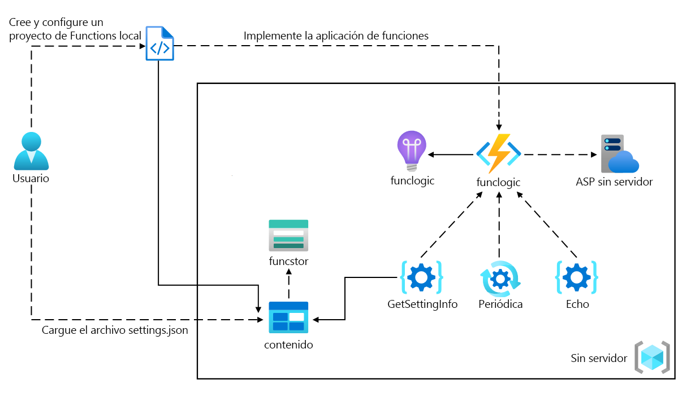
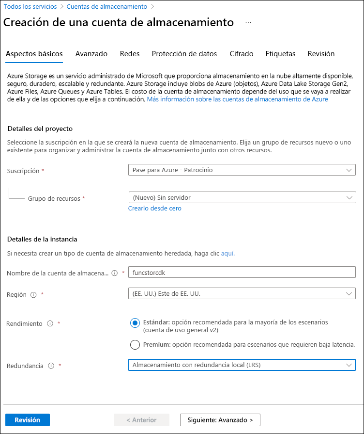
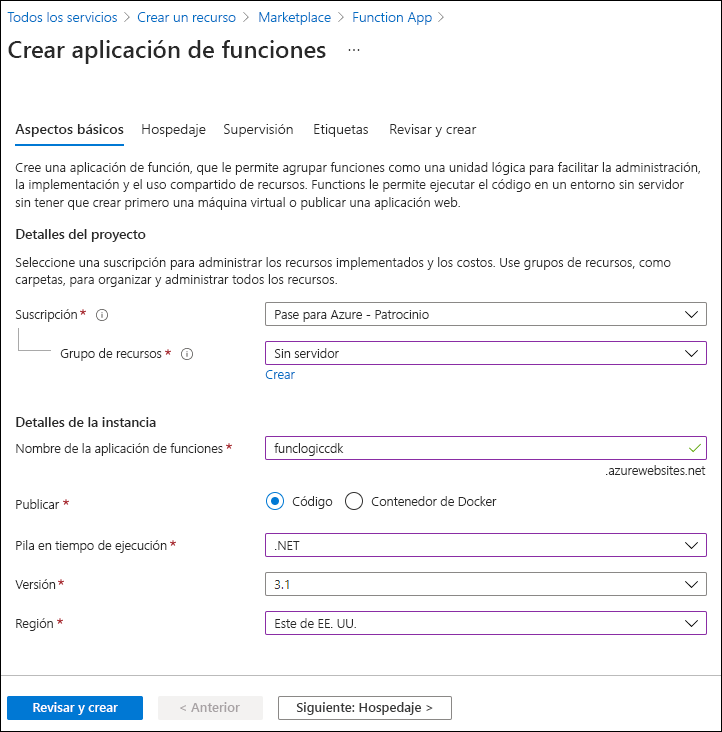

---
lab:
  az204Title: 'Lab 02: Implement task processing logic by using Azure Functions'
  az204Module: 'Learning Path 02: Implement Azure Functions'
---

# Laboratorio 02: Implementación de la lógica de procesamiento de tareas mediante Azure Functions

## Interfaz de usuario de Microsoft Azure

Dada la naturaleza dinámica de las herramientas en la nube de Microsoft, puede experimentar cambios en la interfaz de usuario de Azure que se producen después del desarrollo de este contenido de entrenamiento. Como resultado, es posible que las instrucciones y los pasos del laboratorio no se alineen correctamente.

Microsoft actualiza este curso de entrenamiento cuando la comunidad nos alerta de los cambios necesarios. Sin embargo, las actualizaciones en la nube se producen con frecuencia, por lo que es posible que se produzcan cambios en la interfaz de usuario antes de que se actualice este contenido de entrenamiento. **Si esto ocurre, adáptese a los cambios y, a continuación, trabaje con ellos en los laboratorios según sea necesario.**

## Instructions

### Antes de comenzar

#### Inicio de sesión al entorno de laboratorio

Inicie sesión en la máquina virtual (VM) de Windows 11 con las credenciales siguientes:

- Nombre de usuario: `Admin`
- Contraseña: `Pa55w.rd`

> **Nota**: El instructor le proporcionará instrucciones para conectarse al entorno de laboratorio virtual.

#### Revisión de las aplicaciones instaladas

Busque la barra de tareas en el escritorio de Windows 11. La barra de tareas contiene los iconos de las aplicaciones que usará en este laboratorio, entre los que se incluyen:

- Microsoft Edge
- Explorador de archivos
- Terminal
- Visual Studio Code

## Escenario de laboratorio

En este laboratorio, demostrará la capacidad de crear una función sencilla de Azure que se hace eco del texto que se escribe y lo envía a la función mediante el uso de comandos HTTP POST. Esto ilustrará cómo se puede desencadenar la función a través de HTTP. 

Además, demostrará cómo ejecutar una función de Azure configurándola para que se ejecute según una programación fija. La función escribirá un mensaje en un registro cada vez que se desencadene la programación.

Por último, demostrará cómo una función de Azure puede conectarse a otros recursos de Azure, como una cuenta de almacenamiento. La función se conectará a una cuenta de almacenamiento que cree y devolverá el contenido de un archivo que se almacena en la cuenta de Azure Storage.

<em>Para ver este vídeo, haga clic con el botón derecho sobre este **[vínculo de vídeo](https://youtu.be/-3tneDvkYDo)** y seleccione "Abrir vínculo en una pestaña nueva o una ventana nueva".</em>

 

### Diagrama de la arquitectura



### Ejercicio 1: Creación de recursos de Azure

#### Tarea 1: Abra Azure Portal

1. En la barra de tareas, seleccione el icono de **Microsoft Edge**.
1. En la ventana del explorador, vaya a Azure Portal en `https://portal.azure.com` y, a continuación, inicie sesión con la cuenta que va a usar para este laboratorio.

    > **Nota**: Si es la primera vez que inicia sesión en Azure Portal, se le ofrecerá un paseo por el portal. Si prefiere omitir esta visita, seleccione **Introducción** para empezar a usar el portal.

#### Tarea 2: Creación de una cuenta de Azure Storage

1. En Azure Portal, use el cuadro de texto **Buscar recursos, servicios y documentos** para buscar **Cuentas de almacenamiento** y, a continuación, en la lista de resultados, seleccione **Cuentas de almacenamiento**.

1. En la hoja  **Cuentas de almacenamiento** , seleccione **+ Crear**.

1. En la hoja **Crear una cuenta de almacenamiento**, en la pestaña **Aspectos básicos**, realice las siguientes acciones y seleccione **Revisar**:

    | Configuración | Acción |
    | -- | -- |
    | Lista desplegable de **Suscripción** | Conserve los valores predeterminados |
    | Sección **Grupo de recursos** | Seleccione **Crear nuevo**, escriba **Sin servidor** y seleccione **Aceptar**. |
    | Cuadro de texto **Nombre de la cuenta de almacenamiento**  | Escribir **funcstor** _[su nombre]_ |
    | Lista desplegable de **región** | Seleccione **(EE.UU.) Este de EE. UU.** |
    | **Servicio principal** | Sin cambios |
    | Sección **Rendimiento** | Seleccione la opción **Estándar** |
    | Lista desplegable de **Redundancia** | Seleccione **Almacenamiento con redundancia local (LRS)**. |

    En la captura de pantalla siguiente, se muestran los valores configurados en la hoja **Crear una cuenta de almacenamiento**.

    

1. En la pestaña **Revisar**, revise las opciones que seleccionó en los pasos anteriores.

1. Seleccione **Crear** para crear la cuenta de almacenamiento mediante la configuración especificada.

    > **Nota**: Espere a que se complete la tarea de creación antes de continuar con este laboratorio.

1. En la hoja **Información general**, seleccione el botón **Ir al recurso** para ir a la hoja de la cuenta de almacenamiento recién creada.

1. En la hoja  **Cuenta de almacenamiento** , en la sección  **Seguridad y redes** , seleccione **Claves de acceso**.

1. En la hoja  **Claves de acceso** , seleccione **Mostrar claves**.

1. En la hoja  **Claves de acceso** , revise cualquiera de las **Cadenas de conexión** (mediante el botón **Mostrar**) y, a continuación, registre el valor de cualquiera de los cuadros **Cadena de conexión**  en el Bloc de notas. Las **Claves** son claves de cifrado administradas por la plataforma y **no** se usan para este laboratorio.

   > **Nota**: No importa la cadena de conexión que elija. Son intercambiables.

1. Abra Bloc de notas y pegue el valor de la cadena de conexión copiada en Bloc de notas. Usará este valor más adelante en este laboratorio.

#### Tarea 3: Creación de una aplicación de funciones

1. En el panel de navegación de Azure Portal, seleccione el vínculo **Crear un recurso**.

1. En la hoja **Crear un recurso**, en el cuadro de texto **Buscar Servicios y Marketplace**, escriba **Función** y, a continuación, seleccione ENTRAR.

1. En la hoja de resultados de búsqueda de **Marketplace**, seleccione el resultado de **Aplicación de funciones**.

1. En la hoja **Aplicación de funciones**, seleccione **Crear**.

1. En la hoja **Crear aplicación de funciones**, asegúrese de que **Consumo** sea el plan de hospedaje seleccionado y, a continuación, haga clic en **Seleccionar**.

1. En la hoja **Crear aplicación de funciones (Consumo)**, en la pestaña **Aspectos básicos**, realiza las siguientes acciones y, después, seleccione **Siguiente: Almacenamiento**:

    | Configuración | Acción |
    | -- | -- |
    | Lista desplegable de **Suscripción** | Conserve los valores predeterminados |
    | Sección **Grupo de recursos** | Seleccionar **Sin servidor** |
    | Cuadro de texto **Nombre de la aplicación de funciones**  | Escribir **funclogic** _[sunombre]_ |
    | Lista desplegable de la **pila en tiempo de ejecución** | Seleccione **.NET** |
    | Lista desplegable de **Versión** | Seleccione **8 (LTS), modelo de trabajo aislado ** |
    | Lista desplegable de **Región** | Seleccionar la región **Este de EE. UU.** |
    | Opción **Sistema operativo** | Seleccione **Linux**. |

    En la captura de pantalla siguiente, se muestran los valores configurados en la hoja **Crear aplicación de funciones**.

    

1. En la pestaña **Almacenamiento**, realice las siguientes acciones y, a continuación, seleccione **Revisar y crear**:

    | Configuración | Acción |
    | -- | -- |
    | Lista desplegable de **cuenta de almacenamiento** | Seleccionar la cuenta de almacenamiento **funcstor** _[sunombre]_ |

1. En la pestaña **Revisar y crear**, revise las opciones que seleccionó durante los pasos anteriores.

1. Seleccione **Crear** para crear la aplicación de funciones mediante la configuración especificada.

    > **Nota**: Espere a que se complete la tarea de creación antes de continuar con este laboratorio.

#### Revisar

En este ejercicio, ha creado todos los recursos que usará en este laboratorio.

### Ejercicio 2: Configuración de un proyecto de Azure Functions local

#### Tarea 1: Inicialización de un proyecto de función

1. En la barra de tareas, seleccione el icono **Terminal**.

1. Ejecute el siguiente comando para cambiar el directorio actual al directorio vacío **Allfiles (F):\\Allfiles\\Labs\\02\\Starter\\func**:

    ```powershell
    cd F:\Allfiles\Labs\02\Starter\func
    ```

    > **Nota**: En el Explorador de Windows, quite el atributo **Solo lectura** del archivo **F:\\Allfiles\\Labs\\02\\Starter\\func\\.gitignore**.

1. Ejecute el siguiente comando para usar **Azure Functions Core Tools** para crear un nuevo proyecto de Azure Functions local en el directorio actual mediante el entorno de ejecución **dotnet-isolated**:

    ```powershell
    func init --worker-runtime dotnet-isolated --target-framework net8.0 --force
    ```

    > **Nota**: Puede revisar la documentación para [crear un proyecto][azure-functions-core-tools-new-project] mediante **Azure Functions Core Tools**.
    
1. Cierre la aplicación de **Terminal**.

#### Tarea 2: Configuración de la cadena de conexión

1. En la pantalla **Inicio**, seleccione el icono **Visual Studio Code**.
1. En el menú **Archivo**, seleccione **Abrir carpeta**.
1. En la ventana **Explorador de archivos** que se abre, vaya a **Allfiles (F):\\Allfiles\\Labs\\02\\Starter\\func** y, a continuación, seleccione **Seleccionar carpeta**.
1. En el panel **Explorador** de la ventana **Visual Studio Code**, abra el archivo **local.settings.json**.
1. Observe el valor actual de la configuración **AzureWebJobsStorage**:

    ```json
    "AzureWebJobsStorage": "UseDevelopmentStorage=true",
    ```

1. Cambie el valor del elemento **AzureWebJobsStorage** a la  **cadena de conexión** de la cuenta de almacenamiento que registró anteriormente en este laboratorio.
1. Guarde el archivo **local.settings.json**.

#### Tarea 3: Compilación y validación de un proyecto

1. En la barra de tareas, seleccione el icono **Terminal**.
1. Ejecute el siguiente comando para cambiar el directorio actual al directorio **Allfiles (F):\\Allfiles\\Labs\\02\\Starter\\func**:

    ```powershell
    cd F:\Allfiles\Labs\02\Starter\func
    ```

1. Ejecute el comando siguiente para **compilar** el proyecto de .NET:

    ```powershell
    dotnet build
    ```

#### Revisar

En este ejercicio, ha creado un proyecto local que usará para el desarrollo de Azure Functions.

### Ejercicio 3: Creación de una función que desencadena una solicitud HTTP

#### Tarea 1: Creación de una función desencadenada por HTTP

1. En la barra de tareas, seleccione el icono **Terminal**.
1. Ejecute el siguiente comando para cambiar el directorio actual al directorio **Allfiles (F):\\Allfiles\\Labs\\02\\Starter\\func**:

    ```powershell
    cd F:\Allfiles\Labs\02\Starter\func
    ```

1. Ejecute el siguiente comando para usar **Azure Functions Core Tools** para crear una nueva función denominada **Echo** mediante la plantilla de **desencadenador HTTP**:

    ```powershell
    func new --template "HTTP trigger" --name "Echo"
    ```

    > **Nota**: Puede revisar la documentación para [crear una nueva función][azure-functions-core-tools-new-function] mediante **Azure Functions Core Tools**.

1. Cierre la aplicación que ejecuta **Terminal** actualmente.

#### Tarea 2: Escritura de código de función desencadenado por HTTP

1. En la pantalla **Inicio**, seleccione el icono **Visual Studio Code**.
1. En el menú **Archivo**, seleccione **Abrir carpeta**.
1. En la ventana **Explorador de archivos** que se abre, vaya a **Allfiles (F):\\Allfiles\\Labs\\02\\Starter\\func** y, a continuación, seleccione **Seleccionar carpeta**.
1. En el panel **Explorador** de la ventana **Visual Studio Code**, abra el archivo **Echo.cs**.

1. Elimine todo el contenido del archivo **Echo.cs** y agregue el código siguiente. Define una función desencadenada por HTTP denominada "Echo" que toma una solicitud POST y devuelve el cuerpo de la solicitud. La interfaz ILogger también se usa para registrar información. Esta función se puede usar para probar las solicitudes y respuestas HTTP.

    ```csharp
    using System.Net;
    using Microsoft.Azure.Functions.Worker;
    using Microsoft.Azure.Functions.Worker.Http;
    using Microsoft.Extensions.Logging;
    
    namespace func
    {
        public class Echo
        {
            private readonly ILogger _logger;

            public Echo(ILoggerFactory loggerFactory)
            {
                _logger = loggerFactory.CreateLogger<Echo>();
            }

            [Function("Echo")]
            public HttpResponseData Run([HttpTrigger(AuthorizationLevel.Function, "get", "post")] HttpRequestData req)
            {
                _logger.LogInformation("C# HTTP trigger function processed a request.");

                var response = req.CreateResponse(HttpStatusCode.OK);
                response.Headers.Add("Content-Type", "text/plain; charset=utf-8");

                StreamReader reader = new StreamReader(req.Body);
                string requestBody = reader.ReadToEnd();
                response.WriteString(requestBody);

                return response;
            }
        }
    }
    ```

1. Seleccione **Guardar** para guardar los cambios en el archivo **Echo.cs**.

#### Tarea 3: Prueba de la función desencadenada por HTTP mediante curl

1. En la barra de tareas, seleccione el icono **Terminal**.
1. Ejecute el siguiente comando para cambiar el directorio actual al directorio **Allfiles (F):\\Allfiles\\Labs\\02\\Starter\\func**:

    ```powershell
    cd F:\Allfiles\Labs\02\Starter\func
    ```

1. Ejecute el siguiente comando para ejecutar el proyecto de la aplicación de funciones:

    ```powershell
    func start --build
    ```

    > **Nota**: Puede revisar la documentación para [iniciar el proyecto de la aplicación de funciones localmente](https://docs.microsoft.com/azure/azure-functions/functions-develop-local) mediante **Azure Functions Core Tools**.
    
1. En el equipo del laboratorio, inicie un **símbolo del sistema**.

1. Ejecute el comando siguiente para ejecutar la prueba de la llamada a la API de REST **POST** en `http://localhost:7071/api/echo` con el cuerpo de la solicitud HTTP establecido en un valor numérico de **3**:

   ```cmd
   curl -X POST -i http://localhost:7071/api/echo -d 3
   ```

1. Ejecute el comando siguiente para probar la llamada a la API de REST **POST** en `http://localhost:7071/api/echo` con el cuerpo de la solicitud HTTP establecido en un valor numérico de **5**:

   ```cmd
   curl -X POST -i http://localhost:7071/api/echo -d 5
   ```

1. Ejecute el comando siguiente para probar la llamada a la API de REST **POST** en `http://localhost:7071/api/echo` con el cuerpo de la solicitud HTTP establecido en un valor de cadena de **Hello**:

   ```cmd
   curl -X POST -i http://localhost:7071/api/echo -d "Hello"
   ```

1. Ejecute el comando siguiente para probar la llamada a la API de REST **POST** en `http://localhost:7071/api/echo` con el cuerpo de la solicitud HTTP establecido en un valor de notación de objetos JavaScript (JSON) de **{"msg": "Successful"}**:

   ```cmd
   curl -X POST -i http://localhost:7071/api/echo -d "{"msg": "Successful"}"
   ```

1. Cierre todas las instancias actualmente en ejecución de la aplicación **Terminal** y la aplicación **Símbolo del sistema**.

#### Revisar

En este ejercicio, ha creado una función básica que devuelve el contenido enviado a través de una solicitud HTTP POST.

### Ejercicio 4: Creación de una función que se desencadena según una programación

#### Tarea 1: Creación de una función desencadenada por programación

1. En la barra de tareas, seleccione el icono **Terminal**.
1. Ejecute el siguiente comando para cambiar el directorio actual al directorio **Allfiles (F):\\Allfiles\\Labs\\02\\Starter\\func**:

    ```powershell
    cd F:\Allfiles\Labs\02\Starter\func
    ```

1. En el terminal, ejecute el comando siguiente para usar **Azure Functions Core Tools** para crear una función denominada **Periódica** mediante la plantilla **Desencadenador de temporizador**:

    ```powershell
    func new --template "Timer trigger" --name "Recurring"
    ```

    > **Nota**: Puede revisar la documentación para [crear una nueva función][azure-functions-core-tools-new-function] mediante **Azure Functions Core Tools**.
    
1. Cierre la aplicación que ejecuta **Terminal** actualmente.

#### Tarea 2: Observación del código de función

1. En la pantalla **Inicio**, seleccione el icono **Visual Studio Code**.
1. En el menú **Archivo**, seleccione **Abrir carpeta**.
1. En la ventana **Explorador de archivos** que se abre, vaya a **Allfiles (F):\\Allfiles\\Labs\\02\\Starter\\func** y, a continuación, seleccione **Seleccionar carpeta**.
1. En el panel **Explorador** de la ventana **Visual Studio Code**, abra el archivo **Recurring.cs**.
1. En el editor de código, observe la implementación:

    ```csharp
    using System;
    using Microsoft.Azure.Functions.Worker;
    using Microsoft.Extensions.Logging;

    namespace func
    {
        public class Recurring
        {
            private readonly ILogger _logger;

            public Recurring(ILoggerFactory loggerFactory)
            {
                _logger = loggerFactory.CreateLogger<Recurring>();
            }

            [Function("Recurring")]
            public void Run([TimerTrigger("0 */5 * * * *")] TimerInfo myTimer)
            {
                _logger.LogInformation($"C# Timer trigger function executed at: {DateTime.Now}");

                if (myTimer.ScheduleStatus is not null)
                {
                    _logger.LogInformation($"Next timer schedule at: {myTimer.ScheduleStatus.Next}");
                }
            }
        }
    }
    ```

1. En la línea 17, reemplace `"0 */5 * * * *"` por `"0 */1 * * * *"` para establecer el intervalo de frecuencia periódico en 1 minuto en lugar de 5 minutos y guardar el cambio.

#### Tarea 3: Observación de las ejecuciones de funciones

1. En la barra de tareas, seleccione el icono **Terminal**.
1. Ejecute el siguiente comando para cambiar el directorio actual al directorio **Allfiles (F):\\Allfiles\\Labs\\02\\Starter\\func**:

    ```powershell
    cd F:\Allfiles\Labs\02\Starter\func
    ```

1. En el terminal, ejecute el siguiente comando para ejecutar el proyecto de aplicación de funciones:

    ```powershell
    func start --build
    ```

    > **Nota**: Puede revisar la documentación para [iniciar el proyecto de la aplicación de funciones localmente][azure-functions-core-tools-start-function] mediante **Azure Functions Core Tools**.
    
1. Observe la ejecución de la función que se produce aproximadamente cada minuto. Cada ejecución de función debe representar un mensaje simple en el registro.
1. Cierre la aplicación que ejecuta **Terminal** actualmente.
1. Cierre la ventana de Visual Studio Code.

#### Revisar

En este ejercicio, ha creado una función que se ejecuta automáticamente según una programación fija.

### Ejercicio 5: Creación de una función que se integra con otros servicios

#### Tarea 1: Carga del contenido de ejemplo en Azure Blob Storage

1. En el **panel de navegación** de Azure Portal, seleccione el vínculo **Grupos de recursos**.
1. En la hoja **Grupos de recursos**, seleccione el grupo de recursos **Sin servidor** que creó anteriormente en este laboratorio.
1. En la hoja **Sin servidor**, seleccione la cuenta de almacenamiento **funcstor** _[yourname]_ que creó anteriormente en este laboratorio.
1. En la hoja **Cuenta de almacenamiento**, en la sección **Almacenamiento de datos**, seleccione el vínculo **Contenedores**.
1. En la sección **Contenedores**, seleccione **+ Contenedor**.
1. En la ventana emergente **Nuevo contenedor**, realice las siguientes acciones y, a continuación, seleccione **Crear**:

    | Configuración | Acción |
    | -- | -- |
    | Cuadro de texto de **nombre**  | Escribir **content** |

1. Vuelva a la sección **Contenedores** y, a continuación, seleccione el contenedor de **contenido** recién creado.
1. En la hoja **Contenedor**, seleccione **Cargar**.
1. En la ventana **Cargar blob**, realice las siguientes acciones y, a continuación, seleccione **Cargar**:

    | Configuración | Acción |
    | -- | -- |
    | Sección **Archivos**  | Seleccione **Buscar archivos** o use la característica de arrastrar y colocar. |
    | Ventana **Explorador de archivos**  | Vaya a **Allfiles (F):\\Allfiles\\Labs\\02\\Starter**, seleccione el archivo **settings.json** y, a continuación, seleccione **Abrir**. |
    | Casilla **Sobrescribir si ya hay archivos** | Asegurarse de que esta casilla está seleccionada |

      > **Nota**: Espere a que se cargue el blob antes de continuar con este laboratorio.

#### Tarea 2: Creación de una función desencadenada por HTTP

1. En la barra de tareas, seleccione el icono **Terminal**.
1. Ejecute el siguiente comando para cambiar el directorio actual al directorio **Allfiles (F):\\Allfiles\\Labs\\02\\Starter\\func**:

    ```powershell
    cd F:\Allfiles\Labs\02\Starter\func
    ```

1. En el terminar, ejecute el siguiente comando para usar **Azure Functions Core Tools** para crear una función denominada **GetSettingInfo** mediante la plantilla de **Desencadenador HTTP**:

    ```powershell
    func new --template "HTTP trigger" --name "GetSettingInfo"
    ```

    > **Nota**: Puede revisar la documentación para [crear una nueva función][azure-functions-core-tools-new-function] mediante **Azure Functions Core Tools**.
1. Cierre la aplicación que ejecuta **Terminal** actualmente.

#### Tarea 3: Registro de extensiones de Azure Storage Blob

1. En la barra de tareas, seleccione el icono **Terminal**.
1. Ejecute el siguiente comando para cambiar el directorio actual al directorio **Allfiles (F):\\Allfiles\\Labs\\02\\Starter\\func**:

    ```powershell
    cd F:\Allfiles\Labs\02\Starter\func
    ```

1. En el terminal, ejecute el siguiente comando para registrar la extensión [Microsoft.Azure.Functions.Worker.Extensions.Storage](https://www.nuget.org/packages/Microsoft.Azure.Functions.Worker.Extensions.Storage/6.2.0):

    ```powershell
    dotnet add package Microsoft.Azure.Functions.Worker.Extensions.Storage --version 6.2.0
    ```

#### Tarea 4: Escritura de código de función desencadenado por HTTP con entrada de blob

1. En la pantalla **Inicio**, seleccione el icono **Visual Studio Code**.
1. En el menú **Archivo**, seleccione **Abrir carpeta**.
1. En la ventana **Explorador de archivos** que se abre, vaya a **Allfiles (F):\\Allfiles\\Labs\\02\\Starter\\func** y, a continuación, seleccione **Seleccionar carpeta**.
1. En el panel **Explorador** de la ventana **Visual Studio Code**, abra el archivo **GetSettingInfo.cs**.
1. Reemplace el contenido del código generado automáticamente de la función **GetSettingInfo** a partir de la línea 17 por el código siguiente:

    ```csharp
            [Function("GetSettingInfo")]
            public HttpResponseData Run([HttpTrigger(AuthorizationLevel.Function, "get", "post")] HttpRequestData req, 
                [BlobInput("content/settings.json", Connection = "AzureWebJobsStorage")] string blobContent
                )
            {
                _logger.LogInformation("C# HTTP trigger function processed a request.");
                _logger.LogInformation($"{blobContent}");

                var response = req.CreateResponse(HttpStatusCode.OK);
                response.Headers.Add("Content-Type", "text/plain; charset=utf-8");
                response.WriteString($"{blobContent}");

                return response;
            }
    ```

1. Revise el código resultante, que debe constar del siguiente contenido (este código devuelve el contenido de un archivo JSON en un contenedor de Azure Blob Storage en respuesta a una solicitud HTTP GET):

    ```csharp
    using System.Net;
    using Microsoft.Azure.Functions.Worker;
    using Microsoft.Azure.Functions.Worker.Http;
    using Microsoft.Extensions.Logging;

    namespace func
    {
        public class GetSettingInfo
        {
            private readonly ILogger _logger;

            public GetSettingInfo(ILoggerFactory loggerFactory)
            {
                _logger = loggerFactory.CreateLogger<GetSettingInfo>();
            }

            [Function("GetSettingInfo")]
            public HttpResponseData Run([HttpTrigger(AuthorizationLevel.Function, "get", "post")] HttpRequestData req,
                [BlobInput("content/settings.json", Connection = "AzureWebJobsStorage")] string blobContent
                )
            {
                _logger.LogInformation("C# HTTP trigger function processed a request.");
                _logger.LogInformation($"{blobContent}");

                var response = req.CreateResponse(HttpStatusCode.OK);
                response.Headers.Add("Content-Type", "text/plain; charset=utf-8");
                response.WriteString($"{blobContent}");

                return response;
            }
        }
    }
    ```

1. Seleccione **Guardar** para guardar los cambios en el archivo **GetSettingInfo.cs**.


#### Tarea 5: Probar la función mediante curl

1. En la barra de tareas, seleccione el icono **Terminal**.
1. En el terminal, ejecute el siguiente comando para ejecutar el proyecto de aplicación de funciones:

    ```powershell
    func start --build
    ```

    > **Nota**: Puede revisar la documentación para [iniciar el proyecto de la aplicación de funciones localmente][azure-functions-core-tools-start-function] mediante **Azure Functions Core Tools**.

1. En el equipo del laboratorio, inicie un **símbolo del sistema**.

1. Ejecute el comando siguiente para probar la llamada a la API de REST **GET** en `http://localhost:7071/api/GetSettingInfo`:

   ```cmd
   curl -X GET -i http://localhost:7071/api/GetSettingInfo
   ```

1. Observe el contenido JSON de la respuesta de la aplicación de funciones, que ahora debe incluir:

    ```json
    {
        "version": "0.2.4",
        "root": "/usr/libexec/mews_principal/",
        "device": {
            "id": "21e46d2b2b926cba031a23c6919"
        },
        "notifications": {
            "email": "joseph.price@contoso.com",
            "phone": "(425) 555-0162 x4151"
        }
    }
    ```

1. Cierre todas las instancias actualmente en ejecución de la aplicación **Terminal** y la aplicación **Símbolo del sistema**.

#### Revisar

En este ejercicio, ha creado una función que devuelve el contenido de un archivo JSON desde una cuenta de almacenamiento.

### Ejercicio 6: Implementación de un proyecto de función local en una aplicación Azure Functions

#### Tarea 1: Implementación mediante Azure Functions Core Tools

1. En la barra de tareas, seleccione el icono **Terminal**.
1. Ejecute el siguiente comando para cambiar el directorio actual al directorio **Allfiles (F):\\Allfiles\\Labs\\02\\Starter\\func**:

    ```powershell
    cd F:\Allfiles\Labs\02\Starter\func
    ```

1. En el símbolo del sistema, ejecute el comando siguiente para iniciar sesión en la Interfaz de la línea de comandos (CLI) de Azure:

    ```powershell
    az login
    ```

1. En la ventana del explorador de **Microsoft Edge**, escriba el nombre y la contraseña de la cuenta de Microsoft o Azure Active Directory que usa en este laboratorio y, a continuación, seleccione **Iniciar sesión**.
1. Vuelva a la ventana de **Terminal** abierta actualmente. Espere a que finalice el proceso de inicio de sesión.
1. En el terminal, ejecute el siguiente comando para publicar el proyecto de aplicación de funciones (reemplace el marcador de posición `<function-app-name>` por el nombre de la aplicación de funciones que creó anteriormente en este laboratorio):

    ```powershell
    func azure functionapp publish <function-app-name> --dotnet-version 8.0
    ```

    > **Nota**: Por ejemplo, si el **nombre de la aplicación de funciones** es **funclogicstudent**, el comando sería ``func azure functionapp publish funclogicstudent``. Puede revisar la documentación para [publicar el proyecto de la aplicación de funciones local][azure-functions-core-tools-publish-azure] mediante **Azure Functions Core Tools**.

1. Espere a que la implementación se finalice antes de avanzar con el laboratorio.
1. Cierre la aplicación que ejecuta **Terminal** actualmente.

#### Tarea 2: Validación de la implementación

1. En la barra de tareas, seleccione el icono **Microsoft Edge** y, a continuación, seleccione la pestaña que muestra Azure Portal.
2. En el **panel de navegación** de Azure Portal, seleccione el vínculo **Grupos de recursos**.
3. En la hoja **Grupos de recursos**, seleccione el grupo de recursos **Sin servidor** que creó anteriormente en este laboratorio.
4. En la hoja **Sin servidor**, seleccione la cuenta de almacenamiento **funclogic** _[yourname]_ que creó anteriormente en este laboratorio.
5. En la hoja **Información general** en Aplicación de funciones, selecciona el panel **Funciones**.
6. En el panel **Funciones**, seleccione la función **GetSettingInfo** existente.
7. En la hoja **Función**, seleccione la opción **Código y prueba** en la sección **Desarrollador**.
8. En el editor de funciones, seleccione **Probar o ejecutar**.
9. En el panel que se muestra automáticamente, en la lista desplegable **Método HTTP**, seleccione **GET**.
10. Seleccione **Ejecutar** para probar la función.
11. En **Contenido de respuesta HTTP**, revise los resultados de la serie de pruebas. El contenido JSON debe incluir ahora el código siguiente:

    ```json
    {
        "version": "0.2.4",
        "root": "/usr/libexec/mews_principal/",
        "device": {
            "id": "21e46d2b2b926cba031a23c6919"
        },
        "notifications": {
            "email": "joseph.price@contoso.com",
            "phone": "(425) 555-0162 x4151"
        }
    }
    ```

#### Revisar

En este ejercicio, ha implementado un proyecto de función local para Azure Functions y ha validado que las funciones funcionan en Azure.
