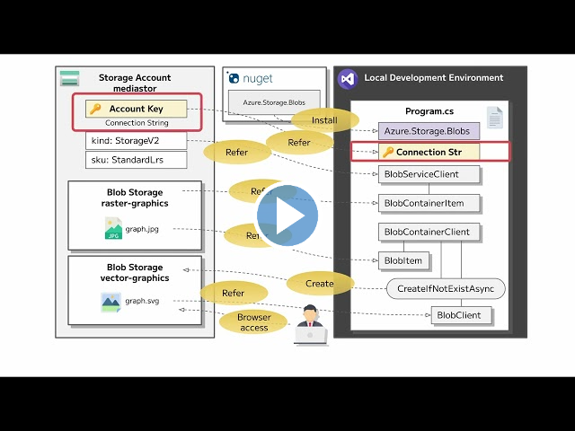

---
lab:
  az204Title: 'Lab 03: Retrieve Azure Storage resources and metadata by using the Azure Storage SDK for .NET'
  az204Module: 'Learning Path 03: Develop solutions that use blob storage'
---

# Laboratorio 03: Recuperación de recursos y metadatos de Azure Storage mediante el SDK de Azure Storage para .NET

## Interfaz de usuario de Microsoft Azure

Dada la naturaleza dinámica de las herramientas en la nube de Microsoft, puede experimentar cambios en la interfaz de usuario (UI) de Azure que se producen después del desarrollo de este contenido de entrenamiento. Como resultado, es posible que las instrucciones y los pasos del laboratorio no se alineen correctamente.

Microsoft actualiza este curso de entrenamiento cuando la comunidad nos alerta de los cambios necesarios. Sin embargo, las actualizaciones en la nube se producen con frecuencia, por lo que es posible que se produzcan cambios en la interfaz de usuario antes de que se actualice este contenido de entrenamiento. **Si esto ocurre, adáptese a los cambios y, a continuación, trabaje con ellos en los laboratorios según sea necesario.**

## Instructions

### Antes de comenzar

#### Inicio de sesión al entorno de laboratorio

Inicie sesión en la máquina virtual (VM) de Windows 10 con las credenciales siguientes:

- Nombre de usuario: `Admin`
- Contraseña: `Pa55w.rd`

> **Nota**: El instructor le proporcionará instrucciones para conectarse al entorno de laboratorio virtual.

#### Revisión de las aplicaciones instaladas

Busque la barra de tareas en el escritorio de Windows 10. La barra de tareas contiene los iconos de las aplicaciones que usará en este laboratorio, entre los que se incluyen:

-   Microsoft Edge
-   Explorador de archivos

## Escenario de laboratorio

En este laboratorio, aprenderá a usar el SDK de Azure Storage para acceder a los contenedores de Azure Storage dentro de una aplicación de C#. También aprenderá a acceder a los metadatos y exponer información de URI para obtener acceso al contenido de los contenedores de la cuenta de almacenamiento. 

Por último, para garantizar el cumplimiento de las normativas de la empresa, implementará el acceso seguro mediante la generación de firmas de acceso compartido y directivas de ciclo de vida de datos. También probará el acceso al contenido a través de un sitio web estático.

<em>Para ver este vídeo, haga clic con el botón derecho sobre este **[vínculo de vídeo](https://youtu.be/UtDXcgLv8BQ)** y seleccione "Abrir vínculo en una pestaña nueva o una ventana nueva".</em>

 

## Diagrama de la arquitectura


### Ejercicio 1: Creación de recursos de Azure

#### Tarea 1: Abra Azure Portal

1. En la barra de tareas, seleccione el icono de **Microsoft Edge**.

1. En la ventana del explorador, vaya a Azure Portal en `https://portal.azure.com` y, a continuación, inicie sesión con la cuenta que va a usar para este laboratorio.

   > **Nota**: Si es la primera vez que inicia sesión en Azure Portal, se le ofrecerá un paseo por el portal. Seleccione **Introducción** para omitir el paseo y empezar a usar el portal.

#### Tarea 2: Creación de una cuenta de almacenamiento

1. En Azure Portal, use el cuadro de texto **Buscar recursos, servicios y documentos** para buscar **Cuentas de almacenamiento** y, a continuación, en la lista de resultados, seleccione **Cuentas de almacenamiento**.

1. En la hoja  **Cuentas de almacenamiento** , seleccione **+ Crear**.

1. En la hoja **Crear una cuenta de almacenamiento**, en la pestaña **Aspectos básicos**, haz lo siguiente:

   | Configuración | Acción |
   | -- | -- |
   | Lista desplegable de **Suscripción** | Conserve los valores predeterminados |
   | Sección **Grupo de recursos** | Seleccione **Crear nuevo**, escriba **StorageMedia** y seleccione **Aceptar**. |
   | Cuadro de texto **Nombre de la cuenta de almacenamiento**  | Escribir **mediastor** _[sunombre]_ |
   | Lista desplegable de **región** | Seleccione **(EE.UU.) Este de EE. UU.** |
   | Sección **Rendimiento** | Seleccione la opción **Estándar** |
   | Lista desplegable de **Redundancia** | Seleccione **Almacenamiento con redundancia local (LRS)** |

   En la captura de pantalla siguiente, se muestran los valores configurados en la hoja **Crear una cuenta de almacenamiento**.
 
   

1. En la pestaña **Opciones avanzadas**, asegúrate de marcar **Permitir el acceso anónimo en contenedores individuales**. Comprueba la configuración si no está habilitada.
    
1. En la pestaña **Revisar**, revise las opciones que seleccionó en los pasos anteriores.

1. Seleccione **Crear** para crear la cuenta de almacenamiento mediante la configuración especificada.

    > **Nota**: Espere a que se complete la tarea de creación antes de continuar con este laboratorio.

1. Haga clic en **Go to resource** (Ir al recurso).

1. En la hoja  **Cuenta de almacenamiento** , en la sección  **Configuración** , seleccione el vínculo  **Puntos de conexión.** 

1. En la sección **Puntos de conexión**, copie el valor del cuadro de texto **Blob Service** en el Portapapeles.

    > **Nota**: Usará este valor de punto de conexión más adelante en el laboratorio.

1. Abra el Bloc de notas y pegue ahí el valor de Blob Service copiado.

1. En la hoja **Cuenta de almacenamiento**, en la sección **Seguridad y redes**, seleccione **Claves de acceso**.

1. Copie el **nombre de cuenta de Storage** en el Portapapeles y péguelo en el Bloc de notas.

1. En la hoja **Claves de acceso**, seleccione **Mostrar claves**.

1. Revise cualquiera de las claves y copie el valor de cualquiera de los cuadros **Clave** en el Portapapeles.

    > **Nota**: Usará todos estos valores más adelante en este laboratorio.

#### Revisar

En este ejercicio, ha creado una nueva cuenta de almacenamiento que se usará en el resto del laboratorio.

### Ejercicio 2: Carga de un blob en un contenedor

#### Tarea 1: Creación de contenedores de cuentas de almacenamiento

1. En la hoja **Cuenta de almacenamiento**, en la sección **Almacenamiento de datos**, seleccione el vínculo **Contenedores**.

1. En la sección **Contenedores**, seleccione **+ Contenedor**.

1. En la ventana emergente **Nuevo contenedor**, realice las siguientes acciones y, a continuación, seleccione **Crear**:

    | Configuración | Acción |
    | -- | -- |
    | Cuadro de texto de **nombre** | Escribir **raster-graphics** |
    | Lista desplegable del **nivel de acceso público** | Seleccionar **Privado (sin acceso anónimo)** |

1. En la sección **Contenedores**, seleccione **+ Contenedor**.

1. En la ventana emergente **Nuevo contenedor**, realice las siguientes acciones y, a continuación, seleccione **Crear**:

    | Configuración | Acción |
    | -- | -- |
    | Cuadro de texto de **nombre** | Escribir **compressed-audio** |
    | Lista desplegable del **nivel de acceso público** | Seleccionar **Privado (sin acceso anónimo)** |

1. En la sección **Contenedores**, observe la lista actualizada de contenedores.

    En la captura de pantalla siguiente, se muestran los valores configurados en la hoja **Crear una cuenta de almacenamiento**.

    

#### Tarea 2: Carga de un blob de cuenta de almacenamiento

1. En la sección **Contenedores**, seleccione el contenedor **raster-graphics** recién creado.

1.  En la hoja **Contenedor**, seleccione **Cargar**.

1.  En la ventana **Cargar blob**, realice las siguientes acciones y, a continuación, seleccione **Cargar**:

   | Configuración | Acción |
   | -- | -- |
   | Sección **Archivos** | Seleccione **Buscar archivos** o use la característica de arrastrar y colocar. |
   | Ventana **Explorador de archivos** | Vaya a **Allfiles (F):\\Allfiles\\Labs\\03\\Starter\\Images**, seleccione el archivo **graph.jpg** y, a continuación, seleccione **Abrir**. |
   | Casilla **Sobrescribir si ya hay archivos** | Asegurarse de que la casilla está seleccionada |
   
   > **Nota**: Espere a que se cargue el blob antes de continuar con este laboratorio.

#### Revisar

En este ejercicio, ha creado contenedores de marcadores de posición en la cuenta de almacenamiento y, a continuación, ha rellenado uno de los contenedores con un blob.

### Ejercicio 3: Acceso a contenedores mediante el SDK de .NET

#### Tarea 1: Creación de un proyecto de .NET

1. En la pantalla **Inicio**, seleccione el icono **Visual Studio Code**.

1. En el menú **Archivo**, seleccione **Abrir carpeta**, busque **Allfiles (F):\\Allfiles\\Labs\\03\\Starter\\BlobManager** y, a continuación, seleccione **Seleccionar carpeta**.

1. En la ventana **Visual Studio Code**, en la barra de menús, seleccione **Terminal** y, a continuación, **Nuevo terminal**.

1. En el terminal, ejecute el siguiente comando para crear un nuevo proyecto de .NET denominado **BlobManager** en la carpeta actual:

    ```
    dotnet new console --framework net6.0 --name BlobManager --output .
    ```

    > **Nota**: El comando **dotnet new** creará un nuevo proyecto de **consola** en una carpeta con el mismo nombre que el proyecto.

1. En el terminal, ejecute el comando siguiente para importar la versión 12.12.0 de **Azure.Storage.Blobs** de NuGet:

    ```
    dotnet add package Azure.Storage.Blobs --version 12.12.0
    ```

    > **Nota**: El comando **dotnet add package** agregará el paquete **Azure.Storage.Blobs** desde NuGet. Para obtener más información, consulte [Azure.Storage.Blobs](https://www.nuget.org/packages/Azure.Storage.Blobs/12.12.0).

1. En el terminal, ejecute el siguiente comando para compilar la aplicación web de .NET:

    ```
    dotnet build
    ```

1. Seleccione **Cerrar el terminal** o el icono de la **papelera de reciclaje** para cerrar el terminal abierto y todos los procesos asociados.

#### Tarea 2: Modificación de la clase Program para acceder a Storage

1. En el panel  **Explorador**  de la ventana **Visual Studio Code**, abra el archivo **Program.cs**.

1. En la pestaña del editor de código del archivo  **Program.cs** , elimine todo el código del archivo existente.

1. Agregue el siguiente código:

    ```csharp
    using Azure.Storage;
    using Azure.Storage.Blobs;
    using Azure.Storage.Blobs.Models;
    using System;
    using System.Threading.Tasks;    
    public class Program
    {
        //Update the blobServiceEndpoint value that you recorded previously in this lab.        
        private const string blobServiceEndpoint = "<primary-blob-service-endpoint>";

        //Update the storageAccountName value that you recorded previously in this lab.
        private const string storageAccountName = "<storage-account-name>";

        //Update the storageAccountKey value that you recorded previously in this lab.
        private const string storageAccountKey = "<key>";    


        //The following code to create a new asynchronous Main method
        public static async Task Main(string[] args)
        { 
        }
    }
    ```

1. Actualice la constante de cadena **blobServiceEndpoint**; para ello, establezca su valor en el  **Punto de conexión de servicio BLOB principal** de la cuenta de almacenamiento que registró anteriormente en este laboratorio.

1. Actualice la constante de cadena **storageAccountName**; para ello, establezca su valor en el  **Nombre de la cuenta de almacenamiento** de la cuenta de este tipo que registró anteriormente en el laboratorio.

1. Actualice la constante de cadena **storageAccountKey**; para ello, establezca su valor en la  **Clave** de la cuenta de almacenamiento que registró anteriormente en este laboratorio.
  

#### Tarea 3: Conexión al punto de conexión de servicio de blobs de Azure Storage

1. En el método **Main**, agregue el siguiente código:
  
    ```csharp
     public static async Task Main(string[] args)
    {
        //The following line of code to create a new instance of the StorageSharedKeyCredential class by using the storageAccountName and storageAccountKey constants as constructor parameters
        StorageSharedKeyCredential accountCredentials = new StorageSharedKeyCredential(storageAccountName, storageAccountKey);

        //The following line of code to create a new instance of the BlobServiceClient class by using the blobServiceEndpoint constant and the accountCredentials variable as constructor parameters
        BlobServiceClient serviceClient = new BlobServiceClient(new Uri(blobServiceEndpoint), accountCredentials);

        //The following line of code to invoke the GetAccountInfoAsync method of the BlobServiceClient class to retrieve account metadata from the service
        AccountInfo info = await serviceClient.GetAccountInfoAsync();

        //Render a welcome message
        await Console.Out.WriteLineAsync($"Connected to Azure Storage Account");

        //Render the storage account's name
        await Console.Out.WriteLineAsync($"Account name:\t{storageAccountName}");

        //Render the type of storage account
        await Console.Out.WriteLineAsync($"Account kind:\t{info?.AccountKind}");

        //Render the currently selected stock keeping unit (SKU) for the storage account
        await Console.Out.WriteLineAsync($"Account sku:\t{info?.SkuName}");
    }
    ```

1. Guarde el archivo **Program.cs** .

1. En la ventana **Visual Studio Code**, en la barra de menús, seleccione **Terminal** y, a continuación, **Nuevo terminal**.

1. En el terminal, ejecute el siguiente comando para ejecutar la aplicación web de .NET:

    ```
    dotnet run
    ```

    > **Nota**: Si hay algún error de compilación, revise el archivo **Program.cs** en la carpeta **Allfiles (F):\\Allfiles\\Labs\\03\\Solution\\BlobManager**.

1. Observe la salida de la aplicación de consola que se está ejecutando actualmente. La salida contiene metadatos para la cuenta de almacenamiento que se recuperó del servicio.

1. Seleccione **Cerrar el terminal** o el icono de la **papelera de reciclaje** para cerrar el terminal abierto y todos los procesos asociados.

#### Tarea 4: Enumeración de los contenedores existentes

1. En la clase **Program**, escriba el código siguiente para crear un nuevo método **estático privado** denominado **EnumerateContainersAsync**, que es asincrónico y tiene un único tipo de parámetro **BlobServiceClient**:
   
    ```csharp
    private static async Task EnumerateContainersAsync(BlobServiceClient client)
    {   
        /*Create an asynchronous foreach loop that iterates over the results of 
            an invocation of the GetBlobContainersAsync method of the BlobServiceClient class. */    
        await foreach (BlobContainerItem container in client.GetBlobContainersAsync())
        {   
            //Print the name of each container
            await Console.Out.WriteLineAsync($"Container:\t{container.Name}");
        }
    }
    ```

1. En el método **Main**, escriba el código siguiente al final del método para invocar el método **EnumerateContainersAsync** y pase la variable *serviceClient* como parámetro:

    ```csharp
    await EnumerateContainersAsync(serviceClient);
    ```

1. Observe el archivo **Program.cs**, que ahora debe incluir lo siguiente:
    ```csharp
    using Azure.Storage;
    using Azure.Storage.Blobs;
    using Azure.Storage.Blobs.Models;
    using System;
    using System.Threading.Tasks;
    
    public class Program
    {
        private const string blobServiceEndpoint = "your blobServiceEndpoint";
        private const string storageAccountName = "your storageAccountName";
        private const string storageAccountKey = "your storageAccountKey";    
        public static async Task Main(string[] args)
        {
            StorageSharedKeyCredential accountCredentials = new StorageSharedKeyCredential(storageAccountName, storageAccountKey);
            BlobServiceClient serviceClient = new     BlobServiceClient(new Uri(blobServiceEndpoint), accountCredentials);
            AccountInfo info = await serviceClient.GetAccountInfoAsync();
            await Console.Out.WriteLineAsync($"Connected to Azure Storage Account");
            await Console.Out.WriteLineAsync($"Account name:\t{storageAccountName}");
            await Console.Out.WriteLineAsync($"Account kind:\t{info?.AccountKind}");
            await Console.Out.WriteLineAsync($"Account sku:\t{info?.SkuName}");

            /* To invoke the EnumerateContainersAsync method, 
            passing in the serviceClient variable as a parameter */
            await EnumerateContainersAsync(serviceClient);
        }        
        private static async Task EnumerateContainersAsync(BlobServiceClient client)
        {        
            await foreach (BlobContainerItem container in client.GetBlobContainersAsync())
            {
                await Console.Out.WriteLineAsync($"Container:\t{container.Name}");
            }
    }
    }
    ```

1. Guarde el archivo **Program.cs** .

1. En la ventana **Visual Studio Code**, en la barra de menús, seleccione **Terminal** y, a continuación, **Nuevo terminal**.

1. En el terminal, ejecute el siguiente comando para ejecutar la aplicación web de .NET:

    ```
    dotnet run
    ```

    > **Nota**: Si hay algún error de compilación, revise el archivo **Program.cs** en la carpeta **Allfiles (F):\\Allfiles\\Labs\\03\\Solution\\BlobManager**.

1. Observe la salida de la aplicación de consola que se está ejecutando actualmente. La salida actualizada incluye una lista de todos los contenedores existentes de la cuenta.

1. Seleccione **Cerrar el terminal** o el icono de la **papelera de reciclaje** para cerrar el terminal abierto y todos los procesos asociados.

#### Revisar

En este ejercicio, ha accedido a los contenedores existentes mediante el SDK de Azure Storage.

### Ejercicio 4: Recuperación de identificadores uniformes de recursos (URI) de blobs mediante el SDK de .NET

#### Tarea 1: Enumeración de los blobs de un contenedor existente mediante el SDK

1. En la clase **Program**, escriba el código siguiente para crear un nuevo método **estático privado** denominado **EnumerateBlobsAsync**, que es asincrónico y tiene dos tipos de parámetros **BlobServiceClient** y **string**:
  
    ```csharp
    private static async Task EnumerateBlobsAsync(BlobServiceClient client, string containerName)
    {   
        /* Get a new instance of the BlobContainerClient class by using the
           GetBlobContainerClient method of the BlobServiceClient class, 
           passing in the containerName parameter */   
        BlobContainerClient container = client.GetBlobContainerClient(containerName);

        /* Render the name of the container that will be enumerated */
        await Console.Out.WriteLineAsync($"Searching:\t{container.Name}");

        /* Create an asynchronous foreach loop that iterates over the results of
            an invocation of the GetBlobsAsync method of the BlobContainerClient class */
        await foreach (BlobItem blob in container.GetBlobsAsync())
        {     
            //Print the name of each blob    
            await Console.Out.WriteLineAsync($"Existing Blob:\t{blob.Name}");
        }
    }
    ```

1. En el método **Main**, escriba el código siguiente al final del método para crear una variable denominada *existingContainerName* con un valor de **raster-graphics**:

    ```csharp
    string existingContainerName = "raster-graphics";
    ```

1. En el método **Main**, escriba el código siguiente al final del método para invocar el método **EnumerateBlobsAsync** y pase las variables *serviceClient* y *existingContainerName* como parámetros:

    ```csharp
    await EnumerateBlobsAsync(serviceClient, existingContainerName);
    ```

1. Observe el archivo **Program.cs**, que ahora debe incluir lo siguiente:
    ```csharp
    using Azure.Storage;
    using Azure.Storage.Blobs;
    using Azure.Storage.Blobs.Models;
    using System;
    using System.Threading.Tasks;    
    public class Program
    {
        private const string blobServiceEndpoint = "your blobServiceEndpoint";
        private const string storageAccountName = "your storageAccountName";
        private const string storageAccountKey = "your storageAccountKey";    
        public static async Task Main(string[] args)
        {
            StorageSharedKeyCredential accountCredentials = new StorageSharedKeyCredential(storageAccountName, storageAccountKey);
            BlobServiceClient serviceClient = new   BlobServiceClient(new Uri(blobServiceEndpoint), accountCredentials);
            AccountInfo info = await serviceClient.GetAccountInfoAsync();
            await Console.Out.WriteLineAsync($"Connected to Azure Storage Account");
            await Console.Out.WriteLineAsync($"Account name:\t{storageAccountName}");
            await Console.Out.WriteLineAsync($"Account kind:\t{info?.AccountKind}");
            await Console.Out.WriteLineAsync($"Account sku:\t{info?.SkuName}");
            await EnumerateContainersAsync(serviceClient);
            string existingContainerName = "raster-graphics";
            await EnumerateBlobsAsync(serviceClient, existingContainerName);
        }        
        private static async Task EnumerateContainersAsync(BlobServiceClient client)
        {        
            await foreach (BlobContainerItem container in client.GetBlobContainersAsync())
            {
                await Console.Out.WriteLineAsync($"Container:\t{container.Name}");
            }
        }        
        private static async Task EnumerateBlobsAsync(BlobServiceClient client, string containerName)
        {      
            BlobContainerClient container = client.GetBlobContainerClient(containerName);
            await Console.Out.WriteLineAsync($"Searching:\t{container.Name}");
            await foreach (BlobItem blob in container.GetBlobsAsync())
            {        
                await Console.Out.WriteLineAsync($"Existing Blob:\t{blob.Name}");
            }
        }
    }
    ```

1. Guarde el archivo **Program.cs** .

1. En la ventana **Visual Studio Code**, en la barra de menús, seleccione **Terminal** y, a continuación, **Nuevo terminal**.

1. En el terminal, ejecute el siguiente comando para ejecutar la aplicación web de .NET:

    ```
    dotnet run
    ```

    > **Nota**: Si hay algún error de compilación, revise el archivo **Program.cs** en la carpeta **Allfiles (F):\\Allfiles\\Labs\\03\\Solution\\BlobManager**.

1. Revise la salida de la aplicación de consola que se está ejecutando actualmente. La salida actualizada incluye metadatos sobre el contenedor y los blobs existentes.

1. Seleccione **Cerrar el terminal** o el icono de la **papelera de reciclaje** para cerrar el terminal abierto y todos los procesos asociados.

#### Tarea 2: Creación de un nuevo contenedor mediante el SDK

1. En la clase **Program**, escriba el código siguiente para crear un nuevo método **estático privado** denominado **GetContainerAsync**, que es asincrónico y tiene dos tipos de parámetros **BlobServiceClient** y **string**:

    ```csharp
    private static async Task<BlobContainerClient> GetContainerAsync(BlobServiceClient client, string containerName)
    {   
        /* Get a new instance of the BlobContainerClient class by using the
            GetBlobContainerClient method of the BlobServiceClient class,
            passing in the containerName parameter */   
        BlobContainerClient container = client.GetBlobContainerClient(containerName);

        /* Invoke the CreateIfNotExistsAsync method of the BlobContainerClient class */
        await container.CreateIfNotExistsAsync(PublicAccessType.Blob);

        /* Render the name of the container that was potentially created */
        await Console.Out.WriteLineAsync($"New Container:\t{container.Name}");

        /* Return the container as the result of the GetContainerAsync */        
        return container;
    }
    ```

1. En el método **Main**, escriba el código siguiente al final del método para crear una variable denominada *newContainerName* con un valor de **vector-graphics**:

    ```csharp
    string newContainerName = "vector-graphics";
    ```

1. En el método **Main**, escriba el código siguiente al final del método para invocar el método **GetContainerAsync**, para pasar las variables *serviceClient* y *newContainerName* como parámetros y para almacenar el resultado en una variable denominada *containerClient* de tipo **BlobContainerClient**:

    ```csharp
    BlobContainerClient containerClient = await GetContainerAsync(serviceClient, newContainerName);
    ```

1. Revise el archivo **Program.cs**, que ahora debe incluir:
    ```csharp
    using Azure.Storage;
    using Azure.Storage.Blobs;
    using Azure.Storage.Blobs.Models;
    using System;
    using System.Threading.Tasks;    
    public class Program
    {
        private const string blobServiceEndpoint = "your blobServiceEndpoint";
        private const string storageAccountName = "your storageAccountName";
        private const string storageAccountKey = "your storageAccountKey";
        public static async Task Main(string[] args)
        {
            StorageSharedKeyCredential accountCredentials = new StorageSharedKeyCredential(storageAccountName, storageAccountKey);
            BlobServiceClient serviceClient = new BlobServiceClient(new Uri(blobServiceEndpoint), accountCredentials);
            AccountInfo info = await serviceClient.GetAccountInfoAsync();
            await Console.Out.WriteLineAsync($"Connected to Azure Storage Account");
            await Console.Out.WriteLineAsync($"Account name:\t{storageAccountName}");
            await Console.Out.WriteLineAsync($"Account kind:\t{info?.AccountKind}");
            await Console.Out.WriteLineAsync($"Account sku:\t{info?.SkuName}");
            await EnumerateContainersAsync(serviceClient);
            string existingContainerName = "raster-graphics";
            await EnumerateBlobsAsync(serviceClient, existingContainerName);
            string newContainerName = "vector-graphics";
            BlobContainerClient containerClient = await GetContainerAsync(serviceClient, newContainerName);
        }        
        private static async Task EnumerateContainersAsync(BlobServiceClient client)
        {        
            await foreach (BlobContainerItem container in client.GetBlobContainersAsync())
            {
                await Console.Out.WriteLineAsync($"Container:\t{container.Name}");
            }
        }        
        private static async Task EnumerateBlobsAsync(BlobServiceClient client, string containerName)
        {      
            BlobContainerClient container = client.GetBlobContainerClient(containerName);
            await Console.Out.WriteLineAsync($"Searching:\t{container.Name}");
            await foreach (BlobItem blob in container.GetBlobsAsync())
            {        
                await Console.Out.WriteLineAsync($"Existing Blob:\t{blob.Name}");
            }
        }        
        private static async Task<BlobContainerClient> GetContainerAsync(BlobServiceClient client, string containerName)
        {      
            BlobContainerClient container = client.GetBlobContainerClient(containerName);
            await container.CreateIfNotExistsAsync(PublicAccessType.Blob);
            await Console.Out.WriteLineAsync($"New Container:\t{container.Name}");
            return container;
        }
    }
    ```

1. Guarde el archivo **Program.cs** .

1. En la ventana **Visual Studio Code**, en la barra de menús, seleccione **Terminal** y, a continuación, **Nuevo terminal**.

1. En el terminal, ejecute el siguiente comando para ejecutar la aplicación web de .NET:

    ```
    dotnet run
    ```

    > **Nota**: Si hay algún error de compilación, revise el archivo **Program.cs** en la carpeta **Allfiles (F):\\Allfiles\\Labs\\03\\Solution\\BlobManager**.

1. Observe la salida de la aplicación de consola que se está ejecutando actualmente. La salida actualizada incluye metadatos sobre el contenedor y los blobs existentes.

1. Seleccione **Cerrar el terminal** o el icono de la **papelera de reciclaje** para cerrar el terminal abierto y todos los procesos asociados.

#### Tarea 3: Carga de un nuevo blob mediante el portal

1. En el panel de **navegación** de Azure Portal, seleccione el vínculo **Grupos de recursos**.

1. En la hoja **Grupos de recursos**, seleccione el grupo de recursos **StorageMedia** que creó anteriormente en este laboratorio.

1. En la hoja **StorageMedia**, seleccione la cuenta de almacenamiento **mediastor** _[su nombre]_ que creó anteriormente en este laboratorio.

1. En la hoja **Cuenta de almacenamiento**, seleccione el vínculo **Contenedores** en la sección **Almacenamiento de datos**.

1. En la sección **Contenedores**, seleccione el contenedor **vector-graphics** recién creado. Es posible que tenga que actualizar la página para observar el nuevo contenedor.

1.  En la hoja **Contenedor**, seleccione **Cargar**.

1.  En la ventana **Cargar blob**, realice las siguientes acciones y, a continuación, seleccione **Cargar**:

    | Configuración | Acción |
    | -- | -- |
    | Sección **Archivos** | Seleccione **Buscar archivos** o use la característica de arrastrar y colocar. |
    | Ventana **Explorador de archivos** |  En **Allfiles (F):\\Allfiles\\Labs\\03\\Starter\\Images**, seleccione el archivo **graph.svg** y, a continuación, seleccione **Abrir**. |
    | Casilla **Sobrescribir si ya hay archivos** | Asegurarse de que la casilla está seleccionada |

    > **Nota**: Espere a que se cargue el blob antes de continuar con este laboratorio.

#### Tarea 4: Acceso al URI del blob mediante el SDK

1. Cambie a la ventana de **Visual Studio Code**.

1. En la clase **Program**, escriba el código siguiente para crear un nuevo método **estático privado** denominado **GetBlobAsync**, que es asincrónico y tiene dos tipos de parámetros **BlobContainerClient** y **string**:
   
    ```csharp
    private static async Task<BlobClient> GetBlobAsync(BlobContainerClient client, string blobName)
    {      
        BlobClient blob = client.GetBlobClient(blobName);
        bool exists = await blob.ExistsAsync();
        if (!exists)
        {
            await Console.Out.WriteLineAsync($"Blob {blob.Name} not found!");
            
        }
        else
            await Console.Out.WriteLineAsync($"Blob Found, URI:\t{blob.Uri}");
        return blob;
    }
    ```

1. En el método **Main**, escriba el código siguiente al final del método para crear una variable denominada *uploadedBlobName* con un valor de **graph.svg**:

    ```csharp
    string uploadedBlobName = "graph.svg";
    ```

1. En el método **Main**, escriba el código siguiente al final del método para invocar el método **GetBlobAsync**, para pasar las variables *containerClient* y *uploadedBlobName* como parámetros y para almacenar el resultado en una variable denominada *blobClient* de tipo **BlobClient**:

    ```csharp
    BlobClient blobClient = await GetBlobAsync(containerClient, uploadedBlobName);
    ```

1. En el método **Main**, escriba el código siguiente al final del método para representar la propiedad **Uri** de la variable *blobClient*:

    ```csharp
    await Console.Out.WriteLineAsync($"Blob Url:\t{blobClient.Uri}");
    ```

1. Observe el archivo **Program.cs**, que ahora debe incluir lo siguiente:
    ```csharp
    using Azure.Storage;
    using Azure.Storage.Blobs;
    using Azure.Storage.Blobs.Models;
    using System;
    using System.Threading.Tasks;    
    public class Program
    {
        private const string blobServiceEndpoint = "your blobServiceEndpoint";
        private const string storageAccountName = "your storageAccountName";
        private const string storageAccountKey = "your storageAccountKey";    
        public static async Task Main(string[] args)
        {
            StorageSharedKeyCredential accountCredentials = new StorageSharedKeyCredential(storageAccountName, storageAccountKey);
            BlobServiceClient serviceClient = new BlobServiceClient(new Uri(blobServiceEndpoint), accountCredentials);
            AccountInfo info = await serviceClient.GetAccountInfoAsync();
            await Console.Out.WriteLineAsync($"Connected to Azure Storage Account");
            await Console.Out.WriteLineAsync($"Account name:\t{storageAccountName}");
            await Console.Out.WriteLineAsync($"Account kind:\t{info?.AccountKind}");
            await Console.Out.WriteLineAsync($"Account sku:\t{info?.SkuName}");
            await EnumerateContainersAsync(serviceClient);
            string existingContainerName = "raster-graphics";
            await EnumerateBlobsAsync(serviceClient, existingContainerName);
            string newContainerName = "vector-graphics";
            BlobContainerClient containerClient = await GetContainerAsync(serviceClient, newContainerName);
            string uploadedBlobName = "graph.svg";
            BlobClient blobClient = await GetBlobAsync(containerClient, uploadedBlobName);
            await Console.Out.WriteLineAsync($"Blob Url:\t{blobClient.Uri}");
        }        
        private static async Task EnumerateContainersAsync(BlobServiceClient client)
        {        
            await foreach (BlobContainerItem container in client.GetBlobContainersAsync())
            {
                await Console.Out.WriteLineAsync($"Container:\t{container.Name}");
            }
        }        
        private static async Task EnumerateBlobsAsync(BlobServiceClient client, string containerName)
        {      
            BlobContainerClient container = client.GetBlobContainerClient(containerName);
            await Console.Out.WriteLineAsync($"Searching:\t{container.Name}");
            await foreach (BlobItem blob in container.GetBlobsAsync())
            {        
                await Console.Out.WriteLineAsync($"Existing Blob:\t{blob.Name}");
            }
        }        
        private static async Task<BlobContainerClient> GetContainerAsync(BlobServiceClient client, string containerName)
        {      
            BlobContainerClient container = client.GetBlobContainerClient(containerName);

            await container.CreateIfNotExistsAsync(PublicAccessType.Blob);
            await Console.Out.WriteLineAsync($"New Container:\t{container.Name}");
            return container;
        }        
        private static async Task<BlobClient> GetBlobAsync(BlobContainerClient client, string blobName)
        {      
            BlobClient blob = client.GetBlobClient(blobName);
            bool exists = await blob.ExistsAsync();
            if (!exists)
            {
                await Console.Out.WriteLineAsync($"Blob {blob.Name} not found!");
                
            }
            else
                await Console.Out.WriteLineAsync($"Blob Found, URI:\t{blob.Uri}");
            return blob;
        }
    }
    ```

1. Guarde el archivo **Program.cs** .

1. En la ventana **Visual Studio Code**, en la barra de menús, seleccione **Terminal** y, a continuación, **Nuevo terminal**.

1. En el terminal, ejecute el siguiente comando para ejecutar la aplicación web de .NET:

    ```
    dotnet run
    ```

    > **Nota**: Si hay algún error de compilación, revise el archivo **Program.cs** en la carpeta **Allfiles (F):\\Allfiles\\Labs\\03\\Solution\\BlobManager**.

1. Observe la salida de la aplicación de consola que se está ejecutando actualmente. La salida actualizada incluye la dirección URL final para acceder al blob en línea. Registre el valor de esta dirección URL para usarla más adelante en el laboratorio.

    > **Nota**: Es probable que la dirección URL sea similar a la cadena siguiente: `https://mediastor*[yourname]*.blob.core.windows.net/vector-graphics/graph.svg`

1. Seleccione **Cerrar el terminal** o el icono de la **papelera de reciclaje** para cerrar el terminal abierto y todos los procesos asociados.

#### Tarea 5: Prueba del URI mediante un explorador

1. En la barra de tareas, active el menú contextual del icono **Microsoft Edge** y, a continuación, seleccione **Nueva ventana**.

1. En la nueva ventana del explorador, consulte la dirección URL que copió anteriormente en este laboratorio para el blob.

1. Ahora debería ver el archivo Gráficos vectoriales escalables (SVG) en la ventana del explorador.

#### Revisar

En este ejercicio, ha creado contenedores y blobs administrados mediante el SDK de Storage.
