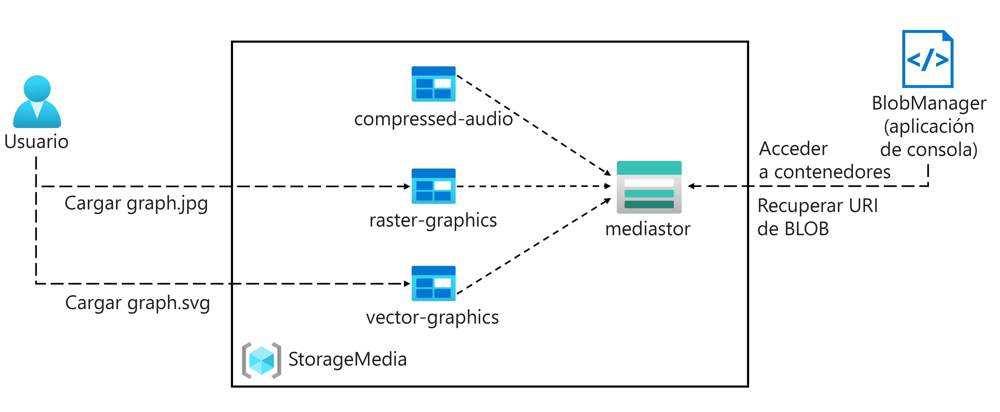
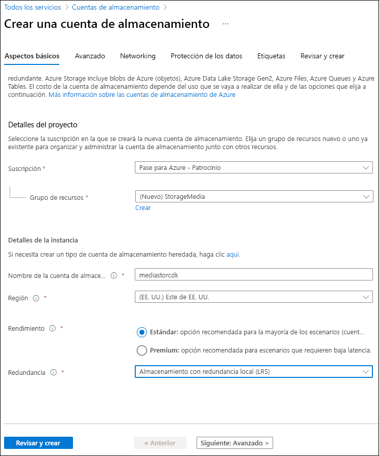
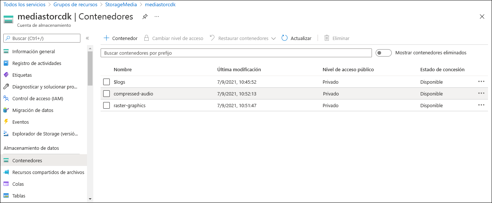

---
lab:
  az204Title: 'Lab 03: Retrieve Azure Storage resources and metadata by using the Azure Storage SDK for .NET'
  az020Title: 'Lab 03: Retrieve Azure Storage resources and metadata by using the Azure Storage SDK for .NET'
  az204Module: 'Module 03: Develop solutions that use blob storage'
  az020Module: 'Module 03: Develop solutions that use blob storage'
ms.openlocfilehash: 30d68c855084782c034d7ed7c0eb49b1851b60d9
ms.sourcegitcommit: d2d374fffa4fcbf92b9c4bdc9c9ecc470152e033
ms.translationtype: HT
ms.contentlocale: es-ES
ms.lasthandoff: 11/16/2021
ms.locfileid: "132626266"
---
# <a name="lab-03-retrieve-azure-storage-resources-and-metadata-by-using-the-azure-storage-sdk-for-net"></a>Laboratorio 03: Recuperación de recursos y metadatos de Azure Storage mediante el SDK de Azure Storage para .NET

## <a name="microsoft-azure-user-interface"></a>Interfaz de usuario de Microsoft Azure

Dada la naturaleza dinámica de las herramientas en la nube de Microsoft, puede experimentar cambios en la interfaz de usuario (UI) de Azure que se producen después del desarrollo de este contenido de entrenamiento. Como resultado, es posible que las instrucciones y los pasos del laboratorio no se alineen correctamente.

Microsoft actualiza este curso de entrenamiento cuando la comunidad nos alerta de los cambios necesarios. Sin embargo, las actualizaciones en la nube se producen con frecuencia, por lo que es posible que se produzcan cambios en la interfaz de usuario antes de que se actualice este contenido de entrenamiento. **Si esto ocurre, adáptese a los cambios y, a continuación, trabaje con ellos en los laboratorios según sea necesario.**

## <a name="instructions"></a>Instructions

### <a name="before-you-start"></a>Antes de comenzar

#### <a name="sign-in-to-the-lab-environment"></a>Inicio de sesión al entorno de laboratorio

Inicie sesión en la máquina virtual (VM) de Windows 10 con las credenciales siguientes:

-   Nombre de usuario: **Admin**

-   Contraseña: **Pa55w.rd**.

> **Nota**: El instructor le proporcionará instrucciones para conectarse al entorno de laboratorio virtual.

#### <a name="review-the-installed-applications"></a>Revisión de las aplicaciones instaladas

Busque la barra de tareas en el escritorio de Windows 10. La barra de tareas contiene los iconos de las aplicaciones que usará en este laboratorio, entre los que se incluyen:

-   Microsoft Edge

-   Explorador de archivos

## <a name="architecture-diagram"></a>Diagrama de la arquitectura



### <a name="exercise-1-create-azure-resources"></a>Ejercicio 1: Creación de recursos de Azure

#### <a name="task-1-open-the-azure-portal"></a>Tarea 1: Abra Azure Portal

1.  En la barra de tareas, seleccione el icono de **Microsoft Edge**.

1. En la ventana del explorador, vaya a Azure Portal (<https://portal.azure.com>) y, a continuación, inicie sesión con la cuenta que va a usar para este laboratorio.

   > **Nota**: Si es la primera vez que inicia sesión en Azure Portal, se le ofrecerá un paseo por el portal. Seleccione **Introducción** para omitir el paseo y empezar a usar el portal.

#### <a name="task-2-create-a-storage-account"></a>Tarea 2: Creación de una cuenta de almacenamiento

1.  En Azure Portal, use el cuadro de texto **Buscar recursos, servicios y documentos** para buscar **Cuentas de almacenamiento** y, a continuación, en la lista de resultados, seleccione **Cuentas de almacenamiento**.

1.  En la hoja **Cuentas de almacenamiento**, seleccione **+ Crear**.

1.  En la hoja **Crear una cuenta de almacenamiento**, en la pestaña **Aspectos básicos**, realice las siguientes acciones y seleccione **Revisar y crear**:

   | Configuración                           | Acción                                                       |
   | --------------------------------- | ------------------------------------------------------------ |
   | Lista desplegable **Suscripción**   | Conserve los valores predeterminados.                                    |
   | Sección **Grupo de recursos**        | Seleccione **Crear nuevo**, escriba **StorageMedia** y seleccione **Aceptar**. |
   | Cuadro de texto **Nombre de la cuenta de almacenamiento** | Escriba **mediastor** _[su nombre]_ .                             |
   | Lista desplegable de **región**         | Seleccione **(EE. UU.) Este de EE. UU.** .                                     |
   | Sección **Rendimiento**           | Seleccione la opción **Estándar**.                              |
   | Lista desplegable de **Redundancia**     | Seleccione **Almacenamiento con redundancia local (LRS)** .                  |

   En la captura de pantalla siguiente, se muestran los valores configurados en la hoja **Crear una cuenta de almacenamiento**.
 
   
   
1.  En la pestaña **Revisar y crear**, revise las opciones que seleccionó durante los pasos anteriores.

1.  Seleccione **Crear** para crear la cuenta de almacenamiento mediante la configuración especificada.

    > **Nota**: Espere a que se complete la tarea de creación antes de continuar con este laboratorio.

1.  En el panel de navegación de Azure Portal, seleccione **Todos los servicios**.

1.  En la hoja **Todos los servicios**, seleccione **Cuentas de almacenamiento**.

1.  En la hoja **Cuentas de almacenamiento**, seleccione la instancia de la cuenta de almacenamiento **mediastor** _[su nombre]_ .

    > **Nota**: Si la instancia de la cuenta de almacenamiento **mediastor** _[su nombre]_ no se muestra, seleccione **Actualizar**.

1.  En la hoja **Cuenta de almacenamiento**, en la sección **Configuración**, seleccione el vínculo **Puntos de conexión**.

1.  En la sección **Puntos de conexión**, registre el valor del cuadro de texto **Blob Service**.

    > **Nota**: Usará este valor de punto de conexión más adelante en el laboratorio.

1.  En la hoja **Cuenta de almacenamiento**, en la sección **Seguridad y redes**, seleccione el vínculo **Claves de acceso**.

1.  En la sección **Claves de acceso**, realice las siguientes acciones:

    a.  Registre el valor en el cuadro de texto **Nombre de la cuenta de almacenamiento**.
    
    b.  Seleccione **Mostrar claves**.

    c.  Seleccione cualquiera de las claves y luego registre el valor en cualquiera de los cuadros de **Clave**.

    > **Nota**: Usará todos estos valores más adelante en este laboratorio.

#### <a name="review"></a>Revisar

En este ejercicio, ha creado una nueva cuenta de almacenamiento que se usará en el resto del laboratorio.

### <a name="exercise-2-upload-a-blob-into-a-container"></a>Ejercicio 2: Carga de un blob en un contenedor

#### <a name="task-1-create-storage-account-containers"></a>Tarea 1: Creación de contenedores de cuentas de almacenamiento

1. En el panel de navegación de Azure Portal, seleccione el vínculo **Grupos de recursos**.

1. En la hoja **Grupos de recursos**, seleccione el grupo de recursos **StorageMedia** que creó anteriormente en este laboratorio.

1. En la hoja **StorageMedia**, seleccione la cuenta de almacenamiento **mediastor** _[su nombre]_ que creó anteriormente en este laboratorio.

1. En la hoja **Cuenta de almacenamiento**, seleccione el vínculo **Contenedores** en la sección **Almacenamiento de datos**.

1. En la sección **Contenedores**, seleccione **+ Contenedor**.

1. En la ventana emergente **Nuevo contenedor**, realice las siguientes acciones y, a continuación, seleccione **Crear**:

    | Configuración                                | Acción                                    |
    | -------------------------------------- | ----------------------------------------- |
    | Cuadro de texto de **nombre**                      | Escriba **raster-graphics**.                |
    | Lista desplegable del **nivel de acceso público** | Seleccione **Privado (sin acceso anónimo)** . |

1. En la sección **Contenedores**, seleccione **+ Contenedor**.

1. En la ventana emergente **Nuevo contenedor**, realice las siguientes acciones y, a continuación, seleccione **Crear**:

    | Configuración                                | Acción                                    |
    | -------------------------------------- | ----------------------------------------- |
    | Cuadro de texto de **nombre**                      | Escriba **compressed-audio**.               |
    | Lista desplegable del **nivel de acceso público** | Seleccione **Privado (sin acceso anónimo)** . |

1. En la sección **Contenedores**, observe la lista actualizada de contenedores.

    En la captura de pantalla siguiente, se muestran los valores configurados en la hoja **Crear una cuenta de almacenamiento**.

    

#### <a name="task-2-upload-a-storage-account-blob"></a>Tarea 2: Carga de un blob de cuenta de almacenamiento

1.  En el panel de **navegación** de Azure Portal, seleccione el vínculo **Grupos de recursos**.

1.  En la hoja **Grupos de recursos**, seleccione el grupo de recursos **StorageMedia** que creó anteriormente en este laboratorio.

1.  En la hoja **StorageMedia**, seleccione la cuenta de almacenamiento **mediastor** _[su nombre]_ que creó anteriormente en este laboratorio.

1.  En la hoja **Cuenta de almacenamiento**, seleccione el vínculo **Contenedores** en la sección **Almacenamiento de datos**.

1.  En la sección **Contenedores**, seleccione el contenedor **raster-graphics** recién creado.

1.  En la hoja **Contenedor**, seleccione **Cargar**.

1.  En la ventana **Cargar blob**, realice las siguientes acciones y, a continuación, seleccione **Cargar**:

   | Configuración                           | Acción                                                       |
   | --------------------------------- | ------------------------------------------------------------ |
   | Sección **Archivos**   | Seleccione el icono **Carpeta**.                                    |
   | Ventana **Explorador de archivos**        | Vaya a **Allfiles (F):\\Allfiles\\Labs\\03\\Starter\\Images**, seleccione el archivo **graph.jpg** y, a continuación, seleccione **Abrir**. |
   | Casilla **Sobrescribir si ya hay archivos** | Asegúrese de que la casilla está activada.                        |
   
   > **Nota**: Espere a que se cargue el blob antes de continuar con este laboratorio.

#### <a name="review"></a>Revisar

En este ejercicio, ha creado contenedores de marcadores de posición en la cuenta de almacenamiento y, a continuación, ha rellenado uno de los contenedores con un blob.

### <a name="exercise-3-access-containers-by-using-the-net-sdk"></a>Ejercicio 3: Acceso a contenedores mediante el SDK de .NET

#### <a name="task-1-create-net-project"></a>Tarea 1: Creación de un proyecto de .NET

1.  En la pantalla **Inicio**, seleccione el icono **Visual Studio Code**.

1.  En el menú **Archivo**, seleccione **Abrir carpeta**, busque **Allfiles (F):\\Allfiles\\Labs\\03\\Starter\\BlobManager** y, a continuación, seleccione **Seleccionar carpeta**.

1.  En la ventana de **Visual Studio Code**, active el menú contextual del panel **Explorador** y, a continuación, seleccione **Abrir en el terminal integrado**.

1.  En el símbolo del sistema, ejecute el siguiente comando para crear un nuevo proyecto de .NET denominado **BlobManager** en la carpeta actual:

    ```
    dotnet new console --name BlobManager --output .
    ```

    > **Nota**: El comando **dotnet new** creará un nuevo proyecto de **consola** en una carpeta con el mismo nombre que el proyecto.

1.  En el símbolo del sistema, ejecute el siguiente comando para importar la versión 12.0.0 de **Azure.Storage.Blobs** de NuGet:

    ```
    dotnet add package Azure.Storage.Blobs --version 12.0.0
    ```

    > **Nota**: El comando **dotnet add package** agregará el paquete **Azure.Storage.Blobs** desde NuGet. Para obtener más información, consulte [Azure.Storage.Blobs](https://www.nuget.org/packages/Azure.Storage.Blobs/12.0.0).

1.  En el símbolo del sistema, escriba el siguiente comando para compilar la aplicación web de .NET:

    ```
    dotnet build
    ```

1.  Seleccione **Cerrar el terminal** o el icono de la **papelera de reciclaje** para cerrar el terminal abierto y todos los procesos asociados.

#### <a name="task-2-modify-the-program-class-to-access-storage"></a>Tarea 2: Modificación de la clase Program para acceder a Storage

1.  En el panel **Explorador** de la ventana **Visual Studio Code**, abra el archivo **Program.cs**.

1.  En la pestaña del editor de código del archivo **Program.cs**, elimine todo el código del archivo existente.

1.  Agregue la siguiente línea de código para importar los espacios de nombres **Azure.Storage**, **Azure.Storage.Blobs** y **Azure.Storage.Blobs.Models** del paquete **Azure.Storage.Blobs**  importado de NuGet:

    ```csharp
    using Azure.Storage;
    using Azure.Storage.Blobs;
    using Azure.Storage.Blobs.Models;
    ```
    
1.  Agregue las siguientes líneas de código para agregar las directivas **en uso** a los espacios de nombres integrados que se usarán en este archivo:

    ```csharp
    using System;
    using System.Threading.Tasks;
    ```

1.  Escriba el siguiente código para crear una nueva clase **Program**:

    ```csharp
    public class Program
    {
    }
    ```

1.  En la clase **Program**, escriba la siguiente línea de código para crear una nueva constante de cadena denominada **blobServiceEndpoint**:

    ```csharp
    private const string blobServiceEndpoint = "";
    ```

1.  Actualice la constante de cadena **blobServiceEndpoint** estableciendo su valor en el **punto de conexión principal de Blob Service** de la cuenta de almacenamiento que registró anteriormente en este laboratorio.

1.  En la clase **Program**, escriba la siguiente línea de código para crear una nueva constante de cadena denominada **storageAccountName**:

    ```csharp
    private const string storageAccountName = "";
    ```

1.  Actualice la constante de cadena **storageAccountName** estableciendo su valor en el **nombre de la cuenta de Storage** de la cuenta de almacenamiento que registró anteriormente en este laboratorio.

1.  En la clase **Program**, escriba la siguiente línea de código para crear una nueva constante de cadena denominada **storageAccountKey**:

    ```csharp
    private const string storageAccountKey = "";
    ```

1.  Actualice la constante de cadena **storageAccountKey** estableciendo su valor en la **Clave** de la cuenta de almacenamiento que registró anteriormente en este laboratorio.

1.  En la clase **Program**, escriba el siguiente código para crear un nuevo método **Main** asincrónico:

    ```csharp
    public static async Task Main(string[] args)
    {
    }
    ```

1.  Revise el archivo **Program.cs**, que ahora debe incluir:

    ```csharp
    using Azure.Storage;
    using Azure.Storage.Blobs;
    using Azure.Storage.Blobs.Models;
    using System;
    using System.Threading.Tasks;
    
    public class Program
    {
        private const string blobServiceEndpoint = "<primary-blob-service-endpoint>";
        private const string storageAccountName = "<storage-account-name>";
        private const string storageAccountKey = "<key>";
    
        public static async Task Main(string[] args)
        {
        }
    }
    ```

#### <a name="task-3-connect-to-the-azure-storage-blob-service-endpoint"></a>Tarea 3: Conexión al punto de conexión de servicio de blobs de Azure Storage

1.  En el método **Main**, agregue la siguiente línea de código para crear una nueva instancia de la clase **StorageSharedKeyCredential** mediante las constantes **storageAccountName** y **storageAccountKey** como parámetros de constructor:

    ```csharp
    StorageSharedKeyCredential accountCredentials = new StorageSharedKeyCredential(storageAccountName, storageAccountKey);
    ```

1.  En el método **Main**, agregue la siguiente línea de código para crear una nueva instancia de la clase **BlobServiceClient** mediante la constante **blobServiceEndpoint** y la variable *accountCredentials* como parámetros de constructor:

    ```csharp
    BlobServiceClient serviceClient = new BlobServiceClient(new Uri(blobServiceEndpoint), accountCredentials);
    ```

1.  En el método **Main**, agregue la siguiente línea de código para invocar el método **GetAccountInfoAsync** de la clase **BlobServiceClient** para recuperar los metadatos de la cuenta del servicio:

    ```csharp
    AccountInfo info = await serviceClient.GetAccountInfoAsync();
    ```
    
1.  En el método **Main**, agregue la siguiente línea de código para mostrar un mensaje de bienvenida:

    ```csharp
    await Console.Out.WriteLineAsync($"Connected to Azure Storage Account");
    ```
    
1.  En el método **Main**, agregue la siguiente línea de código para representar el nombre de la cuenta de almacenamiento:

    ```csharp
    await Console.Out.WriteLineAsync($"Account name:\t{storageAccountName}");
    ```
    
1.  En el método **Main**, agregue la siguiente línea de código para representar el tipo de cuenta de almacenamiento:

    ```csharp
    await Console.Out.WriteLineAsync($"Account kind:\t{info?.AccountKind}");
    ```
    
1.  En el método **Main**, agregue la siguiente línea de código para representar la referencia de almacén (SKU) seleccionada actualmente para la cuenta de almacenamiento:

    ```
    await Console.Out.WriteLineAsync($"Account sku:\t{info?.SkuName}");
    ```

1.  Revise el método **Main**, que ahora debe incluir:

    ```csharp
    public static async Task Main(string[] args)
    {
        StorageSharedKeyCredential accountCredentials = new StorageSharedKeyCredential(storageAccountName, storageAccountKey);

        BlobServiceClient serviceClient = new BlobServiceClient(new Uri(blobServiceEndpoint), accountCredentials);

        AccountInfo info = await serviceClient.GetAccountInfoAsync();

        await Console.Out.WriteLineAsync($"Connected to Azure Storage Account");
        await Console.Out.WriteLineAsync($"Account name:\t{storageAccountName}");
        await Console.Out.WriteLineAsync($"Account kind:\t{info?.AccountKind}");
        await Console.Out.WriteLineAsync($"Account sku:\t{info?.SkuName}");
    }
    ```

1.  Guarde el archivo **Program.cs**.

1.  En la ventana de **Visual Studio Code**, active el menú contextual del panel **Explorador** y, a continuación, seleccione **Abrir en el terminal integrado**.

1.  Con el símbolo del sistema abierto, escriba el siguiente comando para ejecutar la aplicación web de .NET:

    ```
    dotnet run
    ```

    > **Nota**: Si hay algún error de compilación, revise el archivo **Program.cs** en la carpeta **Allfiles (F):\\Allfiles\\Labs\\03\\Solution\\BlobManager**.

1.  Observe la salida de la aplicación de consola que se está ejecutando actualmente. La salida contiene metadatos para la cuenta de almacenamiento que se recuperó del servicio.

1.  Seleccione **Cerrar el terminal** o el icono de la **papelera de reciclaje** para cerrar el terminal abierto y todos los procesos asociados.

#### <a name="task-4-enumerate-the-existing-containers"></a>Tarea 4: Enumeración de los contenedores existentes

1.  En la clase **Program**, escriba el código siguiente para crear un nuevo método **estático privado** denominado **EnumerateContainersAsync**, que es asincrónico y tiene un único tipo de parámetro **BlobServiceClient**:

    ```csharp
    private static async Task EnumerateContainersAsync(BlobServiceClient client)
    {        
    }
    ```

1.  En el método **EnumerateContainersAsync**, escriba el código siguiente para crear un bucle **foreach** asincrónico que recorre en iteración los resultados de una invocación del método **GetBlobContainersAsync** de la clase **BlobServiceClient**:

    ```csharp
    await foreach (BlobContainerItem container in client.GetBlobContainersAsync())
    {
    }
    ```

1.  Dentro del bucle **foreach**, escriba el código siguiente para imprimir el nombre de cada contenedor:

    ```csharp
    await Console.Out.WriteLineAsync($"Container:\t{container.Name}");
    ```

1.  Revise el método **EnumerateContainersAsync**, que ahora debe incluir:

    ```csharp
    private static async Task EnumerateContainersAsync(BlobServiceClient client)
    {        
        await foreach (BlobContainerItem container in client.GetBlobContainersAsync())
        {
            await Console.Out.WriteLineAsync($"Container:\t{container.Name}");
        }
    }
    ```

1.  En el método **Main**, escriba el código siguiente al final del método para invocar el método **EnumerateContainersAsync** y pase la variable *serviceClient* como parámetro:

    ```csharp
    await EnumerateContainersAsync(serviceClient);
    ```

1.  Revise el método **Main**, que ahora debe incluir:

    ```csharp
    public static async Task Main(string[] args)
    {
        // Existing code has not been repeated here for brevity

        await EnumerateContainersAsync(serviceClient);
    }
    ```

1.  Guarde el archivo **Program.cs**.

1.  En la ventana de **Visual Studio Code**, active el menú contextual del panel **Explorador** y, a continuación, seleccione **Abrir en el terminal integrado**.

1.  Con el símbolo del sistema abierto, escriba el siguiente comando para ejecutar la aplicación web de .NET:

    ```
    dotnet run
    ```

    > **Nota**: Si hay algún error de compilación, revise el archivo **Program.cs** en la carpeta **Allfiles (F):\\Allfiles\\Labs\\03\\Solution\\BlobManager**.

1.  Observe la salida de la aplicación de consola que se está ejecutando actualmente. La salida actualizada incluye una lista de todos los contenedores existentes de la cuenta.

1.  Seleccione **Cerrar el terminal** o el icono de la **papelera de reciclaje** para cerrar el terminal abierto y todos los procesos asociados.

#### <a name="review"></a>Revisar

En este ejercicio, ha accedido a los contenedores existentes mediante el SDK de Azure Storage.

### <a name="exercise-4-retrieve-blob-uniform-resource-identifiers-uris-by-using-the-net-sdk"></a>Ejercicio 4: Recuperación de identificadores uniformes de recursos (URI) de blobs mediante el SDK de .NET

#### <a name="task-1-enumerate-the-blobs-in-an-existing-container-by-using-the-sdk"></a>Tarea 1: Enumeración de los blobs de un contenedor existente mediante el SDK

1.  En la clase **Program**, escriba el código siguiente para crear un nuevo método **estático privado** denominado **EnumerateBlobsAsync**, que es asincrónico y tiene dos tipos de parámetros **BlobServiceClient** y **string**:

    ```csharp
    private static async Task EnumerateBlobsAsync(BlobServiceClient client, string containerName)
    {      
    }
    ```

1.  En el método **EnumerateBlobsAsync**, escriba el código siguiente para obtener una nueva instancia de la clase **BlobContainerClient** mediante el método **GetBlobContainerClient** de la clase **BlobServiceClient**, que se pasa en el parámetro **containerName**:

    ```csharp
    BlobContainerClient container = client.GetBlobContainerClient(containerName);
    ```

1.  En el método **EnumerateBlobsAsync**, escriba el código siguiente para representar el nombre del contenedor que se enumerará:

    ```csharp
    await Console.Out.WriteLineAsync($"Searching:\t{container.Name}");
    ```

1.  En el método **EnumerateBlobsAsync**, escriba el código siguiente para crear un bucle **foreach** asincrónico que recorre en iteración los resultados de una invocación del método **GetBlobsAsync** de la clase **BlobContainerClient**:

    ```csharp
    await foreach (BlobItem blob in container.GetBlobsAsync())
    {        
    }
    ```

1.  Dentro del bucle **foreach**, escriba el código siguiente para imprimir el nombre de cada blob:

    ```csharp
     await Console.Out.WriteLineAsync($"Existing Blob:\t{blob.Name}");
    ```

1.  Revise el método **EnumerateBlobsAsync**, que ahora debe incluir:

    ```csharp
    private static async Task EnumerateBlobsAsync(BlobServiceClient client, string containerName)
    {      
        BlobContainerClient container = client.GetBlobContainerClient(containerName);
        
        await Console.Out.WriteLineAsync($"Searching:\t{container.Name}");
        
        await foreach (BlobItem blob in container.GetBlobsAsync())
        {        
             await Console.Out.WriteLineAsync($"Existing Blob:\t{blob.Name}");
        }
    }
    ```

1.  En el método **Main**, escriba el código siguiente al final del método para crear una variable denominada *existingContainerName* con un valor de **raster-graphics**:

    ```csharp
    string existingContainerName = "raster-graphics";
    ```

1.  En el método **Main**, escriba el código siguiente al final del método para invocar el método **EnumerateBlobsAsync** y pase las variables *serviceClient* y *existingContainerName* como parámetros:

    ```csharp
    await EnumerateBlobsAsync(serviceClient, existingContainerName);
    ```

1.  Revise el método **Main**, que ahora debe incluir:

    ```csharp
    public static async Task Main(string[] args)
    {
        // Existing code has not been repeated here for brevity
        
        await EnumerateContainersAsync(serviceClient);

        string existingContainerName = "raster-graphics";
        await EnumerateBlobsAsync(serviceClient, existingContainerName);
    }
    ```

1.  Guarde el archivo **Program.cs**.

1.  En la ventana de **Visual Studio Code**, active el menú contextual del panel **Explorador** y, a continuación, seleccione **Abrir en el terminal integrado**.

1.  Con el símbolo del sistema abierto, escriba el siguiente comando para ejecutar la aplicación web de .NET:

    ```
    dotnet run
    ```

    > **Nota**: Si hay algún error de compilación, revise el archivo **Program.cs** en la carpeta **Allfiles (F):\\Allfiles\\Labs\\03\\Solution\\BlobManager**.

1.  Revise la salida de la aplicación de consola que se está ejecutando actualmente. La salida actualizada incluye metadatos sobre el contenedor y los blobs existentes.

1.  Seleccione **Cerrar el terminal** o el icono de la **papelera de reciclaje** para cerrar el terminal abierto y todos los procesos asociados.

#### <a name="task-2-create-a-new-container-by-using-the-sdk"></a>Tarea 2: Creación de un nuevo contenedor mediante el SDK

1.  En la clase **Program**, escriba el código siguiente para crear un nuevo método **estático privado** denominado **GetContainerAsync**, que es asincrónico y tiene dos tipos de parámetros **BlobServiceClient** y **string**:

    ```csharp
    private static async Task<BlobContainerClient> GetContainerAsync(BlobServiceClient client, string containerName)
    {      
    }
    ```

1.  En el método **GetContainerAsync**, escriba el código siguiente para obtener una nueva instancia de la clase **BlobContainerClient** mediante el método **GetBlobContainerClient** de la clase **BlobServiceClient**, que se pasa en el parámetro **containerName**:

    ```csharp
    BlobContainerClient container = client.GetBlobContainerClient(containerName);
    ```

1.  En el método **GetContainerAsync**, escriba el código siguiente para invocar el método **CreateIfNotExistsAsync** de la clase **BlobContainerClient**:

    ```csharp
    await container.CreateIfNotExistsAsync(PublicAccessType.Blob);
    ```

1.  En el método **GetContainerAsync**, escriba el código siguiente para representar el nombre del contenedor que se creó potencialmente:

    ```csharp
    await Console.Out.WriteLineAsync($"New Container:\t{container.Name}");
    ```

1.  En el método **GetContainerAsync**, escriba el código siguiente para devolver la instancia de la clase **BlobContainerClient** denominada **contenedor** como resultado del método **GetContainerAsync**:

    ```csharp
    return container;
    ```

1.  Revise el método **GetContainerAsync**, que ahora debe incluir:

    ```csharp
    private static async Task<BlobContainerClient> GetContainerAsync(BlobServiceClient client, string containerName)
    {      
        BlobContainerClient container = client.GetBlobContainerClient(containerName);
        
        await container.CreateIfNotExistsAsync(PublicAccessType.Blob);
        
        await Console.Out.WriteLineAsync($"New Container:\t{container.Name}");
        
        return container;
    }
    ```

1.  En el método **Main**, escriba el código siguiente al final del método para crear una variable denominada *newContainerName* con un valor de **vector-graphics**:

    ```csharp
    string newContainerName = "vector-graphics";
    ```

1.  En el método **Main**, escriba el código siguiente al final del método para invocar el método **GetContainerAsync**, para pasar las variables *serviceClient* y *newContainerName* como parámetros y para almacenar el resultado en una variable denominada *containerClient* de tipo **BlobContainerClient**:

    ```csharp
    BlobContainerClient containerClient = await GetContainerAsync(serviceClient, newContainerName);
    ```

1.  Revise el método **Main**, que ahora debe incluir:

    ```csharp
    public static async Task Main(string[] args)
    {
        // Existing code has not been repeated here for brevity
        
        await EnumerateContainersAsync(serviceClient);

        string existingContainerName = "raster-graphics";
        await EnumerateBlobsAsync(serviceClient, existingContainerName);
        
        string newContainerName = "vector-graphics";
        BlobContainerClient containerClient = await GetContainerAsync(serviceClient, newContainerName);
    }
    ```

1.  Guarde el archivo **Program.cs**.

1.  En la ventana de **Visual Studio Code**, active el menú contextual del panel **Explorador** y, a continuación, seleccione **Abrir en el terminal integrado**.

1.  Con el símbolo del sistema abierto, escriba el siguiente comando para ejecutar la aplicación web de .NET:

    ```
    dotnet run
    ```

    > **Nota**: Si hay algún error de compilación, revise el archivo **Program.cs** en la carpeta **Allfiles (F):\\Allfiles\\Labs\\03\\Solution\\BlobManager**.

1.  Observe la salida de la aplicación de consola que se está ejecutando actualmente. La salida actualizada incluye metadatos sobre el contenedor y los blobs existentes.

1.  Seleccione **Cerrar el terminal** o el icono de la **papelera de reciclaje** para cerrar el terminal abierto y todos los procesos asociados.

#### <a name="task-3-upload-a-new-blob-by-using-the-portal"></a>Tarea 3: Carga de un nuevo blob mediante el portal

1.  En el panel de **navegación** de Azure Portal, seleccione el vínculo **Grupos de recursos**.

1.  En la hoja **Grupos de recursos**, seleccione el grupo de recursos **StorageMedia** que creó anteriormente en este laboratorio.

1.  En la hoja **StorageMedia**, seleccione la cuenta de almacenamiento **mediastor** _[su nombre]_ que creó anteriormente en este laboratorio.

1.  En la hoja **Cuenta de almacenamiento**, seleccione el vínculo **Contenedores** en la sección **Almacenamiento de datos**.

1.  En la sección **Contenedores**, seleccione el contenedor **vector-graphics** recién creado. Es posible que tenga que actualizar la página para observar el nuevo contenedor.

1.  En la hoja **Contenedor**, seleccione **Cargar**.

1.  En la ventana **Cargar blob**, realice las siguientes acciones y, a continuación, seleccione **Cargar**:

    | Configuración                           | Acción                                                       |
    | --------------------------------- | ------------------------------------------------------------ |
    | Sección **Archivos**   | Seleccione el icono **Carpeta**.                                    |
    | Ventana **Explorador de archivos**        |  En **Allfiles (F):\\Allfiles\\Labs\\03\\Starter\\Images**, seleccione el archivo **graph.svg** y, a continuación, seleccione **Abrir**. |
    | Casilla **Sobrescribir si ya hay archivos** | Asegúrese de que la casilla está activada.                        |

    > **Nota**: Espere a que se cargue el blob antes de continuar con este laboratorio.

#### <a name="task-4-access-blob-uri-by-using-the-sdk"></a>Tarea 4: Acceso al URI del blob mediante el SDK

1.  Cambie a la ventana de **Visual Studio Code**.

1.  En la clase **Program**, escriba el código siguiente para crear un nuevo método **estático privado** denominado **GetBlobAsync**, que es asincrónico y tiene dos tipos de parámetros **BlobContainerClient** y **string**:

    ```csharp
    private static async Task<BlobClient> GetBlobAsync(BlobContainerClient client, string blobName)
    {      
    }
    ```

1.  En el método **GetBlobAsync**, escriba el código siguiente para obtener una nueva instancia de la clase **BlobClient** mediante el método **GetBlobClient** de la clase **BlobContainerClient**, que se pasa en el parámetro **blobName**:

    ```csharp
    BlobClient blob = client.GetBlobClient(blobName);
    ```

1.  En el método **GetBlobAsync**, escriba el código siguiente para representar el nombre del blob al que se hizo referencia:

    ```csharp
    await Console.Out.WriteLineAsync($"Blob Found:\t{blob.Name}");
    ```

1.  En el método **GetBlobAsync**, escriba el código siguiente para devolver la instancia de la clase **BlobClient** denominada **blob** como resultado del método **GetBlobAsync**:

    ```csharp
    return blob;
    ```

1.  Revise el método **GetBlobAsync**, que ahora debe incluir:

    ```csharp
    private static async Task<BlobClient> GetBlobAsync(BlobContainerClient client, string blobName)
    {      
        BlobClient blob = client.GetBlobClient(blobName);
        await Console.Out.WriteLineAsync($"Blob Found:\t{blob.Name}");
        return blob;
    }
    ```

1.  En el método **Main**, escriba el código siguiente al final del método para crear una variable denominada *uploadedBlobName* con un valor de **graph.svg**:

    ```csharp
    string uploadedBlobName = "graph.svg";
    ```

1.  En el método **Main**, escriba el código siguiente al final del método para invocar el método **GetBlobAsync**, para pasar las variables *containerClient* y *uploadedBlobName* como parámetros y para almacenar el resultado en una variable denominada *blobClient* de tipo **BlobClient**:

    ```csharp
    BlobClient blobClient = await GetBlobAsync(containerClient, uploadedBlobName);
    ```

1.  En el método **Main**, escriba el código siguiente al final del método para representar la propiedad **Uri** de la variable *blobClient*:

    ```csharp
    await Console.Out.WriteLineAsync($"Blob Url:\t{blobClient.Uri}");
    ```

1.  Revise el método **Main**, que ahora debe incluir:

    ```csharp
    public static async Task Main(string[] args)
    {
        // Existing code has not been repeated here for brevity
        
        await EnumerateContainersAsync(serviceClient);

        string existingContainerName = "raster-graphics";
        await EnumerateBlobsAsync(serviceClient, existingContainerName);
        
        string newContainerName = "vector-graphics";
        BlobContainerClient containerClient = await GetContainerAsync(serviceClient, newContainerName);
        
        string uploadedBlobName = "graph.svg";
        BlobClient blobClient = await GetBlobAsync(containerClient, uploadedBlobName);

        await Console.Out.WriteLineAsync($"Blob Url:\t{blobClient.Uri}");
    }
    ```

1.  Guarde el archivo **Program.cs**.

1.  En la ventana de **Visual Studio Code**, active el menú contextual del panel **Explorador** y, a continuación, seleccione **Abrir en el terminal integrado**.

1.  Con el símbolo del sistema abierto, escriba el siguiente comando para ejecutar la aplicación web de .NET:

    ```
    dotnet run
    ```

    > **Nota**: Si hay algún error de compilación, revise el archivo **Program.cs** en la carpeta **Allfiles (F):\\Allfiles\\Labs\\03\\Solution\\BlobManager**.

1.  Observe la salida de la aplicación de consola que se está ejecutando actualmente. La salida actualizada incluye la dirección URL final para acceder al blob en línea. Registre el valor de esta dirección URL para usarla más adelante en el laboratorio.

    > **Nota**: Es probable que la dirección URL sea similar a la cadena siguiente: `https://mediastor*[yourname]*.blob.core.windows.net/vector-graphics/graph.svg`

1.  Seleccione **Cerrar el terminal** o el icono de la **papelera de reciclaje** para cerrar el terminal abierto y todos los procesos asociados.

#### <a name="task-5-test-the-uri-by-using-a-browser"></a>Tarea 5: Prueba del URI mediante un explorador

1.  En la barra de tareas, active el menú contextual del icono **Microsoft Edge** y, a continuación, seleccione **Nueva ventana**.

1.  En la nueva ventana del explorador, consulte la dirección URL que copió anteriormente en este laboratorio para el blob.

1.  Ahora debería ver el archivo Gráficos vectoriales escalables (SVG) en la ventana del explorador.

#### <a name="review"></a>Revisar

En este ejercicio, ha creado contenedores y blobs administrados mediante el SDK de Storage.

### <a name="exercise-5-clean-up-your-subscription"></a>Ejercicio 5: Limpieza de la suscripción

#### <a name="task-1-open-azure-cloud-shell-and-list-resource-groups"></a>Tarea 1: Apertura de Azure Cloud Shell enumeración de grupos de recursos

1.  En Azure Portal, seleccione el icono **Cloud Shell**, , para abrir una nueva sesión de Bash. Si el valor predeterminado de Cloud Shell es una sesión de PowerShell, seleccione **PowerShell** y, en el menú desplegable, seleccione **Bash**.

    > **Nota**: Si es la primera vez que inicia **Cloud Shell**, cuando se le pida que seleccione **Bash** o **PowerShell**, seleccione **PowerShell**. Si aparece el mensaje **No tiene ningún almacenamiento montado**, seleccione la suscripción que utiliza en este laboratorio y, luego, seleccione **Crear almacenamiento**.

#### <a name="task-2-delete-a-resource-group"></a>Tarea 2: Eliminación de un grupo de recursos

1.  En el panel de **Cloud Shell**, ejecute el comando siguiente para eliminar el grupo de recursos **StorageMedia**:

    ```
    az group delete --name StorageMedia --no-wait --yes
    ```
     > **Nota**: El comando se ejecuta de forma asincrónica (según determina el parámetro *--no-wait*). Aunque podrá ejecutar otro comando de la CLI de Azure inmediatamente después en la misma sesión de Bash, los grupos de recursos tardarán unos minutos en quitarse.

1. Cierre el panel de **Cloud Shell** en el portal.

#### <a name="task-3-close-the-active-application"></a>Tarea 3: Cierre de la aplicación activa

- Cierre la aplicación que ejecuta Microsoft Edge actualmente.

#### <a name="review"></a>Revisar

En este ejercicio, ha limpiado la suscripción mediante la eliminación de los grupos de recursos usados en este laboratorio.
