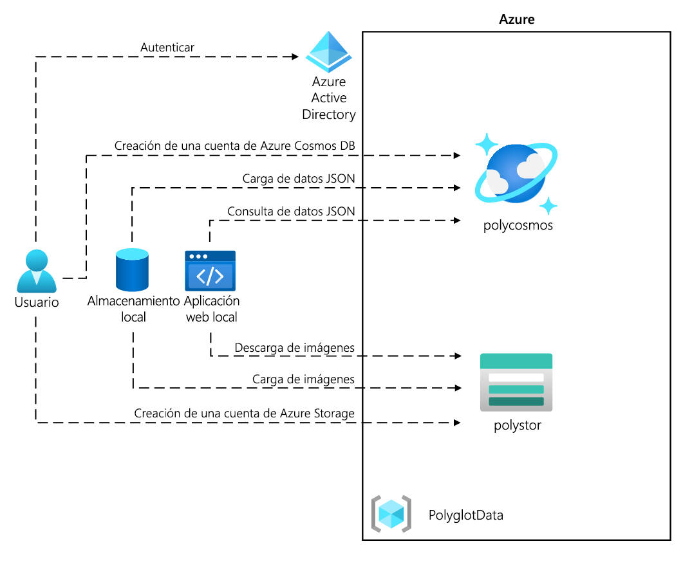
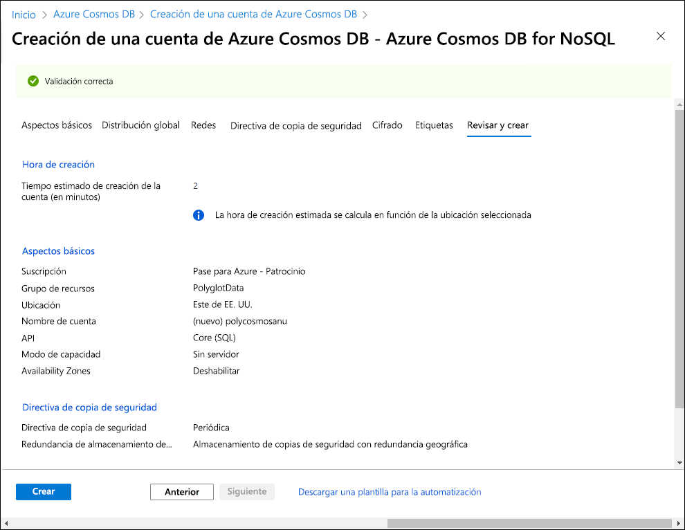
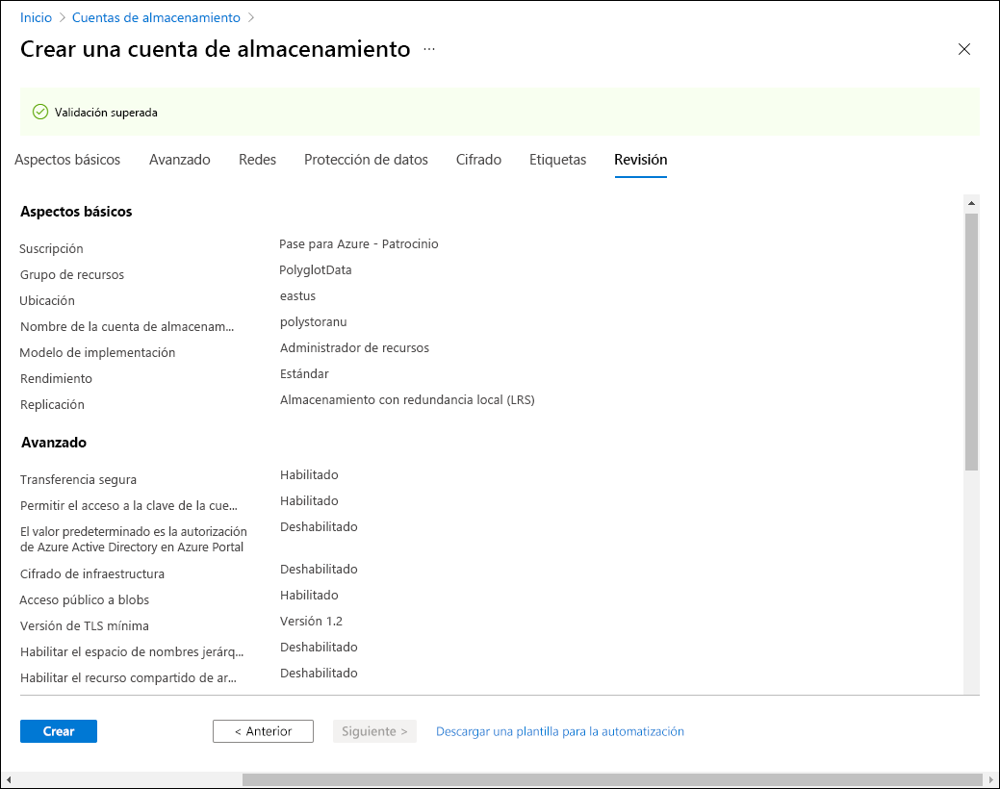

---
lab:
  az204Title: 'Lab 04: Construct a polyglot data solution'
  az204Module: 'Learning Path 04: Develop solutions that use Cosmos DB storage'
---

# Laboratorio 04: Construcción de una solución de datos políglota

## Interfaz de usuario de Microsoft Azure

Dada la naturaleza dinámica de las herramientas en la nube de Microsoft, puede experimentar cambios en la interfaz de usuario de Azure que se producen después del desarrollo de este contenido de entrenamiento. Como resultado, es posible que las instrucciones y los pasos del laboratorio no se alineen correctamente.

Microsoft actualiza este curso de entrenamiento cuando la comunidad nos alerta de los cambios necesarios. Sin embargo, las actualizaciones en la nube se producen con frecuencia, por lo que es posible que se produzcan cambios en la interfaz de usuario antes de que se actualice este contenido de entrenamiento. **Si esto ocurre, adáptese a los cambios y, a continuación, trabaje con ellos en los laboratorios según sea necesario.**

## Instructions

### Antes de comenzar

#### Inicio de sesión al entorno de laboratorio

Inicie sesión en la máquina virtual (VM) de Windows 11 con las credenciales siguientes:

- Nombre de usuario: `Admin`
- Contraseña: `Pa55w.rd`

> **Nota**: El instructor le proporcionará instrucciones para conectarse al entorno de laboratorio virtual.

#### Revisión de las aplicaciones instaladas

Busque la barra de tareas en el escritorio de Windows 11. La barra de tareas contiene los iconos de las aplicaciones que usará en este laboratorio, entre los que se incluyen:

- Microsoft Edge
- Explorador de archivos
- Visual Studio Code

## Escenario de laboratorio

En este laboratorio, creará un recurso de Azure Cosmos DB y un recurso de cuenta de almacenamiento. Con C# y .NET, accederá al recurso de Cosmos DB y cargará datos en él.

Además, como es posible que Contoso desee acceder a los datos de Cosmos DB a través de una interfaz fácil de usar, implementará una solución de .NET que acceda a los datos de Cosmos DB en un explorador web y los muestre.

## Diagrama de la arquitectura



### Ejercicio 1: Creación de recursos de almacén de datos en Azure

#### Tarea 1: Abra Azure Portal

1. En la barra de tareas, seleccione el icono de **Microsoft Edge**.

1. En la ventana del explorador abierta, vaya a Azure Portal en `https://portal.azure.com` y, a continuación, inicie sesión con la cuenta que va a usar para este laboratorio.

   > **Nota**: Si es la primera vez que inicia sesión en Azure Portal, se le ofrecerá un paseo por el portal. Seleccione **Introducción** para omitir el paseo y empezar a usar el portal.

#### Paso 2: Creación de un recurso de cuenta de Azure Cosmos DB

1. En Azure Portal, use el cuadro de texto **Buscar recursos, servicios y documentos** para buscar **Azure Cosmos DB** y, en la lista de resultados, seleccione **Azure Cosmos DB**.

1. En la hoja **Azure Cosmos DB**, seleccione **+ Crear**.

1. En la hoja **Crear una cuenta de Azure Cosmos DB**, seleccione **Crear** en el cuadro **Azure Cosmos DB for NoSQL**.

1. En la pestaña **Aspectos básicos** de la página **Crear cuenta de Azure Cosmos DB: Azure Cosmos DB for NoSQL**, realice las siguientes acciones y, a continuación, seleccione **Revisar y crear**:

   | Configuración                     | Acción                                                                                                                   |
   | --------------------------- | ------------------------------------------------------------------------------------------------------------------------ |
   | Lista de **suscripciones**       | Conserve los valores predeterminados                                                                                                          |
   | Sección **Grupo de recursos**  | Seleccione **Crear nuevo**.                                                                                                    |
   | Cuadro de texto de **nombre**           | Escribir **Polyglotdata y** seleccionar **Aceptar**                                                                                 |
   | Cuadro de texto **AccountName**    | Escribir **polycosmos** _[sunombre]_                                                                                         |
   | Lista desplegable de la **Ubicación** | Seleccione la región de Azure más cercana a la ubicación del equipo de laboratorio y donde pueda crear una cuenta de Cosmos DB. |
   | Sección **Modo de capacidad**   | Seleccionar **Sin servidor**                                                                                                    |

   En la captura de pantalla siguiente se muestran las opciones configuradas en la página **Creación de una cuenta de Azure Cosmos DB: Azure Cosmos DB for NoSQL**.

   

1. En la pestaña **Revisar y crear** de la hoja **Crear una cuenta de Azure Cosmos DB: Azure Cosmos DB for NoSQL**, revise las opciones que seleccionó durante los pasos anteriores.

1. Seleccione **Crear** para crear la cuenta de Azure Cosmos DB mediante la configuración especificada.

   > **Nota**: Espere a que se complete la tarea de creación antes de continuar con este laboratorio.

1. Haga clic en **Go to resource** (Ir al recurso).

1. En la hoja de la **cuenta de Azure Cosmos DB** busque la sección **Configuración** y, a continuación, seleccione el vínculo **Claves**.

1. En el panel **Claves**, en la pestaña **Claves de lectura y escritura**, registre los valores de los cuadros de texto **URI**, **PRIMARY KEY** y **PRIMARY CONNECTION STRING** en el Bloc de notas. Los usará más adelante en el laboratorio.

   > **Nota**: Deberá utilizar el icono del ojo para **Clave principal** y **Cadena de conexión principal** para poder copiarlas en el portapapeles. 

#### Paso 3: Creación de un recurso de una cuenta de Azure Storage

1. En Azure Portal, use el cuadro de texto **Buscar recursos, servicios y documentos** para buscar **Cuentas de almacenamiento** y, a continuación, en la lista de resultados, seleccione **Cuentas de almacenamiento**.

1. En la hoja **Cuentas de almacenamiento**, seleccione **+ Crear**.

1. En la pestaña **Aspectos básicos** de la hoja **Crear una cuenta de almacenamiento**, realice las siguientes acciones y, después, seleccione **Revisar**:

   | Configuración | Acción |
   | --- |--- |
   | Lista de **suscripciones** | Conserve los valores predeterminados |
   | Sección **Grupo de recursos** | Seleccionar **Polyglotdata** |
   | Cuadro de texto **Nombre de la cuenta de almacenamiento** | Escribir **polystor** _[sunombre]_ |
   | Lista desplegable de **región** | Seleccione la misma región en la que creó la cuenta de Cosmos DB anteriormente en este ejercicio. |
   | **Servicio principal** | Sin cambios |
   | Sección **Rendimiento** | Seleccione **Estándar**. |
   | Lista desplegable de **Redundancia** | Seleccione **Almacenamiento con redundancia local (LRS)**. |

   En la captura de pantalla siguiente, se muestran los valores configurados en la hoja **Crear una cuenta de almacenamiento**.

   

1. En la pestaña **Revisar** de la hoja **Crear una cuenta de almacenamiento**, revise las opciones que seleccionó en los pasos anteriores.

1. Seleccione **Crear** para crear la cuenta de almacenamiento mediante la configuración especificada.

   > **Nota**: Espere a que se complete la tarea de creación antes de continuar con este laboratorio.

#### Revisar

En este ejercicio, ha creado los recursos de Azure que necesitará para la solución de datos políglota que implementará en este laboratorio. Los recursos de Azure que ha creado incluyen una cuenta de Azure Cosmos DB y una de Azure Storage.

### Ejercicio 2: Revisión y carga de datos

#### Tarea 1: Carga de imágenes en Azure Blob Storage

1. En el panel de navegación de Azure Portal, vuelva a la hoja de **Cuentas de almacenamiento** y seleccione la cuenta de almacenamiento **polystor** _[su nombre]_ que creó en el ejercicio anterior de este laboratorio.

1. En la hoja de la cuenta de almacenamiento **polystor** _[su nombre]_ , seleccione el vínculo **Contenedores** en la sección **Almacenamiento de datos**.

1. En la sección **Contenedores**, seleccione **+ Contenedor**.

1. En la ventana emergente **Nuevo contenedor**, realice las siguientes acciones y, a continuación, seleccione **Crear**:

   | Configuración                                | Acción                                   |
   | -------------------------------------- | ---------------------------------------- |
   | Cuadro de texto de **nombre**                      | Escribir **images**                         |

1. De nuevo en la sección **Contenedores**, vaya al contenedor de **imágenes** recién creado.

1. Busque la **Configuración** en la hoja **Contenedor** y, a continuación, seleccione el vínculo **Propiedades**.

1. En el panel **Propiedades**, anote y guarde el valor del cuadro de texto **Dirección URL** en el Bloc de notas. Usará este valor más adelante en este laboratorio.

1. Haz clic en **Tokens de acceso compartido** y genera un token de acceso con la configuración predeterminada haciendo clic en **Generar token y dirección URL de SAS**. Registre el valor del token de SAS de **blob** en el Bloc de notas; lo necesitará más adelante.

   > **Nota**: Ahora debería tener 5 valores en el Bloc de notas. El **URI**, la **clave principal** y la **cadena de conexión principal** para la cuenta de Cosmos DB. A continuación, la **dirección URL** y el **token de SAS** para el contenedor de blobs.

1. Busque y seleccione el vínculo **Información general** en la hoja.
1. En la hoja, seleccione **Cargar**.

1. En la ventana emergente **Cargar blob**, realice las siguientes acciones:

   a. En la sección **Archivos** , seleccione **Buscar archivos** o use la característica de arrastrar y colocar.

   b. En la ventana **Explorador de archivos**, busque **Allfiles (F):\\Allfiles\\Labs\\04\\Starter\\Images**, seleccione los 42 archivos de imagen individuales **.jpg** y, a continuación, seleccione **Abrir**.

   c. Asegúrese de que **Sobrescribir los archivos si ya existen** está seleccionado y, a continuación, seleccione **Cargar**.

   > **Nota**: Espere a que se carguen todos los blobs antes de continuar con este laboratorio.

#### Tarea 2: Revisión de datos JSON

1. En el equipo del laboratorio, inicie Visual Studio Code.

1. En el menú **Archivo**, seleccione **Abrir archivo**, vaya a **(F):\\Allfiles\\Labs\\04\\Starter\\AdventureWorks\\AdventureWorks.Upload**, seleccione **models.json** y, a continuación, seleccione **Abrir**.

1. Revise el formato del archivo **models.json** y observe que contiene una matriz de objetos JSON, con una matriz anidada de objetos que forman parte de la propiedad **Products**.

   > **Nota**: Esto determinará las clases que definirá para deserializar el contenido del archivo JSON antes de cargarlo en una colección de Cosmos DB.

1. En el archivo **models.json**, tenga en cuenta que una de las propiedades se denomina **Category.**

   > **Nota**: Usará la propiedad **Category** para definir la creación de particiones de la colección de Cosmos DB.

1. Cierre Visual Studio Code.

#### Tarea 3: Creación de una base de datos y una colección de Cosmos DB, y realización de una carga de datos JSON

1. En la pantalla **Inicio**, seleccione el icono **Visual Studio Code**.

1. En el menú **Archivo**, seleccione **Abrir carpeta**.

1. En la ventana **Explorador de archivos** que se abre, vaya a **Allfiles (F):\\Allfiles\\Labs\\04\\Starter\\AdventureWorks** y, a continuación, seleccione **Seleccionar carpeta**.

1. En la ventana **Visual Studio Code**, en la barra de menús, seleccione **Terminal** y, a continuación, **Nuevo terminal**.

1. En el terminal, compruebe que el directorio actual está establecido en **AdventureWorks** (o cámbielo si no es así) y, a continuación, ejecute el siguiente comando para cambiar el contexto del terminal en la carpeta **AdventureWorks.Upload**:

   ```
   cd .\AdventureWorks.Upload\
   ```

   > **Nota**: Antes de realizar el paso siguiente, abra el Explorador de Windows y quite el atributo **Solo lectura** del archivo **Allfiles (F):\\Allfiles\\Labs\\04\\Starter\\AdventureWorks\\AdventureWorks.Upload\\AdventureWorks.Upload.csproj**.

1. Desde el símbolo del sistema del terminal, ejecute el siguiente comando para agregar la biblioteca cliente de .NET de Azure Cosmos DB al proyecto abierto actualmente:

   > **Nota**: Antes de continuar con el siguiente comando, asegúrate de que te encuentras en esta ruta de acceso: **(F):\\Allfiles\\Labs\\04\\Starter\\AdventureWorks\\AdventureWorks.Upload\\**

   ```
   dotnet add package Microsoft.Azure.Cosmos --version 3.28.0
   ```
   
   > **Nota**: El comando **dotnet add package** agregará el paquete **Microsoft.Azure.Cosmos** desde **NuGet**. Para obtener más información, consulte [Microsoft.Azure.Cosmos](https://www.nuget.org/packages/Microsoft.Azure.Cosmos).

1. Observe los resultados de la compilación impresa en el terminal. La compilación debe completarse correctamente sin errores ni mensajes de advertencia.

1. En el panel **Explorador** de **Visual Studio Code,** expanda el proyecto **AdventureWorks.Upload**.

1. Abra el archivo **Program.cs**.

1. En el archivo **Program.cs**, revise las directivas **que se están usando**\y tenga en cuenta que incluyen **Microsoft.Azure.Cosmos**, **System.IO;** , **System.Text.Json**, **System.Threading.Tasks** y **System.Collections.Generic**. Esto permite la carga asincrónica de elementos JSON desde un archivo local en el equipo de laboratorio a una colección de una base de Cosmos DB.

1. En el archivo **Program.cs**, en la línea 14, establezca el valor de **EndpointUrl** reemplazando la cadena vacía por la propiedad **URI** de la **cuenta de Cosmos DB** que registró anteriormente en este laboratorio. Asegúrese de que el valor está entre comillas dobles. Este es el **primer valor** que registró en el Bloc de notas.

1. En la línea 15, establezca el valor de **AuthorizationKey** reemplazando la cadena vacía por la propiedad **PRIMARY KEY** de la **cuenta de Cosmos DB** que registró anteriormente en este laboratorio. Asegúrese de que el valor está entre comillas dobles. Este es el **segundo** valor que registró en el Bloc de notas.

1. En la línea 18, establezca el valor de **PartitionKey** reemplazando la cadena vacía por **"/Category"** .

   > **Nota**: debes seleccionar los dos caracteres de comillas para sobrescribirlos.

1. En la línea 19, establezca el valor de **JsonFilePath** reemplazando la cadena vacía por **"F:\\\\Allfiles\\\\Labs\\\\04\\\\Starter\\\\AdventureWorks\\\\AdventureWorks.Upload\\\\models.json"** .

   > **Nota**: debes seleccionar los dos caracteres de comillas para sobrescribirlos.

1. Dentro del bloque de prueba, observe la invocación del método **CreateDatabaseIfNotExistsAsync** de la clase **CosmosClient**. Esto creará una base de datos si aún no existe una.

1. Observe la invocación del método **DefineContainer** de la clase **Database**. Esto creará un contenedor que hospedará los elementos JSON si aún no existe uno.

   > **Nota**: El método **DefineContainer** incluye una opción de reducción de costos en la que puede modificar la directiva de indexación predeterminada (que indexa automáticamente todos los atributos).

1. Tenga en cuenta la instrucción **que esté usando**, ya que se basa en un objeto **StreamReader** para leer elementos JSON de un archivo de texto y los deserializa en objetos de la clase **Model** que se define más adelante en el archivo **Program.cs**.

1. Observe el bucle foreach que recorre en iteración la colección de objetos deserializados e inserta de forma asincrónica cada uno de ellos en la colección de destino.

1. Revise las clases **Model** y **Product** que reflejan el formato de los objetos almacenados en el archivo con formato JSON que ha revisado anteriormente en este laboratorio.

1. Guarde y cierre el archivo **Program.cs**.

   > **Nota**: Seleccione **Sobrescribir** si recibió un mensaje sobre que el archivo es de solo lectura.

1. En el terminal, ejecute el siguiente comando para restaurar los paquetes de NuGet que falten y compilar el proyecto en la carpeta :

   ```
   dotnet build
   ```

   > **Nota**: El comando **dotnet build** restaurará automáticamente los paquetes de NuGet que falten antes de compilar todos los proyectos de la carpeta.

1. En el símbolo del sistema del terminal, ejecute el siguiente comando para ejecutar la aplicación de consola de .NET Core:

   ```
   dotnet run
   ```

   > **Nota**: El comando **dotnet run** compilará automáticamente los cambios en el proyecto y, a continuación, iniciará la aplicación web sin un depurador asociado. El comando mostrará los mensajes que indican el progreso de la carga de datos, incluido el número de elementos insertados en la colección de destino y la duración de la operación de inserción.

1. Observe los resultados de la ejecución del comando impreso en el terminal. La ejecución debe completarse correctamente y mostrar el mensaje que indica que hay 119 elementos insertados en la colección de Cosmos DB.

1. Seleccione **Cerrar el terminal** (el icono de la **papelera de reciclaje**) para cerrar el panel del terminal y los procesos asociados.

#### Tarea 4: Validación de la carga de datos JSON

1. En el equipo de laboratorio, vaya a la ventana del explorador **Microsoft Edge** que muestra Azure Portal.

1. En Azure Portal, seleccione el cuadro de texto **Buscar recursos, servicios y documentos**; en la lista **Recursos recientes**, seleccione la cuenta de Azure Cosmos DB **polycosmos** _[sunombre]_ que creó en un paso anterior de este laboratorio.

1. En la hoja **Cuenta de Azure Cosmos DB**, busque y seleccione el vínculo del **Explorador de datos** en la hoja.

1. En el panel **Explorador de datos**, expanda el nodo de base de datos **Retail**.

1. Expanda el nodo **Contenedor** Online y, a continuación, seleccione **Nueva consulta de SQL**.

   > **Nota**: La etiqueta de esta opción podría estar oculta. Para mostrar las etiquetas, mantenga el puntero sobre los iconos del panel **Explorador de datos**.

1. En la pestaña de consulta, escriba el texto siguiente:

   ```sql
   SELECT * FROM models
   ```

1. Seleccione **Ejecutar consulta** y, a continuación, observe la lista de elementos JSON que devuelve la consulta.

1. De nuevo en el editor de consultas, reemplace el texto existente por el texto siguiente:

   ```sql
   SELECT VALUE COUNT(1) FROM models
   ```

1. Seleccione **Ejecutar consulta** y observe el resultado de la operación de agregado **COUNT.** Debe salir 119, que coincide con el número de elementos insertados. 

1. Vuelva a la ventana de **Visual Studio Code**.

#### Revisar

En este ejercicio, ha usado el SDK de .NET para Azure Cosmos DB para insertar datos en Azure Cosmos DB. La aplicación web que implemente a continuación usará estos datos.

### Ejercicio 3: Configuración de una aplicación web .NET

#### Tarea 1: Actualización de referencias a almacenes de datos y compilación de la aplicación web

1. En el panel **Explorador** de **Visual Studio Code,** expanda el proyecto **AdventureWorks.Web**.

1. Abra el archivo **appsettings.json**.

1. En el objeto JSON de la línea 3, busque la ruta de acceso **ConnectionStrings.AdventureWorksCosmosContext**. Tenga en cuenta que el valor actual está vacío:

   ```json
   "ConnectionStrings": {
       "AdventureWorksCosmosContext": "",
   },
   ```

1. Actualice el valor de la propiedad **AdventureWorksCosmosContext** estableciendo su valor en la **CADENA DE CONEXIÓN PRINCIPAL** de la cuenta de Azure Cosmos DB que registró anteriormente en este laboratorio. Este es el **tercer** valor que registró en el Bloc de notas.

1. En el objeto JSON de la línea 6, busque la propiedad **Settings.BlobContainerUrl**. Tenga en cuenta que el valor actual está vacío:

   ```json
   "Settings": {
       "BlobContainerUrl": "",
       "BlobSASToken": ""
   }
   ```

1. Actualice las propiedades **BlobContainerUrl** y **BlobSASToken** estableciendo su valor en la propiedad **URL** del contenedor de blobs de Azure Storage denominado **imágenes** y el valor del **token de SAS** del blob que registró anteriormente en este laboratorio en consecuencia. Estos fueron el **cuarto** y **quinto** valor que registró en el Bloc de notas.

1. Guarde el archivo **appsettings.json** y ciérrelo.

   > **Nota**: Seleccione **Sobrescribir** si recibió un mensaje sobre que el archivo es de solo lectura.

1. En la ventana **Visual Studio Code**, en el panel del explorador, haz clic con el botón derecho en la carpeta **AdventureWorks.Context** y selecciona **Abrir en terminal integrado**.

   

   > **Nota**: Antes de realizar el paso siguiente, abra el Explorador de Windows y quite el atributo de solo lectura del archivo **Allfiles (F):\Allfiles\Labs\04\Starter\AdventureWorks\AdventureWorks.Context\AdventureWorks.Context.csproj**.

1. En el símbolo del sistema del terminal, compruebe que el directorio actual está establecido en **AdventureWorks.Context** (o cámbielo si no es así); a continuación, ejecute el siguiente comando para importar **Microsoft.Azure.Cosmos** desde NuGet:

   > **Nota**: Antes de continuar con el siguiente comando, asegúrate de que te encuentras en esta ruta de acceso: **(F):\\Allfiles\\Labs\\04\\Starter\\AdventureWorks\\AdventureWorks.Context\\**

   ```
   dotnet add package Microsoft.Azure.Cosmos --version 3.28.0
   ```

1. Desde el símbolo del sistema del terminal, ejecuta el comando siguiente para compilar el proyecto **AdventureWorks.Context**:

   ```
   dotnet build
   ```

1. Observe los resultados de la compilación impresa en el terminal. La compilación debe completarse correctamente sin errores ni mensajes de advertencia.

#### Tarea 2: Configuración de la conectividad a Azure Cosmos DB

1. En el panel **Explorador** de **Visual Studio Code,** expanda el proyecto **AdventureWorks.Context**.

1. En el menú contextual del nodo de carpeta **AdventureWorks.Context**, seleccione **Nuevo archivo**.

1. En el nuevo símbolo del sistema del archivo, escriba **AdventureWorksCosmosContext.cs**.

1. En la pestaña del editor de código del archivo **AdventureWorksCosmosContext.cs**, añade el código siguiente:

   ```csharp
   using AdventureWorks.Models;
   using Microsoft.Azure.Cosmos;
   using Microsoft.Azure.Cosmos.Linq;
   using System;
   using System.Collections.Generic;
   using System.Linq;
   using System.Threading.Tasks;

   namespace AdventureWorks.Context
   {
       /* AdventureWorksCosmosContext class will implement the
       IAdventureWorksProductContext interface */
      public class AdventureWorksCosmosContext : IAdventureWorksProductContext
      {
           /* Create a new read-only Container variable named _container */
           private readonly Container _container;

         public AdventureWorksCosmosContext(string connectionString, string database = "Retail", string container = "Online")
         {
           /* Create a new instance of the CosmosClient class, and then obtain
             both a Database and Container instance from the client */
           _container = new CosmosClient(connectionString)
           .GetDatabase(database)
           .GetContainer(container);
         }

         public async Task<Model> FindModelAsync(Guid id)
         {
           /* Create a LINQ query, transform it into an iterator, iterate over the result set,
              and then return the single item in the result set */
           var iterator = _container.GetItemLinqQueryable<Model>()
           .Where(m => m.id == id).ToFeedIterator<Model>();
           List<Model> matches = new List<Model>();
           while (iterator.HasMoreResults)
           {
               var next = await iterator.ReadNextAsync();
               matches.AddRange(next);
           }

           return matches.SingleOrDefault();
         }

         public async Task<List<Model>> GetModelsAsync()
         {
           /* Run an SQL query, get the query result iterator, iterate over the result set,
               and then return the union of all results */
           string query = $@"SELECT * FROM items";
           var iterator = _container.GetItemQueryIterator<Model>(query);
           List<Model> matches = new List<Model>();
           while (iterator.HasMoreResults)
           {
               var next = await iterator.ReadNextAsync();
               matches.AddRange(next);
           }

           return matches;
         }

         public async Task<Product> FindProductAsync(Guid id)
         {
           /* Run an SQL query, get the query result iterator, iterate over the result set,
              and then return the single item in the result set */
           string query = $@"SELECT VALUE products
                       FROM models
                       JOIN products in models.Products
                       WHERE products.id = '{id}'";
           var iterator = _container.GetItemQueryIterator<Product>(query);
           List<Product> matches = new List<Product>();
           while (iterator.HasMoreResults)
           {
               var next = await iterator.ReadNextAsync();
               matches.AddRange(next);
           }

           return matches.SingleOrDefault();
         }

      }
   }
   ```

1. Guarde y cierre el archivo **AdventureWorksCosmosContext.cs**.
1. Desde el símbolo del sistema del terminal, con el directorio actual establecido en **AdventureWorks.Context**, ejecute el siguiente comando para compilar la aplicación web .NET:

   ```
   dotnet build
   ```

   > **Nota**: Si hay algún error de compilación, revisa el archivo **AdventureWorksCosmosContext.cs** en la carpeta **Allfiles    > (F):\\Allfiles\\Labs\\04\\Solution\\AdventureWorks\\AdventureWorks.Context**.

#### Tarea 3: Revisión de la lógica de inicio de la aplicación .NET

1. En el panel **Explorador** de **Visual Studio Code,** expanda el proyecto **AdventureWorks.Web**.

1. Abra el archivo **Startup.cs**.

1. En la clase **Startup,** observe el método **ConfigureProductService** existente:

   ```csharp
   public void ConfigureProductService(IServiceCollection services)
   {
       services.AddScoped<IAdventureWorksProductContext, AdventureWorksCosmosContext>(provider =>
           new AdventureWorksCosmosContext(
               _configuration.GetConnectionString(nameof(AdventureWorksCosmosContext))
           )
       );
   }
   ```

   > **Nota**: El servicio de producto usa Cosmos DB como base de datos.

1. Cierre el archivo **Startup.cs** sin realizar ninguna modificación.

#### Tarea 4: Confirmación que la aplicación .NET se conecta correctamente a almacenes de datos

1. En Visual Studio Code, desde el símbolo del sistema del terminal, ejecute el siguiente comando para cambiar el contexto del terminal a la carpeta **AdventureWorks.Web**:

   ```
   cd ..\AdventureWorks.Web\
   ```

1. En el símbolo del sistema del terminal, ejecute el siguiente comando para ejecutar la aplicación web de ASP.NET:

   > **Nota**: Antes de continuar con el siguiente comando, asegúrate de que te encuentras en esta ruta de acceso: **(F):\\Allfiles\\Labs\\04\\Starter\\AdventureWorks\\AdventureWorks.Web\\**

   ```
   dotnet run
   ```

   > **Nota**: El comando **dotnet run** compilará automáticamente los cambios en el proyecto y, a continuación, iniciará la aplicación web sin un depurador asociado. El comando mostrará la dirección URL de la aplicación en ejecución y los puertos asignados.

1. En la barra de tareas, seleccione el icono de **Microsoft Edge**.

1. En la ventana del explorador abierto, vaya a la aplicación web que se está ejecutando actualmente (<http://localhost:5000>).

1. En la aplicación web, observe la lista de modelos que se muestran en la página principal.

1. Busque el modelo **Touring-1000** y seleccione **Ver detalles**.

1. En la página de detalles del producto **Touring-1000**, revise la lista de opciones.

1. Cierre la ventana del explorador que muestra la aplicación web.

1. Cambie a la ventana de **Visual Studio Code** y, a continuación, seleccione **Desactivar el terminal** (el icono de la **papelera de reciclaje**) para abrir el terminal y los procesos asociados.

#### Revisar

En este ejercicio, ha escrito código de C# para consultar una colección de Azure Cosmos DB mediante el SDK de .NET.
