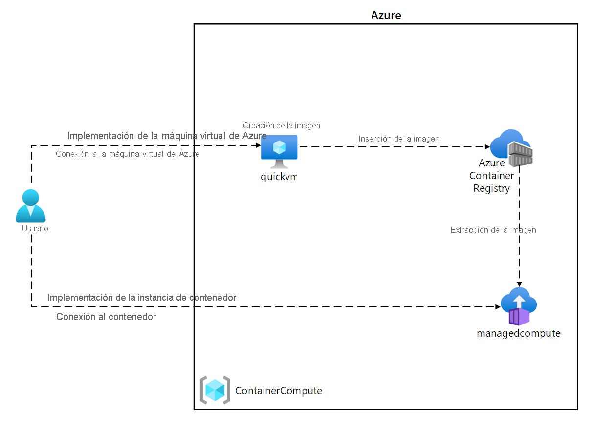
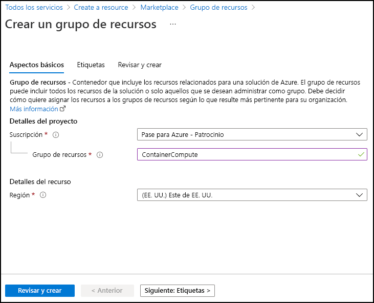
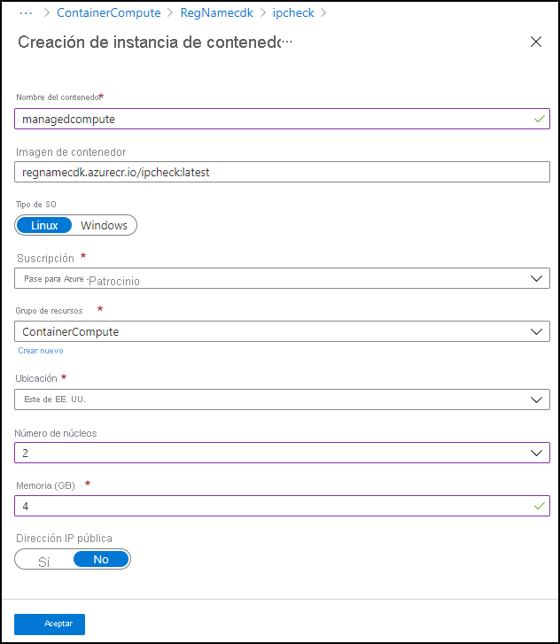
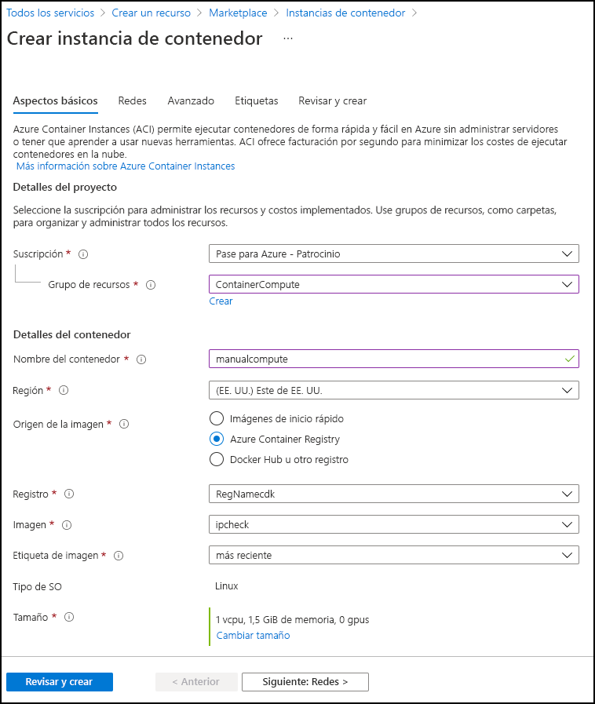

---
lab:
  az204Title: 'Lab 05: Deploy compute workloads by using images and containers'
  az204Module: 'Learning Path 05: Implement containerized solutions'
---

# Laboratorio 05: Implementación de cargas de trabajo del proceso mediante imágenes y contenedores

## Interfaz de usuario de Microsoft Azure

Dada la naturaleza dinámica de las herramientas en la nube de Microsoft, puede experimentar cambios en la interfaz de usuario de Azure que se producen después del desarrollo de este contenido de entrenamiento. Como resultado, es posible que las instrucciones y los pasos del laboratorio no se alineen correctamente.

Microsoft actualiza este curso de entrenamiento cuando la comunidad nos alerta de los cambios necesarios. Sin embargo, las actualizaciones en la nube se producen con frecuencia, por lo que es posible que se produzcan cambios en la interfaz de usuario antes de que se actualice este contenido de entrenamiento. **Si esto ocurre, adáptese a los cambios y, a continuación, trabaje con ellos en los laboratorios según sea necesario.**

## Instructions

### Antes de comenzar

#### Inicio de sesión al entorno de laboratorio

Inicie sesión en la máquina virtual (VM) de Windows 11 con las credenciales siguientes:

- Nombre de usuario: `Admin`
- Contraseña: `Pa55w.rd`

> **Nota**: El instructor le proporcionará instrucciones para conectarse al entorno de laboratorio virtual.

#### Revisión de las aplicaciones instaladas

Busque la barra de tareas en el escritorio de Windows 11. La barra de tareas contiene los iconos de las aplicaciones que usará en este laboratorio, entre los que se incluyen:

-   Microsoft Edge
-   Explorador de archivos

## Escenario de laboratorio

En este laboratorio, explorará cómo crear e implementar contenedores en Azure Container Registry mediante una aplicación .NET y archivos de Docker. Implementará también una solución contenedorizada en Azure Container Apps.

## Diagrama de la arquitectura




### Ejercicio 1: Creación de una imagen de contenedor de Docker e implementación en Azure Container Registry

#### Tarea 1: Abra Azure Portal

1. En la barra de tareas, seleccione el icono de **Microsoft Edge**.

1. En la ventana del explorador abierto, vaya a Azure Portal en `https://portal.azure.com` y, a continuación, inicie sesión con la cuenta que va a usar para este laboratorio.

   > **Nota**: Si es la primera vez que inicia sesión en Azure Portal, se le ofrecerá un paseo por el portal. Si prefiere omitir esta visita, seleccione **Introducción** para empezar a usar el portal.

#### Tarea 2: Creación de un grupo de recursos

1. En el panel de navegación de Azure Portal, use el cuadro de texto **Buscar recursos, servicios y documentos** para buscar el **Grupo de recursos** y, a continuación, en la lista de resultados, seleccione **Grupos de recursos**.

1. En la hoja **Grupos de recursos**, seleccione **Crear**.

1. En la hoja **Crear un grupo de recursos**, en la pestaña **Aspectos básicos**, realice las siguientes acciones y seleccione **Revisar y crear**:

    | Configuración | Acción |
    | -- | -- |
    | Lista desplegable de **Suscripción** | Conserve los valores predeterminados  |
    | Cuadro de texto **Grupo de recursos** | Escriba **ContainerCompute**. |
    | Lista desplegable de **región** | Seleccione **(EE.UU.) Este de EE. UU.** |

    En la captura de pantalla siguiente, se muestran los valores configurados en la hoja **Crear un grupo de recursos**.

    

1. En la pestaña **Revisar y crear**, revise las opciones que seleccionó durante los pasos anteriores.

1. Seleccione **Crear** para crear un grupo de recursos mediante la configuración especificada.  

    > **Nota**: Espere a que se complete la tarea de creación antes de continuar con este laboratorio.


#### Tarea 3: Iniciar el proyecto de origen

1. En la barra de tareas, seleccione el icono **Terminal**.

1. Ejecute el siguiente comando para cambiar el directorio actual al directorio **Allfiles (F):\\Allfiles\\Labs\\05\\Starter**:

    ```powershell
    cd F:\Allfiles\Labs\05\Starter
    ```

1. Ejecute el siguiente comando para crear una nueva aplicación de consola de .NET en el directorio actual mediante .NET 8.0:

    ```powershell
    dotnet new console --output . --name ipcheck --framework net8.0
    ```

1. Ejecute el siguiente comando para crear un nuevo archivo en el directorio actual denominado **Dockerfile**:

    ```powershell
    New-Item -ItemType File Dockerfile
    ```

1. Ejecute el comando siguiente para abrir el directorio actual en Visual Studio Code:

    ```powershell
    code .
    ```

#### Tarea 4: Creación y prueba de una aplicación .NET

1. En el panel **Explorador** de la ventana **Visual Studio Code**, abra el archivo **Program.cs**.

1. Elimine el contenido completo del archivo **Program.cs**.

1. Copie y pegue el siguiente código en el archivo **Program.cs**:

    ```csharp
    // Check if network is available
    if (System.Net.NetworkInformation.NetworkInterface.GetIsNetworkAvailable())
    {
        System.Console.WriteLine("Current IP Addresses:");

        // Get host entry for current hostname
        string hostname = System.Net.Dns.GetHostName();
        System.Net.IPHostEntry host = System.Net.Dns.GetHostEntry(hostname);
        
        // Iterate over each IP address and render their values
        foreach(System.Net.IPAddress address in host.AddressList)
        {
            System.Console.WriteLine($"\t{address}");
        }
    }
    else
    {
        System.Console.WriteLine("No Network Connection");
    }
    ```

1. Guarde el archivo **Program.cs**.

1. Elimine el archivo **Starter.sln**.

    > **Nota**: Esto eliminará la necesidad de hacer referencia explícita al archivo .csproj al usar comandos dotnet.

1. Cambie a la aplicación de **Terminal**.

1. Ejecute el siguiente comando para ejecutar la aplicación:

    ```powershell
    dotnet run
    ```

1. Consulte los resultados. Debe aparecer al menos una dirección IP, que representa la dirección IP asignada al equipo.

1. Vuelve a la ventana **Visual Studio Code** y, desde el panel **Explorer**, abre el archivo **Dockerfile**.

1. Copie y pegue el código siguiente en el archivo **Dockerfile**:

    ```
    # Start using the .NET 8.0 SDK container image
    FROM mcr.microsoft.com/dotnet/sdk:8.0 AS build

    # Change current working directory
    WORKDIR /app

    # Copy existing files from host machine
    COPY . ./

    # Publish application to the "out" folder
    RUN dotnet publish --configuration Release --output out

    # Start container by running application DLL
    ENTRYPOINT ["dotnet", "out/ipcheck.dll"]
    ```

1. Guarde el archivo **Dockerfile**.

    > **Nota**: A continuación, creará un archivo que contenga todo el archivo del proyecto. Esto simplificará la carga de los archivos del proyecto en Cloud Shell.

1. Cambie a la aplicación de **Terminal**.

1. Ejecuta el siguiente comando para crear el archivo:

    ```powershell
    Compress-Archive -Path .\* -DestinationPath .\lab05.zip
    ```

#### Tarea 5: Creación de un recurso de Container Registry

1. Vaya a la ventana del explorador en la que se muestra Azure Portal. 

1. En Azure Portal, seleccione el icono **Cloud Shell**, , para abrir una instancia de Cloud Shell. Si Cloud Shell tiene como valor predeterminado una sesión de PowerShell, seleccione **Cambiar a Bash** en el menú de **Cloud Shell** y, después, seleccione **Confirmar**.

    > **Nota**: El icono **Cloud Shell** se representa mediante un signo "mayor que" (\>) y un carácter de subrayado (\_).

    Si es la primera vez que inicias **Cloud Shell**, se te mostrará un mensaje de **Introducción**. Selecciona **No se requiere cuenta de almacenamiento** y, después, selecciona **Aplicar**.

1. En el panel **Cloud Shell**, seleccione **Administrar archivos** y, en el menú desplegable, seleccione **Cargar**.

1. En el cuadro de diálogo **Abrir**, vaya al directorio vacío **Allfiles (F):\\Allfiles\\Labs\\05\\Starter**, seleccione **lab05.zip** y, a continuación, seleccione **Abrir**.

    > **Nota**: Esto cargará el archivo en el directorio **/~** dentro de la sesión de **Cloud Shell**.

1. En el símbolo del sistema de **Cloud Shell** en el portal, ejecute el siguiente comando para crear un directorio denominado **ipcheck** en el directorio **\~**:

    ```bash
    mkdir ~/ipcheck
    ```

1. Ejecute el siguiente comando para extraer el contenido del archivo cargado en el directorio **\~/ipcheck** recién creado:

    ```bash
    unzip ~/lab05.zip -d ~/ipcheck
    ```

1. Ejecute el siguiente comando para establecer los permisos de lectura y ejecución en todo el contenido extraído en el directorio **\~/ipcheck**:

    ```bash
    chmod -R +xr ~/ipcheck
    ```

1. Ejecute el siguiente comando para cambiar el directorio actual a **\~/ipcheck**:

    ```bash
    cd ~/ipcheck
    ```

1. En el símbolo del sistema de **Cloud Shell** en el portal, ejecute el siguiente comando para crear una variable con un valor único para el recurso de Container Registry: 

    ```bash
    registryName=conregistry$RANDOM
    ```

1. En el símbolo del sistema de **Cloud Shell** en el portal, ejecute el siguiente comando para comprobar que el nombre creado en el paso anterior está disponible: 

    ```bash
    az acr check-name --name $registryName
    ```

    Si los resultados muestran que el nombre está disponible, continúe con el paso siguiente. Si el nombre no está disponible, vuelva a ejecutar el comando del paso anterior y vuelva a comprobar la disponibilidad.

1. En el símbolo del sistema de **Cloud Shell** en el portal, ejecute el siguiente comando para crear un recurso de Container Registry: 

    ```bash
    az acr create --resource-group ContainerCompute --name $registryName --sku Basic
    ```

    > **Nota**: Espere a que se complete la tarea de creación antes de continuar con este laboratorio.

#### Tarea 6: Almacenamiento de los metadatos de Container Registry

1. En el símbolo del sistema de **Cloud Shell**, ejecute el siguiente comando para obtener una lista de todos los registros de contenedor de la suscripción:

    ```
    az acr list --resource-group ContainerCompute
    ```

1. Ejecute el siguiente comando, asegurándose de ver el nombre del Registro como salida. Si no ve ninguna salida distinta de "[]", espere un minuto e intente volver a ejecutar el comando.

    ```
    az acr list --resource-group ContainerCompute --query "max_by([], &creationDate).name" --output tsv
    ```

1. Ejecute el siguiente comando:

    ```
    acrName=$(az acr list --resource-group ContainerCompute --query "max_by([], &creationDate).name" --output tsv)
    ```

1. Ejecute el siguiente comando:

    ```
    echo $acrName
    ```

#### Tarea 7: Implementación de una imagen de contenedor de Docker en Container Registry

1. Ejecute el siguiente comando para cambiar el directorio activo de **\~/** a **\~/ipcheck**:

    ```
    cd ~/ipcheck
    ```

1. Ejecute el siguiente comando para obtener el contenido del directorio actual:

    ```
    dir
    ```

1. Ejecute el siguiente comando para cargar el código fuente en el registro de contenedor y compilar la imagen de contenedor como una tarea de Container Registry:

    ```
    az acr build --registry $acrName --image ipcheck:latest .
    ```

    > **Nota**: Espere a que se complete la tarea de compilación antes de continuar con este laboratorio.

1. Cierre el panel de **Cloud Shell** en el portal.

#### Tarea 8: Validación de la imagen de contenedor en Container Registry

1. En el panel de **navegación** de Azure Portal, seleccione el vínculo **Grupos de recursos**.

1. En la hoja **Grupos de recursos**, seleccione el grupo de recursos **ContainerCompute** que creó anteriormente en este laboratorio.

1. En la hoja **ContainerCompute**, seleccione el registro de contenedor que creó anteriormente en este laboratorio.

1. En la hoja de **Container Registry**, en la sección **Servicios**, seleccione el vínculo **Repositorios**.

1. En la sección **Repositorios**, seleccione el repositorio de imágenes de contenedor **ipcheck** y, a continuación, seleccione la etiqueta **más reciente**.

1. Revise los metadatos de la versión de la imagen de contenedor con la etiqueta **más reciente**.

    > **Nota**: También puede seleccionar el vínculo **Id. de ejecución** para buscar metadatos sobre la tarea de compilación.

#### Revisar

En este ejercicio, ha creado una aplicación de consola de .NET para mostrar la dirección IP actual de una máquina. A continuación, ha agregado el archivo **Dockerfile** a la aplicación para que se pueda convertir en una imagen de contenedor de Docker. Por último, implementó la imagen de contenedor para Container Registry.

### Ejercicio 2: Implementación de una instancia de contenedor de Azure

#### Tarea 1: Habilitación del usuario administrador en Container Registry

1. En el grupo de recursos **ContainerCompute**, selecciona el registro de contenedor que creaste anteriormente en este laboratorio y luego selecciona la hoja **Claves de acceso**.

1. Ajusta el modificador en la sección de usuario administrador para que se habilite el usuario administrador para este registro de contenedor.

#### Tarea 2: Implementación automática de una imagen de contenedor en una instancia de contenedor de Azure

1. En la hoja de **Container Registry**, en la sección **Servicios**, seleccione el vínculo **Repositorios**.

1. En la sección **Repositorios**, seleccione el repositorio que contiene la imagen de contenedor **ipcheck**.

1. En el panel **ipcheck**, seleccione el menú de puntos suspensivos asociado a la entrada de etiqueta **más reciente** y, a continuación, seleccione **Ejecutar instancia**.

1. En la hoja **Crear instancia de contenedor**, realice las acciones siguientes y, a continuación, seleccione **Crear**:

    | Configuración | Acción |
    | -- | -- |
    | Cuadro de texto **Nombre de contenedor** | Escriba **managedcompute**. |
    | Cuadro de texto **Imagen de contenedor** | Conserve los valores predeterminados |
    | Sección **tipo de sistema operativo** | Seleccione **Linux**. |
    | Cuadro de texto **Suscripción** | Conserve los valores predeterminados |
    | Lista desplegable del **grupo de recursos** | Seleccione **ContainerCompute**. |
    | Lista desplegable de la **Ubicación** | Seleccione **Este de EE. UU**. |
    | Lista desplegable **Número de núcleos** | Seleccione **2**. |
    | Cuadro de texto **Memoria (GB)** | Escriba **4**. |
    | Sección **Dirección IP pública** | Seleccione **No**. |

    En la captura de pantalla siguiente, se muestran los valores configurados en la hoja **Crear una instancia de contenedor**.

    

    > **Nota**: Espere a que se cree la instancia de contenedor antes de continuar con este laboratorio.

#### Tarea 3: Implementación manual de una imagen de contenedor en Container Instances

1. En el panel de **navegación** de Azure Portal, seleccione el vínculo **Crear un recurso**.

1. En la hoja **Crear un recurso**, en el cuadro de texto **Buscar Servicios y Marketplace**, escriba **Container Instances** y, a continuación, pulse Entrar.

1. En la hoja de resultados de búsqueda de **Marketplace**, seleccione el resultado de **Instancias de contenedor**.

1. En la hoja **Instancias de contenedor**, seleccione **Crear**.

1. En la hoja **Crear una instancia de contenedor**, en la pestaña **Aspectos básicos**, realice las siguientes acciones y seleccione **Revisar y crear**:

    | Configuración | Acción |
    | -- | -- |
    | Lista desplegable de **Suscripción** | Conserve los valores predeterminados |
    | Lista desplegable del **grupo de recursos** | Seleccione **ContainerCompute**. |
    | Cuadro de texto **Nombre del contenedor**  | Escriba **manualcompute** |
    | Lista desplegable de **región** | Seleccione **(EE.UU.) Este de EE. UU.** |
    | Sección **Origen de la imagen** | Seleccione **Azure Container Registry**. |
    | Lista desplegable de **Registro** | Seleccione el recurso de **Azure Container Registry** que creó anteriormente en este laboratorio |
    | Lista desplegable de **imágenes** | Seleccione **ipcheck** |
    | Lista desplegable de **etiquetas de imagen** | Seleccione **más reciente** |
    | **Tamaño: núcleos**  | Escriba **2**. |
    | **Tamaño: memoria (GiB)** | Escriba **4**. |

    En la captura de pantalla siguiente, se muestran los valores configurados en la hoja **Crear una instancia de contenedor**.

    

1. En la pestaña **Revisar y crear**, revise las opciones seleccionadas.

1. Seleccione **Crear** para crear la instancia de contenedor mediante la configuración especificada.  

    > **Nota**: Espere a que se cree la instancia de contenedor antes de continuar con este laboratorio.


#### Tarea 4: Validar que la instancia de contenedor se ejecutó correctamente

1. En el panel de navegación de Azure Portal, seleccione el vínculo **Grupos de recursos**.

1. En la hoja **Grupos de recursos**, seleccione el grupo de recursos **ContainerCompute** que creó anteriormente en este laboratorio.

1. En la hoja **ContainerCompute,** seleccione la instancia de contenedor **manualcompute** que creó anteriormente en este laboratorio.

1. En la hoja de **Instancias de contenedor**, en la sección **Configuración**, seleccione el vínculo **Contenedores**.

1. En la sección **Contenedores**, revise la lista de **Eventos**.

1. Seleccione la pestaña **Registros** y, a continuación, revise los registros de texto de la instancia de contenedor.

> **Nota**: Opcionalmente, también puede encontrar los **eventos** y **registros** de la instancia de contenedor **managedcompute**.

> **Nota**: Es posible que **manualcompute** y **managedcompute** no contengan ningún evento en este punto.

> **Nota**: Una vez que la aplicación termina de ejecutarse, el contenedor finaliza porque ha completado su trabajo. En cuanto a la instancia de contenedor creada manualmente, indicó que una salida correcta era aceptable, por lo que el contenedor se ejecutó una vez. La instancia creada automáticamente no ofrecía esta opción y supone que el contenedor siempre debe estar en ejecución, por lo que verá reinicios repetidos del contenedor.

#### Revisar

En este ejercicio, ha usado varios métodos para implementar una imagen de contenedor en una instancia de contenedor de Azure. Mediante el método manual, pudo personalizar aún más la implementación y ejecutar aplicaciones basadas en tareas como parte de una ejecución de contenedor.


### Ejercicio 3: Creación de un entorno seguro de Container Apps e implementación de una aplicación de contenedor.

#### Tarea 1: Preparación del entorno

1. Inicie sesión en Azure Portal.

1. Seleccione el icono de **Cloud Shell** y seleccione el entorno **Bash**.

1. En el símbolo del sistema de **Cloud Shell** en el portal, ejecute el siguiente comando para instalar la extensión Azure Container Apps para la CLI: 

    ```bash
    az extension add --name containerapp --upgrade
    ```

1. Ejecute el siguiente comando para registrar el espacio de nombres Microsoft.App: 

    ```bash
    az provider register --namespace Microsoft.App
    ```
   
   > **Nota**: Los recursos de Azure Container Apps se han migrado desde el espacio de nombres **Microsoft.Web** al espacio de nombres **Microsoft.App**.

1. Ejecute el siguiente comando para registrar el proveedor **Microsoft.OperationalInsights** para el área de trabajo de Log Analytics de Azure Monitor si no lo ha usado antes: 

    ```bash
    az provider register --namespace Microsoft.OperationalInsights
    ```

    > **Nota**: El registro del espacio de nombres **Microsoft.App** y **Microsoft.OperationalInsights** puede tardar unos minutos en completarse.

1. Establezca las variables de entorno usadas más adelante en este ejercicio. 
   
   ```bash
     myRG=ContainerCompute
     myAppContEnv=az204-env-$RANDOM
    ```

Con la CLI actualizada y las variables de entorno creadas, puede crear un entorno de Container Apps e implementar la aplicación de contenedor.

#### Tarea 2: Creación de un entorno

Un entorno de Azure Container Apps crea un límite seguro alrededor de un grupo de aplicaciones de contenedor. Las aplicaciones de contenedor implementadas en el mismo entorno se implementan en la misma red virtual y escriben registros en la misma área de trabajo de Log Analytics.

1. En el símbolo del sistema **Cloud Shell** del portal, ejecute el siguiente comando para crear un entorno mediante el comando `az containerapp env` create: 

    ```bash
    az containerapp env create \
        --name $myAppContEnv \
        --resource-group $myRG \
        --location eastus
    ```

#### Tarea 3: Creación de una aplicación de contenedor

Una vez que el entorno de la aplicación de contenedor finalice la implementación, puede implementar una imagen de contenedor en Azure Container Apps.

1. En el símbolo del sistema de **Cloud Shell** del portal, ejecute el siguiente comando para implementar una imagen de contenedor de aplicación de ejemplo mediante el comando `az containerapp create`: 

    ```bash
    az containerapp create \
        --name my-container-app \
        --resource-group $myRG \
        --environment $myAppContEnv \
        --image mcr.microsoft.com/azuredocs/containerapps-helloworld:latest \
        --target-port 80 \
        --ingress 'external' \
        --query properties.configuration.ingress.fqdn
    ```
Al establecer `--ingress` en `external`, la aplicación contenedora estará disponible para solicitudes públicas. El comando devuelve un vínculo para acceder a la aplicación.

2. Seleccione el vínculo devuelto por el comando `az containerapp create` para comprobar que la aplicación de contenedor está en ejecución.

#### Revisar

En este ejercicio, implementaste un contenedor dentro de un entorno de aplicación de contenedor protegido.
