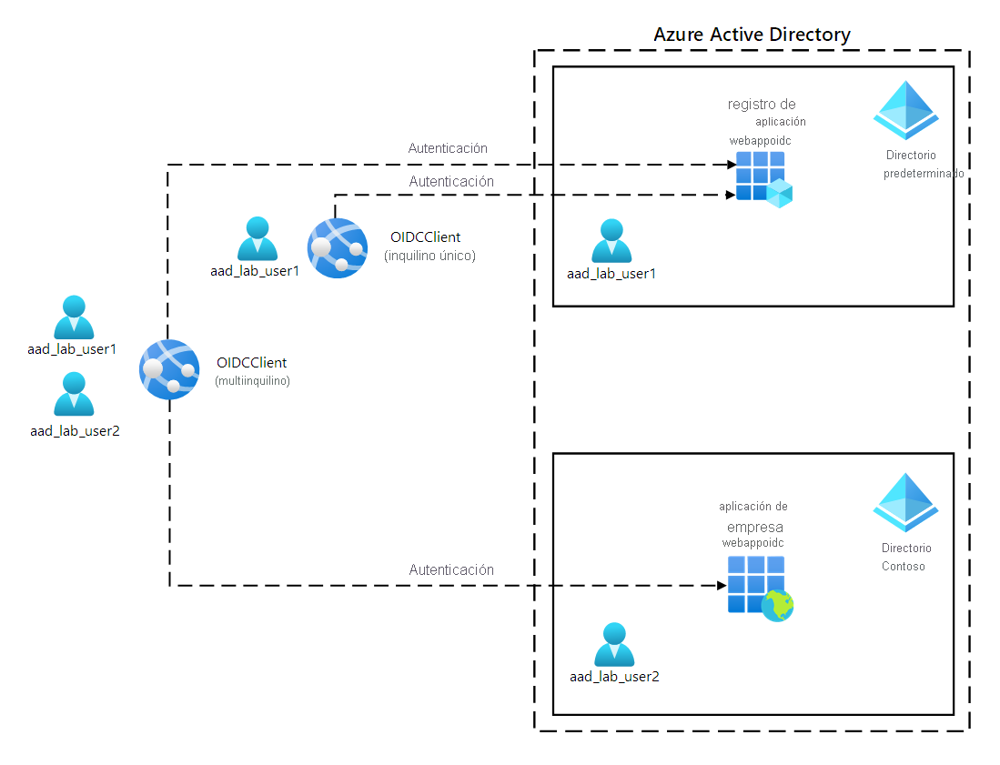
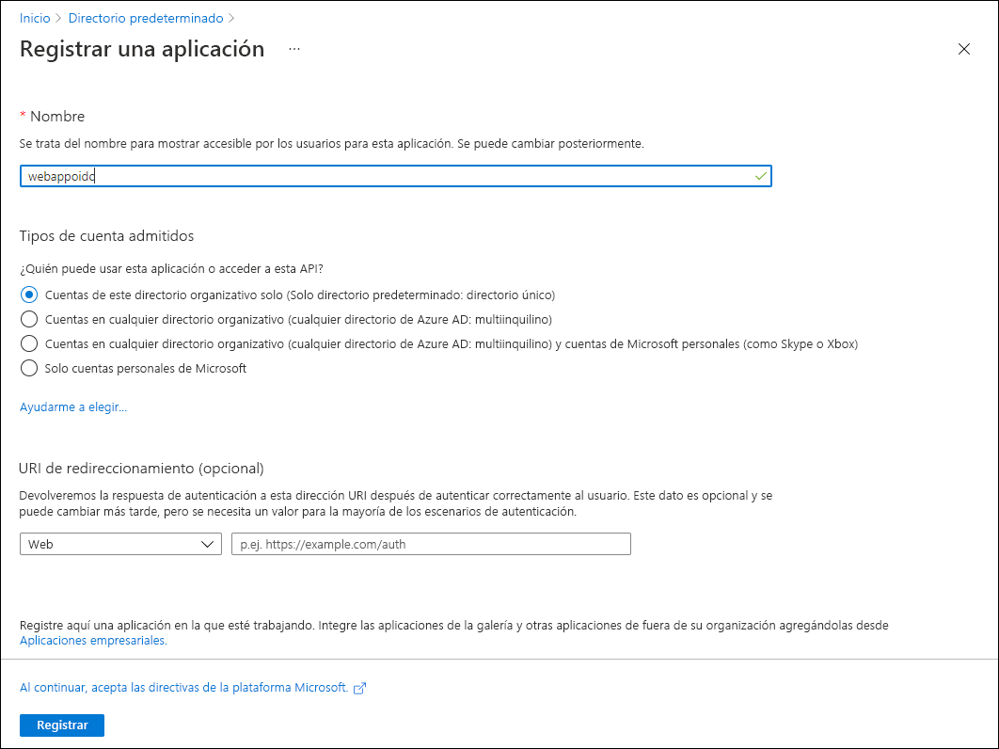
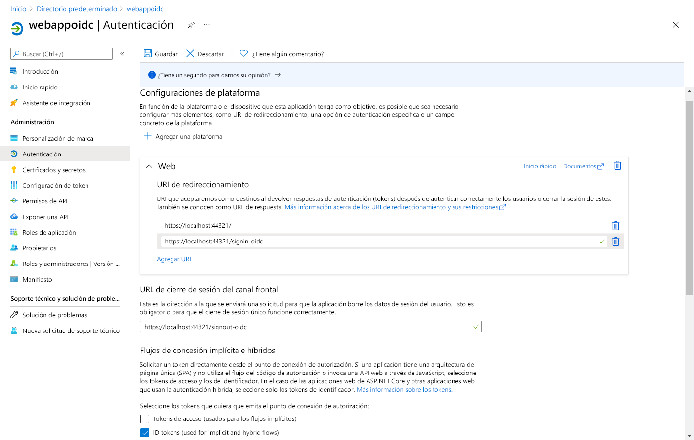

---
lab:
  az204Title: 'Lab 06: Authenticate by using OpenID Connect, MSAL, and .NET SDKs'
  az020Title: 'Lab 06: Authenticate by using OpenID Connect, MSAL, and .NET SDKs'
  az204Module: 'Module 06: Implement user authentication and authorization'
  az020Module: 'Module 06: Implement user authentication and authorization'
---

# <a name="lab-06-authenticate-by-using-openid-connect-msal-and-net-sdks"></a>Laboratorio 06: Autenticación mediante SDK de OpenID Connect, MSAL y .NET

## <a name="microsoft-azure-user-interface"></a>Interfaz de usuario de Microsoft Azure

Dada la naturaleza dinámica de las herramientas en la nube de Microsoft, puede experimentar cambios en la interfaz de usuario de Azure que se producen después del desarrollo de este contenido de entrenamiento. Como resultado, es posible que las instrucciones y los pasos del laboratorio no se alineen correctamente.

Microsoft actualiza este curso de entrenamiento cuando la comunidad nos alerta de los cambios necesarios. Sin embargo, las actualizaciones en la nube se producen con frecuencia, por lo que es posible que se produzcan cambios en la interfaz de usuario antes de que se actualice este contenido de entrenamiento. **Si esto ocurre, adáptese a los cambios y, a continuación, trabaje con ellos en los laboratorios según sea necesario.**

## <a name="instructions"></a>Instructions

### <a name="before-you-start"></a>Antes de comenzar

#### <a name="sign-in-to-the-lab-environment"></a>Inicio de sesión al entorno de laboratorio

Inicie sesión en la máquina virtual (VM) de Windows 10 con las credenciales siguientes:
    
-   Nombre de usuario: **Admin**

-   Contraseña: **Pa55w.rd**.

> **Nota**: El instructor le proporcionará instrucciones para conectarse al entorno de laboratorio virtual.

#### <a name="review-the-installed-applications"></a>Revisión de las aplicaciones instaladas

Busque la barra de tareas en el escritorio de Windows 10. La barra de tareas contiene los iconos de las aplicaciones que usará en este laboratorio, entre los que se incluyen:
    
-   Microsoft Edge

-   Visual Studio Code

## <a name="ensure-that-your-lab-environment-has-its-time-set-properly-no-delay-according-to-your-timezone"></a>Asegúrese de que el entorno de laboratorio tenga su tiempo establecido correctamente (sin retraso, según la zona horaria).

> **Nota:** Si observa que el tiempo del entorno de laboratorio experimenta retraso, ajuste su hora local mediante el siguiente comando de PowerShell para aumentar el tiempo en 15 minutos.

```powershell
  Set-Date -Adjust (New-TimeSpan -Minutes 15)
```

## <a name="architecture-diagram"></a>Diagrama de la arquitectura



### <a name="exercise-1-configure-a-single-tenant-azure-ad-environment"></a>Ejercicio 1: Configuración de un entorno de inquilino único de Azure AD

#### <a name="task-1-open-the-azure-portal"></a>Tarea 1: Apertura de Azure Portal

1.  En la barra de tareas, seleccione el icono de **Microsoft Edge**.

1.  En la ventana abierta del explorador, vaya a Azure Portal ([portal.azure.com](https://portal.azure.com)) y, a continuación, inicie sesión con la cuenta que va a usar para este laboratorio.

    > **Nota**: Si es la primera vez que inicia sesión en Azure Portal, se le ofrecerá un paseo por el portal. Seleccione **Introducción** para omitir el paseo y empezar a usar el portal.

#### <a name="task-2-register-an-application-in-azure-ad"></a>Tarea 2: Registro de una aplicación en Azure AD

1.  En Azure Portal, use el cuadro de texto **Buscar recursos, servicios y documentos** para buscar **Azure Active Directory** y, en la lista de resultados, seleccione **Azure Active Directory**.

    > **Nota**: Esto redirige la sesión del explorador a la hoja del inquilino de Azure Active Directory (Azure AD) asociado a la suscripción de Azure.

1.  En la hoja  **Azure Active Directory** , seleccione **Registros de aplicaciones** en la sección **Administrar**.

1.  En la sección **Registros de aplicaciones**, seleccione **+ Nuevo registro**.

1.  En la sección **Registrar una aplicación**, realice las siguientes acciones y, a continuación, seleccione **Registrar**:
    
    | Configuración | Acción |
    | -- | -- |
    | Cuadro de texto de **nombre** | Escriba **webappoidc** |
    | Lista de **Tipos de cuenta admitidos** | seleccione **Cuentas de este directorio organizativo solo (Solo directorio predeterminado: inquilino único)** |

    > **Nota**: El nombre del inquilino puede diferir en función de la suscripción de Azure.
   
    En la captura de pantalla siguiente, se muestran los valores configurados en la sección **Registrar una aplicación**.
          
     
      
    
#### <a name="task-3-record-unique-identifiers"></a>Tarea 3: Registro de identificadores únicos

1.  En la hoja de registro de aplicaciones **webappoidc**, seleccione **Información general**.

1.  En la sección **Información general**, busque y registre el valor del cuadro de texto **Id. de aplicación (cliente)** . Usará este valor más adelante en este laboratorio.

1.  En la sección **Información general**, busque y registre el valor del cuadro de texto **Id. de directorio (inquilino)** . Usará este valor más adelante en este laboratorio.

#### <a name="task-4-configure-the-application-authentication-settings"></a>Tarea 4: Configuración de la autenticación de la aplicación

1.  En la hoja de registro de aplicaciones **webappoidc**, seleccione **Autenticación** en la sección**Administrar**.

1.  En la sección **Autenticación**, realice estas acciones y seleccione **Configurar**:

    | Configuración | Acción |
    | -- | -- |
    | Sección **Configuraciones de plataforma** | Seleccione **+ Agregar una plataforma** |
    | Hoja **Configurar plataformas** | Seleccione **Web** |
    | Cuadro de texto **URI de redirección** | Escriba `https://localhost:5001/`. |
    | Cuadro de texto **Dirección URL de cierre de sesión del canal frontal** | Escriba `https://localhost:5001/signout-oidc`. |
        
1. De nuevo en la sección **Configuraciones de plataforma**, seleccione **Agregar URI** y, a continuación, escriba `https://localhost:5001/signin-oidc`.

1. En la sección **Concesión implícita y flujos híbridos**, seleccione **Tokens de identificador (usados para flujos implícitos e híbridos)** . 

1. Seleccione **Guardar**.

    En la captura de pantalla siguiente, se muestran los valores configurados en la hoja **Autenticación**.
          
     
       

#### <a name="task-5-create-an-azure-ad-user"></a>Tarea 5: Creación de un usuario de Azure AD

1.  En Azure Portal, seleccione el icono **Cloud Shell**, , para abrir una nueva sesión de PowerShell. Si el valor predeterminado de Cloud Shell es una sesión de Bash, seleccione **Bash** y, en el menú desplegable, seleccione **PowerShell**.

     > **Nota**: Si es la primera vez que inicia **Cloud Shell**, cuando se le pida que seleccione **Bash** o **PowerShell**, seleccione **PowerShell**. Si aparece el mensaje **No tiene ningún almacenamiento montado**, seleccione la suscripción que utiliza en este laboratorio y, luego, seleccione **Crear almacenamiento**.

1.  En el panel **Cloud Shell**, ejecute el siguiente comando para iniciar sesión en el inquilino de Azure AD asociado a su suscripción de Azure:

      ```powershell
       Connect-AzureAD
      ```

1.  Ejecute el siguiente comando para recuperar y mostrar el nombre de dominio principal del Sistema de nombres de dominio (DNS) del inquilino de Azure AD:

       ```powershell
       $aadDomainName = ((Get-AzureAdTenantDetail).VerifiedDomains)[0].Name
       $aadDomainName
       ```

    > **Nota**: Registre el valor del nombre de dominio DNS. Usará este valor más adelante en este laboratorio.

1.  Ejecute los siguientes comandos para crear usuarios de Azure AD que usará para probar la autenticación de Azure AD:

       ```powershell
       $passwordProfile = New-Object -TypeName Microsoft.Open.AzureAD.Model.PasswordProfile
       $passwordProfile.Password = 'Pa55w.rd1234'
       $passwordProfile.ForceChangePasswordNextLogin = $false
       New-AzureADUser -AccountEnabled $true -DisplayName 'aad_lab_user1' -PasswordProfile $passwordProfile -MailNickName 'aad_lab_user1' -UserPrincipalName "aad_lab_user1@$aadDomainName" 
       ```

1.  Ejecute el siguiente comando para identificar el nombre principal de usuario (UPN) del usuario de Azure AD recién creado:

       ```powershell
       (Get-AzureADUser -Filter "MailNickName eq 'aad_lab_user1'").UserPrincipalName
       ```

    > **Nota**: Registre el UPN. Usará este valor más adelante en este laboratorio.

1.  Cierre el panel de Cloud Shell.

#### <a name="review"></a>Revisar

En este ejercicio, ha registrado una aplicación de inquilino único de Azure AD y ha creado una cuenta de usuario de Azure AD.

### <a name="exercise-2-create-a-single-tenant-aspnet-web-app"></a>Ejercicio 2: Creación de una aplicación web de ASP.NET de inquilino único

#### <a name="task-1-create-an-aspnet-web-app-project"></a>Tarea 1: Creación de un proyecto de aplicación web de ASP.NET

1.  En el equipo del laboratorio, inicie un **símbolo del sistema**.

1.  Desde el símbolo del sistema, ejecute los comandos siguientes para crear y establecer el directorio actual en **Allfiles (F):\\Allfiles\\Labs\\06\\Starter\\OIDCClient**:

    ```powershell
    F:
    cd F:\Allfiles\Labs\06\Starter\OIDCClient
    ```

1.  Ejecute los siguientes comandos para crear una nueva aplicación web de .NET Core basada en la plantilla de Modelo-Vista-Controlador (MVC) (reemplace los marcadores de posición `<application_ID>`, `<tenant_ID>` y `<domain_Name>` por los valores correspondientes que registró anteriormente en este laboratorio):

    ```powershell
    dotnet new mvc --auth SingleOrg --client-id <application_ID> --tenant-id <tenant_ID> --domain <domain_Name>
    rmdir .\obj /S /Q
    ```

1.  En el equipo del laboratorio, inicie Visual Studio Code.

1.  En el menú **Archivo**, seleccione **Abrir carpeta**.

1.  En la ventana **Explorador de archivos**, vaya a **Allfiles (F):\\Allfiles\\Labs\\06\\Starter\\OIDCClient** y, a continuación, seleccione **Seleccionar carpeta**.

1.  En el panel **Explorador** de Visual Studio Code, revise la estructura de carpetas generada automáticamente que representa una aplicación web MVC.

1.  Vaya a la carpeta **Propiedades**, abra el archivo **launchSettings.json** y aplique los cambios siguientes:

    
    | Sección | Propiedad | Value |
    | -- | -- | -- |
    | **iisSettings** | **sslPort** | **44321** |
    | **OIDCClient**  | **applicationUrl** | `https://localhost:5001` |
    

    > **Nota**: Los números de puerto deben coincidir con el valor especificado al crear el registro de aplicación de Azure AD.

1.  Guarde y cierre el archivo.

1.  En el panel **Explorador** de Visual Studio Code, seleccione **OIDCClient.csproj**.

1.  Asegúrese de que el valor del elemento `<TargetFramework>` está establecido en **net6.0**.

1.  Asegúrese de que la versión de los paquetes NuGet `Microsoft.AspNetCore.Authentication.JwtBearer` y `Microsoft.AspNetCore.Authentication.OpenIdConnect` esté establecida en **6.0.6**.

1.  Establezca la versión de los paquetes NuGet `Microsoft.Identity.Web` y `Microsoft.Identity.Web.UI` en **1.25.0**.

1.  Compruebe que el contenido del archivo **OIDCClient.csproj** se parece a la siguiente lista (el valor de `UserSecretsId` será diferente) y guarde los cambios.

    ```csharp
    <Project Sdk="Microsoft.NET.Sdk.Web">
      <PropertyGroup>
        <TargetFramework>net6.0</TargetFramework>
        <UserSecretsId>aspnet-OIDCClient-737DEB13-25D4-4C52-93C5-F485367E3C8C</UserSecretsId>
      </PropertyGroup>

      <ItemGroup>
        <PackageReference Include="Microsoft.AspNetCore.Authentication.JwtBearer" Version="6.0.6" NoWarn="NU1605" />
        <PackageReference Include="Microsoft.AspNetCore.Authentication.OpenIdConnect" Version="6.0.6" NoWarn="NU1605" />
        <PackageReference Include="Microsoft.Identity.Web" Version="1.25.0" />
        <PackageReference Include="Microsoft.Identity.Web.UI" Version="1.25.0" />
      </ItemGroup>
    </Project>
    ```

1.  Cierre el archivo **OIDCClient.csproj**.

1.  Vaya a la carpeta **Views\Shared** y abra el archivo **_LoginPartial.cshtml**.

1.  Compruebe que el atributo `asp-area` de cada elemento span hace referencia a `MicrosoftIdentity`, como en la línea siguiente:

    ```csharp
    <a class="nav-link text-dark" asp-area="MicrosoftIdentity" asp-controller="Account" asp-action="SignOut">Sign out</a>
    ```

1.  Cierre el archivo sin realizar ningún cambio.

1.  Abra el archivo **appsettings.json** y revise el contenido del objeto **AzureAd**, incluidos los siguientes elementos:

    | Elemento | Value |
    | -- | -- |
    | `Instance` | `https://login.microsoftonline.com/`|
    | `Domain` | Dominio DNS principal del inquilino de Azure AD asociado a la suscripción de Azure |
    | `TenantId` | GUID del inquilino de Azure AD |
    | `ClientId` | Id. de aplicación (cliente) de la aplicación registrada en el inquilino de Azure AD |
    | `CallbackPath` | `/signin-oidc` |

1.  Cierre el archivo sin realizar ningún cambio.

1.  En el panel del **Explorador** de Visual Studio Code, seleccione **Program.cs**.

1.  Compruebe que el archivo contiene las directivas **using** siguientes:

    ```csharp
    using Microsoft.AspNetCore.Authentication.OpenIdConnect;
    using Microsoft.Identity.Web;
    using Microsoft.Identity.Web.UI;
    ```

1.  Compruebe que el archivo contiene las líneas siguientes, que agregan los servicios de autenticación pertinentes al contenedor:

    ```csharp
    builder.services.AddAuthentication(OpenIdConnectDefaults.AuthenticationScheme)
      .AddMicrosoftIdentityWebApp(Configuration.GetSection("AzureAd"));
    ```

1.  Compruebe que el archivo contiene las líneas siguientes, que agregan un controlador y Razor Pages para la administración de cuentas:

    ```csharp
    builder.services.AddRazorPages()
      .AddMicrosoftIdentityUI();
    ```

1.  Guarde y cierre el archivo.

### <a name="task-2-test-the-single-tenant-web-app-in-a-single-tenant-scenario"></a>Tarea 2: Prueba de la aplicación web de inquilino único en un escenario de inquilino único

1.  En la ventana de **Visual Studio Code**, active el menú contextual del panel **Explorador** y, a continuación, seleccione **Abrir en el terminal integrado**.

1.  Ejecute los comandos siguientes para compilar la aplicación web de .NET:

    ```
    cd F:\Allfiles\Labs\06\Starter\OIDCClient
    dotnet build
    ```

    > **Nota**: Si hay algún error de compilación, revise los archivos de la carpeta **Allfiles (F):\\Allfiles\\Labs\\06\\Solution\\OIDCClient**. Ignore los mensajes de advertencia.

1.  Ejecute el siguiente comando para generar un certificado autofirmado y configurar el equipo local para que confíe en él:

    ```
    dotnet dev-certs https --trust
    ```

1.  Si se le pide que instale el certificado generado automáticamente, seleccione **Sí**.

1.  En el símbolo del sistema del terminal, ejecute el siguiente comando para ejecutar la aplicación web de .NET:

    ```
    dotnet run
    ```

1.  Inicie el explorador de Microsoft Edge en el modo **InPrivate** y, a continuación, vaya a la dirección URL `https://localhost:5001`.

1.  Si aparece el mensaje **La conexión no es privada**, seleccione **Avanzado** y, después, seleccione el vínculo **Continuar a localhost (no seguro)** .

1.  En la ventana abierta del explorador, cuando se le solicite, autentíquese mediante el UPN de la cuenta de Azure AD **aad_lab_user1** que creó anteriormente en este laboratorio con **Pa55w.rd1234** como contraseña.

    > **Nota**: Si aparece la ventana **Ayúdenos a proteger su cuenta**, seleccione **Omitir por ahora**.

1.  La ventana del explorador abrirá automáticamente la página web **Permisos solicitados**.

1.  Revise los permisos solicitados, que incluyen **Ver el perfil básico** y **Mantener el acceso a los datos a los que le ha dado acceso**.

1.  Seleccione **Aceptar**.

1.  Revise la página principal de **bienvenida** del sitio de destino que muestra el explorador y compruebe que el UPN de la cuenta de Azure AD **aad_user1** aparece en la ventana del explorador.

1.  En la página de **bienvenida**, seleccione **Cerrar sesión**.

1.  Cuando se le pida que seleccione la cuenta para cerrar sesión, seleccione la cuenta de Azure AD **aad_lab_user1**. Se le redirigirá automáticamente a la página **Sesión cerrada**.

1.  Cierre el explorador de Microsoft Edge.

#### <a name="review"></a>Revisar 

En este ejercicio, ha implementado una aplicación web de inquilino único y la ha probado en un entorno de Azure de inquilino único.

### <a name="exercise-3-clean-up-your-lab-environment"></a>Ejercicio 3: Limpiar el entorno de laboratorio

#### <a name="task-1-delete-the-application-registration-in-azure-ad"></a>Tarea 1: Eliminación del registro de aplicaciones en Azure AD

1.  Cambie al explorador de Microsoft Edge que muestra Azure Portal.

1.  En Azure Portal, vaya a la hoja del inquilino de Azure AD asociado a su suscripción de Azure.

1.  En la hoja  **Azure Active Directory** , seleccione **Registros de aplicaciones** en la sección **Administrar**.

1.  En la sección **Registros de aplicaciones**, seleccione el registro de aplicación **webappoidc** de Azure AD que creó anteriormente en este laboratorio.

1.  En la sección **webappoidc**, realice las siguientes acciones:

    a.   Seleccione **Eliminar**.

    b.   En la hoja **Eliminar registro de aplicación**, seleccione **I understand the implications of deleting this app registration** (Entiendo las implicaciones de eliminar este registro de aplicación) y, a continuación, seleccione **Eliminar**.

1.  Vaya a la hoja **Usuarios \| Todos los usuarios (versión preliminar)** .

1.  En la lista de usuarios, seleccione **aad_lab_user1**.

1.  En la hoja **aad_lab_user1 \| Perfil**, seleccione **Eliminar** y, cuando se le solicite confirmación, seleccione **Sí**.

#### <a name="task-2-close-the-active-applications"></a>Tarea 2: Cierre de las aplicaciones activas

1.  Cierre las ventanas abiertas de Microsoft Edge.

1.  Cierre Visual Studio Code.

#### <a name="review"></a>Revisar

En este ejercicio, ha limpiado la suscripción mediante la eliminación del registro de aplicación usado en este laboratorio.
