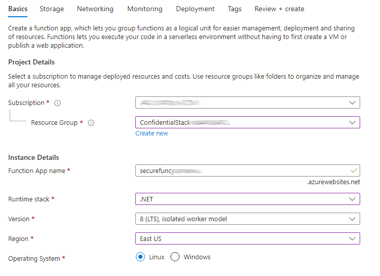

---
lab:
  az204Title: 'Lab 07: Access resource secrets more securely across services'
  az204Module: 'Learning Path 07: Implement secure Azure solutions'
---

# Laboratorio 07: Acceso a secretos de recursos de forma más segura entre servicios

## Interfaz de usuario de Microsoft Azure

Dada la naturaleza dinámica de las herramientas en la nube de Microsoft, puede experimentar cambios en la interfaz de usuario de Azure que se producen después del desarrollo de este contenido de entrenamiento. Como resultado, es posible que las instrucciones y los pasos del laboratorio no se alineen correctamente.

Microsoft actualiza este curso de entrenamiento cuando la comunidad aporta los cambios necesarios a nuestra atención. Sin embargo, dado que las actualizaciones en la nube se producen con frecuencia, es posible que se produzcan cambios en la interfaz de usuario antes de que se actualice este contenido de entrenamiento. **Si esto ocurre, adáptese a los cambios y, a continuación, trabaje con ellos en los laboratorios según sea necesario.**

## Instructions

### Antes de comenzar

#### Inicio de sesión al entorno de laboratorio

Inicie sesión en la máquina virtual (VM) de Windows 11 con las credenciales siguientes:

- Nombre de usuario: `Admin`
- Contraseña: `Pa55w.rd`

> **Nota**: El instructor le proporcionará instrucciones para conectarse al entorno de laboratorio virtual.

#### Revisión de las aplicaciones instaladas

Busque la barra de tareas en el escritorio de Windows 11. La barra de tareas contiene los iconos de las aplicaciones que usará en este laboratorio, entre los que se incluyen:

- Microsoft Edge
- Explorador de archivos
- Terminal
- Visual Studio Code

## Escenario de laboratorio

En este laboratorio, creará una cuenta de almacenamiento y una aplicación de función de Azure que accederá a la cuenta de almacenamiento. Para demostrar el almacenamiento seguro de la información de la cadena de conexión, aprovisionará un recurso de Key Vault y administrará los secretos adecuados para almacenar la información de la cadena de conexión. También administrará la identidad de servicio para obtener acceso seguro a la información de la cadena de conexión de la cuenta de almacenamiento.

## Diagrama de la arquitectura


### Ejercicio 1: Creación de recursos de Azure

#### Tarea 1: Abra Azure Portal

1. En la barra de tareas, seleccione el icono de **Microsoft Edge**.

1. En la ventana del explorador abierto, vaya a Azure Portal en `https://portal.azure.com` y, a continuación, inicie sesión con la cuenta que va a usar para este laboratorio.

   > **Nota**: Si es la primera vez que inicia sesión en Azure Portal, se le ofrecerá un paseo por el portal. Seleccione **Introducción** para omitir el paseo y empezar a usar el portal.

#### Tarea 2: Creación de una cuenta de almacenamiento

1. En Azure Portal, use el cuadro de texto **Buscar recursos, servicios y documentos** para buscar **Cuentas de almacenamiento** y, a continuación, en la lista de resultados, seleccione **Cuentas de almacenamiento**.

1. En la hoja  **Cuentas de almacenamiento** , seleccione **+ Crear**.

1. En la hoja **Crear una cuenta de almacenamiento**, en la pestaña **Aspectos básicos**, realice las siguientes acciones y seleccione **Revisar**:

    | Configuración | Acción |
    |--|--|
    | Lista desplegable de **Suscripción** | Conserve los valores predeterminados |
    | Sección **Grupo de recursos** | Seleccione **Crear nuevo**, escriba **ConfidentialStack** y seleccione **Aceptar** |
    | Cuadro de texto **Nombre de la cuenta de almacenamiento**  | Escriba **securestor** _[sunombre]_ |
    | Lista desplegable de **región** | Seleccione **(EE.UU.) Este de EE. UU.** |
    | Sección **Rendimiento** | Seleccione la opción **Estándar** |
    | Lista desplegable de **Redundancia** | Seleccione **Almacenamiento con redundancia local (LRS)**. |

   En la captura de pantalla siguiente, se muestran los valores configurados en la hoja **Crear una cuenta de almacenamiento**.

   

1. En la pestaña **Revisar**, revise las opciones que seleccionó en los pasos anteriores.

1. Seleccione **Crear** para crear la cuenta de almacenamiento mediante la configuración especificada.

   > **Nota**: Espere a que se complete la tarea de creación antes de continuar con este laboratorio.

1. En la hoja **Información general sobre la implementación**, seleccione **Ir al recurso**.

1. En la hoja **Cuenta de almacenamiento** , en la sección **Seguridad y redes** , seleccione el vínculo **Claves de acceso** .

1. En la sección **Claves de acceso** , seleccione **Mostrar claves**.

1. En la hoja  **Claves de acceso** , revise cualquiera de las **Cadenas de conexión** (mediante el botón **Mostrar**) y, a continuación, registre el valor de cualquiera de los cuadros **Cadena de conexión**  en el Bloc de notas. Las **Clave**s son claves de cifrado administradas por la plataforma y **no** se usan para este laboratorio.

   > **Nota**: No importa la cadena de conexión que elija. Son intercambiables.

#### Tarea 3: Creación de una instancia de Azure Key Vault

1. En Azure Portal, use el cuadro de texto **Buscar recursos, servicios y documentos** para buscar **Almacenes de claves** y, a continuación, en la lista de resultados, seleccione **Almacenes de claves**.

1. En la hoja **Almacenes de claves**, seleccione **Crear**.

1. En la hoja **Crear almacén de claves**, en la pestaña **Aspectos básicos**, realice las siguientes acciones y seleccione **Siguiente** para ir a la pestaña **Configuración de acceso**:

   | Configuración                           | Acción                                   |
   | --------------------------------- | ---------------------------------------- |
   | Lista desplegable de **Suscripción**   | Conserve los valores predeterminados                 |
   | Lista desplegable del **grupo de recursos** | Seleccionar **ConfidentialStack** en la lista |
   | Cuadro de texto **Nombre del almacén de claves**        | Escribir **securevault** _[sunombre]_        |
   | Lista desplegable de **Región**         | Seleccione **Este de EE. UU**.                       |
   | Lista desplegable de **planes de tarifa**   | Seleccione **Estándar**.                      |

   En la captura de pantalla siguiente, se muestran los valores configurados en la hoja **Crear almacén de claves**.

   

1. En la pestaña **Configuración de acceso**, cambie el modelo de permisos a **Directiva de acceso a almacenes** y, a continuación, seleccione **Revisar y crear**.

1. En la pestaña **Revisar y crear**, revise las opciones que seleccionó durante los pasos anteriores.

1. Seleccione **Crear** para crear el almacén de claves mediante la configuración especificada.

   > **Nota**: Espere a que se complete la tarea de creación antes de continuar con este laboratorio.

#### Tarea 4: Creación de una aplicación de funciones

1. En Azure Portal, use el cuadro de texto **Buscar recursos, servicios y documentos** para buscar la **Aplicación de funciones** y, a continuación, en la lista de resultados, seleccione **Aplicación de funciones**.

1. En la hoja **Aplicación de funciones**, seleccione **Crear**.

1. En la página **Seleccionar una opción de hospedaje**, asegúrate de que **Consumo** está seleccionado y, después, haz clic en **Seleccionar**.

1. En la hoja **Crear aplicación de funciones (Consumo)**, en la pestaña **Aspectos básicos**, realiza las siguientes acciones y, después, selecciona **Siguiente: Almacenamiento**:

   | Configuración                           | Acción                              |
   | --------------------------------- | ----------------------------------- |
   | Lista desplegable de **Suscripción**   | Conserve los valores predeterminados            |
   | Lista desplegable del **grupo de recursos** | Seleccione **ConfidentialStack**        |
   | Cuadro de texto **Nombre de la aplicación de funciones**     | Escriba **securefunc** _[sunombre]_    |
   | Lista desplegable de la **pila en tiempo de ejecución**  | Seleccione **.NET**                     |
   | Lista desplegable de **Versión**        | Seleccione **8 (LTS), modelo de trabajo aislado**.                        |
   | Lista desplegable de **Región**         | Seleccionar la región **Este de EE. UU.**       |
   | Sección del **sistema operativo**      | Seleccione **Linux**.                    |

   En la captura de pantalla siguiente, se muestran los valores configurados en la hoja **Crear aplicación de funciones**.

   

1. En la pestaña **Almacenamiento**, realice las siguientes acciones y, a continuación, seleccione **Revisar y crear**:

    | Configuración | Acción |
    |--|--|
    | Lista desplegable de **cuenta de almacenamiento** | Seleccione la cuenta de almacenamiento **securestor** _[sunombre]_ |

1. En la pestaña **Revisar y crear**, revise las opciones que seleccionó durante los pasos anteriores.

1. Seleccione **Crear** para crear la aplicación de funciones mediante la configuración especificada.

   > **Nota**: Espere a que se complete la tarea de creación antes de continuar con este laboratorio.

#### Revisar

En este ejercicio, ha creado todos los recursos que usará en este laboratorio.

### Ejercicio 2: Configuración de secretos e identidades

#### Tarea 1: Configuración de una identidad de servicio administrada asignada por el sistema

1. En el panel de navegación de Azure Portal, seleccione el vínculo **Grupos de recursos**.

1. En la hoja **Grupos de recursos**, seleccione el grupo de recursos **ConfidentialStack**.

1. En la hoja **ConfidentialStack**, seleccione la aplicación de funciones **securefunc** _[yourname]_.

   > **Nota**: Habrá dos recursos, una aplicación de funciones y un recurso de Application Insights, con el mismo nombre. Asegúrese de seleccionar el recurso de la aplicación de funciones.

1. En la hoja **Aplicación de funciones**, seleccione la opción **Identidad** en la sección **Configuración**.

1. En el panel **Identidad**, en la pestaña **Asignado por el sistema**, establezca **Estado** en **Activado** y, a continuación, seleccione **Guardar**.

1. Seleccione **Sí** para confirmar la configuración.

   > **Nota**: Espere a que se cree la identidad administrada asignada por el sistema antes de avanzar con este laboratorio.

#### Tarea 2: Creación de un secreto de almacén de claves

1. En el **panel de navegación** de Azure Portal, seleccione el vínculo **Grupos de recursos**.

1. En la hoja **Grupos de recursos**, seleccione el grupo de recursos **ConfidentialStack**.

1. En la hoja **ConfidentialStack**, seleccione el almacén de claves **securevault** _[yourname]_.

1. En la hoja **Key Vault**, seleccione el vínculo **Secretos** en la sección **Objetos**.

1. En el panel **Secretos**, seleccione **+ Generar o importar**.

1. En la hoja **Crear un secreto**, realice las siguientes acciones y, a continuación, seleccione **Crear**:

    | Configuración | Acción |
    |--|--|
    | Lista desplegable de **opciones de carga** | Seleccione **Manual**. |
    | Cuadro de texto de **nombre** | Escriba **storagecredentials** |
    | Cuadro de texto **Valor secreto** | Escriba la cadena de conexión de la cuenta de almacenamiento que registró anteriormente en este laboratorio. |
    | Cuadro de texto **Tipo de contenido** | Déjelo en blanco. |
    | Casilla **Establecer fecha de activación** | No seleccionado |
    | Casilla **Establecer fecha de expiración** | No seleccionado |
    | Opción **Activado** | Seleccione **Sí**. |

   En la captura de pantalla siguiente, se muestran los valores configurados en la hoja **Crear un secreto**.

   

   > **Nota**: Espere a que se cree el secreto antes de continuar con este laboratorio.

1. Vuelva al panel **Secretos** y seleccione el elemento **storagecredentials** de la lista.

1. En el panel **Versiones**, seleccione la versión más reciente del secreto **storagecredentials**.

1. En el panel **Versión del secreto**, realice las siguientes acciones:

   1. Seleccione **Mostrar valor del secreto** para ver el valor asignado al secreto.

   1. Registre el valor del cuadro de texto **Identificador secreto** porque lo usará más adelante en el laboratorio.

   > **Nota**: Está registrando el valor del cuadro de texto **Identificador secreto,** no el cuadro de texto **Valor del secreto**.

#### Tarea 3: Configuración de una directiva de acceso de Key Vault

1. En el panel de navegación de Azure Portal, seleccione el vínculo **Grupos de recursos**.

1. En la hoja **Grupos de recursos**, seleccione el grupo de recursos **ConfidentialStack**.

1. En la hoja **ConfidentialStack**, seleccione el almacén de claves **securevault[yourname]**.

1. En la hoja **Key Vault**, seleccione el vínculo **Directivas de acceso** en la sección **Introducción**.

1. En el panel **Directivas de acceso**, seleccione **+ Crear**.

1. En la hoja **Crear una directiva de acceso**, seleccione la sección **Permisos** y realice las siguientes selecciones:

    | Configuración | Acción |
    |--|--|
    | Lista desplegable **Configurar a partir de una plantilla** | Déjelo en blanco. |
    | Casillas **Permisos de clave** | 0 servicios seleccionados |
    | Casillas **Permisos secretos** | Seleccione el permiso **Obtener** |
    | Casillas **Permisos de certificado** | 0 servicios seleccionados |

1. Selecciona la sección **Principal** y selecciona las siguientes opciones:

    | Configuración | Acción |
    |--|--|
    | Vínculo **Seleccionar entidad de seguridad** | Busque y, a continuación, seleccione la entidad de servicio denominada **securefunc** _[yourname]_. La identidad administrada asignada por el sistema que creó anteriormente en este laboratorio tendrá el mismo nombre que el recurso de Azure Functions. |

1. Selecciona **Revisar y crear** y luego **Crear**.

   > **Nota**: Espere a que se guarden los cambios en las directivas de acceso antes de continuar con este laboratorio.

#### Tarea 4: Creación de una configuración de la aplicación derivada de Key Vault

1. En el panel de navegación de Azure Portal, seleccione el vínculo **Grupos de recursos**.

1. En la hoja **Grupos de recursos**, seleccione el grupo de recursos **ConfidentialStack**.

1. En la hoja **ConfidentialStack**, seleccione la aplicación de funciones **securefunc[yourname]** .

1. En la hoja **Aplicación de funciones**, en la sección **Configuración**, seleccione el vínculo **Variable de entorno**.

1. En la pestaña **Configuración de la aplicación**, seleccione **+ Agregar**. Introduzca la siguiente información en el cuadro de diálogo emergente **Agregar o editar configuración de la aplicación**:

    | Configuración | Acción |
    |--|--|
    | Cuadro de texto de **nombre** | Introduzca **StorageConnectionString** |
    | Cuadro de texto **Valor** | Construya un valor mediante la sintaxis `@Microsoft.KeyVault(SecretUri=<Secret Identifier>)`, donde el marcador de posición `<Secret Identifier>` representa el identificador secreto que registró anteriormente en este ejercicio. |
    | Casilla **Configuración de la ranura de implementación** | Conserve los valores predeterminados |

    >**Nota**: Por ejemplo, si el identificador secreto es `https://securevaultstudent.vault.azure.net/secrets/storagecredentials/17b41386df3e4191b92f089f5efb4cbf`, el valor resultante sería `@Microsoft.KeyVault(SecretUri=https://securevaultstudent.vault.azure.net/secrets/storagecredentials/17b41386df3e4191b92f089f5efb4cbf)`.

1. Seleccione **Aplicar** para cerrar el cuadro de diálogo emergente y vuelva a la sección **Configuración de la aplicación**.

1. En la parte inferior de la sección **Configuración de la aplicación**, seleccione **Aplicar**.

    >**Nota:** Es posible que reciba una advertencia de que su aplicación puede reiniciarse al actualizar la configuración de la aplicación. Seleccione **Confirmar**. Espere a que se guarde la configuración de la aplicación antes de continuar con el laboratorio.

#### Revisar

En este ejercicio, ha creado una identidad de servicio administrada asignada por el sistema para la aplicación de funciones y, a continuación, ha concedido a esa identidad los permisos adecuados para obtener el valor de un secreto en el almacén de claves. Por último, ha creado un secreto al que ha hecho referencia dentro de las opciones de configuración de la aplicación de funciones.

### Ejercicio 3: Compilación de una aplicación de Azure Functions

#### Tarea 1: Inicialización de un proyecto de función

1. En la barra de tareas, seleccione el icono **Terminal**.

1. Ejecute el siguiente comando para cambiar el directorio actual al directorio vacío **Allfiles (F):\\Allfiles\\Labs\\07\\Starter\\func**:

   ```powershell
   cd F:\Allfiles\Labs\07\Starter\func
   ```

   > **Nota**: En el Explorador de Windows, quite el atributo de solo lectura del archivo F:\Allfiles\Labs\07\Starter\func\.gitignore.

1. Ejecute el siguiente comando para usar **Azure Functions Core Tools** para crear un nuevo proyecto de Functions local en el directorio actual mediante el entorno de ejecución **dotnet**:

   ```powershell
   func init --worker-runtime dotnet-isolated --target-framework net8.0 --force
   ```

   > **Nota**: Puede revisar la documentación para [crear un proyecto][azure-functions-core-tools-new-project] mediante **Azure Functions Core Tools**.

1. Ejecute el comando siguiente para **compilar** el proyecto de .NET 8:

   ```powershell
   dotnet build
   ```

#### Tarea 2: Creación de una función desencadenada por HTTP

1. Ejecute el siguiente comando para usar **Azure Functions Core Tools** para crear una nueva función denominada **FileParser** mediante la plantilla de **desencadenador HTTP**:

   ```powershell
   func new --template "HTTP trigger" --name "FileParser"
   ```

   > **Nota**: Puede revisar la documentación para [crear una nueva función][azure-functions-core-tools-new-function] mediante **Azure Functions Core Tools**.

1. Cierre la aplicación que ejecuta **Terminal** actualmente.

#### Tarea 3: Configuración y lectura de una configuración de la aplicación

1. En la pantalla **Inicio**, seleccione el icono **Visual Studio Code**.

1. En el menú **Archivo**, seleccione **Abrir carpeta**.

1. En la ventana **Explorador de archivos** que se abre, vaya a **Allfiles (F):\\Allfiles\\Labs\\07\\Starter\\func** y, a continuación, seleccione **Seleccionar carpeta**.

1. En el panel **Explorador** de la ventana **Visual Studio Code**, abra el archivo **local.settings.json**.

1. Anote el valor actual del objeto **Valores**:

   ```json
   "Values": {
       "AzureWebJobsStorage": "UseDevelopmentStorage=true",
       "FUNCTIONS_WORKER_RUNTIME": "dotnet-isolated"
   }
   ```

1. Actualice el valor del objeto **Values** agregando una nueva configuración denominada **StorageConnectionString** y, a continuación, asignándole un valor de cadena de **[TEST VALUE]** :

   ```json
   "Values": {
       "AzureWebJobsStorage": "UseDevelopmentStorage=true",
       "FUNCTIONS_WORKER_RUNTIME": "dotnet-isolated",
       "StorageConnectionString": "[TEST VALUE]"
   }
   ```

1. Ahora el archivo **local.settings.json** debe incluir:

   ```json
   {
     "IsEncrypted": false,
     "Values": {
       "AzureWebJobsStorage": "UseDevelopmentStorage=true",
       "FUNCTIONS_WORKER_RUNTIME": "dotnet-isolated",
       "StorageConnectionString": "[TEST VALUE]"
     }
   }
   ```

1. Seleccione **Guardar** para guardar los cambios en el archivo **local.settings.json**.

1. En el panel **Explorador** de la ventana **Visual Studio Code**, abra el archivo **FileParser.cs**.

1. En el editor de código, reemplace el contenido del código generado automáticamente de la función **FileParser** a partir de la línea 18 por el código siguiente:

    ```csharp
           [Function("FileParser")]
            public HttpResponseData Run([HttpTrigger(AuthorizationLevel.Function, "get", "post")] HttpRequestData req)
            {
                _logger.LogInformation("C# HTTP trigger function processed a request.");

                var response = req.CreateResponse(HttpStatusCode.OK);
                response.Headers.Add("Content-Type", "text/plain; charset=utf-8");

                string connectionString = Environment.GetEnvironmentVariable("StorageConnectionString");
                response.WriteString(connectionString);

                return response;
            }
    ``` 

1. Omita las advertencias relativas a los valores NULL. 

1. Revise el código resultante, que debe constar del siguiente contenido (este código devuelve el valor de la variable de entorno StorageConnectionString):

   ```csharp
   using System.Net;
   using Microsoft.Azure.Functions.Worker;
   using Microsoft.Azure.Functions.Worker.Http;
   using Microsoft.Extensions.Logging;

   namespace func
   {
       public class FileParser
       {
           private readonly ILogger _logger;

           public FileParser(ILoggerFactory loggerFactory)
           {
               _logger = loggerFactory.CreateLogger<FileParser>();
           }

           [Function("FileParser")]
           public HttpResponseData Run([HttpTrigger(AuthorizationLevel.Function, "get", "post")] HttpRequestData req)
           {
               _logger.LogInformation("C# HTTP trigger function processed a request.");

               var response = req.CreateResponse(HttpStatusCode.OK);
               response.Headers.Add("Content-Type", "text/plain; charset=utf-8");

               string connectionString = Environment.GetEnvironmentVariable("StorageConnectionString");
               response.WriteString(connectionString);

               return response;
           }
       }
   }
   ```

1. Seleccione **Guardar** para guardar los cambios en el archivo **FileParser.cs**.

#### Tarea 4: Validación de la función local

1. En la barra de tareas, seleccione el icono **Terminal**.

1. Ejecute el siguiente comando para cambiar el directorio actual al directorio vacío **Allfiles (F):\\Allfiles\\Labs\\07\\Starter\\func**:

   ```powershell
   cd F:\Allfiles\Labs\07\Starter\func
   ```

1. Ejecute el siguiente comando para ejecutar el proyecto de la aplicación de funciones:

   ```powershell
   func start --build
   ```

   > **Nota**: Puede revisar la documentación para [iniciar el proyecto de la aplicación de funciones localmente][azure-functions-core-tools-start-function] mediante **Azure Functions Core Tools**.

1. En el equipo del laboratorio, inicie un **símbolo del sistema**.

1. Ejecute el comando siguiente para ejecutar la prueba de la llamada a la API REST **GET** en `http://localhost:7071/api/FileParser`:

   ```cmd
   curl -X GET -i http://localhost:7071/api/FileParser
   ```

1. Observe el valor **[TEST VALUE]** de **StorageConnectionString** que se devuelve como resultado de la solicitud HTTP:

   ```cmd
   HTTP/1.1 200 OK
   Content-Type: text/plain; charset=utf-8
   Date: Tue, 01 Sep 2020 23:35:39 GMT
   Server: Kestrel
   Transfer-Encoding: chunked

   [TEST VALUE]
   ```

1. Cierre todas las instancias actualmente en ejecución de la aplicación **Terminal** y la aplicación **Símbolo del sistema**.

#### Tarea 5: Implementación de la función mediante Azure Functions Core Tools

1. En la barra de tareas, seleccione el icono **Terminal**.

1. Ejecute el siguiente comando para cambiar el directorio actual al directorio vacío **Allfiles (F):\\Allfiles\\Labs\\07\\Starter\\func**:

   ```powershell
   cd F:\Allfiles\Labs\07\Starter\func
   ```

1. Ejecute el siguiente comando para iniciar sesión en la interfaz de la línea de comandos (CLI) de Azure:

   ```powershell
   az login
   ```

1. En la ventana del explorador **Microsoft Edge**, escriba las credenciales de la cuenta que usa para acceder a la suscripción de Azure y, luego, seleccione **Iniciar sesión**.

1. Vuelva a la ventana de **Terminal** abierta actualmente. Espere a que finalice el proceso de inicio de sesión.

1. Ejecute el comando siguiente para publicar el proyecto de aplicación de funciones (reemplace el marcador de posición `<function-app-name>` por el nombre de la aplicación de funciones que creó anteriormente en este laboratorio):

   ```powershell
   func azure functionapp publish <function-app-name> --dotnet-version 8.0
   ```

   > **Nota**: Por ejemplo, si el **nombre de la aplicación de funciones** es **securefuncstudent**, el comando sería `func azure functionapp publish securefuncstudent --force`. Puede revisar la documentación para [publicar el proyecto de la aplicación de funciones local][azure-functions-core-tools-publish-azure] mediante **Azure Functions Core Tools**.

1. Espere a que la implementación se finalice antes de avanzar con el laboratorio.

1. Cierre la aplicación que ejecuta **Terminal** actualmente.

#### Tarea 6: Configuración de la aplicación derivada de Key Vault

1. En la barra de tareas, seleccione el icono **Microsoft Edge** y, a continuación, seleccione la pestaña que contiene Azure Portal.

1. En el panel de navegación de Azure Portal, seleccione el vínculo **Grupos de recursos**.

1. En la hoja **Grupos de recursos**, seleccione el grupo de recursos **ConfidentialStack**.

1. En la hoja **ConfidentialStack**, seleccione la aplicación de funciones **securefunc[yourname]** .

1. En la hoja **Aplicación de funciones**, selecciona la opción **Información general**.

1. En la pestaña **Funciones**, en la parte inferior de la página Información general, selecciona la función **FileParser** existente.

1. En la hoja **Función**, seleccione la opción **Código y prueba** en la sección **Desarrollador**.

1. En el editor de funciones, seleccione **Probar o ejecutar**.

1. En el panel que se muestra de forma automática, en la lista **Método HTTP**, seleccione **GET**.

1. Seleccione **Ejecutar** para probar la función.

1. Revise los resultados de la serie de pruebas. El resultado debe ser la cadena de conexión de Azure Storage.

#### Revisar

En este ejercicio, ha usado una identidad de servicio para leer el valor de un secreto almacenado en Key Vault y ha devuelto ese valor como resultado de una aplicación de funciones.

### Ejercicio 4: Acceso a datos de Azure Blob Storage

#### Tarea 1: Carga de un blob de almacenamiento de ejemplo

1. En el panel de navegación de Azure Portal, seleccione el vínculo **Grupos de recursos**.

1. En la hoja **Grupos de recursos**, seleccione el grupo de recursos **ConfidentialStack**.

1. En la hoja **ConfidentialStack**, seleccione la cuenta de almacenamiento **securestor** _[yourname]_.

1. En la hoja **Cuenta de almacenamiento**, en la sección **Almacenamiento de datos**, seleccione el vínculo **Contenedores**.

1. En la sección **Contenedores**, seleccione **+ Contenedor**.

1. En la ventana emergente **Nuevo contenedor**, realice las siguientes acciones y, a continuación, seleccione **Crear**:

    | Configuración | Acción |
    |--|--|
    | Cuadro de texto de **nombre** | Escriba **drop** |

1. Vuelva a la sección **Contenedores** y, a continuación, vaya al contenedor **drop** recién creado.

1. En la hoja **Contenedor**, seleccione **Cargar**.

1. En la ventana **Cargar blob**, realice las siguientes acciones y, a continuación, seleccione **Cargar**:

    | Configuración | Acción |
    |--|--|
    | Sección **Archivos** | Seleccione **Buscar archivos** o use la característica de arrastrar y colocar. |
    | Ventana **Explorador de archivos** | Vaya a **Allfiles (F):\\Allfiles\\Labs\\07\\Starter**, seleccione el archivo **records.json** y, a continuación, seleccione **Abrir**. |
    | Casilla **Sobrescribir si ya hay archivos** | Asegurarse de que esta casilla está seleccionada |

    > **Nota**: Espere a que se cargue el blob antes de continuar con este laboratorio.

1. Vuelva a la hoja **Contenedor** y seleccione el blob **records.json** en la lista de blobs.

1. En la hoja **Blob**, busque los metadatos del blob y copie la dirección URL del blob.

1. En la barra de tareas, active el menú contextual del icono **Microsoft Edge** y, a continuación, seleccione **Nueva ventana**.

1. En la nueva ventana del explorador, consulte la dirección URL que copió para el blob.

1. Ahora debería mostrarse un mensaje de error que indica que no se permite el acceso público.

   > **Nota**: Esto se espera al no estar habilitado el acceso anónimo para nuestros blobs.

#### Tarea 2: Extracción y configuración del SDK de Azure para .NET

1. En la barra de tareas, seleccione el icono **Terminal**.

1. Ejecute el siguiente comando para cambiar el directorio actual al directorio vacío **Allfiles (F):\\Allfiles\\Labs\\07\\Starter\\func**:

   ```powershell
   cd F:\Allfiles\Labs\07\Starter\func
   ```

1. Ejecute el comando siguiente para agregar la versión **12.18.0** del paquete **Azure.Storage.Blobs** de NuGet:

   ```powershell
   dotnet add package Azure.Storage.Blobs --version 12.18.0
   ```

   > **Nota**: el paquete de NuGet [Azure.Storage.Blobs](https://www.nuget.org/packages/Azure.Storage.Blobs) hace referencia al subconjunto del SDK de Azure para .NET necesario para escribir código para Azure Blob Storage.

1. Cierre la aplicación que ejecuta **Terminal** actualmente.

1. En la pantalla **Inicio**, seleccione el icono **Visual Studio Code**.

1. En el menú **Archivo**, seleccione **Abrir carpeta**.

1. En la ventana **Explorador de archivos** que se abre, vaya a **Allfiles (F):\\Allfiles\\Labs\\07\\Starter\\func** y, a continuación, seleccione **Seleccionar carpeta**.

1. En el panel **Explorador** de la ventana **Visual Studio Code**, abra el archivo **FileParser.cs**.

1. Agregue **directivas using** para los espacios de nombres **Azure.Storage.Blobs** y **Azure.Storage.Blobs.Models**:

   ```csharp
   using Azure.Storage.Blobs;
   using Azure.Storage.Blobs.Models;
   ```

1. Reemplace el contenido del método **FileParser** actual a partir de la línea 19 por el código siguiente:

    ```csharp
            [Function("FileParser")]
            public HttpResponseData Run([HttpTrigger(AuthorizationLevel.Function, "get", "post")] HttpRequestData req)
            {
                _logger.LogInformation("C# HTTP trigger function processed a request.");

                var response = req.CreateResponse(HttpStatusCode.OK);

                string connectionString = Environment.GetEnvironmentVariable("StorageConnectionString");

                /* Create a new instance of the BlobClient class by passing in your
                   connectionString variable, a  "drop" string value, and a
                   "records.json" string value to the constructor */
                BlobClient blob = new BlobClient(connectionString, "drop", "records.json");

                // Download the content of the referenced blob 
                BlobDownloadResult downloadResult = blob.DownloadContent();

                 // Retrieve the value of the downloaded blob and convert it to string
                response.WriteString(downloadResult.Content.ToString());
            
                //return the response
                return response;
            }
    ``` 

1. Omita la advertencia relativas a los valores NULL.

1. Revise el código resultante, que debe constar del siguiente contenido (este código devuelve el contenido del blob descargado de la cuenta de almacenamiento designada por la variable de entorno StorageConnectionString):

   ```csharp
   namespace func
   {
       public class FileParser
       {
           private readonly ILogger _logger;

           public FileParser(ILoggerFactory loggerFactory)
           {
               _logger = loggerFactory.CreateLogger<FileParser>();
           }

           [Function("FileParser")]
           public HttpResponseData Run([HttpTrigger(AuthorizationLevel.Function, "get", "post")] HttpRequestData req)
           {
               _logger.LogInformation("C# HTTP trigger function processed a request.");

               var response = req.CreateResponse(HttpStatusCode.OK);

               string connectionString = Environment.GetEnvironmentVariable("StorageConnectionString");

               /* Create a new instance of the BlobClient class by passing in your
                  connectionString variable, a  "drop" string value, and a
                  "records.json" string value to the constructor */
               BlobClient blob = new BlobClient(connectionString, "drop", "records.json");

               // Download the content of the referenced blob 
               BlobDownloadResult downloadResult = blob.DownloadContent();

                // Retrieve the value of the downloaded blob and convert it to string
               response.WriteString(downloadResult.Content.ToString());
            
               //return the response
               return response;
           }
       }
   }
   ```

1. Seleccione **Guardar** para guardar los cambios en el archivo **FileParser.cs**.

#### Tarea 3: Implementación y validación de la aplicación de Azure Functions

1. En la barra de tareas, seleccione el icono **Terminal**.

1. Ejecute el siguiente comando para cambiar el directorio actual al directorio vacío **Allfiles (F):\\Allfiles\\Labs\\07\\Starter\\func**:

   ```powershell
   cd F:\Allfiles\Labs\07\Starter\func
   ```

1. Ejecute el siguiente comando para iniciar sesión en la CLI de Azure:

   ```powershell
   az login
   ```

1. En la ventana del explorador **Microsoft Edge**, escriba la dirección de correo electrónico y la contraseña de su cuenta Microsoft y, a continuación, seleccione **Iniciar sesión**.

1. Vuelva a la ventana de **Terminal** abierta actualmente. Espere a que finalice el proceso de inicio de sesión.

1. Ejecute el comando siguiente para publicar el proyecto de aplicación de funciones (reemplace el marcador de posición `<function-app-name>` por el nombre de la aplicación de funciones que usó anteriormente en este laboratorio):

   ```powershell
   func azure functionapp publish <function-app-name> --dotnet-version 8.0
   ```

   > **Nota**: Por ejemplo, si el **nombre de la aplicación de funciones** es **securefuncstudent**, el comando sería `func azure functionapp publish securefuncstudent`. Puede revisar la documentación para [publicar el proyecto de la aplicación de funciones local][azure-functions-core-tools-publish-azure] mediante **Azure Functions Core Tools**.

1. Espere a que la implementación se finalice antes de avanzar con el laboratorio.

1. Cierre la aplicación que ejecuta **Terminal** actualmente.

1. En la barra de tareas, seleccione el icono **Microsoft Edge** y, a continuación, vaya a Azure Portal.

1. En el panel de navegación de Azure Portal, seleccione el vínculo **Grupos de recursos**.

1. En la hoja **Grupos de recursos**, seleccione el grupo de recursos **ConfidentialStack**.

1. En la hoja **ConfidentialStack**, seleccione la aplicación de funciones **securefunc[yourname]** .

1. En la hoja **Aplicación de funciones**, selecciona la opción **Información general**.

1. En la pestaña **Funciones** de la página Información general, selecciona la función **FileParser** existente.

1. En la hoja **Función**, seleccione la opción **Código y prueba** en la sección **Desarrollador**.

1. En el editor de funciones, seleccione **Probar o ejecutar**.

1. En el panel que se muestra de forma automática, en la lista **Método HTTP**, seleccione **GET**.

1. Seleccione **Ejecutar** para probar la función.

1. Revise los resultados de la serie de pruebas. La salida contendrá el contenido del blob **$/drop/records.json** almacenado en la cuenta de Azure Storage.

#### Revisar

En este ejercicio, ha usado código C\# para acceder a una cuenta de almacenamiento y, a continuación, ha descargado el contenido de un blob.
