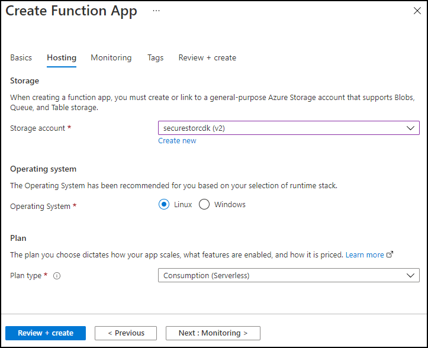

---
lab:
  az204Title: 'Lab 07: Access resource secrets more securely across services'
  az020Title: 'Lab 07: Access resource secrets more securely across services'
  az204Module: 'Module 07: Implement secure cloud solutions'
  az020Module: 'Module 07: Implement secure cloud solutions'
ms.openlocfilehash: 4076ffe2afc66c9bfec1633fefe547a2fc713983
ms.sourcegitcommit: ddc44a8b5edc7ce2d93849bcab6c6a83dee1c99b
ms.translationtype: HT
ms.contentlocale: es-ES
ms.lasthandoff: 04/29/2022
ms.locfileid: "144404790"
---
# <a name="lab-07-access-resource-secrets-more-securely-across-services"></a>Laboratorio 07: Acceso a secretos de recursos de forma más segura entre servicios

## <a name="microsoft-azure-user-interface"></a>Interfaz de usuario de Microsoft Azure

Dada la naturaleza dinámica de las herramientas en la nube de Microsoft, puede experimentar cambios en la interfaz de usuario de Azure que se producen después del desarrollo de este contenido de entrenamiento. Como resultado, es posible que las instrucciones y los pasos del laboratorio no se alineen correctamente.

Microsoft actualiza este curso de entrenamiento cuando la comunidad aporta los cambios necesarios a nuestra atención. Sin embargo, dado que las actualizaciones en la nube se producen con frecuencia, es posible que se produzcan cambios en la interfaz de usuario antes de que se actualice este contenido de entrenamiento. **Si esto ocurre, adáptese a los cambios y, a continuación, trabaje con ellos en los laboratorios según sea necesario.**

## <a name="instructions"></a>Instructions

### <a name="before-you-start"></a>Antes de comenzar

#### <a name="sign-in-to-the-lab-environment"></a>Inicio de sesión en el entorno de laboratorio

Inicie sesión en la máquina virtual (VM) de Windows 10 con las credenciales siguientes:

- Nombre de usuario: **Admin**
- Contraseña: **Pa55w.rd**.

> **Nota**: El instructor le proporcionará instrucciones para conectarse al entorno de laboratorio virtual.

#### <a name="review-the-installed-applications"></a>Revisión de las aplicaciones instaladas

Busque la barra de tareas en el escritorio de Windows 10. La barra de tareas contiene los iconos de las aplicaciones que usará en este laboratorio, entre los que se incluyen:

- Microsoft Edge
- Explorador de archivos
- Terminal Windows
- Visual Studio Code

## <a name="architecture-diagram"></a>Diagrama de la arquitectura


### <a name="exercise-1-create-azure-resources"></a>Ejercicio 1: Creación de recursos de Azure

#### <a name="task-1-open-the-azure-portal"></a>Tarea 1: Apertura de Azure Portal

1. En la barra de tareas, seleccione el icono de **Microsoft Edge**.

1. En la ventana del explorador abierto, vaya a Azure Portal (<https://portal.azure.com>) y, a continuación, inicie sesión con la cuenta que va a usar para este laboratorio.

    > **Nota**: Si es la primera vez que inicia sesión en Azure Portal, se le ofrecerá un paseo por el portal. Seleccione **Introducción** para omitir el paseo y empezar a usar el portal.

#### <a name="task-2-create-a-storage-account"></a>Tarea 2: Creación de una cuenta de almacenamiento

1. En Azure Portal, use el cuadro de texto **Buscar recursos, servicios y documentos** para buscar **Cuentas de almacenamiento** y, a continuación, en la lista de resultados, seleccione **Cuentas de almacenamiento**.

1. En la hoja **Cuentas de almacenamiento**, seleccione **+ Crear**.

1. En la hoja **Crear una cuenta de almacenamiento**, en la pestaña **Aspectos básicos**, realice las siguientes acciones y seleccione **Revisar y crear**:

   | Configuración | Acción |
   | --- | --- |
   | Lista desplegable de **Suscripción**   | Conserve los valores predeterminados |
   | Sección **Grupo de recursos**        | Seleccione **Crear nuevo**, escriba **ConfidentialStack** y seleccione **Aceptar** |
   | Cuadro de texto **Nombre de la cuenta de almacenamiento** | Escriba **securestor** _[sunombre]_ |
   | Lista desplegable de **región**         | Seleccione **(EE.UU.) Este de EE. UU.** |
   | Sección **Rendimiento**           | Seleccione la opción **Estándar** |
   | Lista desplegable de **Redundancia**     | Seleccione **Almacenamiento con redundancia local (LRS)** |

   En la captura de pantalla siguiente, se muestran los valores configurados en la hoja **Crear una cuenta de almacenamiento**.

   

1. En la pestaña **Revisar y crear**, revise las opciones que seleccionó durante los pasos anteriores.

1. Seleccione **Crear** para crear la cuenta de almacenamiento mediante la configuración especificada.

    > **Nota**: Espere a que se complete la tarea de creación antes de continuar con este laboratorio.

1. En la hoja **Información general sobre la implementación**, seleccione **Ir al recurso**.

1. En la hoja **Cuenta de almacenamiento**, en la sección **Seguridad y redes**, seleccione el vínculo **Claves de acceso**.

1. En la sección **Claves de acceso**, seleccione **Mostrar claves**.

1. Seleccione alguna de las claves y registre el valor en cualquiera de los cuadros **Cadena de conexión**. Usará este valor más adelante en este laboratorio.

    > **Nota**: No importa la cadena de conexión que elija. Son intercambiables.

#### <a name="task-3-create-an-azure-key-vault"></a>Tarea 3: Creación de una instancia de Azure Key Vault

1. En Azure Portal, use el cuadro de texto **Buscar recursos, servicios y documentos** para buscar **Almacenes de claves** y, a continuación, en la lista de resultados, seleccione **Almacenes de claves**.

1. En la hoja **Almacenes de claves**, seleccione **Crear**.

1.  En la hoja **Crear almacén de claves**, en la pestaña **Aspectos básicos**, realice las siguientes acciones y seleccione **Revisar y crear**:

    | Configuración                           | Acción                                    |
    | --------------------------------- | ----------------------------------------- |
    | Lista desplegable de **Suscripción**   | Conserve los valores predeterminados.                 |
    | Lista desplegable del **grupo de recursos** | Seleccione **ConfidentialStack** en la lista. |
    | Cuadro de texto del **Nombre del almacén de claves**       | Escriba **securevault** _[yourname]_ .        |
    | Lista desplegable de **Región**         | Seleccione **Este de EE. UU**.                       |
    | Lista desplegable de **planes de tarifa**   | Seleccione **Estándar**.                      |

    En la captura de pantalla siguiente, se muestran los valores configurados en la hoja **Crear almacén de claves**.

    

1. En la pestaña **Revisar y crear**, revise las opciones que seleccionó durante los pasos anteriores.

1. Seleccione **Crear** para crear el almacén de claves mediante la configuración especificada.

    > **Nota**: Espere a que se complete la tarea de creación antes de continuar con este laboratorio.

#### <a name="task-4-create-a-function-app"></a>Tarea 4: Creación de una aplicación de funciones

1. En Azure Portal, use el cuadro de texto **Buscar recursos, servicios y documentos** para buscar la **Aplicación de funciones** y, a continuación, en la lista de resultados, seleccione **Aplicación de funciones**.

1. En la hoja **Aplicación de funciones**, seleccione **Crear**.

1. En la hoja **Crear aplicación de funciones**, en la pestaña **Aspectos básicos**, realice las siguientes acciones y, a continuación, seleccione **Siguiente: Hosting**:

    | Configuración                           | Acción                            |
    | --------------------------------- | --------------------------------- |
    | Lista desplegable de **Suscripción**   | Conserve los valores predeterminados         |
    | Lista desplegable del **grupo de recursos** | Seleccione **ConfidentialStack**     |
    | Cuadro de texto del **nombre de la aplicación de funciones**    | Escriba **securefunc** _[sunombre]_ |
    | Sección **Publicar**               | Seleccione **Código**. |
    | Lista desplegable de la **pila en tiempo de ejecución**  | Seleccione **.NET** |
    | Lista desplegable de **Versión**        | Seleccione **3.1** |
    | Lista desplegable de **Región**         | Seleccione la región **Este de EE. UU.** |

    En la captura de pantalla siguiente, se muestran los valores configurados en la hoja **Crear aplicación de funciones**.

    

1. En la pestaña **Hosting**, realice las siguientes acciones y, a continuación, seleccione **Revisar y crear**:

    | Configuración | Acción |
    | --- | --- |
    | Lista desplegable de **cuenta de almacenamiento** | Seleccione la cuenta de almacenamiento **securestor** _[sunombre]_ |
    | Sección del **sistema operativo**       | Seleccione **Linux**. |
    | Lista desplegable del **Tipo de plan**       | Seleccione **Consumo (sin servidor)** |

    En la captura de pantalla siguiente, se muestran los valores configurados en la pestaña **Hosting** en la hoja **Crear aplicación de funciones**.

    

1. En la pestaña **Revisar y crear**, revise las opciones que seleccionó durante los pasos anteriores.

1. Seleccione **Crear** para crear la aplicación de funciones mediante la configuración especificada.

    > **Nota**: Espere a que se complete la tarea de creación antes de continuar con este laboratorio.

#### <a name="review"></a>Revisar

En este ejercicio, ha creado todos los recursos que usará en este laboratorio.

### <a name="exercise-2-configure-secrets-and-identities"></a>Ejercicio 2: Configuración de secretos e identidades

#### <a name="task-1-configure-a-system-assigned-managed-service-identity"></a>Tarea 1: Configuración de una identidad de servicio administrada asignada por el sistema

1. En el panel de navegación de Azure Portal, seleccione el vínculo **Grupos de recursos**.

1. En la hoja **Grupos de recursos**, seleccione el grupo de recursos **ConfidentialStack**.

1. En la hoja **ConfidentialStack**, seleccione la aplicación de funciones **securefunc** _[yourname]_ .

    > **Nota**: Habrá dos recursos, una aplicación de funciones y un recurso de Application Insights, con el mismo nombre. Asegúrese de seleccionar el recurso de la aplicación de funciones.

1. En la hoja **Aplicación de funciones**, seleccione la opción **Identidad** en la sección **Configuración**.

1. En el panel **Identidad**, en la pestaña **Asignado por el sistema**, establezca **Estado** en **Activado** y, a continuación, seleccione **Guardar**.

1. Seleccione **Sí** para confirmar la configuración.

    > **Nota**: Espere a que se cree la identidad administrada asignada por el sistema antes de avanzar con este laboratorio.

#### <a name="task-2-create-a-key-vault-secret"></a>Tarea 2: Creación de un secreto de almacén de claves

1. En el **panel de navegación** de Azure Portal, seleccione el vínculo **Grupos de recursos**.

1. En la hoja **Grupos de recursos**, seleccione el grupo de recursos **ConfidentialStack**.

1. En la hoja **ConfidentialStack**, seleccione el almacén de claves **securevault** _[yourname]_ .

1. En la hoja **Key Vault**, seleccione el vínculo **Secretos** en la sección **Configuración**.

1. En el panel **Secretos**, seleccione **+ Generar o importar**.

1. En la hoja **Crear un secreto**, realice las siguientes acciones y, a continuación, seleccione **Crear**:

    | Configuración | Acción |
    | --- |  --- |
    | Lista desplegable de **opciones de carga** | Seleccione **Manual**. |
    | Cuadro de texto de **nombre**       | Escriba **storagecredentials** |
    | Cuadro de texto **Valor**       | Escriba la cadena de conexión de la cuenta de almacenamiento que registró anteriormente en este laboratorio.               |
    | Cuadro de texto **Tipo de contenido** | déjelo en blanco. |
    | Casilla **Establecer fecha de activación** | No activado. |
    | Casilla **Establecer fecha de expiración** | No activado. |
    | Opción **Activado** | Seleccione **Sí**. |

    En la captura de pantalla siguiente, se muestran los valores configurados en la hoja **Crear un secreto**.

    

    > **Nota**: Espere a que se cree el secreto antes de continuar con este laboratorio.

1. Vuelva al panel **Secretos** y seleccione el elemento **storagecredentials** de la lista.

1. En el panel **Versiones**, seleccione la versión más reciente del secreto **storagecredentials**.

1. En el panel **Versión del secreto**, realice las siguientes acciones:

    1. Seleccione **Mostrar valor del secreto** para ver el valor asignado al secreto.

    1. Registre el valor del cuadro de texto **Identificador secreto** porque lo usará más adelante en el laboratorio.

    > **Nota**: Está registrando el valor del cuadro de texto **Identificador secreto,** no el cuadro de texto **Valor del secreto**.

#### <a name="task-3-configure-a-key-vault-access-policy"></a>Tarea 3: Configuración de una directiva de acceso de Key Vault

1. En el panel de navegación de Azure Portal, seleccione el vínculo **Grupos de recursos**.

1. En la hoja **Grupos de recursos**, seleccione el grupo de recursos **ConfidentialStack**.

1. En la hoja **ConfidentialStack**, seleccione el almacén de claves **securevault[yourname]** .

1. En la hoja **Key Vault**, seleccione el vínculo **Directivas de acceso** en la sección **Configuración**.

1. En el panel **Directivas de acceso**, seleccione **Agregar directiva de acceso**.

1. En la hoja **Agregar directiva de acceso**, realice las siguientes acciones y, a continuación, seleccione **Agregar**:

    | Configuración | Acción |
    | --- | --- |
    | Lista desplegable **Configurar a partir de una plantilla** | Déjelo en blanco. |
    | Lista desplegable de **permisos de clave** | 0 servicios seleccionados |
    | Lista desplegable de **permisos de secreto** | Seleccione el permiso **GET** |
    | Lista desplegable de **permisos de certificado** | 0 servicios seleccionados |
    | Vínculo **Seleccionar entidad de seguridad** | Busque y, a continuación, seleccione la entidad de servicio denominada **securefunc** _[yourname]_ . La identidad administrada asignada por el sistema que creó anteriormente en este laboratorio tendrá el mismo nombre que el recurso de Azure Functions. |
    | Vínculo **Aplicación autorizada** | Ninguno seleccionado |

    En la captura de pantalla siguiente, se muestran los valores configurados en la hoja **Agregar directiva de acceso**.

    

1. En el panel **Directivas de acceso**, seleccione **Guardar**.

    > **Nota**: Espere a que se guarden los cambios en las directivas de acceso antes de continuar con este laboratorio.

#### <a name="task-4-create-a-key-vault-derived-application-setting"></a>Tarea 4: Creación de una configuración de la aplicación derivada de Key Vault

1. En el panel de navegación de Azure Portal, seleccione el vínculo **Grupos de recursos**.

1. En la hoja **Grupos de recursos**, seleccione el grupo de recursos **ConfidentialStack**.

1. En la hoja **ConfidentialStack**, seleccione la aplicación de funciones **securefunc[yourname]** .

1. En la hoja **Aplicación de funciones**, seleccione la opción **Configuración** en la sección **Configuración**.

1. En el panel **Configuración**, en la pestaña **Configuración de la aplicación**, seleccione **Nueva configuración de la aplicación**.

1. En la ventana emergente **Agregar o editar configuración de la aplicación**, en el cuadro de texto **Nombre**, escriba **StorageConnectionString**.

1. En el cuadro de texto **Valor**, construya un valor mediante la sintaxis siguiente: ``@Microsoft.KeyVault(SecretUri=*Secret Identifier*)``.

    > **Nota**: Deberá crear una referencia al **_identificador secreto_** mediante la sintaxis anterior. Por ejemplo, si el identificador del secreto es `https://securevaultstudent.vault.azure.net/secrets/storagecredentials/17b41386df3e4191b92f089f5efb4cbf`, el valor sería `@Microsoft.KeyVault(SecretUri=https://securevaultstudent.vault.azure.net/secrets/storagecredentials/17b41386df3e4191b92f089f5efb4cbf)`.

1. Deje la casilla **configuración de la ranura de implementación** establecida en su valor predeterminado (no seleccionado) y, a continuación, seleccione **Aceptar** para cerrar la ventana emergente y volver a la sección **Configuración**.

1. Seleccione **Guardar** para guardar la configuración y, a continuación, en el cuadro de diálogo emergente **Guardar cambios**, seleccione **Continuar**.

    > **Nota**: Espere a que se guarde la configuración de la aplicación antes de continuar con el laboratorio.

#### <a name="review"></a>Revisar

En este ejercicio, ha creado una identidad de servicio administrada asignada por el sistema para la aplicación de funciones y, a continuación, ha concedido a esa identidad los permisos adecuados para obtener el valor de un secreto en el almacén de claves. Por último, ha creado un secreto al que ha hecho referencia dentro de las opciones de configuración de la aplicación de funciones.

### <a name="exercise-3-build-an-azure-functions-app"></a>Ejercicio 3: Compilación de una aplicación de Azure Functions

#### <a name="task-1-initialize-a-function-project"></a>Tarea 1: Inicialización de un proyecto de función

1. En la barra de tareas, seleccione el icono **Terminal Windows**.

1. Ejecute el siguiente comando para cambiar el directorio actual al directorio vacío **Allfiles (F):\\Allfiles\\Labs\\07\\Starter\\func**:

    ```powershell
    cd F:\Allfiles\Labs\07\Starter\func
    ```

    > **Nota**: En el Explorador de Windows, quite el atributo de solo lectura del archivo F:\Allfiles\Labs\07\Starter\func\.gitignore.

1. Ejecute el siguiente comando para usar **Azure Functions Core Tools** para crear un nuevo proyecto de Functions local en el directorio actual mediante el entorno de ejecución **dotnet**:

    ```powershell
    func init --worker-runtime dotnet --force
    ```

    > **Nota**: Puede revisar la documentación para [crear un proyecto][azure-functions-core-tools-new-project] mediante **Azure Functions Core Tools**.

1. Ejecute el siguiente comando para **compilar** el proyecto de .NET Core 3.1:

    ```powershell
    dotnet build
    ```

#### <a name="task-2-create-an-http-triggered-function"></a>Tarea 2: Creación de una función desencadenada por HTTP

1. Ejecute el siguiente comando para usar **Azure Functions Core Tools** para crear una nueva función denominada **FileParser** mediante la plantilla de **desencadenador HTTP**:

    ```powershell
    func new --template "HTTP trigger" --name "FileParser"
    ```

    > **Nota**: Puede revisar la documentación para [crear una nueva función][azure-functions-core-tools-new-function] mediante **Azure Functions Core Tools**.

1. Cierre la aplicación que ejecuta **Terminal Windows** actualmente.

#### <a name="task-3-configure-and-read-an-application-setting"></a>Tarea 3: Configuración y lectura de una configuración de la aplicación

1. En la pantalla **Inicio**, seleccione el icono **Visual Studio Code**.

1. En el menú **Archivo**, seleccione **Abrir carpeta**.

1. En la ventana **Explorador de archivos** que se abre, vaya a **Allfiles (F):\\Allfiles\\Labs\\07\\Starter\\func** y, a continuación, seleccione **Seleccionar carpeta**.

1. En el panel **Explorador** de la ventana **Visual Studio Code**, abra el archivo **local.settings.json**.

1. Observe el valor actual del objeto **Valores**:

    ```json
    "Values": {
        "AzureWebJobsStorage": "UseDevelopmentStorage=true",
        "FUNCTIONS_WORKER_RUNTIME": "dotnet"
    }
    ```

1. Actualice el valor del objeto **Values** agregando una nueva configuración denominada **StorageConnectionString** y, a continuación, asignándole un valor de cadena de **[TEST VALUE]** :

    ```json
    "Values": {
        "AzureWebJobsStorage": "UseDevelopmentStorage=true",
        "FUNCTIONS_WORKER_RUNTIME": "dotnet",
        "StorageConnectionString": "[TEST VALUE]"
    }
    ```

1. Ahora el archivo **local.settings.json** debe incluir:

    ```json
    {
        "IsEncrypted": false,
        "Values": {
            "AzureWebJobsStorage": "UseDevelopmentStorage=true",
            "FUNCTIONS_WORKER_RUNTIME": "dotnet",
            "StorageConnectionString": "[TEST VALUE]"
        }
    }
    ```

1. Seleccione **Guardar** para guardar los cambios en el archivo **local.settings.json**.

1. En el panel **Explorador** de la ventana **Visual Studio Code**, abra el archivo **FileParser.cs**.

1. En el editor de código, observe la implementación de ejemplo:

    ```csharp
    using System;
    using System.IO;
    using System.Threading.Tasks;
    using Microsoft.AspNetCore.Mvc;
    using Microsoft.Azure.WebJobs;
    using Microsoft.Azure.WebJobs.Extensions.Http;
    using Microsoft.AspNetCore.Http;
    using Microsoft.Extensions.Logging;
    using Newtonsoft.Json;
    namespace func
    {
        public static class FileParser
        {
            [FunctionName("FileParser")]
            public static async Task<IActionResult> Run(
                [HttpTrigger(AuthorizationLevel.Function, "get", "post", Route = null)] HttpRequest req,
                ILogger log)
            {
                log.LogInformation("C# HTTP trigger function processed a request.");
                string name = req.Query["name"];
                string requestBody = await new StreamReader(req.Body).ReadToEndAsync();
                dynamic data = JsonConvert.DeserializeObject(requestBody);
                name = name ?? data?.name;
                string responseMessage = string.IsNullOrEmpty(name)
                    ? "This HTTP triggered function executed successfully. Pass a name in the query string or in the request body for a personalized response."
                    : $"Hello, {name}. This HTTP triggered function executed successfully.";
                return new OkObjectResult(responseMessage);
            }
        }
    }
    ```

1. Elimine todo el contenido del archivo **FileParser.cs**.

1. Agregue las siguientes líneas de código para agregar **directivas using** para los espacios de nombres **Microsoft.AspNetCore.Mvc**, **Microsoft.Azure.WebJobs**, **Microsoft.AspNetCore.Http**, **System** y **System.Threading.Tasks**:

    ```csharp
    using Microsoft.AspNetCore.Mvc;
    using Microsoft.Azure.WebJobs;
    using Microsoft.AspNetCore.Http;
    using System;
    using System.Threading.Tasks;
    ```

1. Cree una nueva clase **estática pública** denominada **FileParser**:

    ```csharp
    public static class FileParser
    { }
    ```

1. Observe de nuevo el archivo **FileParser.cs**, que ahora debe incluir:

    ```csharp
    using Microsoft.AspNetCore.Mvc;
    using Microsoft.Azure.WebJobs;
    using Microsoft.AspNetCore.Http;
    using System;
    using System.Threading.Tasks;
    public static class FileParser
    { }
    ```

1. Dentro de la clase **FileParser,** agregue el siguiente bloque de código para crear un nuevo método **estático público** *asincrónico* denominado **Run**. Este método devuelve una variable de tipo **Task \<IActionResult\>** y también toma una variable de tipo **HttpRequest** denominada *request*:

    ```csharp
    public static async Task<IActionResult> Run(
        HttpRequest request)
    { }
    ```

1. Agregue el código siguiente para anexar un atributo al método **Run** de tipo **FunctionNameAttribute** que tiene su parámetro **name** establecido en un valor de **FileParser**:

    ```csharp
    [FunctionName("FileParser")]
    public static async Task<IActionResult> Run(
        HttpRequest request)
    { }
    ```

1. Agregue el código siguiente para anexar un atributo al parámetro **request** de tipo **HttpTriggerAttribute** que tiene su matriz de parámetros de **métodos** establecida en un valor único de **GET**:

    ```csharp
    [FunctionName("FileParser")]
    public static async Task<IActionResult> Run(
        [HttpTrigger("GET")] HttpRequest request)
    { }
    ```

1. Observe de nuevo el archivo **FileParser.cs**, que ahora debe incluir:

    ```csharp
    using Microsoft.AspNetCore.Mvc;
    using Microsoft.Azure.WebJobs;
    using Microsoft.AspNetCore.Http;
    using System;
    using System.Threading.Tasks;
    public static class FileParser
    {
        [FunctionName("FileParser")]
        public static async Task<IActionResult> Run(
            [HttpTrigger("GET")] HttpRequest request)
        { }
    }
    ```

1. En el método **Run**, escriba la siguiente línea de código para recuperar el valor de la configuración de la aplicación **StorageConnectionString** mediante el método **Environment.GetEnvironmentVariable** y almacenar el resultado en una variable de **cadena** denominada **connectionString**:

    ```csharp
    string connectionString = Environment.GetEnvironmentVariable("StorageConnectionString");
    ```

1. Escriba la siguiente línea de código para devolver el valor de la variable **connectionString** como respuesta HTTP:

    ```csharp
    return new OkObjectResult(connectionString);
    ```

1. Observe de nuevo el archivo **FileParser.cs**, que ahora debe incluir:

    ```csharp
    using Microsoft.AspNetCore.Mvc;
    using Microsoft.Azure.WebJobs;
    using Microsoft.AspNetCore.Http;
    using System;
    using System.Threading.Tasks;
    public static class FileParser
    {
        [FunctionName("FileParser")]
        public static async Task<IActionResult> Run(
            [HttpTrigger("GET")] HttpRequest request)
        {
            string connectionString = Environment.GetEnvironmentVariable("StorageConnectionString");
            return new OkObjectResult(connectionString);
        }
    }
    ```

1. Seleccione **Guardar** para guardar los cambios en el archivo **FileParser.cs**.

#### <a name="task-4-validate-the-local-function"></a>Tarea 4: Validación de la función local

1. En la barra de tareas, seleccione el icono **Terminal Windows**.

1. Ejecute el siguiente comando para cambiar el directorio actual al directorio vacío **Allfiles (F):\\Allfiles\\Labs\\07\\Starter\\func**:

    ```powershell
    cd F:\Allfiles\Labs\07\Starter\func
    ```

1. Ejecute el siguiente comando para ejecutar el proyecto de la aplicación de funciones:

    ```powershell
    func start --build
    ```

    > **Nota**: Puede revisar la documentación para [iniciar el proyecto de la aplicación de funciones localmente][azure-functions-core-tools-start-function] mediante **Azure Functions Core Tools**.

1. En la barra de tareas, vuelva a seleccionar el icono **Terminal Windows** para abrir una nueva instancia de la aplicación **Terminal Windows**. Ejecute el siguiente comando para cambiar el directorio actual al directorio vacío **Allfiles (F):\\Allfiles\\Labs\\07\\Starter\\func**:

    ```powershell
    cd F:\Allfiles\Labs\07\Starter\func
    ```
    
1. Cuando reciba el símbolo del sistema abierto, ejecute el siguiente comando para iniciar la herramienta **httprepl**, estableciendo el identificador uniforme de recursos (URI) base en ``http://localhost:7071``:

    ```powershell
    httprepl http://localhost:7071
    ```

    > **Nota**: La herramienta **httprepl** muestra un mensaje de error. Este mensaje se produce porque la herramienta está buscando un archivo de definición de Swagger que se usará para atravesar la API. Dado que el proyecto de la función no genera un archivo de definición de Swagger, deberá recorrer la API manualmente.
1. Cuando reciba el símbolo del sistema de la herramienta, ejecute el siguiente comando para ir al directorio de **api** relativo:

    ```powershell
    cd api
    ```

1. Ejecute el siguiente comando para ir al directorio **fileparser** relativo:

    ```powershell
    cd fileparser
    ```

1. Ejecute el comando siguiente para ejecutar el comando **get**:

    ```powershell
    get
    ```

1. Observe el valor **[TEST VALUE]** de **StorageConnectionString** que se devuelve como resultado de la solicitud HTTP:

    ```powershell
    HTTP/1.1 200 OK
    Content-Type: text/plain; charset=utf-8
    Date: Tue, 01 Sep 2020 23:35:39 GMT
    Server: Kestrel
    Transfer-Encoding: chunked
    [TEST VALUE]
    ```

1. Ejecute el comando siguiente para salir de la herramienta **httprepl**:

    ```powershell
    exit
    ```

1. Cierre todas las instancias actualmente en ejecución de la aplicación **Terminal Windows**.

#### <a name="task-5-deploy-the-function-using-the-azure-functions-core-tools"></a>Tarea 5: Implementación de la función mediante Azure Functions Core Tools

1. En la barra de tareas, seleccione el icono **Terminal Windows**.

1. Ejecute el siguiente comando para cambiar el directorio actual al directorio vacío **Allfiles (F):\\Allfiles\\Labs\\07\\Starter\\func**:

    ```powershell
    cd F:\Allfiles\Labs\07\Starter\func
    ```

1. Ejecute el siguiente comando para iniciar sesión en la interfaz de la línea de comandos (CLI) de Azure:

    ```powershell
    az login
    ```

1. En la ventana del explorador **Microsoft Edge**, escriba la dirección de correo electrónico y la contraseña de su cuenta Microsoft y, a continuación, seleccione **Iniciar sesión**.

1. Vuelva a la ventana de **Terminal Windows** abierta actualmente. Espere a que finalice el proceso de inicio de sesión.

1. Ejecute el siguiente comando para publicar el proyecto de la aplicación de funciones:

    ```powershell
    func azure functionapp publish <function-app-name>
    ```

    > **Nota**: Por ejemplo, si el **nombre de la aplicación de funciones** es **securefuncstudent**, el comando sería ``func azure functionapp publish securefuncstudent``. Puede revisar la documentación para [publicar el proyecto de la aplicación de funciones local][azure-functions-core-tools-publish-azure] mediante **Azure Functions Core Tools**.

1. Espere a que la implementación se finalice antes de avanzar con el laboratorio.

1. Cierre la aplicación que ejecuta **Terminal Windows** actualmente.

#### <a name="task-6-test-the-key-vault-derived-application-setting"></a>Tarea 6: Configuración de la aplicación derivada de Key Vault

1. En la barra de tareas, seleccione el icono **Microsoft Edge** y, a continuación, seleccione la pestaña que contiene Azure Portal (<https://portal.azure.com>).

1. En el panel de navegación de Azure Portal, seleccione el vínculo **Grupos de recursos**.

1. En la hoja **Grupos de recursos**, seleccione el grupo de recursos **ConfidentialStack**.

1. En la hoja **ConfidentialStack**, seleccione la aplicación de funciones **securefunc[yourname]** .

1. En la hoja de **Aplicación de funciones**, en la sección **Funciones**, seleccione la opción **Funciones**.

1. En el panel **Funciones**, seleccione la función **FileParser** existente.

1. En la hoja **Función**, seleccione la opción **Código y prueba** en la sección **Desarrollador**.

1. En el editor de funciones, seleccione **Probar o ejecutar**.

1. En el cuadro de diálogo emergente que se muestra, en la lista **método HTTP**, seleccione **GET**.

1. Seleccione **Ejecutar** para probar la función.

1. Observe los resultados de la serie de pruebas. El resultado debe ser la cadena de conexión de Azure Storage.

#### <a name="review"></a>Revisar

En este ejercicio, ha usado una identidad de servicio para leer el valor de un secreto almacenado en Key Vault y ha devuelto ese valor como resultado de una aplicación de funciones.

### <a name="exercise-4-access-azure-blob-storage-data"></a>Ejercicio 4: Acceso a datos de Azure Blob Storage

#### <a name="task-1-upload-a-sample-storage-blob"></a>Tarea 1: Carga de un blob de almacenamiento de ejemplo

1. En el panel de navegación de Azure Portal, seleccione el vínculo **Grupos de recursos**.

1. En la hoja **Grupos de recursos**, seleccione el grupo de recursos **ConfidentialStack**.

1. En la hoja **ConfidentialStack**, seleccione la cuenta de almacenamiento **securestor** _[yourname]_ .

1. En la hoja **Cuenta de almacenamiento**, en la sección **Almacenamiento de datos**, seleccione el vínculo **Contenedores**.

1. En la sección **Contenedores**, seleccione **+ Contenedor**.

1. En la ventana emergente **Nuevo contenedor**, realice las siguientes acciones y, a continuación, seleccione **Crear**:

    | Configuración | Acción |
    | --- | --- |
    | Cuadro de texto de **nombre** | Escriba **drop** |
    | Lista desplegable del **nivel de acceso público** | Seleccione **Blob (acceso de lectura anónimo solo para blobs)** . |

1. Vuelva a la sección **Contenedores** y, a continuación, seleccione el contenedor **drop** recién creado.

1. En la hoja **Contenedor**, seleccione **Cargar**.

1. En la ventana **Cargar blob**, realice las siguientes acciones y, a continuación, seleccione **Cargar**:

    | Configuración | Acción |
    | --- | --- |
    | Sección **Archivos** | Seleccione el icono **Carpeta**. |
    | Ventana **Explorador de archivos** | Vaya a **Allfiles (F):\\Allfiles\\Labs\\07\\Starter**, seleccione el archivo **records.json** y, a continuación, seleccione **Abrir**. |
    | Casilla **Sobrescribir si ya hay archivos** | Asegúrese de que esta casilla está activada. |

    > **Nota**: Espere a que se cargue el blob antes de continuar con este laboratorio.

1. Vuelva a la hoja **Contenedor** y seleccione el blob **records.json** en la lista de blobs.

1. En la hoja **Blob**, busque los metadatos del blob y copie la dirección URL del blob.

1. En la barra de tareas, active el menú contextual del icono **Microsoft Edge** y, a continuación, seleccione **Nueva ventana**.

1. En la nueva ventana del explorador, consulte la dirección URL que copió para el blob.

1. Ahora debería mostrarse el contenido de la notación de objetos JavaScript (JSON) del blob. Cierre la ventana del explorador con el contenido del JSON.

1. Vuelva a la ventana del explorador con Azure Portal y, a continuación, cierre la hoja **Blob**.

1. Vuelva a la hoja **Contenedor** y seleccione **Cambiar nivel de acceso**.

1. En la ventana emergente **Cambiar nivel de acceso**, realice las siguientes acciones:

    1. En la lista desplegable **Nivel de acceso público**, seleccione **Privado (sin acceso anónimo)** .

    1. Seleccione **Aceptar**.

1. En la barra de tareas, active el menú contextual del icono **Microsoft Edge** y, a continuación, seleccione **Nueva ventana**.

1. En la nueva ventana del explorador, consulte la dirección URL que copió para el blob.

1. Ahora debería mostrarse un mensaje de error que indica que no se encontró el recurso.

    > **Nota**: Si no se muestra el mensaje de error, es posible que el explorador haya almacenado en caché el archivo. Seleccione CTRL+F5 para actualizar la página hasta que se muestre el mensaje de error.

#### <a name="task-2-pull-and-configure-the-azure-sdk-for-net"></a>Tarea 2: Extracción y configuración del SDK de Azure para .NET

1. En la barra de tareas, seleccione el icono **Terminal Windows**.

1. Ejecute el siguiente comando para cambiar el directorio actual al directorio vacío **Allfiles (F):\\Allfiles\\Labs\\07\\Starter\\func**:

    ```powershell
    cd F:\Allfiles\Labs\07\Starter\func
    ```

1. Ejecute el siguiente comando para agregar la versión **12.6.0** del paquete **Azure.Storage.Blobs** de NuGet:

    ```powershell
    dotnet add package Azure.Storage.Blobs --version 12.6.0
    ```

    > **Nota**: el paquete de NuGet [Azure.Storage.Blobs](https://www.nuget.org/packages/Azure.Storage.Blobs/12.6.0) hace referencia al subconjunto del SDK de Azure para .NET necesario para escribir código para Azure Blob Storage.

1. Cierre la aplicación que ejecuta **Terminal Windows** actualmente.

1. En la pantalla **Inicio**, seleccione el icono **Visual Studio Code**.

1. En el menú **Archivo**, seleccione **Abrir carpeta**.

1. En la ventana **Explorador de archivos** que se abre, vaya a **Allfiles (F):\\Allfiles\\Labs\\07\\Starter\\func** y, a continuación, seleccione **Seleccionar carpeta**.

1. En el panel **Explorador** de la ventana **Visual Studio Code**, abra el archivo **FileParser.cs**.

1. Agregue una **directiva using** para el espacio de nombres **Azure.Storage.Blobs**:

    ```csharp
    using Azure.Storage.Blobs;
    ```

1. Observe el archivo **FileParser.cs**, que ahora debe incluir:

    ```csharp
    using Azure.Storage.Blobs;
    using Microsoft.AspNetCore.Mvc;
    using Microsoft.Azure.WebJobs;
    using Microsoft.AspNetCore.Http;
    using System;
    using System.Threading.Tasks;
    public static class FileParser
    {
        [FunctionName("FileParser")]
        public static async Task<IActionResult> Run(
            [HttpTrigger("GET")] HttpRequest request)
        {
            string connectionString = Environment.GetEnvironmentVariable("StorageConnectionString");
            return new OkObjectResult(connectionString);
        }
    }
    ```

#### <a name="task-3-write-azure-blob-storage-code-using-the-azure-sdk-for-net"></a>Tarea 3: Escritura de código de Azure Blob Storage mediante el SDK de Azure para .NET

1. En el método **Run** de la clase **FileParser**, elimine la siguiente línea de código:

    ```csharp
    return new OkObjectResult(connectionString);
    ```

1. Todavía dentro del método **Run**, agregue el siguiente bloque de código para crear una nueva instancia de la clase **BlobClient** pasando la variable *connectionString*, un valor de cadena ``"drop"`` y un valor de cadena ``"records.json"`` al constructor:

    ```csharp
    BlobClient blob = new BlobClient(connectionString, "drop", "records.json");
    ```

1. Todavía dentro del método **Run**, agregue el siguiente bloque de código para usar el método **BlobClient.DownloadAsync** para descargar el contenido del blob al que se hace referencia de forma asincrónica y, a continuación, almacene el resultado en una variable denominada *response*:

    ```csharp
    var response = await blob.DownloadAsync();
    ```

1. Todavía dentro del método **Run**, agregue el siguiente bloque de código para devolver el valor de los distintos contenidos almacenados en la variable de *contenido* mediante el constructor de clase **FileStreamResult**:

    ```csharp
    return new FileStreamResult(response?.Value?.Content, response?.Value?.ContentType);
    ```

1. Observe de nuevo el archivo **FileParser.cs**, que ahora debe incluir:

    ```csharp
    using Azure.Storage.Blobs;
    using Microsoft.AspNetCore.Mvc;
    using Microsoft.Azure.WebJobs;
    using Microsoft.AspNetCore.Http;
    using System;
    using System.Threading.Tasks;
    public static class FileParser
    {
        [FunctionName("FileParser")]
        public static async Task<IActionResult> Run(
            [HttpTrigger("GET")] HttpRequest request)
        {
            string connectionString = Environment.GetEnvironmentVariable("StorageConnectionString");
            BlobClient blob = new BlobClient(connectionString, "drop", "records.json");
            var response = await blob.DownloadAsync();
            return new FileStreamResult(response?.Value?.Content, response?.Value?.ContentType);
        }
    }
    ```

1. Seleccione **Guardar** para guardar los cambios en el archivo **FileParser.cs**.

#### <a name="task-4-deploy-and-validate-the-azure-functions-app"></a>Tarea 4: Implementación y validación de la aplicación de Azure Functions

1. En la barra de tareas, seleccione el icono **Terminal Windows**.

1. Ejecute el siguiente comando para cambiar el directorio actual al directorio vacío **Allfiles (F):\\Allfiles\\Labs\\07\\Starter\\func**:

    ```powershell
    cd F:\Allfiles\Labs\07\Starter\func
    ```

1. Ejecute el siguiente comando para iniciar sesión en la CLI de Azure:

    ```powershell
    az login
    ```
1. En la ventana del explorador **Microsoft Edge**, escriba la dirección de correo electrónico y la contraseña de su cuenta Microsoft y, a continuación, seleccione **Iniciar sesión**.

1. Vuelva a la ventana de **Terminal Windows** abierta actualmente. Espere a que finalice el proceso de inicio de sesión.

1. Ejecute el siguiente comando para volver a publicar el proyecto de la aplicación de funciones:

    ```powershell
    func azure functionapp publish <function-app-name>
    ```

    > **Nota**: Por ejemplo, si el **nombre de la aplicación de funciones** es **securefuncstudent**, el comando sería ``func azure functionapp publish securefuncstudent``. Puede revisar la documentación para [publicar el proyecto de la aplicación de funciones local][azure-functions-core-tools-publish-azure] mediante **Azure Functions Core Tools**.

1. Espere a que la implementación se finalice antes de avanzar con el laboratorio.

1. Cierre la aplicación que ejecuta **Terminal Windows** actualmente.

1. En la barra de tareas, seleccione el icono **Microsoft Edge** y, a continuación, vaya a Azure Portal (<https://portal.azure.com>).

1. En el panel de navegación de Azure Portal, seleccione el vínculo **Grupos de recursos**.

1. En la hoja **Grupos de recursos**, seleccione el grupo de recursos **ConfidentialStack**.

1. En la hoja **ConfidentialStack**, seleccione la aplicación de funciones **securefunc[yourname]** .

1. En la hoja de **App Service**, en la sección **Funciones**, seleccione la opción **Funciones**.

1. En el panel **Funciones**, seleccione la función **FileParser** existente.

1. En la hoja **Función**, seleccione la opción **Código y prueba** en la sección **Desarrollador**.

1. En el editor de funciones, seleccione **Probar o ejecutar**.

1. En el cuadro de diálogo emergente que se muestra, en la lista **método HTTP**, seleccione **GET**.

1. Seleccione **Ejecutar** para probar la función.

1. Observe los resultados de la serie de pruebas. La salida contendrá el contenido del blob **$/drop/records.json** almacenado en la cuenta de Azure Storage.

#### <a name="review"></a>Revisar

En este ejercicio, ha usado código C\# para acceder a una cuenta de almacenamiento y, a continuación, ha descargado el contenido de un blob.

### <a name="exercise-5-clean-up-your-subscription"></a>Ejercicio 5: Limpieza de la suscripción

#### <a name="task-1-open-azure-cloud-shell"></a>Tarea 1: Apertura de Azure Cloud Shell

1. En Azure Portal, seleccione el icono **Cloud Shell**, , para abrir una nueva sesión de Bash. Si el valor predeterminado de Cloud Shell es una sesión de PowerShell, seleccione **PowerShell** y, en el menú desplegable, seleccione **Bash**.

    > **Nota**: Si es la primera vez que inicia **Cloud Shell**, cuando se le pida que seleccione **Bash** o **PowerShell**, seleccione **PowerShell**. Si aparece el mensaje **No tiene ningún almacenamiento montado**, seleccione la suscripción que utiliza en este laboratorio y, luego, seleccione **Crear almacenamiento**.

#### <a name="task-2-delete-a-resource-group"></a>Tarea 2: Eliminación de un grupo de recursos

1. En el panel **Cloud Shell**, ejecute el comando siguiente para eliminar el grupo de recursos **ConfidentialStack**:

    ```bash
    az group delete --name ConfidentialStack --no-wait --yes
    ```

     > **Nota**: El comando se ejecuta de forma asincrónica (según determina el parámetro *--no-wait*). Aunque podrá ejecutar otro comando de la CLI de Azure inmediatamente después en la misma sesión de Bash, los grupos de recursos tardarán unos minutos en quitarse.

1. Cierre el panel de **Cloud Shell** en el portal.

#### <a name="task-3-close-the-active-application"></a>Tarea 3: Cierre de la aplicación activa

- Cierre la aplicación que ejecuta Microsoft Edge actualmente.

#### <a name="review"></a>Revisar

En este ejercicio, ha limpiado la suscripción mediante la eliminación de los grupos de recursos usados en este laboratorio.
