---
lab:
  az204Title: 'Lab 08: Create a multi-tier solution by using Azure services'
  az204Module: 'Module 08: Implement API Management'
---

# Laboratorio 08: Creación de una solución de niveles múltiples mediante los servicios de Azure

## Interfaz de usuario de Microsoft Azure

Dada la naturaleza dinámica de las herramientas en la nube de Microsoft, puede experimentar cambios en la interfaz de usuario de Azure que se producen después del desarrollo de este contenido de entrenamiento. Como resultado, es posible que las instrucciones y los pasos del laboratorio no se alineen correctamente.

Microsoft actualiza este curso de entrenamiento cuando la comunidad nos alerta de los cambios necesarios. Sin embargo, las actualizaciones en la nube se producen con frecuencia, por lo que es posible que se produzcan cambios en la interfaz de usuario antes de que se actualice este contenido de entrenamiento. **Si esto ocurre, adáptese a los cambios y, a continuación, trabaje con ellos en los laboratorios según sea necesario.**


## Instructions

### Antes de comenzar

#### Inicio de sesión al entorno de laboratorio

Inicie sesión en la máquina virtual (VM) de Windows 10 con las credenciales siguientes:
    
-   Nombre de usuario: **Admin**

-   Contraseña: **Pa55w.rd**.

> **Nota**: El instructor le proporcionará instrucciones para conectarse al entorno de laboratorio virtual.

#### Revisión de las aplicaciones instaladas

Busque la barra de tareas en el escritorio de Windows 10. La barra de tareas contiene los iconos de las aplicaciones que usará en este laboratorio:
    
-   Microsoft Edge

## Diagrama de la arquitectura

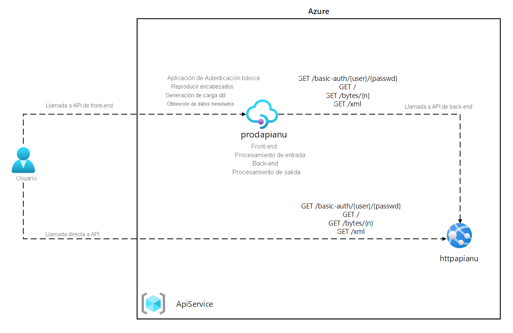

### Ejercicio 1: Creación de un recurso de Azure App Service mediante una imagen de contenedor de Docker

#### Tarea 1: Abra Azure Portal

1.  En la barra de tareas, seleccione el icono de **Microsoft Edge**.

1.  En la ventana del explorador que se abrirá, vaya a Azure Portal ([portal.azure.com](https://portal.azure.com)) y, a continuación, inicie sesión con la cuenta que va a usar para este laboratorio.

    > **Nota**: Si es la primera vez que inicia sesión en Azure Portal, se le ofrecerá un paseo por el portal. Seleccione **Introducción** para omitir el paseo y empezar a usar el portal.

#### Tarea 2: Creación de una aplicación web mediante el recurso de Azure App Service mediante una imagen de contenedor httpbin

1.  En Azure Portal, use el cuadro de texto **Buscar recursos, servicios y documentos** para buscar **App Services** y, a continuación, en la lista de resultados, seleccione **App Services**.

1.  En la hoja **App Services**, seleccione **+ Crear**.

1.  En la hoja **Crear aplicación web**, en la pestaña **Aspectos básicos**, realice las siguientes acciones:
    
    | Configuración | Acción |
    | -- | -- |
    | Lista desplegable de **Suscripción** | Conserve los valores predeterminados |
    | Sección **Grupo de recursos** | Seleccione **Crear nuevo**, escriba **ApiService** y seleccione **Aceptar**. |
    | Cuadro de texto de **nombre** | Escriba **httpapi** *[sunombre]* |
    | Sección **Publicar** | Seleccione **Contenedor de Docker** |
    | Sección del **sistema operativo** | Seleccione **Linux**. |
    | Lista desplegable de **Región** | Seleccione cualquier región de Azure en la que pueda implementar una aplicación web de Azure. |
    | Sección **Plan de Linux** | Seleccione **Crear nuevo**, escriba **ApiPlan** en el cuadro de texto **Nombre** y seleccione **Aceptar**. |
    | Sección **Plan de precios** | Seleccione **Cambiar tamaño,** en la hoja **Selector de especificaciones**, seleccione **Ver opciones adicionales**, haga clic en **S1** y, a continuación, en **Aplicar**. |

1.  Seleccione **Siguiente: Docker>** .

1.  En la pestaña **Docker**, realice las siguientes acciones y, a continuación, seleccione **Revisar y crear**:

    | Configuración | Acción |
    | -- | -- |
    | Lista desplegable de **opciones** | Seleccione **Contenedor único** |
    | Lista desplegable de **Origen de la imagen** | Seleccione **Docker Hub** |
    | Lista desplegable del **Tipo de acceso** | Seleccione **Público**. |
    | Cuadro de texto **Imagen y etiqueta** | Escriba **kennethreitz/httpbin:latest**. |

1.  En la pestaña **Revisar y crear**, revise las opciones que seleccionó durante los pasos anteriores.

1.  Seleccione **Crear** para crear la aplicación web mediante la configuración especificada.

    > **Nota**: Espere a que se complete la tarea de creación antes de continuar con este laboratorio.

#### Tarea 3: Prueba de la aplicación web httpbin

1.  En Azure Portal, use el cuadro de texto **Buscar recursos, servicios y documentos** para buscar **App Services** y, a continuación, en la lista de resultados, seleccione **App Services**.

1.  En la hoja **App Services,** seleccione la aplicación web recién creada.

1.  En la hoja que muestra las propiedades de la aplicación recién creada, seleccione **Examinar**.

1.  En la aplicación web, realice las siguientes acciones:

    a.  Seleccione **Formatos de respuesta**.

    b.  Seleccione **GET /html**.

    c.  Haga clic en **Probar**.

    En la captura de pantalla siguiente se muestra la sección **Probar** de la aplicación web.

    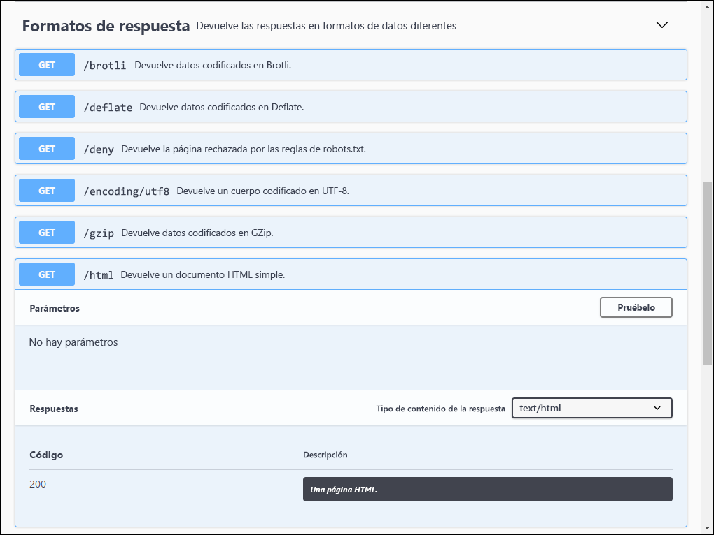

    d.  Seleccione **Ejecutar**.

    e.  Revise el valor de los cuadros de texto **Cuerpo de la respuesta** y **Encabezados de respuesta**.

    f.  Revise el valor del cuadro de texto **Dirección URL de la solicitud**.

1.  En la aplicación web, realice las siguientes acciones:

    a.  Seleccione **Datos dinámicos**.

    b.  Seleccione **GET /bytes/{n}**.

    c.  Haga clic en **Probar**.

    d.  En el cuadro de texto **n**, escriba **25**.

    e.  Seleccione **Execute**(Ejecutar).

    f.  Revise el valor de los cuadros de texto **Cuerpo de la respuesta** y **Encabezados de respuesta**.

    g.  Seleccione **Descargar archivo** y, una vez descargado el archivo, ábralo en el Bloc de notas, revise su contenido y, a continuación, cierre el archivo.

    > **Nota**: El archivo contiene una secuencia de bytes generados aleatoriamente.

    En la captura de pantalla siguiente se muestra la sección de datos dinámicos de la aplicación web.
  
    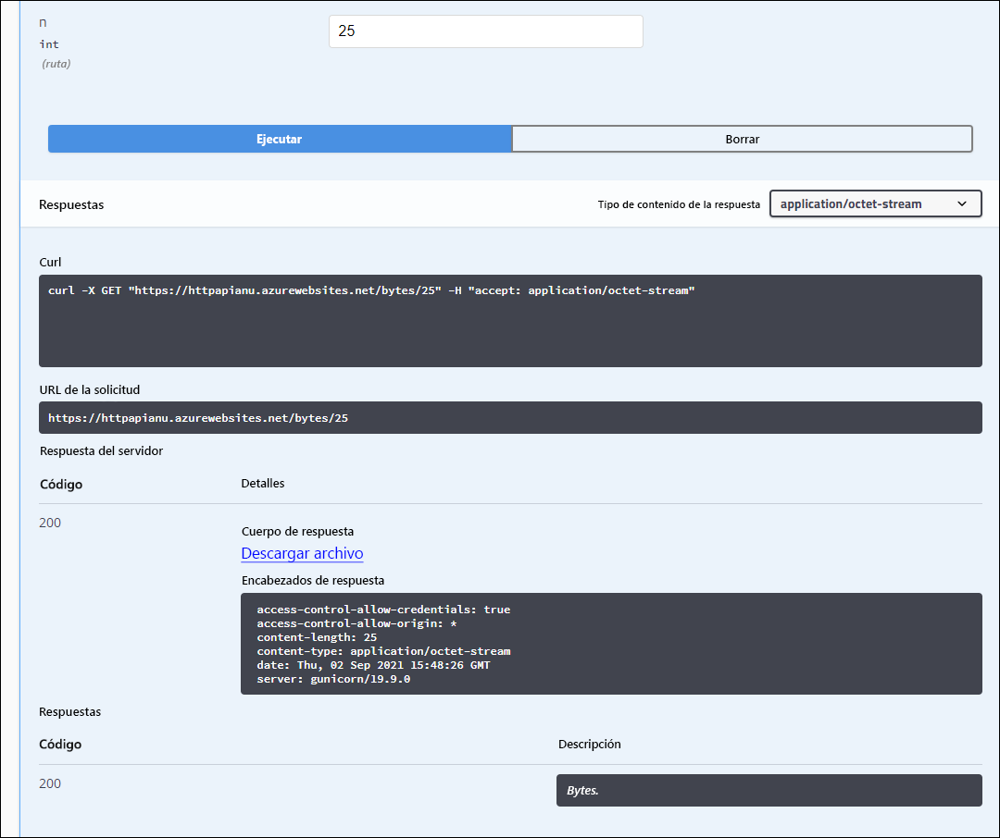

1.  En la aplicación web, realice las siguientes acciones:

    a.  Seleccione **Códigos de estado**.

    b.  Seleccione **GET /status/{codes}**.

    c.  Haga clic en **Probar**.

    d.  En el cuadro de texto **Códigos**, escriba **404**.

    e.  Seleccione **Execute**(Ejecutar).

    f.  Revise la **respuesta del servidor** y observe que incluye la entrada **Error: NO ENCONTRADO**.
     
1.  Cierre la ventana del explorador que muestra la aplicación web.

1.  Vuelva a la ventana del explorador que muestra la aplicación web**httpapi** _[su nombre]_.

1.  En la sección **Configuración**, seleccione el vínculo **Propiedades**.

1.  En la sección **Propiedades**, registre el valor del vínculo de **dirección URL**. Usará este valor más adelante en el laboratorio para enviar solicitudes a la API correspondiente.

#### Revisar

En este ejercicio, ha creado una nueva aplicación web de Azure mediante una imagen de contenedor procedente de Docker Hub.

### Ejercicio 2: Creación de un nivel de proxy de API mediante Azure API Management

#### Tarea 1: Creación de un recurso de API Management

1.  En Azure Portal, use el cuadro de texto **Buscar recursos, servicios y documentos** para buscar **servicios de API Management** y, a continuación, en la lista de resultados, seleccione **servicios de API Management**.

1.  En la hoja **Servicios de API Management**, seleccione **+ Crear**.

1.  En la hoja **Instalar puerta de enlace de API Management**, realice las siguientes acciones y, a continuación, seleccione **Revisar y crear**:

    
    | Configuración | Acción |
    | -- | -- |
    | Lista desplegable de **Suscripción** | Conserve los valores predeterminados. |
    | Sección **Grupo de recursos** | Seleccione el grupo **ApiService** que creó anteriormente en el laboratorio. |
    | Lista de **regiones** | Seleccione la misma región que eligió en el ejercicio anterior. |
    | Cuadro de texto **Nombre del recurso** | Escriba **proapi** *[su nombre]* . |
    | Cuadro de texto **Nombre de la organización** | Escriba **Contoso** |
    | Cuadro de texto **Correo electrónico del administrador** | Escriba `admin@contoso.com`. |
    | Lista desplegable de **planes de tarifa** | **Consumo (99,95 % del SLA)** |

    En la captura de pantalla siguiente se muestran los valores configurados de la hoja **Crear una instancia de API Management** de la aplicación web.
    
    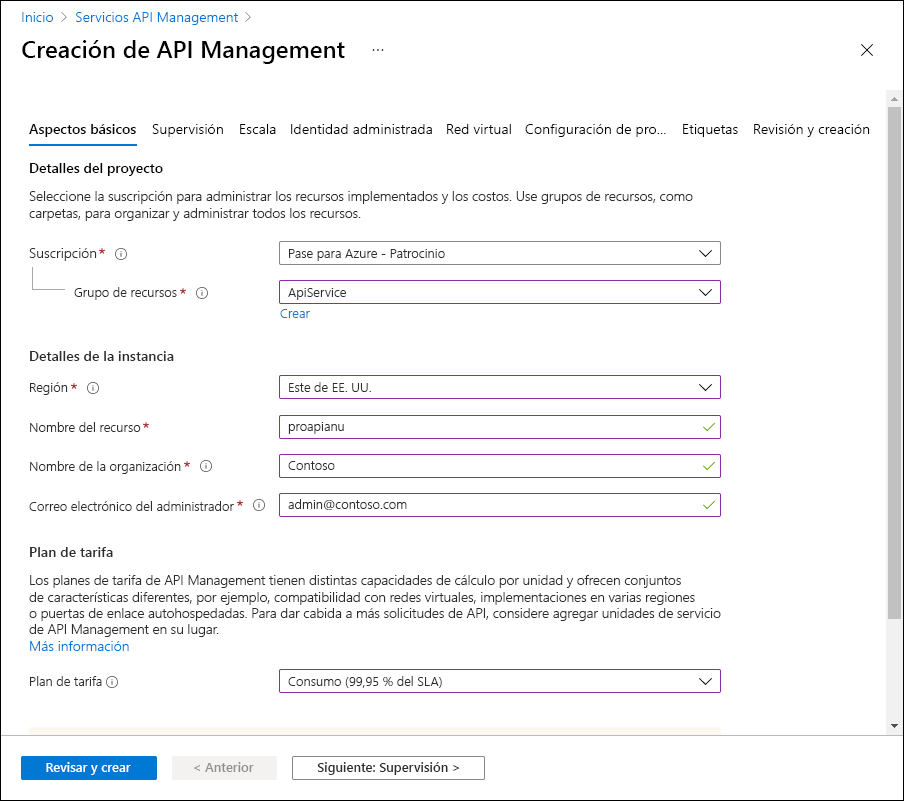

1.  En la pestaña **Revisar y crear**, revise la opción que especificó en el paso anterior y, a continuación, seleccione **Crear**.

    > **Nota**: Espere a que se complete la tarea de creación antes de continuar con este laboratorio.

1. En la hoja **Información general sobre la implementación**, seleccione **Ir al recurso**.

#### Tarea 2: Definición de una nueva API

1.  En la hoja del **servicio de API Management**,en la sección **API**, seleccione **API**.

1.  En la sección **Definir una nueva API**, seleccione **HTTP**.

1.  En la ventana **Creación de una API HTTP**, realice las siguientes acciones y, a continuación, seleccione **Crear**:
    
    | Configuración | Acción |
    | -- | -- |
    | Cuadro de texto **Nombre para mostrar** | Escriba **HTTPBin API** |
    | Cuadro de texto de **nombre** | Escriba **httpbin-api**. |
    | Cuadro de texto **Dirección URL del servicio web** | Escriba la dirección URL de la aplicación web que copió anteriormente en este laboratorio.                 **Nota**: Asegurarse de que la dirección URL comienza con el prefijo https:// |
    | Cuadro de texto **Sufijo de dirección URL de API** | Déjelo vacío. |
 
    En la captura de pantalla siguiente, se muestran los valores configurados de la ventana **Crear una API en blanco** de la aplicación web.

    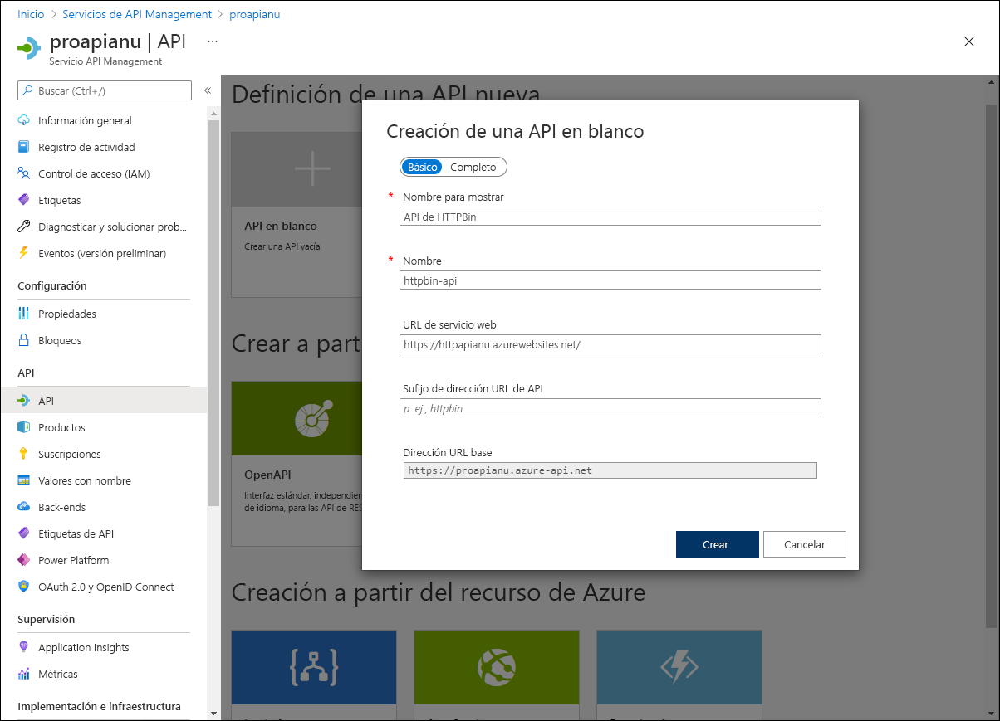

    > **Nota**: Espere a que la nueva API termine de crearse.

1.  En la pestaña **Diseño**, seleccione **+ Agregar operación**.

1.  En la sección **Agregar operación**, realice las siguientes acciones y, a continuación, seleccione **Guardar**:


    | Configuración | Acción |
    | -- | -- |
    | Cuadro de texto **Nombre para mostrar** | Escriba **Echo Headers** (Encabezados de eco). |
    | Cuadro de texto de **nombre** | Compruebe que su valor está establecido en **echo-headers**. |
    | Lista de **direcciones URL** | Seleccione **GET**. |
    | Cuadro de texto de la **dirección URL** | Escriba **/** |

    En la captura de pantalla siguiente se muestran los ajustes configurados de la sección **Agregar operación**.
    
    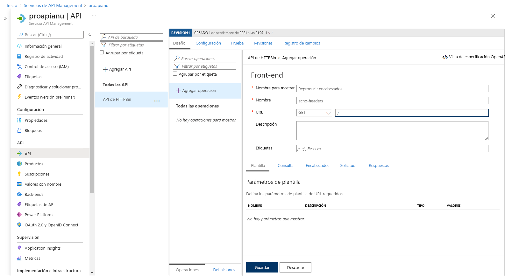

    
1.  De nuevo en la pestaña **Diseño**, en la lista de operaciones, seleccione **Encabezados de eco**.

1.  En la sección **Diseño**, en el icono **Procesamiento de entrada**, seleccione **+ Agregar directiva**.

1.  En la sección **Agregar directiva entrante**, seleccione el icono **Establecer encabezados**.

1.  En la sección **Establecer encabezados**, realice las siguientes acciones y, a continuación, seleccione **Guardar**:
    
    | Configuración | Acción |
    | -- | -- |
    | Cuadro de texto de **nombre**    | Escriba el **origen**. |
    | Cuadro de texto **Valor** | Seleccione la lista, **Agregar valor** y, a continuación, escriba **azure-api-mgmt**. |
    | Lista de **acciones** | Seleccione **anexar**. |

    En la captura de pantalla siguiente se muestran los ajustes configurados de la sección **Diseño**.

    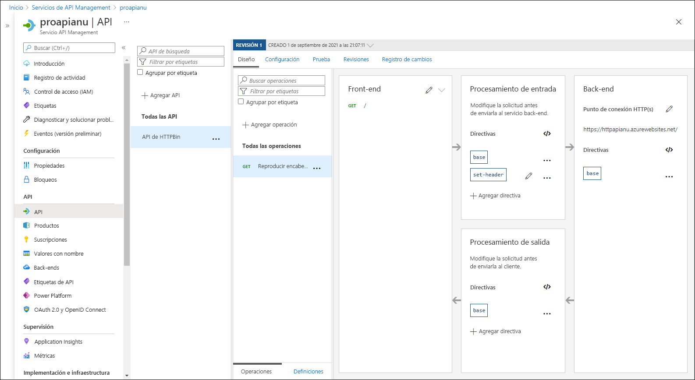

1.  De nuevo en la pestaña **Diseño**, en la lista de operaciones, seleccione **Encabezados de eco**.

1.  En la sección **Diseño** de los **Encabezados de eco**, en el icono **Back-end**, seleccione el icono con forma de lápiz.

1.  En la sección **Back-end**, realice las siguientes acciones y, a continuación, seleccione **Guardar**:

    | Configuración | Acción |
    | -- | -- |
    | Sección **Dirección URL del servicio** | Seleccione la casilla de **invalidación**. |
    | Cuadro de texto **Dirección URL del servicio** | Anexe el valor **/headers** a su valor actual. **Nota**: Por ejemplo, si el valor actual es `http://httpapi[yourname].azurewebsites.net`, el nuevo valor será `http://httpapi[yourname].azurewebsites.net/headers`. |
    
1.  De nuevo en la pestaña **Diseño**, en la lista de operaciones, seleccione **Encabezados de eco** y, a continuación. seleccione la pestaña **Prueba**.

1.  En la sección **Encabezados de eco**, seleccione **Enviar**.

    En la captura de pantalla siguiente se muestran los ajustes configurados de la sección **Encabezados de eco**.

    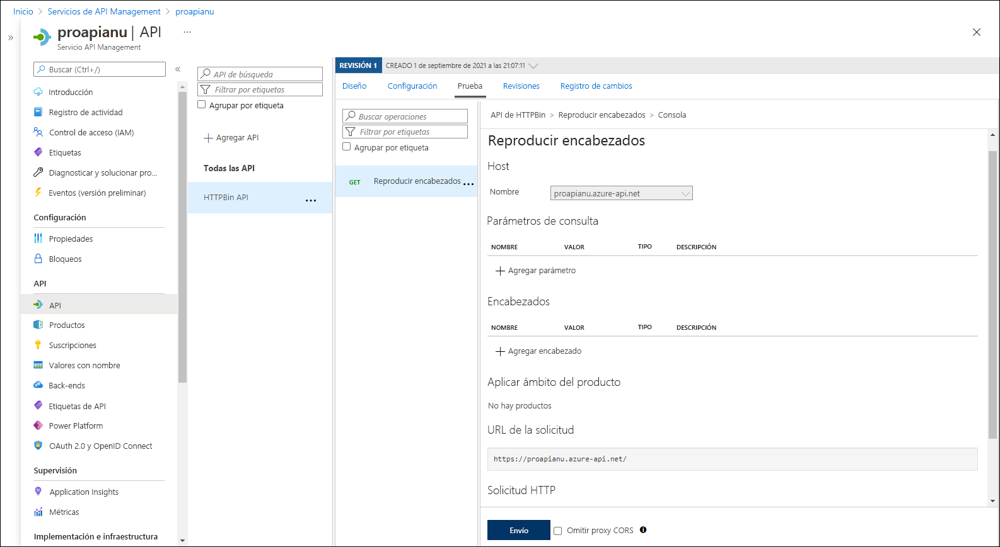
    
1.  Revise los resultados de la solicitud de API.

    > **Nota**: Compruebe que haya muchos encabezados enviados como parte de la solicitud que se repitan en la respuesta. Deben incluir el nuevo encabezado **Origen** que creó como parte de esta tarea.
     
    En la captura de pantalla siguiente se muestra la respuesta a la solicitud **Encabezados de eco**.

    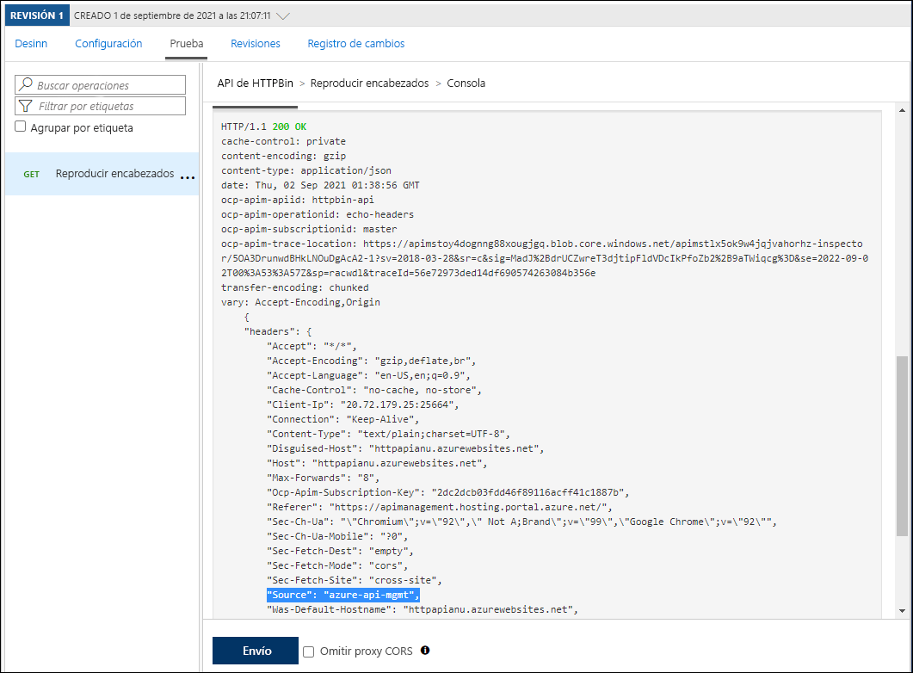
     
1.  Seleccione la pestaña **Diseño** para volver a la lista de operaciones.

#### Tarea 3: Manipular una respuesta de API

1.  En la pestaña **Diseño**, seleccione **+ Agregar operación**.

1.  En la sección **Agregar operación**, realice las siguientes acciones y, a continuación, seleccione **Guardar**:

    | Configuración | Acción |
    | -- | -- |
    | Cuadro de texto **Nombre para mostrar** | Escriba **Obtener datos heredados**. |
    | Cuadro de texto de **nombre** | Compruebe que su valor está establecido en **get-legacy-data**. |
    | Lista de **direcciones URL** | Compruebe que su valor está establecido en **GET**. |
    | Cuadro de texto de la **dirección URL** | Escriba **/xml**. |

1.  De nuevo en la pestaña **Diseño**, en la lista de operaciones, seleccione **Get Legacy Data** (Obtener datos heredados).

1.  Seleccione la pestaña **Prueba** y, a continuación, seleccione **Enviar**.

1.  Revise los resultados de la solicitud de API.

    > **Nota**: En este momento, los resultados deben estar en formato XML.

    En la captura de pantalla siguiente se muestran los resultados de la solicitud de API.
    
    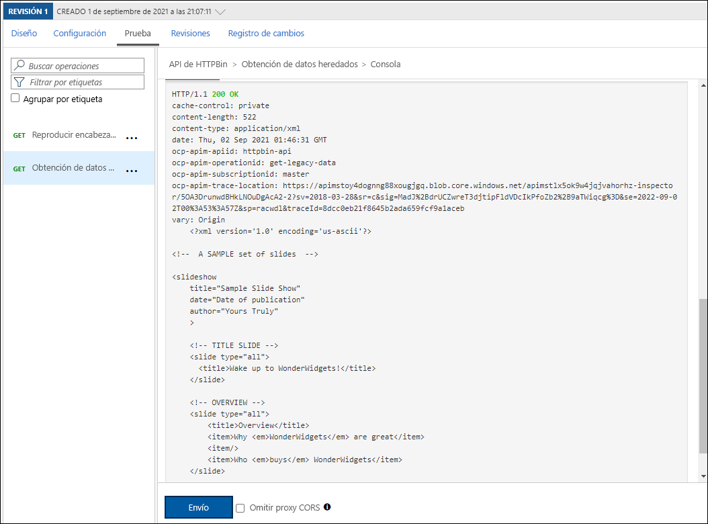

    
1.  Seleccione la pestaña **Diseño** y, a continuación, seleccione **Obtener datos heredados**.

1.  En el panel **Diseño**, en la sección **Procesamiento de salida**, seleccione **Agregar directiva**.
    
    En la siguiente captura de pantalla se muestra la sección **Procesamiento de salida**.
    
    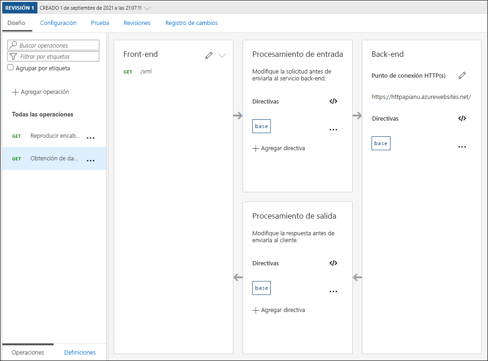
    
1.  En la sección **Agregar directiva de salida**, seleccione el icono **Otras directivas**.

1.  En el editor de código de directiva, busque el siguiente bloque de contenido XML:

    ```
    <outbound>
        <base />
    </outbound>
    ```

1.  Reemplace ese bloque de XML por el siguiente XML:

    ```
    <outbound>
        <base />
        <xml-to-json kind="direct" apply="always" consider-accept-header="false" />
    </outbound>
    ```

1.  En el editor de código de la directiva, seleccione **Guardar**.

1.  De nuevo en la pestaña **Diseño**, en la lista de operaciones, seleccione **Obtener datos heredados** y, a continuación, seleccione **Probar**.

1.  En la sección **Obtener datos heredados**, seleccione **Enviar**.

1.  Revise los resultados de la solicitud de API.

    > **Nota**: Los nuevos resultados están en formato de Notación de objetos JavaScript (JSON).

1.  En la sección **Respuesta de HTTP**, realice los pasos siguientes:

    1.  Seleccione **Seguimiento**.

    1.  Revise el contenido de los cuadros de texto de **Back-end** y **Saliente** y tenga en cuenta que incluyen detalles de las operaciones de API correspondientes con su información de tiempo.

#### Tarea 4: Manipular una solicitud de API

1.  En la pestaña **Diseño**, seleccione **+ Agregar operación**.

1.  En la sección **Agregar operación**, realice las siguientes acciones y, a continuación, seleccione **Guardar**:

    | Configuración  | Acción |
    | -- | -- |
    | Cuadro de texto **Nombre para mostrar** | Escriba **Modify Status Code** (Modificar el código de estado). |
    | Cuadro de texto de **nombre** | Compruebe que su valor está establecido en **modify-status-code**. |
    | Lista de **direcciones URL** | Seleccione **GET**. |
    | Cuadro de texto de la **dirección URL** | Escriba **/status/404**. |

1.  De nuevo en la pestaña **Diseño**, en la lista de operaciones, seleccione **Modificar el código de estado**.

1.  En la sección **Diseño**, en el icono **Procesamiento de entrada**, seleccione **+ Agregar directiva**.

1.  En la sección **Agregar directiva de entrada**, seleccione el icono **Reescribir dirección URL**.

1.  En la sección **Reescribir dirección URL**, realice las acciones siguientes:
       
    a.  En el cuadro de texto **Back-end**, escriba **/status/200**.
    
    b.  Seleccione **Guardar**.

1.  De nuevo en la pestaña **Diseño**, en la lista de operaciones, seleccione **Modificar el código de estado** y, a continuación. seleccione la pestaña **Prueba**.
    
1.  En la sección **Modificar el código de estado**, seleccione **Enviar**.

1.  Revise los resultados de la solicitud de API.

    > **Nota**: Compruebe que la solicitud devolvió la respuesta **HTTP/1.1 200 Aceptar**.
   
#### Revisar

En este ejercicio, ha creado un nivel de proxy entre el recurso App Service y los desarrolladores que quieren realizar consultas en su API.

### Ejercicio 3: Limpieza de la suscripción

#### Tarea 1: Apertura de Azure Cloud Shell

1.  En Azure Portal, seleccione el icono **Cloud Shell**, , para abrir una nueva sesión de Bash. Si el valor predeterminado de Cloud Shell es una sesión de PowerShell, seleccione **PowerShell**y, en el menú desplegable, seleccione **Bash**.

      > **Nota**: Si es la primera vez que inicia **Cloud Shell**, cuando se le pida que seleccione **Bash** o **PowerShell**, seleccione **PowerShell**. Si aparece el mensaje **No tiene ningún almacenamiento montado**, seleccione la suscripción que utiliza en este laboratorio y, luego, seleccione **Crear almacenamiento**.

#### Tarea 2: Eliminación de los grupos de recursos

1.  En el panel de **Cloud Shell**, ejecute el comando siguiente para eliminar el grupo de recursos **ApiService**:

    ```
    az group delete --name ApiService --no-wait --yes
    ```
    
     > **Nota**: El comando se ejecuta de forma asincrónica (según determina el parámetro *--no-wait*). Aunque podrá ejecutar otro comando de la CLI de Azure inmediatamente después en la misma sesión de Bash, los grupos de recursos tardarán unos minutos en quitarse.
  
1.  Cierre el panel de **Cloud Shell** en el portal.

#### Tarea 3: Cierre de las aplicaciones activas

1.  Cierre la aplicación que ejecuta Microsoft Edge actualmente.

#### Revisar

En este ejercicio, ha limpiado la suscripción mediante la eliminación de los grupos de recursos usados en este laboratorio.
