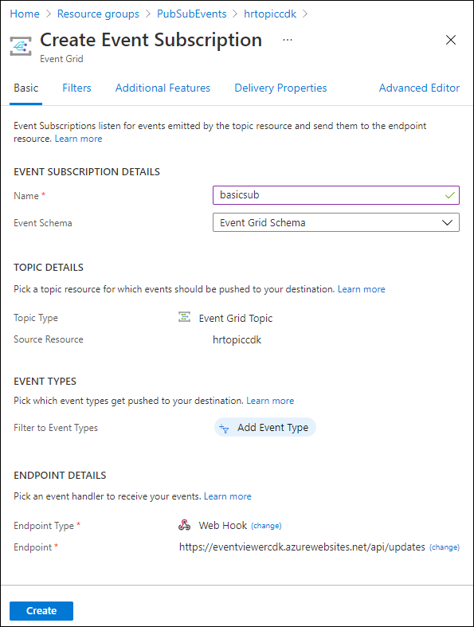

---
lab:
  az204Title: 'Lab 09: Publish and subscribe to Event Grid events'
  az020Title: 'Lab 09: Publish and subscribe to Event Grid events'
  az204Module: 'Module 09: Develop event-based solutions'
  az020Module: 'Module 09: Develop event-based solutions'
---

# <a name="lab-09-publish-and-subscribe-to-event-grid-events"></a>Laboratorio 09: Publicación y suscripción a eventos de Event Grid

## <a name="microsoft-azure-user-interface"></a>Interfaz de usuario de Microsoft Azure

Given the dynamic nature of Microsoft cloud tools, you might experience Azure UI changes that occur after the development of this training content. As a result, the lab instructions and lab steps might not align correctly.

Microsoft updates this training course when the community alerts us to needed changes. However, cloud updates occur frequently, so you might encounter UI changes before this training content updates. <bpt id="p1">**</bpt>If this occurs, adapt to the changes, and then work through them in the labs as needed.<ept id="p1">**</ept>

## <a name="instructions"></a>Instructions

### <a name="before-you-start"></a>Antes de comenzar

#### <a name="sign-in-to-the-lab-environment"></a>Inicio de sesión al entorno de laboratorio

Inicie sesión en la máquina virtual (VM) de Windows 10 con las credenciales siguientes:

- Nombre de usuario: **Admin**

- Contraseña: **Pa55w.rd**.

> **Nota**: El instructor le proporcionará instrucciones para conectarse al entorno de laboratorio virtual.

#### <a name="review-the-installed-applications"></a>Revisión de las aplicaciones instaladas

Find the taskbar on your Windows 10 desktop. The taskbar contains the icons for the applications that you'll use in this lab, including:

- Microsoft Edge

- Microsoft Visual Studio Code

## <a name="architecture-diagram"></a>Diagrama de la arquitectura


### <a name="exercise-1-create-azure-resources"></a>Ejercicio 1: Creación de recursos de Azure

#### <a name="task-1-open-the-azure-portal"></a>Tarea 1: Apertura de Azure Portal

1. En la barra de tareas, seleccione el icono de **Microsoft Edge**.

1. En la ventana del explorador abierto, vaya a Azure Portal (<https://portal.azure.com>) y, a continuación, inicie sesión con la cuenta que va a usar para este laboratorio.

    > Dada la naturaleza dinámica de las herramientas en la nube de Microsoft, puede experimentar cambios en la interfaz de usuario de Azure que se producen después del desarrollo de este contenido de entrenamiento.

#### <a name="task-2-open-azure-cloud-shell"></a>Tarea 2: Apertura de Azure Cloud Shell

1. Como resultado, es posible que las instrucciones y los pasos del laboratorio no se alineen correctamente.

    > <bpt id="p1">**</bpt>Note<ept id="p1">**</ept>: If this is the first time you are starting <bpt id="p2">**</bpt>Cloud Shell<ept id="p2">**</ept>, when prompted to select either <bpt id="p3">**</bpt>Bash<ept id="p3">**</ept> or <bpt id="p4">**</bpt>PowerShell<ept id="p4">**</ept>, select <bpt id="p5">**</bpt>Bash<ept id="p5">**</ept>. When you are presented with the <bpt id="p1">**</bpt>You have no storage mounted<ept id="p1">**</ept> message, select the subscription you are using in this lab, and then select <bpt id="p2">**</bpt>Create storage<ept id="p2">**</ept>.

1. En Azure Portal, en el símbolo del sistema de **Cloud Shell**, ejecute el siguiente comando para obtener la versión de la herramienta Interfaz de la línea de comandos de Azure (CLI de Azure):

    ```bash
    az --version
    ```

#### <a name="task-3-review-the-microsofteventgrid-provider-registration"></a>Tarea 3: Revisión del registro del proveedor Microsoft.EventGrid

1. En el **panel de Cloud Shell**, ejecute el siguiente comando para obtener una lista de subgrupos y comandos en el nivel raíz de la CLI de Azure:

    ```bash
    az --help
    ```

1. En el **panel de Cloud Shell**, ejecute el siguiente comando para obtener una lista de los comandos que están disponibles para los proveedores de recursos:

    ```bash
    az provider --help
    ```

1. En el **panel de Cloud Shell**, ejecute el siguiente comando para enumerar todos los proveedores registrados actualmente:

    ```bash
    az provider list
    ```

1. En el **panel de Cloud Shell**, ejecute el siguiente comando para enumerar solo los espacios de nombres de los proveedores registrados actualmente:

    ```bash
    az provider list --query "[].namespace"
    ```

1. Microsoft actualiza este curso de entrenamiento cuando la comunidad nos alerta de los cambios necesarios.

1. Cierre el panel de **Cloud Shell**.

#### <a name="task-4-create-a-custom-event-grid-topic"></a>Tarea 4: Creación de un tema de Event Grid personalizado

1. En el panel de navegación de Azure Portal, seleccione **Crear un recurso**.

1. En el panel **Crear un recurso**, en el cuadro de texto **Servicios Search y Marketplace**, escriba **Tema de Event Grid** y, a continuación, seleccione Entrar.

1. En el panel de resultados de búsqueda de **Marketplace**, seleccione el resultado de **Tema de Event Grid** y, a continuación, seleccione **Crear**.

1. En el panel **Crear tema**, en la pestaña **Aspectos básicos**, realice las siguientes acciones y, a continuación, seleccione la pestaña **Aspectos avanzados**:

    | Configuración | Acción |
    | -- | -- |
    | Lista desplegable de **Suscripción**  | Conserve los valores predeterminados |
    | Lista desplegable del **grupo de recursos** | Seleccione **Crear nuevo**, escriba **PubSubEvents** y seleccione **Aceptar**. |
    | Cuadro de texto de **nombre** | Escribir **hrtopic** _[sunombre]_ |
    | Lista desplegable de **Región** | Seleccione **Este de EE. UU**. |

   En la captura de pantalla siguiente, se muestran los valores configurados en la pestaña **Aspectos básicos**.

   

1. En la pestaña **Aspectos avanzados**, en la lista desplegable **Esquema de eventos**, seleccione **Esquema de Event Grid**y, a continuación, seleccione **Revisar y crear**.

1. En la pestaña **Revisar y crear**, revise las opciones que seleccionó durante los pasos anteriores.

1. Seleccione **Crear** para crear un tema de Event Grid mediante la configuración especificada.
  
    > Sin embargo, las actualizaciones en la nube se producen con frecuencia, por lo que es posible que se produzcan cambios en la interfaz de usuario antes de que se actualice este contenido de entrenamiento.

#### <a name="task-5-deploy-the-azure-event-grid-viewer-to-a-web-app"></a>Tarea 5: Implementación del visor de Azure Event Grid en una aplicación web

1. En el panel de navegación de Azure Portal, seleccione **Crear un recurso**.

1. En el panel **Crear un recurso**, en el cuadro de texto **Servicios Search y Marketplace**, escriba **Aplicación web** y, a continuación, seleccione ENTRAR.

1. En el panel de resultados de búsqueda de **Marketplace**, seleccione el resultado de **Aplicación web** y, a continuación, seleccione **Crear**.

1. En el panel **Crear aplicación web**, en la pestaña **Aspectos básicos**, realice las siguientes acciones y, a continuación, seleccione **Siguiente: Docker**:

   | Configuración | Acción |
   | -- | -- |
   | Lista desplegable de **Suscripción** | Conserve los valores predeterminados |
   | Lista desplegable del **grupo de recursos** | Seleccionar **PubSubEvents** en la lista |
   | Cuadro de texto **Nombre**  | Escribir **eventviewer** _[sunombre]_ |
   | Sección **Publicar** | Seleccione **Contenedor de Docker** |
   | Sección del **sistema operativo** | Seleccionar **Linux** |
   | Lista desplegable de **Región** | Seleccionar **Este de EE. UU. |
   | Sección **Plan de Linux (Este de EE. UU.)** | Seleccione **Crear nuevo**, escriba **EventPlan** en el cuadro de texto **Nombre** y, a continuación, seleccione **Aceptar**. |
   | Sección **SKU y tamaño** | Conserve los valores predeterminados |

   En la captura de pantalla siguiente, se muestran los valores configurados en la hoja **Crear aplicación web**.

   

1. En la pestaña **Docker**, realice las siguientes acciones y seleccione **Revisar y crear**:

    | Configuración | Acción |
    | -- | -- |
    | Lista desplegable de **opciones** | Seleccione **Contenedor único** |
    | Lista desplegable de **Origen de la imagen** | Seleccione **Docker Hub** |
    | Lista desplegable del **Tipo de acceso** | Seleccione **Público**. |
    | Cuadro de texto **Imagen y etiqueta** | Enter **microsoftlearning/azure-event-grid-viewer:latest** |

   En la captura de pantalla siguiente, se muestran los valores configurados en la pestaña **Docker**.

   

1. En la pestaña **Revisar y crear**, revise las opciones que seleccionó durante los pasos anteriores.

1. Seleccione **Crear** para crear la aplicación web mediante la configuración especificada.
  
    > **Si esto ocurre, adáptese a los cambios y, a continuación, trabaje con ellos en los laboratorios según sea necesario.**

#### <a name="review"></a>Revisar

En este ejercicio, ha creado el tema Event Grid y una aplicación web que usará en el resto del laboratorio.

### <a name="exercise-2-create-an-event-grid-subscription"></a>Ejercicio 2: Creación de una suscripción a Event Grid

#### <a name="task-1-access-the-event-grid-viewer-web-application"></a>Tarea 1: Acceso a la aplicación web Visor de Event Grid

1. En el panel de navegación de Azure Portal, seleccione **Grupos de recursos**.

1. En el panel **Grupos de recursos**, seleccione el grupo de recursos **PubSubEvents**.

1. En el panel **PubSubEvents**, seleccione la aplicación web **eventviewer** _[sunombre]_ .

1. En el panel **App Service**, en la categoría **Configuración**, seleccione el vínculo **Propiedades**.

1. In the <bpt id="p1">**</bpt>Properties<ept id="p1">**</ept> section, record the value of the <bpt id="p2">**</bpt>URL<ept id="p2">**</ept> link. You'll use this value later in the lab.

1. Seleccione **Introducción** y, a continuación, **Examinar**.

1. Observe the currently running <bpt id="p1">**</bpt>Azure Event Grid Viewer<ept id="p1">**</ept> web application. Leave this web application running for the remainder of the lab.

    > <bpt id="p1">**</bpt>Note<ept id="p1">**</ept>: This web application will update in real time as events are sent to its endpoint. You'll use this application to monitor events throughout the lab.

1. Vuelva a la ventana del explorador abierta actualmente que muestra Azure Portal.

#### <a name="task-2-create-a-new-subscription"></a>Tarea 2: Creación de una nueva suscripción

1. En el panel de navegación de Azure Portal, seleccione **Grupos de recursos**.

1. En el panel **Grupos de recursos**, seleccione el grupo de recursos **PubSubEvents** que creó anteriormente en este laboratorio.

1. En el panel **PubSubEvents**, seleccione el tema de Event Grid **hrtopic** _[sunombre]_ que creó anteriormente en este laboratorio.

1. En el panel **Tema de Event Grid**, seleccione **+ Suscripción a eventos**.

1. En el panel **Crear suscripción a eventos**, realice las siguientes acciones y, a continuación, seleccione **Crear**:

    | Configuración | Acción |
    | -- | -- |
    | Cuadro de texto **Nombre**  | Escribir **basicsub** |
    | Lista desplegable **Esquema de eventos** | Seleccionar **Esquema de Event Grid** |
    | Lista desplegable **Tipo de punto de conexión** | Seleccionar **Webhook** |
    | **Punto de conexión** | Select <bpt id="p1">**</bpt>Select an endpoint<ept id="p1">**</ept>. In the <bpt id="p1">**</bpt>Subscriber Endpoint<ept id="p1">**</ept> text box, enter the <bpt id="p2">**</bpt>Web App URL<ept id="p2">**</ept> value that you recorded previously, ensure that it uses an <bpt id="p3">**</bpt>https://<ept id="p3">**</ept> prefix, add the suffix <bpt id="p4">**</bpt>/api/updates<ept id="p4">**</ept>, and then select <bpt id="p5">**</bpt>Confirm Selection<ept id="p5">**</ept>. For example, if your <bpt id="p1">**</bpt>Web App URL<ept id="p1">**</ept> value is <ph id="ph1">``http://eventviewerstudent.azurewebsites.net/``</ph>, then your <bpt id="p2">**</bpt>Subscriber Endpoint<ept id="p2">**</ept> would be <ph id="ph2">``https://eventviewerstudent.azurewebsites.net/api/updates``</ph> |

   En la captura de pantalla siguiente, se muestran los valores configurados en el panel **Crear suscripción a eventos**.

   

    > <bpt id="p1">**</bpt>Note<ept id="p1">**</ept>: Wait for Azure to finish creating the subscription before you continue with the lab. You'll receive a notification when the subscription is created.

#### <a name="task-3-observe-the-subscription-validation-event"></a>Tarea 3: Observación del evento de validación de suscripción

1. Vuelva a la ventana del explorador que muestra la aplicación web **Visor de Azure Event Grid**.

1. Revise el evento **Microsoft.EventGrid.SubscriptionValidationEvent** que se creó como parte del proceso de creación de la suscripción.

1. Seleccione el evento y revise su contenido JSON.

1. Vuelva a la ventana del explorador abierta actualmente con Azure Portal.

#### <a name="task-4-record-subscription-credentials"></a>Tarea 4: Registro de credenciales de suscripción

1. En el panel de navegación de Azure Portal, seleccione **Grupos de recursos**.

1. En el panel **Grupos de recursos**, seleccione el grupo de recursos **PubSubEvents** que creó anteriormente en este laboratorio.

1. En el panel **PubSubEvents**, seleccione el tema de Event Grid **hrtopic** _[sunombre]_ que creó anteriormente en este laboratorio.

1. On the <bpt id="p1">**</bpt>Event Grid Topic<ept id="p1">**</ept> blade, record the value of the <bpt id="p2">**</bpt>Topic Endpoint<ept id="p2">**</ept> field. You'll use this value later in the lab.

1. En la categoría **Configuración**, seleccione el vínculo **Claves de acceso**.

1. In the <bpt id="p1">**</bpt>Access keys<ept id="p1">**</ept> section, record the value of the <bpt id="p2">**</bpt>Key 1<ept id="p2">**</ept> text box. You'll use this value later in the lab.

#### <a name="review"></a>Revisar

En este ejercicio, ha creado una nueva suscripción, ha validado su registro y, a continuación, ha registrado las credenciales necesarias para publicar un nuevo evento en el tema.

### <a name="exercise-3-publish-event-grid-events-from-net"></a>Ejercicio 3: Publicación de eventos de Event Grid desde .NET

#### <a name="task-1-create-a-net-project"></a>Tarea 1: Creación de un proyecto de .NET

1. En la pantalla **Inicio**, seleccione el icono **Visual Studio Code**.

1. En el menú **Archivo**, seleccione **Abrir carpeta**.

1. En la ventana **Explorador de archivos** que se abre, vaya a **Allfiles (F):\\Allfiles\\Labs\\09\\Starter\\EventPublisher** y, a continuación, seleccione **Seleccionar carpeta**.

1. En la ventana de **Visual Studio Code**, active el menú contextual del panel **Explorador** y, a continuación, seleccione **Abrir en el terminal integrado**.

1. Ejecute el siguiente comando para crear un nuevo proyecto de .NET denominado **EventPublisher** en la carpeta actual:

    ```powershell
    dotnet new console --framework net6.0 --name EventPublisher --output . 
    ```

    > **Nota**: El comando **dotnet new** creará un nuevo proyecto de **consola** en una carpeta con el mismo nombre que el proyecto.

1. Ejecute el comando siguiente para importar la versión 4.10.0 de **Azure.Messaging.EventGrid** desde NuGet:

    ```powershell
    dotnet add package Azure.Messaging.EventGrid --version 4.10.0
    ```

    > <bpt id="p1">**</bpt>Note<ept id="p1">**</ept>: The <bpt id="p2">**</bpt>dotnet add package<ept id="p2">**</ept> command will add the <bpt id="p3">**</bpt>Microsoft.Azure.EventGrid<ept id="p3">**</ept> package from NuGet. For more information, go to <bpt id="p1">[</bpt>Azure.Messaging.EventGrid<ept id="p1">](https://www.nuget.org/packages/Azure.Messaging.EventGrid/4.10.0)</ept>.

1. Ejecute el siguiente comando para crear la aplicación web de .NET:

    ```powershell
    dotnet build
    ```

1. Seleccione **Cerrar el terminal** o el icono de la **papelera de reciclaje** para cerrar el terminal abierto y todos los procesos asociados.

#### <a name="task-2-modify-the-program-class-to-connect-to-event-grid"></a>Tarea 2: Modificar la clase Program para conectarse a Event Grid

1. En el panel  **Explorador**  de la ventana **Visual Studio Code**, abra el archivo **Program.cs**.

1. En la pestaña del editor de código del archivo  **Program.cs** , elimine todo el código del archivo existente.

1. Agregue la siguiente línea de código para importar los espacios de nombres **Azure** y **Azure.Messaging.EventGrid** desde el paquete **Azure.Messaging.EventGrid** importado desde NuGet:

    ```csharp
    using Azure;
    using Azure.Messaging.EventGrid;
    ```

1. Agregue las siguientes líneas de código para agregar las directivas **en uso** a los espacios de nombres integrados que se usarán en este archivo:

    ```csharp
    using System;
    using System.Threading.Tasks;
    ```

1. Escriba el siguiente código para crear una nueva clase **Program**:

    ```csharp
    public class Program
    {
    }
    ```

1. En la clase **Program**, escriba la siguiente línea de código para crear una nueva constante de cadena denominada **topicEndpoint**:

    ```csharp
    private const string topicEndpoint = "";
    ```

1. Actualice la constante de cadena **topicEndpoint**; para ello, establezca su valor en el  **Punto de conexión del tema** de Event Grid que registró anteriormente en este laboratorio.

1. En la clase **Program**, escriba la siguiente línea de código para crear una nueva constante de cadena denominada **topicKey**:

    ```csharp
    private const string topicKey = "";
    ```

1. Actualice la constante de cadena **topicKey**; para ello, establezca su valor en la  **Clave** del tema de Event Grid que registró anteriormente en este laboratorio.

1. En la clase **Program**, escriba el siguiente código para crear un nuevo método **Main** asincrónico:

    ```csharp
    public static async Task Main(string[] args)
    {
    }
    ```

1. Observe el archivo **Program.cs**, que ahora debería incluir las siguientes líneas de código:

    ```csharp
    using Azure;
    using Azure.Messaging.EventGrid;
    using System;
    using System.Threading.Tasks;    
    public class Program
    {
        private const string topicEndpoint = "<topic-endpoint>";
        private const string topicKey = "<topic-key>";        
        public static async Task Main(string[] args)
        {
        }
    }
    ```

#### <a name="task-3-publish-new-events"></a>Tarea 3: Publicación de nuevos eventos

1. En el método **Main**, realice las siguientes acciones para publicar una lista de eventos en el punto de conexión del tema:

    a. Add the following line of code to create a new variable named <bpt id="p1">**</bpt>endpoint<ept id="p1">**</ept> of type <bpt id="p2">**</bpt>Uri<ept id="p2">**</ept>, using the <bpt id="p3">**</bpt>topicEndpoint<ept id="p3">**</ept> string constant as a constructor parameter:

    ```csharp
    Uri endpoint = new Uri(topicEndpoint); 
    ```

    Busque la barra de tareas en el escritorio de Windows 10.

    ```csharp
    AzureKeyCredential credential = new AzureKeyCredential(topicKey);
    ```

    La barra de tareas contiene los iconos de las aplicaciones que usará en este laboratorio, entre los que se incluyen:

    ```csharp
    EventGridPublisherClient client = new EventGridPublisherClient(endpoint, credential);
    ```

    d. Add the following block of code to create a new variable named <bpt id="p1">**</bpt>firstEvent<ept id="p1">**</ept> of type <bpt id="p2">**</bpt><bpt id="p3">[</bpt>EventGridEvent<ept id="p3">](https://docs.microsoft.com/dotnet/api/azure.messaging.eventgrid.eventgridevent)</ept><ept id="p2">**</ept> and populate that variable with sample data:

    ```csharp
    EventGridEvent firstEvent = new EventGridEvent(
        subject: $"New Employee: Alba Sutton",
        eventType: "Employees.Registration.New",
        dataVersion: "1.0",
        data: new
        {
            FullName = "Alba Sutton",
            Address = "4567 Pine Avenue, Edison, WA 97202"
         }
     );
     ```

    e. Add the following block of code to create a new variable named <bpt id="p1">**</bpt>secondEvent<ept id="p1">**</ept> of type <bpt id="p2">**</bpt><bpt id="p3">[</bpt>EventGridEvent<ept id="p3">](https://docs.microsoft.com/dotnet/api/azure.messaging.eventgrid.eventgridevent)</ept><ept id="p2">**</ept> and populate that variable with sample data:

     ```csharp
        EventGridEvent secondEvent = new EventGridEvent(
            subject: $"New Employee: Alexandre Doyon",
            eventType: "Employees.Registration.New",
            dataVersion: "1.0",
            data: new
            {
                FullName = "Alexandre Doyon",
                Address = "456 College Street, Bow, WA 98107"
            }
        );
     ```

    f. Add the following line of code to asynchronously invoke the <bpt id="p1">**</bpt><bpt id="p2">[</bpt>EventGridPublisherClient.SendEventAsync<ept id="p2">](https://docs.microsoft.com/dotnet/api/azure.messaging.eventgrid.eventgridpublisherclient.sendeventasync)</ept><ept id="p1">**</ept> method using the <bpt id="p3">**</bpt>firstEvent<ept id="p3">**</ept> variable as a parameter:

     ```csharp
     await client.SendEventAsync(firstEvent);
     ```

    g. Add the following line of code to render the <bpt id="p1">**</bpt>"First event published"<ept id="p1">**</ept> message to the console:

     ```csharp
     Console.WriteLine("First event published");
     ```

    h. Add the following line of code to asynchronously invoke the <bpt id="p1">**</bpt><bpt id="p2">[</bpt>EventGridPublisherClient.SendEventAsync<ept id="p2">](https://docs.microsoft.com/dotnet/api/azure.messaging.eventgrid.eventgridpublisherclient.sendeventasync)</ept><ept id="p1">**</ept> method using the <bpt id="p3">**</bpt>secondEvent<ept id="p3">**</ept> variable as a parameter:

     ```csharp
     await client.SendEventAsync(secondEvent);
     ```

    i. Add the following line of code to render the <bpt id="p1">**</bpt>"Second event published"<ept id="p1">**</ept> message to the console:

     ```csharp
     Console.WriteLine("Second event published");
     ```

1. Revise el método **Main**, que ahora debe incluir:

    ```csharp
    public static async Task Main(string[] args)
    {
        Uri endpoint = new Uri(topicEndpoint);
        AzureKeyCredential credential = new AzureKeyCredential(topicKey);
        EventGridPublisherClient client = new EventGridPublisherClient(endpoint, credential);        
        EventGridEvent firstEvent = new EventGridEvent(
            subject: $"New Employee: Alba Sutton",
            eventType: "Employees.Registration.New",
            dataVersion: "1.0",
            data: new
            {
                FullName = "Alba Sutton",
                Address = "4567 Pine Avenue, Edison, WA 97202"
            }
        );
        EventGridEvent secondEvent = new EventGridEvent(
            subject: $"New Employee: Alexandre Doyon",
            eventType: "Employees.Registration.New",
            dataVersion: "1.0",
            data: new
            {
                FullName = "Alexandre Doyon",
                Address = "456 College Street, Bow, WA 98107"
            }
        );
        await client.SendEventAsync(firstEvent);
        Console.WriteLine("First event published");
        await client.SendEventAsync(secondEvent);
        Console.WriteLine("Second event published");
    }
    ```

1. Guarde el archivo **Program.cs** .

1. En la ventana de **Visual Studio Code**, active el menú contextual del panel **Explorador** y, a continuación, seleccione **Abrir en el terminal integrado**.

1. Ejecute el siguiente comando para ejecutar la aplicación web de .NET:

    ```powershell
    dotnet run
    ```

    > **Nota**: Si hay algún error de compilación, revise el archivo **Program.cs** en la carpeta **Allfiles (F):\\Allfiles\\Labs\\09\\Solution\\EventPublisher**.

1. Observe la salida del mensaje de operación correcta de la aplicación de consola que se está ejecutando actualmente.

1. Seleccione **Cerrar el terminal** o el icono de la **papelera de reciclaje** para cerrar el terminal abierto y todos los procesos asociados.

#### <a name="task-4-observe-published-events"></a>Tarea 4: Observación de los eventos publicados

1. Vuelva a la ventana del explorador con la aplicación web **Visor de Azure Event Grid**.

1. Revise los eventos **Employees.Registration.New** creados por la aplicación de consola.

1. Seleccione cualquiera de los eventos y revise su contenido JSON.

1. Vuelva a Azure Portal.

#### <a name="review"></a>Revisar

En este ejercicio, ha publicado nuevos eventos en el tema de Event Grid mediante una aplicación de consola de .NET.

### <a name="exercise-4-clean-up-your-subscription"></a>Ejercicio 4: Limpieza de la suscripción

#### <a name="task-1-open-azure-cloud-shell"></a>Tarea 1: Apertura de Azure Cloud Shell

1. In the Azure portal, select the <bpt id="p1">**</bpt>Cloud Shell<ept id="p1">**</ept> icon <ph id="ph1"></ph> to open a new Bash session. If Cloud Shell defaults to a PowerShell session, select <bpt id="p1">**</bpt>PowerShell<ept id="p1">**</ept> and, in the drop-down menu, select <bpt id="p2">**</bpt>Bash<ept id="p2">**</ept>.

    > <bpt id="p1">**</bpt>Note<ept id="p1">**</ept>: If this is the first time you are starting <bpt id="p2">**</bpt>Cloud Shell<ept id="p2">**</ept>, when prompted to select either <bpt id="p3">**</bpt>Bash<ept id="p3">**</ept> or <bpt id="p4">**</bpt>PowerShell<ept id="p4">**</ept>, select <bpt id="p5">**</bpt>PowerShell<ept id="p5">**</ept>. When you are presented with the <bpt id="p1">**</bpt>You have no storage mounted<ept id="p1">**</ept> message, select the subscription you are using in this lab, and select <bpt id="p2">**</bpt>Create storage<ept id="p2">**</ept>.

#### <a name="task-2-delete-a-resource-group"></a>Tarea 2: Eliminación de un grupo de recursos

1. En el panel de **Cloud Shell**, ejecute el comando siguiente para eliminar el grupo de recursos **PubSubEvents**:

    ```bash
    az group delete --name PubSubEvents --no-wait --yes
    ```

     > **Nota**: El comando se ejecuta de forma asincrónica (según determina el parámetro *--no-wait*). Aunque podrá ejecutar otro comando de la CLI de Azure inmediatamente después en la misma sesión de Bash, los grupos de recursos tardarán unos minutos en quitarse.

1. Cierre el panel de **Cloud Shell** en el portal.

#### <a name="task-3-close-the-active-applications"></a>Tarea 3: Cierre de las aplicaciones activas

1. Cierre la aplicación que ejecuta Microsoft Edge actualmente.

1. Cierre la aplicación que ejecuta Visual Studio Code actualmente.

#### <a name="review"></a>Revisar

En este ejercicio, ha limpiado la suscripción mediante la eliminación de los grupos de recursos usados en este laboratorio.
