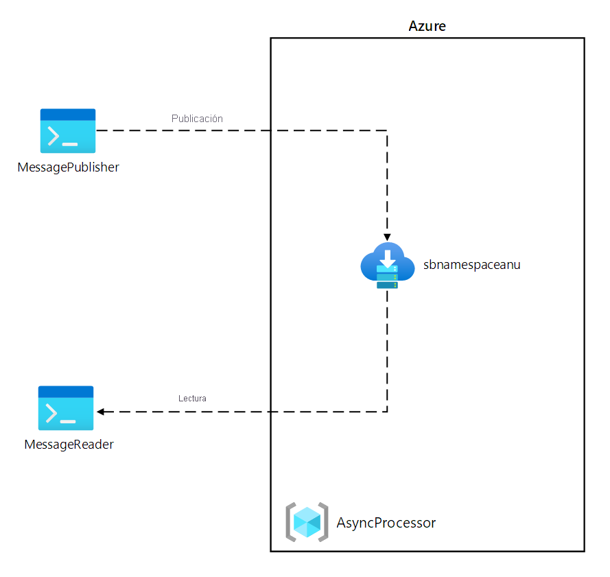
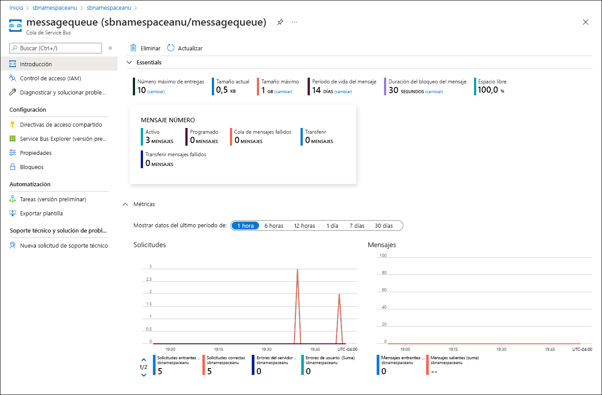
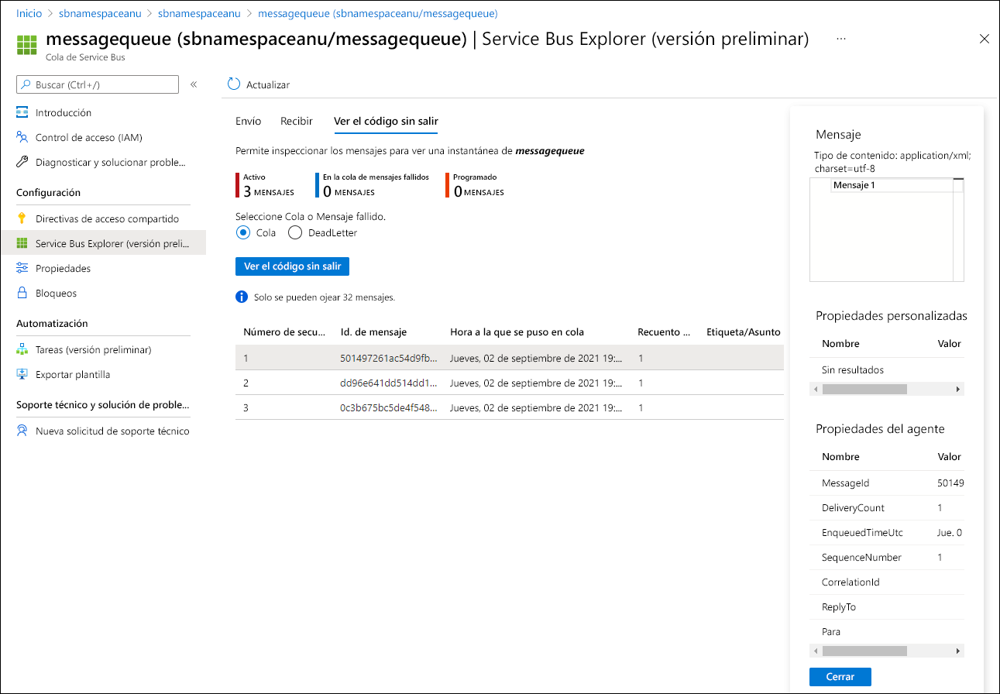

---
lab:
  az204Title: 'Lab 10: Asynchronously process messages by using Azure Service Bus Queues'
  az020Title: 'Lab 10: Asynchronously process messages by using Azure Service Bus Queues'
  az204Module: 'Module 10: Develop message-based solutions'
  az020Module: 'Module 10: Develop message-based solutions'
ms.openlocfilehash: 251f19ea16a3a55a4dfec26c82565ff2418334da
ms.sourcegitcommit: 9711ba92ee508e51804c0757218f4405df6f0f7f
ms.translationtype: HT
ms.contentlocale: es-ES
ms.lasthandoff: 07/25/2022
ms.locfileid: "147406118"
---
# <a name="lab-10-asynchronously-process-messages-by-using-azure-service-bus-queues"></a>Laboratorio 10: Procesamiento asincrónico de mensajes mediante colas de Azure Service Bus

## <a name="microsoft-azure-user-interface"></a>Interfaz de usuario de Microsoft Azure

Dada la naturaleza dinámica de las herramientas en la nube de Microsoft, puede experimentar cambios en la interfaz de usuario de Azure que se producen después del desarrollo de este contenido de entrenamiento. Como resultado, es posible que las instrucciones y los pasos del laboratorio no se alineen correctamente.

Microsoft actualiza este curso de entrenamiento cuando la comunidad nos alerta de los cambios necesarios. Sin embargo, las actualizaciones en la nube se producen con frecuencia, por lo que es posible que se produzcan cambios en la interfaz de usuario antes de que se actualice este contenido de entrenamiento. **Si esto ocurre, adáptese a los cambios y, a continuación, trabaje con ellos en los laboratorios según sea necesario.**

## <a name="instructions"></a>Instructions

### <a name="before-you-start"></a>Antes de comenzar

#### <a name="sign-in-to-the-lab-environment"></a>Inicio de sesión al entorno de laboratorio

Inicie sesión en la máquina virtual (VM) de Windows 10 con las credenciales siguientes:
    
-   Nombre de usuario: **Admin**

-   Contraseña: **Pa55w.rd**.

> **Nota**: El instructor le proporcionará instrucciones para conectarse al entorno de laboratorio virtual.

#### <a name="review-the-installed-applications"></a>Revisión de las aplicaciones instaladas

Busque la barra de tareas en el escritorio de Windows 10. La barra de tareas contiene los iconos de las aplicaciones que usará en este laboratorio, entre los que se incluyen:
    
-   Microsoft Edge

-   Visual Studio Code

## <a name="architecture-diagram"></a>Diagrama de la arquitectura



### <a name="exercise-1-create-azure-resources"></a>Ejercicio 1: Creación de recursos de Azure

#### <a name="task-1-open-the-azure-portal"></a>Tarea 1: Apertura de Azure Portal

1.  En la barra de tareas, seleccione el icono de **Microsoft Edge**.

1.  En la ventana del explorador, vaya a Azure Portal ([portal.azure.com](https://portal.azure.com)) e inicie sesión con la cuenta que va a usar para este laboratorio.

    > **Nota**: Si es la primera vez que inicia sesión en Azure Portal, se le ofrecerá un paseo por el portal. Seleccione **Introducción** para omitir el paseo y empezar a usar el portal.

#### <a name="task-2-create-an-azure-service-bus-queue"></a>Tarea 2: Creación de una cola de Azure Service Bus

1.  En Azure Portal, use el cuadro de texto **Buscar recursos, servicios y documentos** para buscar **Service Bus** y, a continuación, en la lista de resultados, seleccione **Service Bus**.

1.  En la hoja **Service Bus**, seleccione **+ Crear**.

1.  En la hoja **Crear espacio de nombres**, en la pestaña **Aspectos básicos**, realice las siguientes acciones y seleccione **Revisar y crear**:
        
    | Configuración                           | Acción                                                       |
    | --------------------------------- | ------------------------------------------------------------ |
    | Lista desplegable de **Suscripción**    |Conserve los valores predeterminados. |
    | Sección **Grupo de recursos** | Seleccione **Crear nuevo**, escriba **AsyncProcessor** y seleccione **Aceptar**.|
    | Cuadro de texto **Nombre del espacio de nombres** | Escriba **sbnamespace** _[yourname]_ .|
    | Lista desplegable de **Región** |  Seleccione cualquier región de Azure en la que pueda implementar una instancia de Azure Service Bus.|
    | Lista desplegable de **planes de tarifa** |  Seleccione **Básica**.|

    En la captura de pantalla siguiente, se muestran los valores configurados en la pestaña **Aspectos básicos** de la hoja **Crear espacio de nombres**.
    
       
     
1.  En la pestaña **Revisar y crear**, revise las opciones que seleccionó durante los pasos anteriores.

1.  Seleccione **Crear** para crear el espacio de nombres de **Service Bus** mediante la configuración especificada.

    > **Nota**: Espere a que se complete la tarea de creación antes de continuar con este laboratorio.

1.  En la hoja **Implementación**, seleccione el botón **Ir al recurso** para ir a la hoja del espacio de nombres de **Service Bus** recién creado.

1.  En la hoja del espacio de nombres de **Service Bus**, en la sección **Configuración**, seleccione **Directivas de acceso compartido**.

1.  En la lista de directivas, seleccione **RootManageSharedAccessKey**.

1.  En el panel **Directiva de SAS: RootManageSharedAccessKey**, junto a la entrada **Cadena de conexión principal**, seleccione el botón **Copiar en el Portapapeles** y registre el valor copiado. Lo usará más adelante en este laboratorio.

    > **Nota**: No importa cuál de las dos claves disponibles elija. Son intercambiables.

1.  En la hoja del espacio de nombres de **Service Bus**, en la sección **Entidades**, seleccione **Colas** y, a continuación, **+ Cola**.

1.  En la hoja **Crear cola**, revise la configuración disponible, en el cuadro de texto **Nombre**, escriba **messagequeue** y, a continuación, seleccione **Crear**.

1.  Seleccione **messagequeue** para mostrar las propiedades de la cola de **Service Bus**.

1.  Deje la ventana del explorador abierta. Volverá a usarla en este laboratorio.

#### <a name="review"></a>Revisar

En este ejercicio, ha creado un espacio de nombres de **Azure Service Bus** y una cola de **Service Bus** que usará en el resto del laboratorio.

### <a name="exercise-2-create-a-net-core-project-to-publish-messages-to-a-service-bus-queue"></a>Ejercicio 2: Creación de un proyecto de .NET Core para publicar mensajes en una cola de Service Bus

#### <a name="task-1-create-a-net-core-project"></a>Tarea 1: Creación de un proyecto de .NET Core

1.  En el equipo del laboratorio, inicie Visual Studio Code.

1.  En Visual Studio Code, en el menú **Archivo**, seleccione **Abrir carpeta**.

1.  En la ventana **Abrir carpeta**, vaya a **Allfiles (F):\\Allfiles\\Labs\\10\\Starter\\MessagePublisher** y, a continuación, seleccione **Seleccionar carpeta**.

1.  En la ventana **Visual Studio Code**, active el menú contextual y, a continuación, seleccione **Abrir en el terminal integrado**.

1.  En la solicitud del terminal, ejecute el siguiente comando para crear un nuevo proyecto de .NET denominado **MessagePublisher** en la carpeta actual:

    ```
    dotnet new console --name MessagePublisher --output .
    ```

    > **Nota**: El comando **dotnet new** creará un nuevo proyecto de **consola** en una carpeta con el mismo nombre que el proyecto.

1.  Ejecute el siguiente comando para importar la versión 7.2.1 de **Azure.Messaging.ServiceBus** desde NuGet:

    ```
    dotnet add package Azure.Messaging.ServiceBus --version 7.2.1
    ```

    > **Nota**: El comando **dotnet add package** agregará el paquete **Azure.Messaging.ServiceBus** desde NuGet. Para más información, vaya a [Azure.Messaging.ServiceBus](https://www.nuget.org/packages/Azure.Messaging.ServiceBus/).

1.  En la solicitud del terminal, ejecute el siguiente comando para compilar la aplicación de consola de .NET Core:

    ```
    dotnet build
    ```

1.  Seleccione **Cerrar el terminal** (el icono de la **papelera de reciclaje**) para cerrar el panel del terminal y los procesos asociados.

#### <a name="task-2-publish-messages-to-an-azure-service-bus-queue"></a>Tarea 2: Publicación de mensajes en una cola de Azure Service Bus

1.  En el panel **Explorador** de la ventana **Visual Studio Code**, abra el archivo **Program.cs**.

1.  En la pestaña del editor de código del archivo **Program.cs**, elimine todo el código del archivo existente.

1.  Agregue las siguientes líneas de código para facilitar el uso de los espacios de nombres integrados a los que se hará referencia en este archivo:

    ```csharp
    using System;
    using System.Threading.Tasks;
    ```

1.  Agregue el código siguiente para importar el espacio de nombres de **Azure.Messaging.ServiceBus** incluido en el paquete **Azure.Storage.Queues** importado desde NuGet:

    ```csharp
    using Azure.Messaging.ServiceBus;
    ```
    
1.  Escriba el siguiente código para crear una nueva clase **Program** en el espacio de nombres de MessagePublisher:

    ```csharp
    namespace MessagePublisher
    {
       public class Program
       {
       }
    }
    ```

1.  En la clase **Program**, escriba el siguiente código para crear una nueva constante de cadena denominada **storageConnectionString**:

    ```csharp
    private const string storageConnectionString = "";
    ```

1.  Actualice la constante de cadena **storageConnectionString** estableciendo su valor en **Cadena de conexión principal** del espacio de nombres de Service Bus que registró anteriormente en este laboratorio.

1.  Escriba el código siguiente para crear una constante de cadena denominada **queueName** con un valor de **messagequeue** que coincida con el nombre de la cola de Service Bus que creó anteriormente en este ejercicio.

    ```csharp
    private const string queueName = "messagequeue";
    ```

1.  Escriba el código siguiente para crear una constante de entero que almacena el número de mensajes que se enviarán a la cola de destino:

    ```csharp
    private const int numOfMessages = 3;
    ```

1.  Escriba el código siguiente para crear un cliente de Service Bus que será el propietario de la conexión a la cola de destino:

    ```csharp
    static ServiceBusClient client;
    ```

1.  Escriba el código siguiente para crear un remitente de Service Bus que se usará para publicar mensajes en la cola de destino:

    ```csharp
    static ServiceBusSender sender;
    ```

1.  Escriba el siguiente código para crear un nuevo método **Main** asincrónico:

    ```csharp
    public static async Task Main(string[] args)
    {
    }
    ```

1.  Revise el archivo **Program.cs**, que ahora debería incluir el siguiente código. Tenga en cuenta que el marcador de posición `<storage-connection-string>` representa la cadena de conexión al espacio de nombres de Azure Service Bus de destino:

    ```csharp
    using System;
    using System.Threading.Tasks;
    using Azure.Messaging.ServiceBus;
    namespace MessagePublisher
    {
        public class Program
        {
            private const string storageConnectionString = "<storage-connection-string>";
            private const string queueName = "messagequeue";
            private const int numOfMessages = 3;
            static ServiceBusClient client;
            static ServiceBusSender sender;
            public static async Task Main(string[] args)
            {
            }
        }
    }
    ```

1.  En el método **Main**, agregue el código siguiente para inicializar el *cliente* de tipo **ServiceBusClient** que proporcionará conectividad con el espacio de nombres y el **remitente** de Service Bus que serán responsables de enviar mensajes:

    ```csharp
    client = new ServiceBusClient(storageConnectionString);
    sender = client.CreateSender(queueName);  
    ```

    > **Nota**: El cliente de Service Bus es seguro de almacenar en caché y usar como singleton durante la duración de la aplicación. Esto se considera uno de los procedimientos recomendados para publicar y leer mensajes de forma periódica.

1.  En el método **Main**, agregue el código siguiente para crear un objeto **ServiceBusMessageBatch** que le permita combinar varios mensajes en un lote mediante el método **TryAddMessage**:

    ```csharp
    using ServiceBusMessageBatch messageBatch = await sender.CreateMessageBatchAsync();
    ```

1.  En el método **Main**, agregue las siguientes líneas de código para agregar mensajes a un lote y producir una excepción si un tamaño de mensaje supera los límites admitidos por el lote:

    ```csharp
    for (int i = 1; i <= numOfMessages; i++)
    {
        if (!messageBatch.TryAddMessage(new ServiceBusMessage($"Message {i}")))
        {
            throw new Exception($"The message {i} is too large to fit in the batch.");
        }
    }
    ```

1.  En el método **Main**, agregue las siguientes líneas de código para crear un bloque try, con el **remitente** publicando mensajes de forma asincrónica en el lote en la cola de destino:

    ```csharp
    try
    {
        await sender.SendMessagesAsync(messageBatch);
        Console.WriteLine($"A batch of {numOfMessages} messages has been published to the queue.");
    }
    ```

1.  En el método **Main**, agregue las siguientes líneas de código para crear un bloque finally que deseche de forma asincrónica los objetos del **emisor** y del **cliente**, liberando así los recursos de red y no administrados:

    ```csharp
    finally
    {
        await sender.DisposeAsync();
        await client.DisposeAsync();
    }
    ```

1.  Revise el método **Main**, que ahora debe constar del código siguiente: 

    ```csharp
    public static async Task Main(string[] args)
    {
        client = new ServiceBusClient(storageConnectionString);
        sender = client.CreateSender(queueName);
        using ServiceBusMessageBatch messageBatch = await sender.CreateMessageBatchAsync();
        for (int i = 1; i <= numOfMessages; i++)
        {
            if (!messageBatch.TryAddMessage(new ServiceBusMessage($"Message {i}")))
            {
                throw new Exception($"The message {i} is too large to fit in the batch.");
            }
        }
        try
        {
            await sender.SendMessagesAsync(messageBatch);
            Console.WriteLine($"A batch of {numOfMessages} messages has been published to the queue.");
        }
        finally
        {
            await sender.DisposeAsync();
            await client.DisposeAsync();
        }
    }
    ```

1.  Guarde el archivo **Program.cs**.

1.  En la ventana **Visual Studio Code**, active el menú contextual y, a continuación, seleccione **Abrir en el terminal integrado**.

1.  En el símbolo del sistema del terminal, ejecute el siguiente comando para iniciar la aplicación de la consola de .NET Core:

    ```
    dotnet run
    ```

    > **Nota**: Si hay algún error, revise el archivo **Program.cs** en la carpeta **Allfiles (F):\\Allfiles\\Labs\\10\\Solution\\MessagePublisher**.

1.  Compruebe que el mensaje de consola que se muestra en la solicitud del terminal indica que se ha publicado un lote de tres mensajes en la cola.

1.  Seleccione **Cerrar el terminal** (el icono de la **papelera de reciclaje**) para cerrar el panel del terminal y los procesos asociados.

1.  Cambie al explorador de Microsoft Edge que muestra la cola de Service Bus **messagequeue** en Azure Portal.

1.  Revise el panel **Essentials** y observe que la cola contiene tres mensajes activos.

    En la captura de pantalla siguiente se muestran las métricas de cola y el recuento de mensajes de Service Bus.
     
       
     
1.  Seleccione la hoja **Service Bus Explorer (versión preliminar)** .

1.  Seleccione el encabezado de pestaña **Modo de inspección** y, en la pestaña **Cola**, seleccione el botón **Ver desde el inicio**.

1.  Compruebe que la cola contiene tres mensajes.

1.  Seleccione el primer mensaje y revise su contenido en el panel **Mensaje**.

    En la captura de pantalla siguiente se muestra el contenido del primer mensaje.
         
       

     
1.  Cierre el panel **Mensaje**.

#### <a name="review"></a>Revisar

En este ejercicio, ha configurado el proyecto de .NET que publicó mensajes en una cola de Azure Service Bus.

### <a name="exercise-3-create-a-net-core-project-to-read-messages-from-a-service-bus-queue"></a>Ejercicio 3: Creación de un proyecto de .NET Core para leer mensajes de una cola de Service Bus

#### <a name="task-1-create-a-net-project"></a>Tarea 1: Creación de un proyecto de .NET

1.  En el equipo del laboratorio, inicie Visual Studio Code.

1.  En Visual Studio Code, en el menú **Archivo**, seleccione **Abrir carpeta**.

1.  En la ventana **Abrir carpeta**, vaya a **Allfiles (F):\\Allfiles\\Labs\\10\\Starter\\MessageReader** y, a continuación, seleccione **Seleccionar carpeta**.

1.  En la ventana **Visual Studio Code**, active el menú contextual y, a continuación, seleccione **Abrir en el terminal integrado**.

1.  En la solicitud del terminal, ejecute el siguiente comando para crear un nuevo proyecto de .NET denominado **MessageReader** en la carpeta actual:

    ```
    dotnet new console --name MessageReader --output .
    ```

1.  Ejecute el siguiente comando para importar la versión 7.2.1 de **Azure.Messaging.ServiceBus** desde NuGet:

    ```
    dotnet add package Azure.Messaging.ServiceBus --version 7.2.1
    ```

1.  En la solicitud del terminal, ejecute el siguiente comando para compilar la aplicación de consola de .NET Core:

    ```
    dotnet build
    ```

1.  Seleccione **Cerrar el terminal** (el icono de la **papelera de reciclaje**) para cerrar el panel del terminal y los procesos asociados.

#### <a name="task-2-read-messages-from-an-azure-service-bus-queue"></a>Tarea 2: Lectura de mensajes de una cola de Azure Service Bus

1.  En el panel **Explorador** de la ventana **Visual Studio Code**, abra el archivo **Program.cs**.

1.  En la pestaña del editor de código del archivo **Program.cs**, elimine todo el código del archivo existente.

1.  Agregue el mismo código que se incluyó en el archivo Program.cs para permitir la interacción con las colas de Azure Service Bus, pero establezca el espacio de nombres en **MessageReader**:

    ```csharp
    using System;
    using System.Threading.Tasks;
    using Azure.Messaging.ServiceBus;
    namespace MessageReader
    {
       public class Program
       {
          private const string storageConnectionString = "";
          static string queueName = "messagequeue";
          static ServiceBusClient client;
       }
    }
    ```

1.  Como antes, actualice la constante de cadena **storageConnectionString** estableciendo su valor en **Cadena de conexión principal** del espacio de nombres de **Service Bus** que registró anteriormente en este laboratorio.

1.  Escriba el código siguiente para crear un ServiceBusProcessor que se usará para procesar mensajes de la cola:

    ```csharp
    static ServiceBusProcessor processor;
    ```

1.  Escriba el código siguiente para crear una tarea **MessageHandler** asincrónica estática que muestre el cuerpo de los mensajes en la cola mientras se procesan y los elimina una vez completado el procesamiento:

    ```csharp
    static async Task MessageHandler(ProcessMessageEventArgs args)
    {
        string body = args.Message.Body.ToString();
        Console.WriteLine($"Received: {body}");
        await args.CompleteMessageAsync(args.Message);
    }
    ```

1.  Escriba el código siguiente para crear una tarea **ErrorHandler** asincrónica estática que administre las excepciones detectadas durante el procesamiento de mensajes:

    ```csharp
    static Task ErrorHandler(ProcessErrorEventArgs args)
    {
        Console.WriteLine(args.Exception.ToString());
        return Task.CompletedTask;
    }
    ```

1.  Escriba el siguiente código para crear un nuevo método **Main** asincrónico:

    ```csharp
    static async Task Main(string[] args)
    {
    }
    ```

1.  Revise el archivo **Program.cs**, que ahora debería incluir el siguiente código. El marcador de posición `<storage-connection-string>` representa la cadena de conexión al espacio de nombres de Azure Service Bus de destino:

    ```csharp
    using System;
    using System.Threading.Tasks;
    using Azure.Messaging.ServiceBus;
    namespace MessageReader
    {
        class Program
        {
            static string storageConnectionString = "";
            static string queueName = "messagequeue";
            static ServiceBusClient client;
            static ServiceBusProcessor processor;
            static async Task MessageHandler(ProcessMessageEventArgs args)
            {
                string body = args.Message.Body.ToString();
                Console.WriteLine($"Received: {body}");
                await args.CompleteMessageAsync(args.Message);
            }
            static Task ErrorHandler(ProcessErrorEventArgs args)
            {
                Console.WriteLine(args.Exception.ToString());
                return Task.CompletedTask;
            }
            static async Task Main()
            {
            }
        }
    }
    ```

1.  En el método **Main**, agregue el código siguiente para inicializar el *cliente* de tipo **ServiceBusClient** que proporcionará conectividad con el espacio de nombres y el **procesador** de Service Bus que serán responsables de procesar mensajes:

    ```csharp
    client = new ServiceBusClient(storageConnectionString);
    processor = client.CreateProcessor(queueName, new ServiceBusProcessorOptions());
    ```

    > **Nota**: Como se mencionó anteriormente, el cliente de Service Bus es seguro de almacenar en caché y usar como singleton durante la duración de la aplicación. Esto se considera uno de los procedimientos recomendados para publicar y leer mensajes de forma periódica.

1.  En el método **Main**, agregue las siguientes líneas de código para crear un bloque try, que primero implementa un controlador de procesamiento de mensajes y errores, inicia el procesamiento de mensajes y detiene el procesamiento después de una entrada del usuario:

    ```csharp
    try
    {
        processor.ProcessMessageAsync += MessageHandler;
        processor.ProcessErrorAsync += ErrorHandler;
        await processor.StartProcessingAsync();
        Console.WriteLine("Wait for a minute and then press any key to end the processing");
        Console.ReadKey();
        Console.WriteLine("\nStopping the receiver...");
        await processor.StopProcessingAsync();
        Console.WriteLine("Stopped receiving messages");
    }
    ```

1.  En el método **Main**, agregue las siguientes líneas de código para crear un bloque finally que deseche de forma asincrónica los objetos del **procesador** y del **cliente**, liberando así los recursos de red y no administrados:

    ```csharp
    finally
    {
        await processor.DisposeAsync();
        await client.DisposeAsync();
    }
    ```

1.  Revise el método **Main**, que ahora debe constar del código siguiente:

    ```csharp
    static async Task Main()
    {
        client = new ServiceBusClient(storageConnectionString);
        processor = client.CreateProcessor(queueName, new ServiceBusProcessorOptions());
        try
        {
            processor.ProcessMessageAsync += MessageHandler;
            processor.ProcessErrorAsync += ErrorHandler;
            await processor.StartProcessingAsync();
            Console.WriteLine("Wait for a minute and then press any key to end the processing");
            Console.ReadKey();
            Console.WriteLine("\nStopping the receiver...");
            await processor.StopProcessingAsync();
            Console.WriteLine("Stopped receiving messages");
        }
        finally
        {
            await processor.DisposeAsync();
            await client.DisposeAsync();
        }
    }
    ```

1.  Guarde el archivo **Program.cs**.

1.  En la ventana **Visual Studio Code**, active el menú contextual y, a continuación, seleccione **Abrir en el terminal integrado**.

1.  En el símbolo del sistema del terminal, ejecute el siguiente comando para iniciar la aplicación de la consola de .NET Core:

    ```
    dotnet run
    ```

    > **Nota**: Si hay algún error, revise el archivo **Program.cs** en la carpeta **Allfiles (F):\\Allfiles\\Labs\\10\\Solution\\MessageReader**.

1.  Compruebe que el mensaje de la consola que se muestra en la solicitud del terminal indica que se han recibido los tres mensajes en la cola.

1.  En la solicitud del terminal, presione cualquier tecla para detener el receptor y finalizar la ejecución de la aplicación.

1.  Seleccione **Cerrar el terminal** (el icono de la **papelera de reciclaje**) para cerrar el panel del terminal y los procesos asociados.

1.  Vuelva a cambiar al explorador de Microsoft Edge que muestra la cola de Service Bus **messagequeue** en Azure Portal.

1.  En la hoja **Service Bus Explorer (versión preliminar)** , seleccione **Actualizar** y observe que el número de mensajes activos en la cola ha cambiado a **0**.

#### <a name="review"></a>Revisar

En este ejercicio, leerá y eliminará mensajes de la cola de Azure Service Bus mediante la biblioteca .NET.

### <a name="exercise-4-clean-up-your-subscription"></a>Ejercicio 4: Limpieza de la suscripción

#### <a name="task-1-open-azure-cloud-shell"></a>Tarea 1: Apertura de Azure Cloud Shell

1.  En Azure Portal, seleccione el icono **Cloud Shell**, , para abrir una nueva sesión de Bash. Si el valor predeterminado de Cloud Shell es una sesión de PowerShell, seleccione **PowerShell** y, en el menú desplegable, seleccione **Bash**.

    > **Nota**: Si es la primera vez que inicia **Cloud Shell**, cuando se le pida que seleccione **Bash** o **PowerShell**, seleccione **PowerShell**. Si aparece el mensaje **No tiene ningún almacenamiento montado**, seleccione la suscripción que utiliza en este laboratorio y seleccione **Crear almacenamiento**.

#### <a name="task-2-delete-resource-groups"></a>Tarea 2: Eliminación de los grupos de recursos

1.  En el panel de **Cloud Shell**, ejecute el comando siguiente para eliminar el grupo de recursos **AsyncProcessor**:

    ```
    az group delete --name AsyncProcessor --no-wait --yes
    ```
    
     > **Nota**: El comando se ejecuta de forma asincrónica (según determina el parámetro *--no-wait*). Aunque podrá ejecutar otro comando de la CLI de Azure inmediatamente después en la misma sesión de Bash, los grupos de recursos tardarán unos minutos en quitarse.
  
1.  Cierre el panel de **Cloud Shell** en el portal.

#### <a name="task-3-close-the-active-applications"></a>Tarea 3: Cierre de las aplicaciones activas

1.  Cierre la aplicación que ejecuta Microsoft Edge actualmente.

1.  Cierre la aplicación que ejecuta Visual Studio Code actualmente.

#### <a name="review"></a>Revisar

En este ejercicio, ha limpiado la suscripción mediante la eliminación de los grupos de recursos usados en este laboratorio.
