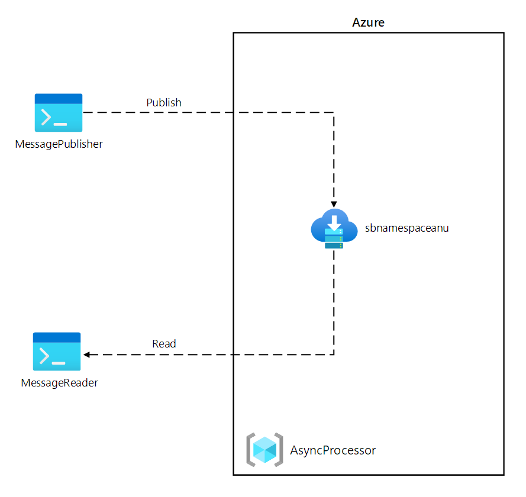

---
lab:
  az204Title: 'Lab 10: Asynchronously process messages by using Azure Service Bus Queues'
  az204Module: 'Learning Path 10: Develop message-based solutions'
---

# Laboratorio 10: Procesamiento asincrónico de mensajes mediante colas de Azure Service Bus

## Interfaz de usuario de Microsoft Azure

Dada la naturaleza dinámica de las herramientas en la nube de Microsoft, puede experimentar cambios en la interfaz de usuario de Azure que se producen después del desarrollo de este contenido de entrenamiento. Como resultado, es posible que las instrucciones y los pasos del laboratorio no se alineen correctamente.

Microsoft actualiza este curso de entrenamiento cuando la comunidad nos alerta de los cambios necesarios. Sin embargo, las actualizaciones en la nube se producen con frecuencia, por lo que es posible que se produzcan cambios en la interfaz de usuario antes de que se actualice este contenido de entrenamiento. **Si esto ocurre, adáptese a los cambios y, a continuación, trabaje con ellos en los laboratorios según sea necesario.**

## Instructions


### Antes de comenzar

#### Inicio de sesión al entorno de laboratorio

Inicie sesión en la máquina virtual (VM) de Windows 10 con las credenciales siguientes:

- Nombre de usuario: `Admin`
- Contraseña: `Pa55w.rd`

> **Nota**: El instructor le proporcionará instrucciones para conectarse al entorno de laboratorio virtual.

#### Revisión de las aplicaciones instaladas

Busque la barra de tareas en el escritorio de Windows 10. La barra de tareas contiene los iconos de las aplicaciones que usará en este laboratorio, entre los que se incluyen:
    
-   Microsoft Edge
-   Visual Studio Code

## Escenario de laboratorio

En este laboratorio, creará una prueba de concepto para este escenario mediante el empleo de una cola de Azure Service Bus. Para demostrar cómo puede funcionar el sistema, creará un proyecto de .NET Core que publicará mensajes en el sistema y una segunda aplicación de .NET Core que leerá mensajes de la cola. La primera aplicación simulará los datos procedentes de un sensor, mientras que la segunda aplicación simulará el sistema que leerá los mensajes de la cola para su procesamiento.

## Diagrama de la arquitectura



### Ejercicio 1: Creación de recursos de Azure

#### Tarea 1: Abra Azure Portal

1. En la barra de tareas, seleccione el icono de **Microsoft Edge**.

1. En la ventana del explorador, vaya a Azure Portal en `https://portal.azure.com` e inicie sesión con la cuenta que va a usar para este laboratorio.

    > **Nota**: Si es la primera vez que inicia sesión en Azure Portal, se le ofrecerá un paseo por el portal. Seleccione **Introducción** para omitir el paseo y empezar a usar el portal.

#### Tarea 2: Creación de una cola de Azure Service Bus

1. En Azure Portal, use el cuadro de texto **Buscar recursos, servicios y documentos** para buscar **Service Bus** y, a continuación, en la lista de resultados, seleccione **Service Bus**.

1. En la hoja **Service Bus**, seleccione **+ Crear**.

1. En la hoja **Crear espacio de nombres**, en la pestaña **Aspectos básicos**, realice las siguientes acciones y seleccione **Revisar y crear**:
        
    | Configuración | Acción |
    | -- | -- |
    | Lista desplegable de **Suscripción** |Conserve los valores predeterminados |
    | Sección **Grupo de recursos**  | Seleccione **Crear nuevo**, escriba **AsyncProcessor** y seleccione **Aceptar**. |
    | Cuadro de texto **Nombre de espacio de nombres**  | Escribir **sbnamespace** _[sunombre]_ |
    | Lista desplegable **Región**  | Seleccionar cualquier región de Azure en la que pueda implementar una instancia de Azure Service Bus |
    | Lista desplegable **Plan de tarifa**  | Seleccione **Básica**. |

    En la captura de pantalla siguiente, se muestran los valores configurados en la pestaña **Aspectos básicos** de la hoja **Crear espacio de nombres**.
    
    
     
1. En la pestaña **Revisar y crear**, revise las opciones que seleccionó durante los pasos anteriores.

1. Seleccione **Crear** para crear el espacio de nombres de **Service Bus** mediante la configuración especificada.

    > **Nota**: Espere a que se complete la tarea de creación antes de continuar con este laboratorio.

1. En la hoja **Implementación**, seleccione el botón **Ir al recurso** para ir a la hoja del espacio de nombres de **Service Bus** recién creado.

1. En la hoja del espacio de nombres de  **Service Bus**, en la sección **Configuración**, seleccione **Directivas de acceso compartido**.

1. En la lista de directivas, seleccione **RootManageSharedAccessKey**.

1. En el panel **Directiva de SAS: RootManageSharedAccessKey**, junto a la entrada **Cadena de conexión principal**, seleccione el botón **Copiar en el Portapapeles** y registre el valor copiado. Lo usará más adelante en este laboratorio.

    > **Nota**: No importa cuál de las dos claves disponibles elija. Son intercambiables.

1. En la hoja del espacio de nombres de  **Service Bus**, en la sección **Entidades**, seleccione **Colas** y, a continuación, **+ Cola**.

1. En la hoja **Crear cola**, revise la configuración disponible, en el cuadro de texto **Nombre**, escriba **messagequeue** y, a continuación, seleccione **Crear**.

1. Seleccione **messagequeue** para mostrar las propiedades de la cola de **Service Bus**.

1. Deje la ventana del explorador abierta. Volverá a usarla en este laboratorio.

#### Revisar

En este ejercicio, ha creado un espacio de nombres de **Azure Service Bus** y una cola de **Service Bus** que usará en el resto del laboratorio.

### Ejercicio 2: Seleccione la hoja Service Bus Explorer (versión preliminar)" with "Seleccione la hoja Service Bus Explorer

#### Tarea 1: Creación de un proyecto de .NET Core

1. En el equipo del laboratorio, inicie Visual Studio Code.

1. En Visual Studio Code, en el menú **Archivo**, seleccione **Abrir carpeta**.

1. En la ventana **Abrir carpeta**, vaya a **Allfiles (F):\\Allfiles\\Labs\\10\\Starter\\MessagePublisher** y, a continuación, seleccione **Seleccionar carpeta**.

1. En la ventana **Visual Studio Code**, en la barra de menús, seleccione **Terminal** y, a continuación, **Nuevo terminal**.

1. En la solicitud del terminal, ejecute el siguiente comando para crear un nuevo proyecto de .NET denominado **MessagePublisher** en la carpeta actual:

    ```
    dotnet new console --framework net6.0 --name MessagePublisher --output .
    ```

    > **Nota**: El comando **dotnet new** creará un nuevo proyecto de **consola** en una carpeta con el mismo nombre que el proyecto.

1. Ejecute el comando siguiente para importar la versión 7.8.1 del paquete **Azure.Messaging.ServiceBus** desde NuGet:

    ```
    dotnet add package Azure.Messaging.ServiceBus --version 7.8.1
    ```

    > **Nota**: El comando **dotnet add package** agregará el paquete **Azure.Messaging.ServiceBus** desde NuGet. Para más información, vaya a [Azure.Messaging.ServiceBus](https://www.nuget.org/packages/Azure.Messaging.ServiceBus/).

1. En la solicitud del terminal, ejecute el siguiente comando para compilar la aplicación de consola de .NET Core:

    ```
    dotnet build
    ```

1. Seleccione **Cerrar el terminal** (el icono de la **papelera de reciclaje**) para cerrar el panel del terminal y los procesos asociados.

#### Tarea 2: Publicación de mensajes en una cola de Azure Service Bus

1. En el panel  **Explorador**  de la ventana **Visual Studio Code**, abra el archivo **Program.cs**.

1. En la pestaña del editor de código del archivo  **Program.cs** , elimine todo el código del archivo existente.

1. Agregue el siguiente código:

    ```csharp
    using System;
    using System.Threading.Tasks;
    using Azure.Messaging.ServiceBus;
    namespace MessagePublisher
    {
        public class Program
        {
            /* The `<serviceBus-connection-string>` placeholder represents
               the connection string to the target Azure Service Bus namespace */
            private const string serviceBusConnectionString = "<serviceBus-connection-string>";

            /* To create a string constant named "queueName" with a value
               of "messagequeue", matching the name of the Service Bus queue.*/
            private const string queueName = "messagequeue";

            /* Stores the number of messages to be sent to the target queue */
            private const int numOfMessages = 3;

            /* To create a Service Bus client that will own the connection to the target queue */
            static ServiceBusClient client = default!;

            /* To create a Service Bus sender that will be 
               used to publish messages to the target queue */
            static ServiceBusSender sender = default!;

            public static async Task Main(string[] args)
            {   
                /* To initialize "client" of type "ServiceBusClient" that will 
                   provide connectivity to the Service Bus namespace and "sender"
                   that will be responsible for sending messages */
                client = new ServiceBusClient(serviceBusConnectionString);
                sender = client.CreateSender(queueName);

                /* To create a "ServiceBusMessageBatch" object that will allow you to combine
                   multiple messages into a batch by using the "TryAddMessage" method */
                using ServiceBusMessageBatch messageBatch = await sender.CreateMessageBatchAsync();

                /* To add messages to a batch and throw an exception if a message
                   size exceeds the limits supported by the batch */
                for (int i = 1; i <= numOfMessages; i++)
                {
                    if (!messageBatch.TryAddMessage(new ServiceBusMessage($"Message {i}")))
                    {
                        throw new Exception($"The message {i} is too large to fit in the batch.");
                    }
                }
                try
                {
                    /* To create a try block, with "sender" asynchronously 
                       publishing messages in the batch to the target queue */
                    await sender.SendMessagesAsync(messageBatch);
                    Console.WriteLine($"A batch of {numOfMessages} messages has been published to the queue.");
                }
                finally
                {
                    /* To create a finally block that asynchronously disposes of the "sender"
                       and "client" objects, releasing any network and unmanaged resources */
                    await sender.DisposeAsync();
                    await client.DisposeAsync();
                }
            }
        }
    }
    ```
    > **Nota**: Actualice la constante de cadena **serviceBusConnectionString** estableciendo su valor en la **Cadena de conexión principal** del espacio de nombres de Service Bus y actualice **queueName** con un valor de **messagequeue** que coincida con el nombre de la cola de Service Bus que creó anteriormente en este ejercicio.

    > **Nota**: El cliente de Service Bus es seguro de almacenar en caché y usar como singleton durante la duración de la aplicación. Esto se considera uno de los procedimientos recomendados para publicar y leer mensajes de forma periódica.

1. Guarde el archivo **Program.cs** .

1. En el símbolo del sistema del terminal, ejecute el siguiente comando para iniciar la aplicación de la consola de .NET Core:

    ```
    dotnet run
    ```

    > **Nota**: Si hay algún error, revise el archivo **Program.cs** en la carpeta **Allfiles (F):\\Allfiles\\Labs\\10\\Solution\\MessagePublisher**.

1. Compruebe que el mensaje de consola que se muestra en la solicitud del terminal indica que se ha publicado un lote de tres mensajes en la cola.

1. Seleccione **Cerrar el terminal** (el icono de la **papelera de reciclaje**) para cerrar el panel del terminal y los procesos asociados.

1. Cambie al explorador de Microsoft Edge que muestra la cola de Service Bus **messagequeue** en Azure Portal.

1. Revise el panel **Essentials** y observe que la cola contiene tres mensajes activos.

    En la captura de pantalla siguiente se muestran las métricas de cola y el recuento de mensajes de Service Bus.
     
    
     
1. Seleccione la hoja **Service Bus Explorer**.

1. En el encabezado de la pestaña **Modo de inspección** y, en la pestaña **Cola**, seleccione el botón **Ver desde el inicio**.

1. Compruebe que la cola contiene tres mensajes.

1. Seleccione el primer mensaje y revise su contenido en el panel**Mensaje**.

    En la captura de pantalla siguiente se muestra el contenido del primer mensaje.
         
    

1. Cierre el panel **Mensaje**.

#### Revisar

En este ejercicio, ha configurado el proyecto de .NET que publicó mensajes en una cola de Azure Service Bus.

### Ejercicio 3: Creación de un proyecto de .NET Core para leer mensajes de una cola de Service Bus

#### Tarea 1: Creación de un proyecto de .NET

1. En el equipo del laboratorio, inicie Visual Studio Code.

1. En Visual Studio Code, en el menú **Archivo**, seleccione **Abrir carpeta**.

1. En la ventana **Abrir carpeta**, vaya a **Allfiles (F):\\Allfiles\\Labs\\10\\Starter\\MessageReader** y, a continuación, seleccione **Seleccionar carpeta**.

1. En la ventana **Visual Studio Code**, en la barra de menús, seleccione **Terminal** y, a continuación, **Nuevo terminal**.

1. En la solicitud del terminal, ejecute el siguiente comando para crear un nuevo proyecto de .NET denominado **MessageReader** en la carpeta actual:

    ```
    dotnet new console --framework net6.0 --name MessageReader --output .
    ```

1. Ejecute el comando siguiente para importar la versión 7.8.1 del paquete **Azure.Messaging.ServiceBus** desde NuGet:

    ```
    dotnet add package Azure.Messaging.ServiceBus --version 7.8.1
    ```

1. En la solicitud del terminal, ejecute el siguiente comando para compilar la aplicación de consola de .NET Core:

    ```
    dotnet build
    ```

1. Seleccione **Cerrar el terminal** (el icono de la **papelera de reciclaje**) para cerrar el panel del terminal y los procesos asociados.

#### Tarea 2: Lectura de mensajes de una cola de Azure Service Bus

1. En el panel  **Explorador**  de la ventana **Visual Studio Code**, abra el archivo **Program.cs**.

1. En la pestaña del editor de código del archivo  **Program.cs** , elimine todo el código del archivo existente.

1. Agregue el siguiente código:

    ```csharp
    using System;
    using System.Threading.Tasks;
    using Azure.Messaging.ServiceBus;
    namespace MessageReader
    {
        class Program
        {   
            /* The `<serviceBus-connection-string>` placeholder represents
               the connection string to the target Azure Service Bus namespace */
            static string serviceBusConnectionString = "<serviceBus-connection-string>";
            
            /* To create a string constant named "queueName" with a value
               of "messagequeue", matching the name of the Service Bus queue.*/
            static string queueName = "messagequeue";
            static ServiceBusClient client= default!;

            /* Create a ServiceBusProcessor that will be used to process messages from the queue */
            static ServiceBusProcessor processor = default!;


            static async Task MessageHandler(ProcessMessageEventArgs args)
            {   
                /* To create a static async "MessageHandler" task that displays 
                   the body of messages in the queue as they are being processed 
                   and deletes them after the processing completes */

                string body = args.Message.Body.ToString();
                Console.WriteLine($"Received: {body}");
                await args.CompleteMessageAsync(args.Message);
            }
            static Task ErrorHandler(ProcessErrorEventArgs args)
            {   
                /* To create a static async "ErrorHandler" task that manages 
                   any exceptions encountered during message processing */
                Console.WriteLine(args.Exception.ToString());
                return Task.CompletedTask;
            }

            static async Task Main()
            {   
                /* To initialize "client" of type "ServiceBusClient" that will provide 
                   connectivity to the Service Bus namespace and "processor" that will
                   be responsible for processing of messages */
                client = new ServiceBusClient(serviceBusConnectionString);
                processor = client.CreateProcessor(queueName, new ServiceBusProcessorOptions());
                try
                {   
                    /* To create a try block, which first implements a message and error
                        processing handler, initiates message processing, and stops
                        processing following a user input */
                    processor.ProcessMessageAsync += MessageHandler;
                    processor.ProcessErrorAsync += ErrorHandler;

                    await processor.StartProcessingAsync();
                    Console.WriteLine("Wait for a minute and then press any key to end the processing");
                    Console.ReadKey();

                    Console.WriteLine("\nStopping the receiver...");
                    await processor.StopProcessingAsync();
                    Console.WriteLine("Stopped receiving messages");
                }
                finally
                {
                   /* To create a finally block that asynchronously disposes of the "processor"
                       and "client" objects, releasing any network and unmanaged resources */
                    await processor.DisposeAsync();
                    await client.DisposeAsync();
                }
            }
        }
    }
    ```

    > **Nota:** Actualice la constante de cadena **serviceBusConnectionString** estableciendo su valor en la **Cadena de conexión principal** del espacio de nombres de **Service Bus** que registró anteriormente en este laboratorio.   

1. Guarde el archivo **Program.cs** .

1. En el símbolo del sistema del terminal, ejecute el siguiente comando para iniciar la aplicación de la consola de .NET Core:

    ```
    dotnet run
    ```

    > **Nota**: Si hay algún error, revise el archivo **Program.cs** en la carpeta **Allfiles (F):\\Allfiles\\Labs\\10\\Solution\\MessageReader**.

1. Compruebe que el mensaje de la consola que se muestra en la solicitud del terminal indica que se han recibido los tres mensajes en la cola.

1. En la solicitud del terminal, presione cualquier tecla para detener el receptor y finalizar la ejecución de la aplicación.

1. Seleccione **Cerrar el terminal** (el icono de la **papelera de reciclaje**) para cerrar el panel del terminal y los procesos asociados.

1. Vuelva a cambiar al explorador de Microsoft Edge que muestra la cola de Service Bus **messagequeue** en Azure Portal.

1. En la hoja **Service Bus Explorer (versión preliminar)**,seleccione **Ver desde el inicio** y observe que el número de mensajes activos en la cola ha cambiado a **0**.

#### Revisar

En este ejercicio, leerá y eliminará mensajes de la cola de Azure Service Bus mediante la biblioteca .NET.
