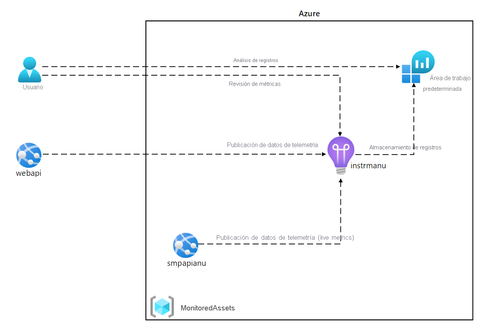
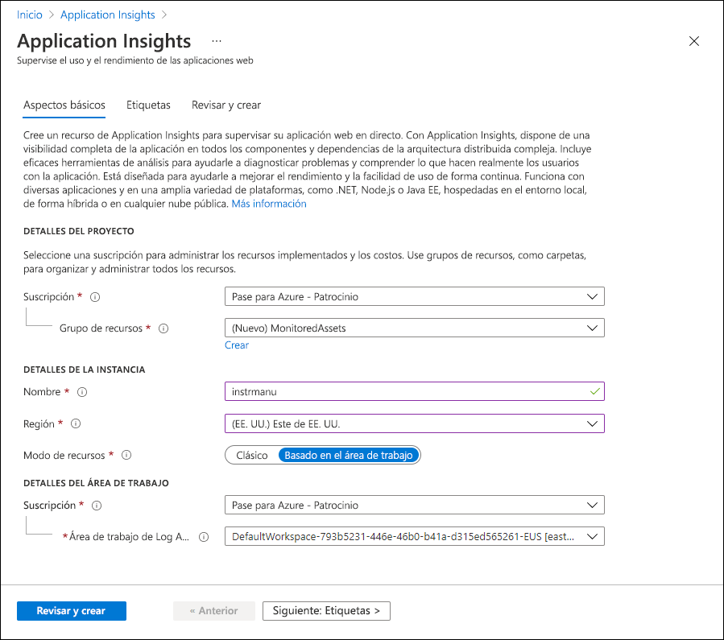
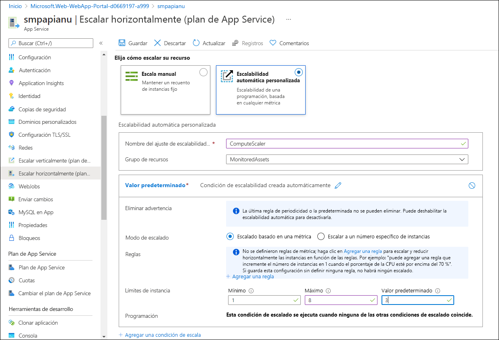
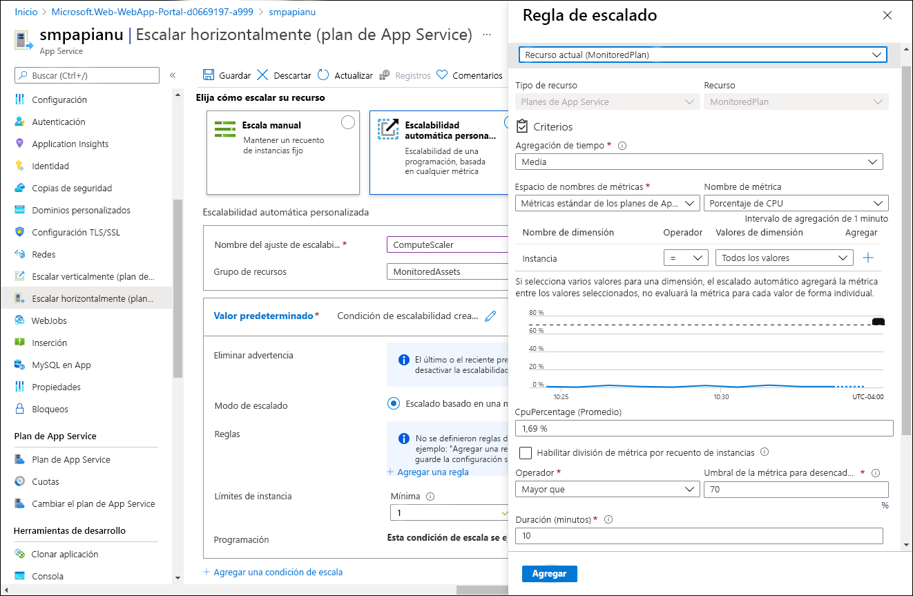
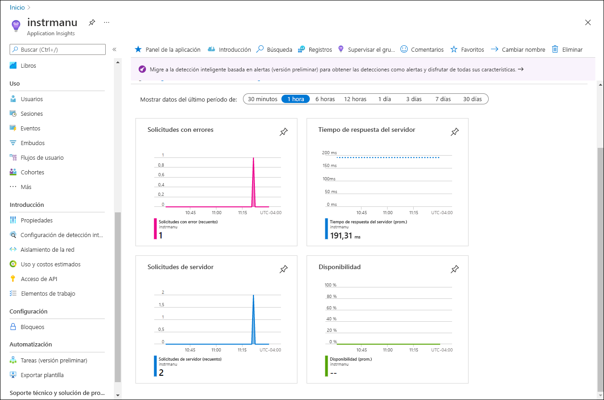
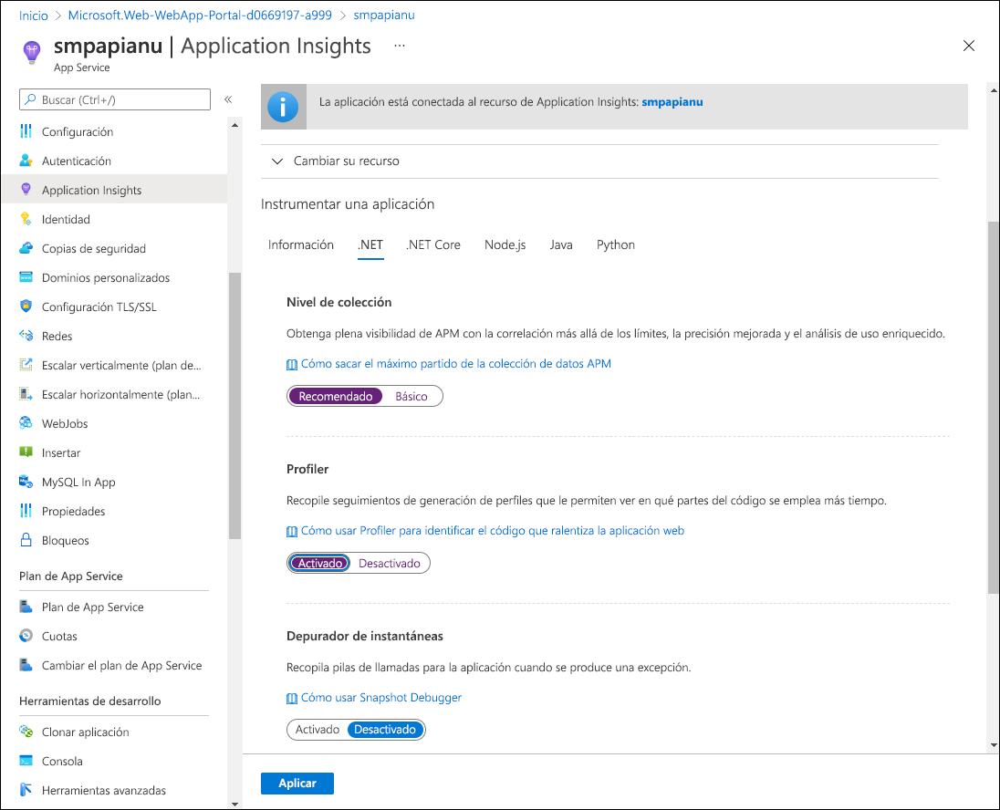
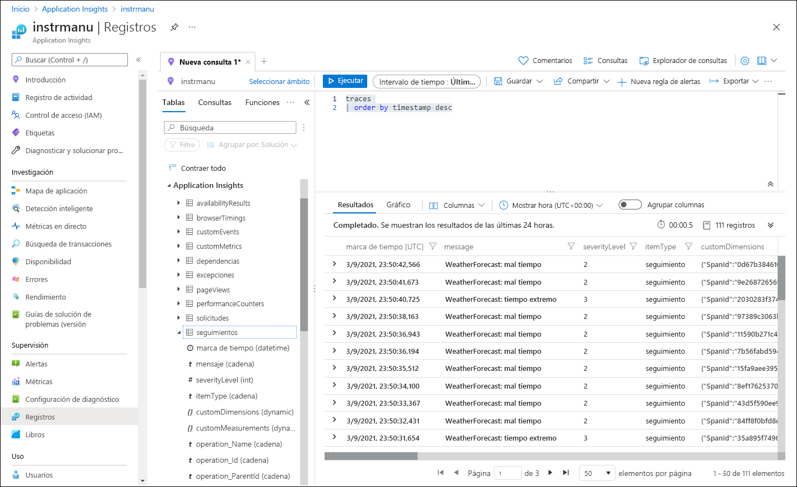

---
lab:
  az204Title: 'Lab 11: Monitor services that are deployed to Azure'
  az020Title: 'Lab 11: Monitor services that are deployed to Azure'
  az204Module: 'Module 11: Monitor and optimize Azure solutions'
  az020Module: 'Module 11: Monitor and optimize Azure solutions'
ms.openlocfilehash: 6bb60fb2329b8c55885d9d37abfe1c17bec762c0
ms.sourcegitcommit: ddc44a8b5edc7ce2d93849bcab6c6a83dee1c99b
ms.translationtype: HT
ms.contentlocale: es-ES
ms.lasthandoff: 04/29/2022
ms.locfileid: "144404802"
---
# <a name="lab-11-monitor-services-that-are-deployed-to-azure"></a>Laboratorio 11: Supervisión de los servicios que se implementan en Azure

## <a name="microsoft-azure-user-interface"></a>Interfaz de usuario de Microsoft Azure

Dada la naturaleza dinámica de las herramientas en la nube de Microsoft, puede experimentar cambios en la interfaz de usuario de Azure que se producen después del desarrollo de este contenido de entrenamiento. Como resultado, es posible que las instrucciones y los pasos del laboratorio no se alineen correctamente.

Microsoft actualiza este curso de entrenamiento cuando la comunidad nos alerta de los cambios necesarios. Sin embargo, las actualizaciones en la nube se producen con frecuencia, por lo que es posible que se produzcan cambios en la interfaz de usuario antes de que se actualice este contenido de entrenamiento. **Si esto ocurre, adáptese a los cambios y, a continuación, trabaje con ellos en los laboratorios según sea necesario.**

## <a name="instructions"></a>Instructions

### <a name="before-you-start"></a>Antes de comenzar

#### <a name="sign-in-to-the-lab-environment"></a>Inicio de sesión en el entorno de laboratorio

Inicie sesión en la máquina virtual (VM) de Windows 10 con las credenciales siguientes:
    
-   Nombre de usuario: **Admin**

-   Contraseña: **Pa55w.rd**.

> **Nota**: El instructor le proporcionará instrucciones para conectarse al entorno de laboratorio virtual.

#### <a name="review-the-installed-applications"></a>Revisión de las aplicaciones instaladas

Busque la barra de tareas en el escritorio de Windows 10. La barra de tareas contiene los iconos de las aplicaciones que usará en este laboratorio, entre los que se incluyen:
    
-   Microsoft Edge

-   Explorador de archivos

-   Visual Studio Code

-   Azure PowerShell

## <a name="architecture-diagram"></a>Diagrama de la arquitectura



### <a name="exercise-1-create-and-configure-azure-resources"></a>Ejercicio 1: Implementación y configuración de los recursos de Azure

#### <a name="task-1-open-the-azure-portal"></a>Tarea 1: Abra Azure Portal

1.  En la barra de tareas, seleccione el icono de **Microsoft Edge**.

1.  En la ventana del explorador, vaya a Azure Portal ([portal.azure.com](https://portal.azure.com)) y, a continuación, inicie sesión con la cuenta que va a usar para este laboratorio.

    > **Nota**: Si es la primera vez que inicia sesión en Azure Portal, se le ofrecerá un paseo por el portal. Seleccione **Introducción** para omitir el paseo y empezar a usar el portal.

#### <a name="task-2-create-an-application-insights-resource"></a>Tarea 2: Cree un recurso de Application Insights

1.  En Azure Portal, use el cuadro de texto **Buscar recursos, servicios y documentos** en la parte superior de la página para buscar **Application Insights** y, a continuación, en la lista de resultados, seleccione **Application Insights**.

1.  En la hoja **Application Insights** seleccione **+ Crear**.

1.  En la hoja **Application Insights**, en la pestaña **Aspectos básicos**, realice las siguientes acciones y seleccione **Revisar y crear**:
    
    | Configuración                         | Acción                                                       |
    | ------------------------------- | ------------------------------------------------------------ |
    | Lista desplegable de **Suscripción** | Conserve los valores predeterminados.                                    |
    | Sección **Grupo de recursos**      | Seleccione **Crear nuevo**, escriba **MonitoredAssets** y seleccione **Aceptar**. |
    | Cuadro de texto de **nombre**     | **instrm** _[su nombre]_ .                           |
    | Lista desplegable de **región**       | Seleccione cualquier región de Azure en la que pueda implementar una instancia de Azure Service Bus. |
    | Sección **Modo de recursos** | Seleccione la opción **Basada en área de trabajo**.|
    | Sección **DETALLES DEL ÁREA DE TRABAJO** | Conserve los valores predeterminados de las listas desplegables **Suscripción** y **Área de trabajo de Log Analytics**.|
    
    En la captura de pantalla siguiente, se muestran los valores configurados en la hoja **Application Insights**.

       
     
1.  En la pestaña **Revisar y crear**, revise las opciones que seleccionó durante los pasos anteriores.

1.  Seleccione **Crear** para crear la instancia de **Application Insights** mediante la configuración especificada.

    > **Nota**: Espere a que se complete la tarea de creación antes de continuar con este laboratorio.

1.  En la hoja **Información general\| de Microsoft.AppInsights**, seleccione el botón **Ir al recurso** para ir a la hoja del recurso recién creado de **Application Insights**.

1.  En la hoja de **Application Insights**, en la sección **Configurar**, seleccione el vínculo **Propiedades**.

1.  En la hoja **Propiedades**, junto a la entrada **Clave de instrumentación**, seleccione el botón **Copiar en el portapapeles** y, a continuación, registre el valor copiado. Lo usará más adelante en este laboratorio.

    > **Nota**: Las aplicaciones cliente usan la clave para conectarse a un recurso específico de **Application Insights**.

### <a name="task-3-create-an-azure-web-api-resource"></a>Tarea 3: Creación de un recurso de API web de Azure

1.  En Azure Portal, use el cuadro de texto **Buscar recursos, servicios y documentos** en la parte superior de la página para buscar **App Services** y, a continuación, en la lista de resultados, seleccione **App Services**.

1.  En la hoja **App Services**, seleccione **+ Crear**.
    
1.  En la hoja **Crear aplicación web**, en la pestaña **Aspectos básicos**, realice las siguientes acciones y, a continuación, seleccione **Siguiente: Implementación**:

    | Configuración                         | Acción                                                       |
    | ------------------------------- | ------------------------------------------------------------ |
    | Lista desplegable de **Suscripción** | Conserve los valores predeterminados.                                    |
    | Lista desplegable del **grupo de recursos**      |Seleccione **MonitoredAssets**. |
    | Cuadro de texto de **nombre**     | Escriba **smpapi** _[sunombre]_ |
    | Sección **Publicar**       | Seleccione **Código**. |
    | Lista desplegable de la **pila en tiempo de ejecución** | Seleccione **.NET Core 3.1 (LTS)** .|
    | Sección del **sistema operativo** |  Seleccione **Windows**.|
    | Lista desplegable de **región** |  Seleccione la misma región que eligió como ubicación del recurso de la **instancia de Application**. |
    | Sección **Plan de App Service** |  Seleccione **Crear nuevo**. |
    | Cuadro de texto de **nombre** |  Escriba **MonitoredPlan** y seleccione **Aceptar**.|
    |  Sección **SKU y tamaño** |  Conserve los valores predeterminados. |

1.  En la pestaña **Implementación**, seleccione **Siguiente: Supervisión**.

1.  En la pestaña **Supervisión**, realice las siguientes acciones y, a continuación, seleccione **Revisar y crear**:

    | Configuración                         | Acción                                                       |
    | ------------------------------- | ------------------------------------------------------------ |
    | Sección **Habilitar Application Insights** | Asegúrese de que está seleccionada la opción **Sí**.                                    |
    | Lista desplegable de **Application Insights**     | Seleccione el recurso de Application Insights de **instrm** _[su nombre]_ que creó anteriormente en este laboratorio.|

1.  En la pestaña **Revisar y crear**, revise las opciones que seleccionó durante los pasos anteriores.

1.  Seleccione **Crear** para crear la API web mediante la configuración especificada.

    > **Nota**: Espere a que se complete la tarea de creación antes de continuar con este laboratorio.

1.  En la hoja **Información general**, seleccione el botón **Ir al recurso** para ir a la hoja de la API web de Azure recién creada.

1.  En la hoja de **App Service**, en la sección **Configuración**, seleccione el vínculo **Configuración**.

1.  En la sección **Configuración**, realice los pasos siguientes:

    a.  En la pestaña **Configuración de la aplicación**, seleccione **Mostrar valores** para mostrar los secretos asociados a la API web.

    b.  Anote el valor que representa la clave **APPINSIGHTS\_INSTRUMENTATIONKEY**. Este valor se estableció automáticamente al crear el recurso de API web.

1.  En la hoja de **App Service**, en la sección **Configuración**, seleccione el vínculo **Propiedades**.

1.  En la sección **Propiedades**, registre el valor del vínculo de **dirección URL**. Usará este valor más adelante en el laboratorio para enviar solicitudes a la API web.

#### <a name="task-4-configure-web-api-autoscale-options"></a>Tarea 4: Configuración de opciones de escalado automático de API web

1.  En la hoja de **App Service**, en la sección **Configuración**, seleccione el vínculo **Escalar horizontalmente (plan de App Service)** .

1.  En la sección **Escalar horizontalmente**, realice las siguientes acciones y, a continuación, seleccione **Guardar**:

    | Configuración                         | Acción                                                       |
    | ------------------------------- | ------------------------------------------------------------ |
    | Sección de **escalabilidad horizontal** | Seleccione **Escalabilidad automática personalizada**.|
    | Cuadro de texto del **Nombre de la configuración de escalado automático**     | Escriba **ComputeScaler**.|
    | Lista desplegable del **grupo de recursos**     |Seleccione **MonitoredAssets**. |
    | Sección **Modo de escalado**      | Seleccione **Escalar en función de una métrica**. |
    | Cuadro de texto **Mínimo** de la sección **Límites de instancia** | Escriba **2**.|
    | Cuadro de texto **Máximo** de la sección **Límites de instancia** | Escriba **8**.|
    | Cuadro de texto **Predeterminado** de la sección **Límites de instancia** | Escriba **3**. |

    En la captura de pantalla siguiente se muestran los valores configurados en la sección **Escalabilidad horizontal** de la hoja **App Service**.

    

    | Configuración                         | Acción                                                       |
    | ------------------------------- | ------------------------------------------------------------ |
    | Sección **Reglas** |  Seleccione **Agregar una regla**.|
    | Hoja **Regla de escalado** | Acepte los valores predeterminados para el resto de opciones y seleccione **Agregar**.|

    En la captura de pantalla siguiente se muestran los valores configurados adicionales en la sección **Escalabilidad horizontal** de la hoja **App Service**.

    

    > **Nota**: Espere a que se complete la operación de guardado antes de continuar con este laboratorio.

#### <a name="review"></a>Revisar

En este ejercicio, ha creado los recursos de Azure que usará para el resto del laboratorio.

### <a name="exercise-2-monitor-a-local-web-api-by-using-application-insights"></a>Ejercicio 2: Supervisión de una API web local mediante Application Insights

#### <a name="task-1-build-a-net-web-api-project"></a>Tarea 1: Compilación de un proyecto de API web de .NET

1.  En el equipo del laboratorio, inicie **Visual Studio Code**.

1.  En Visual Studio Code, en el menú **Archivo**, seleccione **Abrir archivo**.

1.  En la ventana **Abrir carpeta** vaya a **Allfiles (F):\\Allfiles\\Laboratorios\\11\\Inicio\\API**, y seleccione **Seleccionar carpeta**.

1.  En **Visual Studio Code**, active el menú contextual y, a continuación, seleccione **Abrir en el terminal integrado**.

1.  En el símbolo del sistema del terminal, ejecute el siguiente comando para crear una nueva aplicación de API web de .NET denominada **SimpleApi** en el directorio actual:

    ```
    dotnet new webapi --output . --name SimpleApi
    ```

1.  Ejecute el siguiente comando para importar la versión 2.18.0 de **Microsoft.ApplicationInsights** desde NuGet al proyecto actual:

    ```
    dotnet add package Microsoft.ApplicationInsights --version 2.18.0
    ```

    > **Nota**: El comando **dotnet add package** agregará el paquete **Microsoft.ApplicationInsights** desde NuGet. Para obtener más información, consulte este [Microsoft.ApplicationInsights](https://www.nuget.org/packages/Microsoft.ApplicationInsights/).

1.  Ejecute el siguiente comando para importar la versión 2.18.0 de **Microsoft.ApplicationInsights.AspNetCore** desde NuGet:

    ```
    dotnet add package Microsoft.ApplicationInsights.AspNetCore --version 2.18.0
    ```

    > **Nota**: El comando **dotnet add package** agregará el paquete **Microsoft.ApplicationInsights.AspNetCore** desde NuGet. Para obtener más información, consulte este [Microsoft.ApplicationInsights.AspNetCore](https://www.nuget.org/packages/Microsoft.ApplicationInsights.AspNetCore).

1.  En el símbolo del sistema del terminal, ejecute el siguiente comando para importar la versión 2.18.0 de **Microsoft.ApplicationInsights.PerfCounterCollector** desde NuGet al proyecto actual:

    ```
    dotnet add package Microsoft.ApplicationInsights.PerfCounterCollector --version 2.18.0
    ```

    > **Nota**: El comando **dotnet add package** agregará el paquete **Microsoft.ApplicationInsights.PerfCounterCollector** desde NuGet. Para obtener más información, consulte [Microsoft.ApplicationInsights.PerfCounterCollector](https://www.nuget.org/packages/Microsoft.ApplicationInsights.PerfCounterCollector/).

1.  En el símbolo del sistema del terminal, ejecute el siguiente comando para compilar la API web de .NET:

    ```
    dotnet build
    ```

#### <a name="task-2-update-app-code-to-disable-https-and-use-application-insights"></a>Tarea 2: Actualización del código de la aplicación para deshabilitar HTTPS y uso de Application Insights

1.  En la ventana de **Visual Studio Code**, en el panel **Explorador**, seleccione el archivo **Startup.cs** para abrir el archivo en el panel del **editor**.

1.  En el panel del **editor**, en la clase **Startup**, busque y elimine el código siguiente en la línea 39:

    ```csharp
    app.UseHttpsRedirection();
    ```

    > **Nota**: Esta línea de código obliga a la API web a usar HTTPS. Para este laboratorio, esto no es necesario.

1.  Al principio de la definición de la clase **Startup**, agregue una nueva constante de cadena estática denominada **INSTRUMENTATION_KEY** con el valor establecido en la clave de instrumentación de recursos de Application Insights que registró anteriormente en este laboratorio:

    ```csharp
    private const string INSTRUMENTATION_KEY = "instrumentation_key";
    ```

    > **Nota**: Por ejemplo, si la clave de instrumentación es `d2bb0eed-1342-4394-9b0c-8a56d21aaa43`, esa línea de código sería `private const string INSTRUMENTATION_KEY = "d2bb0eed-1342-4394-9b0c-8a56d21aaa43";`.

1.  Busque el método **ConfigureServices** en la clase **Startup**:

    ```csharp
    public void ConfigureServices(IServiceCollection services)
    {
        services.AddControllers();
    }
    ```

1.  A partir de una nueva línea, agregue el código siguiente al final del método **ConfigureServices** para configurar Application Insights mediante la clave de instrumentación proporcionada:

    ```csharp
    services.AddApplicationInsightsTelemetry(INSTRUMENTATION_KEY);
    ```

1.  Revise el método **ConfigureServices**, que ahora debe contener el código siguiente:

    ```csharp
    public void ConfigureServices(IServiceCollection services)
    {
        services.AddControllers();
        services.AddApplicationInsightsTelemetry(INSTRUMENTATION_KEY);        
    }
    ```

1.  Guarde el archivo **Startup.cs**.

1.  En el símbolo del sistema del terminal, ejecute el siguiente comando para compilar la API web de .NET.

    ```
    dotnet build
    ```

#### <a name="task-3-test-an-api-application-locally"></a>Tarea 3: Prueba local de una aplicación de API

1.  En el símbolo del sistema del terminal, ejecute el siguiente comando y, a continuación, seleccione **Entrar** para crear un certificado. Seleccione **SÍ** en la opción que se le muestra.

    ```
    dotnet dev-certs https --trust
    ```

1.  En el símbolo del sistema del terminal, ejecute el siguiente comando para iniciar la API web de .NET.

    ```
    dotnet run
    ```

1.  En la barra de tareas, abra el menú contextual de **Microsoft Edge** y, a continuación, abra una nueva ventana del explorador.

1.  En la ventana del explorador que se abre, vaya a la página en la que la dirección URL contiene la ruta de acceso relativa **/weatherforecast** de la API web, que en este momento se hospeda en **localhost** en el puerto **5000**.
    
    > **Nota**: La dirección URL completa es `http://localhost:5000/weatherforecast`.

    > **Nota**: La página debe contener una salida con el formato siguiente:

    ```
    [{"date":"2021-09-04T10:15:04.0969996-07:00","temperatureC":54,"temperatureF":129,"summary":"Sweltering"},{"date":"2021-09-05T10:15:04.0972401-07:00","temperatureC":44,"temperatureF":111,"summary":"Balmy"},{"date":"2021-09-06T10:15:04.0976549-07:00","temperatureC":41,"temperatureF":105,"summary":"Scorching"},{"date":"2021-09-07T10:15:04.0976613-07:00","temperatureC":-4,"temperatureF":25,"summary":"Freezing"},{"date":"2021-09-08T10:15:04.0976618-07:00","temperatureC":33,"temperatureF":91,"summary":"Balmy"}]
    ```

1.  Cierre la ventana del explorador que muestra la página generada mediante `http://localhost:5000/weatherforecast`.

1.  En Visual Studio Code, seleccione **Cerrar el terminal** (el icono de la **papelera de reciclaje**) para cerrar el panel del **terminal** y los procesos asociados.

#### <a name="task-4-review-metrics-in-application-insights"></a>Tarea 4: Revisión de métricas en Application Insights

1.  En el equipo de laboratorio, vaya a la ventana del explorador **Microsoft Edge** que muestra Azure Portal.

1.  En Azure Portal, vuelva a la hoja del recurso de Application Insights **instrm** _[su nombre]_ que creó anteriormente en este laboratorio.

1.  En la hoja **Application Insights**, en los iconos del centro de la hoja, busque las métricas que se muestran. En concreto, busque el número de solicitudes de servidor que se han producido y el tiempo medio de respuesta del servidor.

    En la captura de pantalla siguiente se muestran las métricas de **Application Insights** de la aplicación web local.

    

    > **Nota**: Puede tardar hasta cinco minutos en observar las solicitudes en los gráficos de métricas de Application Insights.

#### <a name="review"></a>Revisar

En este ejercicio, ha creado una aplicación de API mediante ASP.NET y la ha configurado para transmitir métricas de aplicación a Application Insights. A continuación, usó el panel de Application Insights para revisar los detalles de rendimiento sobre la API.

### <a name="exercise-3-monitor-a-web-api-using-application-insights"></a>Ejercicio 3: Supervisión de una API web mediante Application Insights

#### <a name="task-1-deploy-an-application-to-the-web-api"></a>Tarea 1: Implementación de una aplicación en la API web

1.  En el equipo de laboratorio, cambie a Visual Studio Code.

1.  En la ventana de **Visual Studio Code**, en el panel del **Explorador**, vaya al directorio **bin\Debug\netcoreapp3.1**.

    > **Nota**: Para verificar que está en el directorio **bin\Debug\netcoreapp3.1**, en Visual Studio Code, en el menú Archivo, seleccione Abrir carpeta y vaya a **Allfiles (F):\\Allfiles\\Labs\\11\\Starter\\Api\\bin\\Debug\\netcoreapp3.1** y después seleccione **Seleccionar carpeta**.

1.  Agregue un archivo denominado **web.config** al directorio.

1.  Abra el archivo **web.config** y agregue el siguiente contenido:

    ```
    <?xml version="1.0" encoding="utf-8"?>
    <configuration>
      <location path="." inheritInChildApplications="false">
        <system.webServer>
          <handlers>
            <add name="aspNetCore" path="*" verb="*" modules="AspNetCoreModuleV2" resourceType="Unspecified" />
          </handlers>
          <aspNetCore processPath="dotnet" arguments=".\SimpleApi.dll" stdoutLogEnabled="false" stdoutLogFile=".\logs\stdout" hostingModel="inprocess" />
        </system.webServer>
      </location>
    </configuration>
    ```

1.  Guarde y cierre el archivo.

1.  En **Visual Studio Code**, active el menú contextual y, a continuación, seleccione **Abrir en el terminal integrado**.

1.  En el símbolo del sistema del terminal, ejecute el siguiente comando para asegurarse de que el directorio actual está establecido en **Allfiles (F):\\Allfiles\\Laboratorios\\11\\Inicio\\API\\papelera\\Depurar\\netcoreapp3.1**, donde residen los archivos de implementación:

    ```
    cd F:\Allfiles\Labs\11\Starter\Api\bin\Debug\netcoreapp3.1
    ```

1.  Ejecute el siguiente comando para crear un archivo ZIP que contenga el proyecto de inicio que implementará junto a la API web de Azure:

    ```powershell
    Compress-Archive -Path * -DestinationPath api.zip
    ```

1.  En el símbolo de sistema del terminal, ejecute el siguiente comando para iniciar sesión en la suscripción de Azure mediante Azure PowerShell:

    ```powershell
    Connect-AzAccount
    ```

1.  Siga las instrucciones que se muestran en el símbolo de sistema del terminal; para ello, cambie al explorador Microsoft Edge que muestra Azure Portal, abra otra pestaña en la ventana del explorador, vaya a `https://microsoft.com/devicelogin` y, cuando se le solicite, escriba el código proporcionado, inicie sesión con la cuenta que va a usar en este laboratorio.

    > **Nota**: Espere a que termine el proceso de inicio de sesión.

1.  Cierre la pestaña del explorador recién abierta y vuelva al símbolo del sistema del terminal en la ventana de Visual Studio Code.

1.  Ejecute el siguiente comando para mostrar la lista de todas las aplicaciones web en el grupo de recursos **MonitoredAssets**:

    ```powershell
    Get-AzWebApp -ResourceGroupName MonitoredAssets
    ```

1.  Ejecute el siguiente comando para mostrar la lista de todas las aplicaciones web en el grupo de recursos **MonitoredAssets** cuyo nombre comienza por **smpapi\*** :

    ```powershell
    Get-AzWebApp -ResourceGroupName MonitoredAssets | Where-Object {$_.Name -like 'smpapi*'}
    ```

1.  Ejecute los siguientes comandos para mostrar el nombre de la primera de las aplicaciones web identificadas en el paso anterior y almacenarlo en una variable denominada **$webAppName**:

    ```powershell
    Get-AzWebApp -ResourceGroupName MonitoredAssets | Where-Object {$_.Name -like 'smpapi*'} | Select-Object -ExpandProperty Name
    $webAppName = (Get-AzWebApp -ResourceGroupName MonitoredAssets | Where-Object {$_.Name -like 'smpapi*'})[0] | Select-Object -ExpandProperty Name
    ```

1.  Ejecute el siguiente comando para implementar el archivo **api.zip** que creó anteriormente en esta tarea en la API web cuyo nombre identificó en el paso anterior:

    ```powershell
    az webapp deployment source config-zip --resource-group MonitoredAssets --src api.zip --name $webAppName
    ```

    > **Nota**: Si se le pide que se autentique, ejecute `az login` y siga las instrucciones para completar el proceso de inicio de sesión.

    > **Nota**: Espere a que se complete la operación de implementación antes de continuar con este laboratorio.

    > **Nota**: Revise la salida del comando y compruebe que `provisioningState` está establecido en `Succeeded`. La salida del comando debe tener el siguiente formato:

    ```
    Getting scm site credentials for zip deployment
    Starting zip deployment. This operation can take a while to complete ...
    Deployment endpoint responded with status code 202
    {
        "active": true,
        "author": "N/A",
        "author_email": "N/A",
        "complete": true,
        "deployer": "ZipDeploy",
        "end_time": "2021-09-03T17:02:18.124062Z",
        "id": "f5fb8ef6a11d4f8387f09dc47628007e",
        "is_readonly": true,
        "is_temp": false,
        "last_success_end_time": "2021-09-03T17:02:18.124062Z",
        "log_url": "https://smpapianu.scm.azurewebsites.net/api/deployments/latest/log",
        "message": "Created via a push deployment",
        "progress": "",
        "provisioningState": "Succeeded",
        "received_time": "2021-09-03T17:02:11.942626Z",
        "site_name": "smpapianu",
        "start_time": "2021-09-03T17:02:12.1613438Z",
        "status": 4,
        "status_text": "",
        "url": "https://smpapianu.scm.azurewebsites.net/api/deployments/latest"
    }
    ```

1.  En el equipo del laboratorio, inicie otra ventana del explorador Microsoft Edge.

1.  En la ventana del explorador, vaya a la aplicación de API web de Azure en la que implementó la aplicación de API anteriormente en esta tarea anexando a su dirección URL (que registró anteriormente en este laboratorio) el sufijo **/weatherforecast**.

    > **Nota**: Por ejemplo, si la dirección URL es `https://smpapianu.azurewebsites.net`, la nueva dirección URL será `https://smpapianu.azurewebsites.net/weatherforecast`.

1.  Compruebe que la salida es similar a la generada al ejecutar la aplicación de API localmente.

    > **Nota**: La salida incluirá valores diferentes, pero debe tener el mismo formato.

    > **Nota**: Si se produce una excepción, asegúrese de que el contenido del archivo **web.config** coincide con el ejemplo mostrado anteriormente en esta tarea. Si no coincide, realice los cambios necesarios y vuelva a generar el archivo **api.zip** y vuelva a realizar la implementación.

#### <a name="task-2-configure-in-depth-metric-collection-for-web-apps"></a>Tarea 2: Configuración de la recopilación de métricas detallada para Web Apps

1.  En el equipo de laboratorio, vaya a la ventana del explorador **Microsoft Edge** que muestra Azure Portal.

1.  En Azure Portal, vuelva a la hoja del recurso de aplicación web **smpapi** _[su nombre]_ que creó anteriormente en este laboratorio.

1.  En la hoja **App Service**, seleccione **Application Insights**.

1.  En la hoja **Application Insights**, realice las siguientes acciones, seleccione **Aplicar** y, a continuación, en el cuadro de diálogo de confirmación y seleccione **Sí**:

    | Configuración                         | Acción                                                       |
    | ------------------------------- | ------------------------------------------------------------ |
    | Control deslizante de **Application Insights** | Asegúrese de que esté establecido en **Habilitar**.|
    | Sección de la **Instrumentación de la aplicación**    | Seleccione la pestaña **.NET Core**.|
    | Sección del **nivel de colección**    | Selección de elementos **Recomendados**. |
    | Sección **Profiler**      | Seleccione **Activado**.|
    | Sección del **depurador de instantáneas** | seleccione **Desactivado**.|
    | Sección de **comandos SQL** | seleccione **Desactivado**.|


    En la captura de pantalla siguiente, se muestra la configuración de **Application Insights** de la API web de Azure.

    

1.  Cambie a la pestaña del explorador que abrió en la tarea anterior para mostrar los resultados de la implementación de la aplicación de API en la aplicación de API de destino de Azure (incluida la ruta de acceso relativa **/weatherforecast** en la dirección URL de destino) y actualice la página del explorador varias veces.

1.  Revise la salida con formato JSON que haya generado la API.

1.  Registre la dirección URL que usó para acceder a la salida con formato JSON.

    > **Nota**: La dirección URL debe tener el formato `https://smpapianu.azurewebsites.net/weatherforecast` si el nombre del sitio que creó anteriormente era **smpapianu**.

#### <a name="task-3-get-updated-metrics-in-application-insights"></a>Tarea 3: Obtención de métricas actualizadas en Application Insights

1.  Vuelva a la ventana del explorador que muestra la aplicación web de Azure en Azure Portal.

1.  En la hoja **Application Insights** de la aplicación web, seleccione el vínculo **Ver los datos de Application Insights**.

1.  En la hoja **Application Insights**, revise las métricas recopiladas en los iconos del centro de la hoja, incluido el número de solicitudes de servidor que se han producido y el tiempo medio de respuesta del servidor.

    En la captura de pantalla siguiente se muestran las métricas de **Application Insights** de la aplicación web de Azure en Azure Portal.

    

    > **Nota**: Las métricas actualizadas pueden tardar hasta cinco minutos en aparecer en los gráficos de métricas de Application Insights.

#### <a name="task-4-view-real-time-metrics-in-application-insights"></a>Tarea 4: Visualización de métricas en tiempo real en Application Insights

1.  En la hoja **Application Insights**, en la sección **Investigar**, haga clic en **Métricas activas**.

1.  Vuelva a la ventana del explorador que muestra la aplicación de API de destino que se ejecuta en la aplicación web de Azure de destino (que tiene como destino la ruta de acceso relativa **/weatherforecast** en la dirección URL de destino) y, a continuación, actualice la página del explorador varias veces.

1.  Cambie a la ventana del explorador que muestra la hoja **Métricas activas** y revise su contenido.

    > **Nota**: La sección **Solicitudes entrantes** debe actualizarse en cuestión de segundos y mostrar las solicitudes realizadas a la API web.

### <a name="exercise-4-application-insights-logging-with-net-core"></a>Ejercicio 4: Registro de Application Insights con .NET Core

#### <a name="task-1-configure-logging-for-a-net-core-api-app"></a>Tarea 1: Configuración del registro para una aplicación de API de .NET Core

1.  Cambie a la ventana de **Visual Studio Code**.

1.  En el símbolo del sistema del terminal, ejecute el siguiente comando para asegurarse de que el directorio actual está establecido en **Allfiles (F):\\Allfiles\\Labs\\11\\Starter\\Api**, donde residen los archivos de implementación:

    ```
    cd F:\Allfiles\Labs\11\Starter\Api
    ```

1.  Ejecute el siguiente comando para importar la versión 2.18.0 de **Microsoft.Extensions.Logging.ApplicationInsights** desde NuGet al proyecto actual:

    ```
    dotnet add package Microsoft.Extensions.Logging.ApplicationInsights --version 2.18.0
    ```

    > **Nota**: El comando **dotnet add package** agregará el paquete **Microsoft.ApplicationInsights** desde NuGet. Para obtener más información, consulte [Microsoft.Extensions.Logging.ApplicationInsights](https://www.nuget.org/packages/Microsoft.Extensions.Logging.ApplicationInsights).

1.  En la ventana de **Visual Studio Code**, en el panel **Explorador**, vaya al directorio **Controladores** y abra el archivo **WeatherForecastController.cs**.

1.  Revise el contenido del archivo y observe que incluye la directiva `using Microsoft.Extensions.Logging` y una inserción de constructores para la interfaz <WeatherForecastController> ILogger genérica.

    ```csharp
    using System;
    using System.Collections.Generic;
    using System.Linq;
    using System.Threading.Tasks;
    using Microsoft.AspNetCore.Mvc;
    using Microsoft.Extensions.Logging;
    namespace SimpleApi.Controllers
    {
        [ApiController]
        [Route("[controller]")]
        public class WeatherForecastController : ControllerBase
        {
            private static readonly string[] Summaries = new[]
            {
                "Freezing", "Bracing", "Chilly", "Cool", "Mild", "Warm", "Balmy", "Hot", "Sweltering", "Scorching"
            };
            private readonly ILogger<WeatherForecastController> _logger;
            public WeatherForecastController(ILogger<WeatherForecastController> logger)
            {
                _logger = logger;
            }
            [HttpGet]
            public IEnumerable<WeatherForecast> Get()
            {
                var rng = new Random();
                return Enumerable.Range(1, 5).Select(index => new WeatherForecast
                {
                    Date = DateTime.Now.AddDays(index),
                    TemperatureC = rng.Next(-20, 55),
                    Summary = Summaries[rng.Next(Summaries.Length)]
                })
                .ToArray();
            }
        }
    }
    ```

    > **Nota**: Aprovechará esta configuración para implementar el registro personalizado. Actualmente, el constructor muestra un grupo de cinco previsiones meteorológicas generadas aleatoriamente. Tendrá que modificar el controlador para mostrar una previsión cada vez. Para cada previsión, generará una entrada de registro informativo, de advertencia o de error que indica el tipo de tiempo (leve, severo y extremo). Una vez que Application Insights registra estas entradas de registro en el área de trabajo de Log Analytics correspondiente, cada entrada tendrá asignado automáticamente un nivel de gravedad de 1, 2 o 3. 

1.  Busque la línea `var rng = new Random();` en el método `public IEnumerable<WeatherForecast> Get()` en el archivo **WeatherForecastController.cs**, y agregue el código siguiente a partir de la línea siguiente:

    ```csharp
            int temperatureC = rng.Next(-20, 55);
            var summaryId = rng.Next(Summaries.Length);
            switch (summaryId)
            {
                case 0: case 9:
                _logger.LogError("WeatherForecast: extreme weather");
                break;
                case 1: case 2: case 7: case 8:
                _logger.LogWarning("WeatherForecast: severe weather");
                break;
                default:
                _logger.LogInformation("WeatherForecast: mild weather");
                break;
            }
    ```

1.  Modifique la instrucción `return` para que tenga el siguiente contenido:

    ```csharp
            return Enumerable.Range(1, 1).Select(index => new WeatherForecast
            {
                Date = DateTime.Now.AddDays(index),
                TemperatureC = temperatureC,
                Summary = Summaries[summaryId]
            })
            .ToArray();
    ```

1.   Guarde y cierre el archivo.

1.  En el símbolo del sistema del terminal, ejecute el siguiente comando para compilar la API web de .NET:

    ```
    dotnet build
    ```

#### <a name="task-2-test-logging-of-a-net-core-api-app"></a>Tarea 2: Prueba del registro de una aplicación de API de .NET Core

1.  Ejecute el siguiente comando para iniciar la API web de .NET.

    ```
    dotnet run
    ```

    > **Nota**: Mantenga la API web en ejecución y supervise la salida del panel del **terminal** de Visual Studio Code mientras realiza los pasos siguientes en esta tarea.

1.  En el equipo del laboratorio, abra el menú contextual del icono de **Microsoft Edge** y, a continuación, abra una nueva ventana del explorador.

    > **Nota**: Coloque la ventana del explorador de forma que no bloquee el panel del **terminal** de Visual Studio Code.

1.  En la ventana abierta del explorador, vaya a `http://localhost:5000/weatherforecast` y, a continuación, actualice la página varias veces.

    > **Nota**: Cada vez que actualice la página, esta debería mostrar una previsión meteorológica diferente en el formato siguiente.

    ```
    [{"date":"2021-09-04T14:35:29.0789168-07:00","temperatureC":2,"temperatureF":35,"summary":"Sweltering"}]
    ```

    > **Nota**: Cada actualización de la página debe dar lugar a una presentación de mensaje informativo, de advertencia o de error en el símbolo del sistema del terminal, con el formato siguiente:

    ```
    warn: SimpleApi.Controllers.WeatherForecastController[0]
      WeatherForecast: severe weather
    ```

    > **Nota**: Actualice la página varias veces para asegurarse de que ha generado al menos un mensaje de cada tipo(**información**, **aviso** y **error**).

1.  Deje la aplicación de API en ejecución.

#### <a name="task-3-review-the-application-insights-logging"></a>Tarea 3: Revisión del registro de Application Insights

1.  En el equipo de laboratorio, vaya a la ventana del explorador **Microsoft Edge** que muestra Azure Portal.

1.  En Azure Portal, vuelva a la hoja del recurso de Application Insights **instrm** _[su nombre]_ que creó anteriormente en este laboratorio.

1.  En la hoja **Application Insights**, en la sección **Supervisión**, seleccione **Registros**.

1.  Si es necesario, cierre el panel de **bienvenida a Log Analytics** y el panel **Consultas**.

1.  En el panel **Nueva consulta**, escriba la siguiente consulta y seleccione **Ejecutar**:

    ```
    traces
    | order by timestamp desc
    ```

1.  Revise los resultados de la consulta.

    > **Nota**: Los resultados deben incluir entradas de registro correspondientes a los mensajes de advertencia y error generados por la aplicación de API de .NET Core, con sus respectivos niveles de gravedad (2 y 3).

    > **Nota**: Puede tardar hasta cinco minutos en observar las solicitudes en los gráficos de métricas de Application Insights.

    En la captura de pantalla siguiente, se muestran los resultados de la consulta de registro en la hoja **Application Insights**.

    

    > **Nota**: Puede implementar la aplicación de API actualizada en una aplicación web de Azure para recopilar sus registros mediante Application Insights de una manera equivalente.

    > **Nota**: Puede extender el nivel de registro de Application Insights para incluir eventos informativos modificando el archivo **appsettings.Development.json** (o **appsettings.json**), tal como se muestra en la lista de código siguiente. Sin embargo, debe tener en cuenta que esto aumentará considerablemente el volumen de registro, lo que tendrá posibles implicaciones en el rendimiento y los precios de la red:

    ```
    {
      "Logging": {
        "LogLevel": {
          "Default": "Information",
          "Microsoft": "Warning",
          "Microsoft.Hosting.Lifetime": "Information"
        },
        "ApplicationInsights": {
          "LogLevel": {
            "Microsoft": "Information"
          }
        }
      }
    }
    ```

1.  Cierre la ventana del explorador que muestra la salida de la aplicación de API.

1.  Cambie a la ventana de **Visual Studio Code** y, a continuación, seleccione **Desactivar el terminal** (el icono de la **papelera de reciclaje**) para cerrar el panel del **terminal** y los procesos asociados.

#### <a name="review"></a>Revisar

En este ejercicio, ha configurado y probado el registro de Application Insights de la aplicación de API web.

### <a name="exercise-5-clean-up-your-subscription"></a>Ejercicio 5: Limpieza de la suscripción

#### <a name="task-1-open-azure-cloud-shell"></a>Tarea 1: Apertura de Azure Cloud Shell

1.  En Azure Portal, seleccione el icono **Cloud Shell**, , para abrir una nueva sesión de PowerShell. Si el valor predeterminado de Cloud Shell es una sesión de PowerShell, seleccione **PowerShell** y, en el menú desplegable, seleccione **Bash**.

    > **Nota**: Si es la primera vez que inicia **Cloud Shell**, cuando se le pida que seleccione **Bash** o **PowerShell**, seleccione **Bash**. Si aparece el mensaje **No tiene ningún almacenamiento montado**, seleccione la suscripción que utiliza en este laboratorio y, luego, seleccione **Crear almacenamiento**.

#### <a name="task-2-delete-resource-groups"></a>Tarea 2: Eliminación de los grupos de recursos

1.  En el panel de **Cloud Shell**, ejecute el comando siguiente para eliminar el grupo de recursos **MonitoredAssets**:

    ```
    az group delete --name MonitoredAssets --no-wait --yes
    ```

    > **Nota**: El comando se ejecuta de forma asincrónica (según determina el parámetro *--no-wait*). Aunque podrá ejecutar otro comando de la CLI de Azure inmediatamente después en la misma sesión de Bash, los grupos de recursos tardarán unos minutos en quitarse.

1.  Cierre el panel de **Cloud Shell** en el portal.

#### <a name="task-3-close-the-active-applications"></a>Tarea 3: Cierre de las aplicaciones activas

1.  Cierre la aplicación que ejecuta Microsoft Edge actualmente.

1.  Cierre la aplicación que ejecuta Visual Studio Code actualmente.

#### <a name="review"></a>Revisar

En este ejercicio, ha limpiado la suscripción mediante la eliminación de los grupos de recursos usados en este laboratorio.
