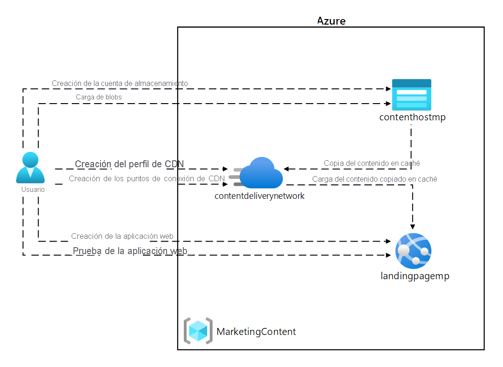
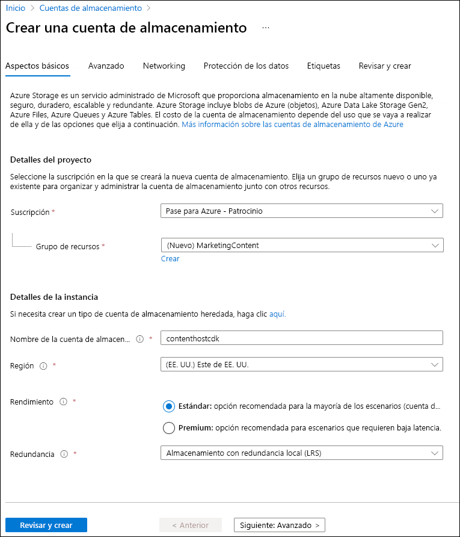
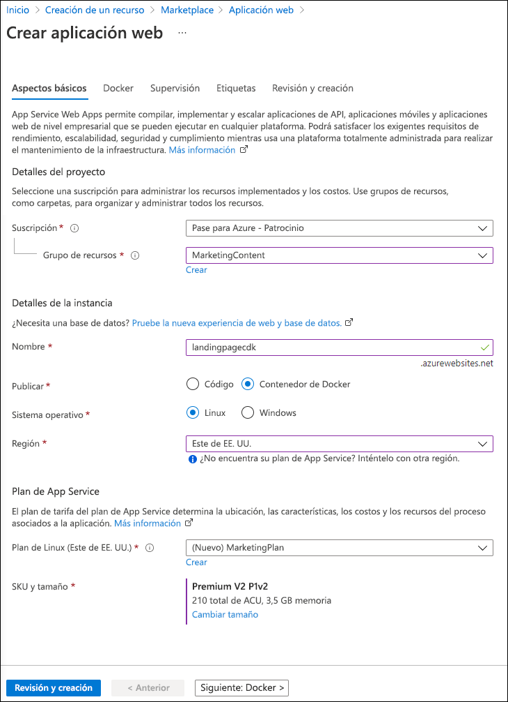
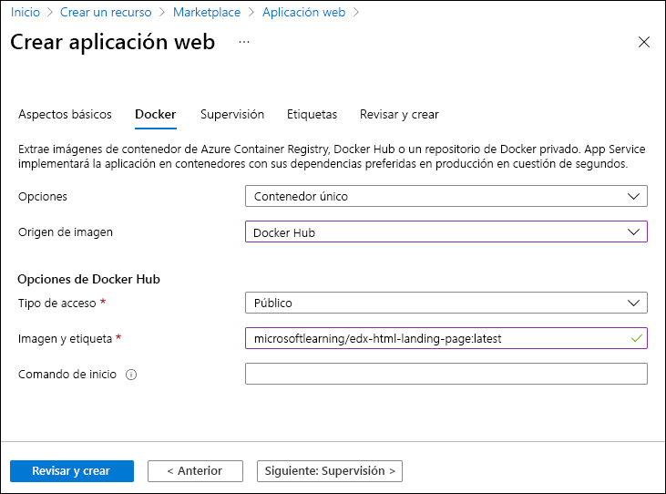
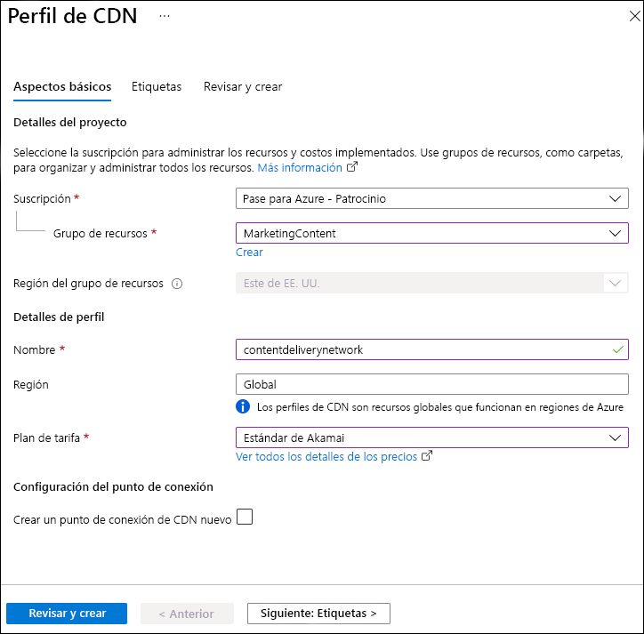
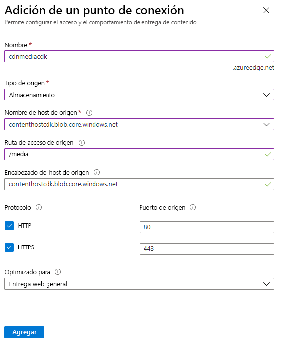
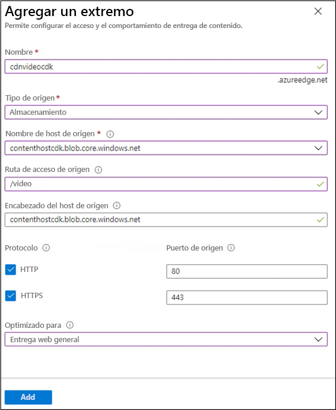
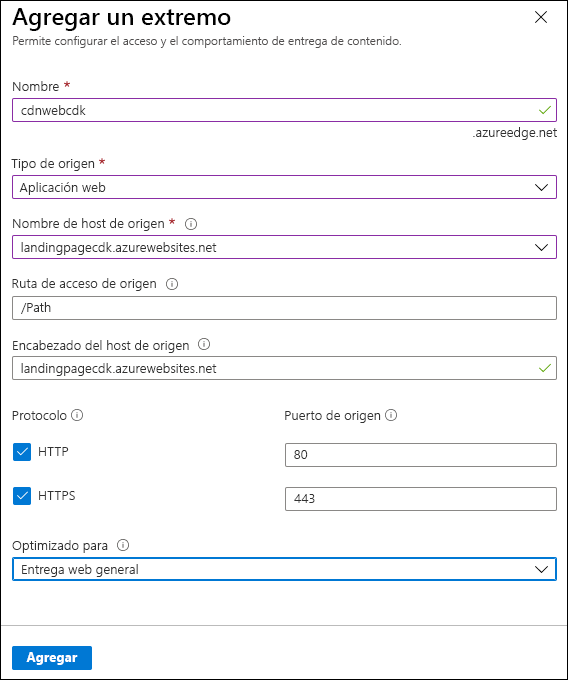

---
lab:
  az204Title: 'Lab 12: Enhance a web application by using the Azure Content Delivery Network'
  az204Module: 'Module 12: Integrate caching and content delivery within solutions'
---

# <a name="lab-12-enhance-a-web-application-by-using-the-azure-content-delivery-network"></a>Laboratorio 12: Mejora de una aplicación web mediante Azure Content Delivery Network

## <a name="microsoft-azure-user-interface"></a>Interfaz de usuario de Microsoft Azure

Given the dynamic nature of Microsoft cloud tools, you might experience Azure UI changes that occur after the development of this training content. As a result, the lab instructions and lab steps might not align correctly.

Microsoft updates this training course when the community alerts us to needed changes. However, cloud updates occur frequently, so you might encounter UI changes before this training content updates. <bpt id="p1">**</bpt>If this occurs, adapt to the changes, and then work through them in the labs as needed.<ept id="p1">**</ept>

## <a name="instructions"></a>Instructions

### <a name="before-you-start"></a>Antes de comenzar

#### <a name="sign-in-to-the-lab-environment"></a>Inicio de sesión al entorno de laboratorio

Inicie sesión en la máquina virtual (VM) de Windows 10 con las credenciales siguientes:

- Nombre de usuario: **Admin**

- Contraseña: **Pa55w.rd**.

> **Nota**: El instructor le proporcionará instrucciones para conectarse al entorno de laboratorio virtual.

#### <a name="review-the-installed-applications"></a>Revisión de las aplicaciones instaladas

Find the taskbar on your Windows 10 desktop. The taskbar contains the icon for the application that you'll use in this lab:

- Microsoft Edge

## <a name="architecture-diagram"></a>Diagrama de la arquitectura



### <a name="exercise-1-create-azure-resources"></a>Ejercicio 1: Creación de recursos de Azure

#### <a name="task-1-open-the-azure-portal"></a>Tarea 1: Apertura de Azure Portal

1. En la barra de tareas, seleccione el icono de **Microsoft Edge**.

1. En la ventana del explorador abierto, vaya a Azure Portal (<https://portal.azure.com>) y, a continuación, inicie sesión con la cuenta que va a usar para este laboratorio.

   > Dada la naturaleza dinámica de las herramientas en la nube de Microsoft, puede experimentar cambios en la interfaz de usuario de Azure que se producen después del desarrollo de este contenido de entrenamiento.

#### <a name="task-2-create-a-storage-account"></a>Tarea 2: Creación de una cuenta de almacenamiento

1. En Azure Portal, use el cuadro de texto **Buscar recursos, servicios y documentos** para buscar la **Cuenta de almacenamiento** y, a continuación, en la lista de resultados, seleccione **Cuentas de almacenamiento**.

1. En la hoja  **Cuentas de almacenamiento** , seleccione **+ Crear**.

1. En la hoja **Crear una cuenta de almacenamiento**, en la pestaña **Aspectos básicos**, realice las siguientes acciones y seleccione **Revisar y crear**.

   | Configuración | Acción |
   | -- | -- |
   | Lista desplegable de **Suscripción** | Conserve los valores predeterminados |
   | Sección **Grupo de recursos** | Seleccione **Crear nuevo**, escriba **MarketingContent** y seleccione **Aceptar**. |
   | Cuadro de texto **Nombre de la cuenta de almacenamiento**  | Escribir **contenthost** _[sunombre]_ |
   | Lista desplegable de **región** | Seleccione **(EE.UU.) Este de EE. UU.** |
   | Sección **Rendimiento** | Seleccione la opción **Estándar** |
   | Lista desplegable de **Redundancia** | Seleccione **Almacenamiento con redundancia local (LRS)**. |

    En la captura de pantalla siguiente, se muestran los valores configurados en la hoja **Crear una cuenta de almacenamiento**.

    

1. En la pestaña **Revisar y crear**, revise las opciones que seleccionó durante los pasos anteriores.

1. Seleccione **Crear** para crear la cuenta de almacenamiento mediante la configuración especificada.

    > **Nota**: Espere a que se complete la tarea de creación antes de continuar con este laboratorio.

#### <a name="task-3-create-a-web-app-by-using-azure-app-service"></a>Tarea 3: Creación de una aplicación web mediante Azure App Service

1. En el panel de navegación de Azure Portal, seleccione **Crear un recurso**.

1. En la hoja **Crear un recurso**, en el cuadro de texto **Servicios Search y Marketplace**, escriba **Aplicación web** y, a continuación, seleccione ENTRAR.

1. En la hoja de resultados de búsqueda, seleccione el resultado de la **aplicación web** y, a continuación, seleccione **Crear**.

1. En la hoja **Crear aplicación web**, en la pestaña **Aspectos básicos**, realice las siguientes acciones y, a continuación, seleccione **Siguiente: Docker**:

   | Configuración | Acción |
   | -- | -- |
   | Lista desplegable de **Suscripción** | Conserve los valores predeterminados |
   | Lista desplegable del **grupo de recursos** | Seleccionar **MarketingContent** en la lista |
   | Cuadro de texto **Nombre**  | Escribir **landingpage** _[sunombre]_ |
   | Sección **Publicar** | Seleccione **Contenedor de Docker** |
   | Sección del **sistema operativo** | Seleccione **Linux**. |
   | Lista desplegable de **Región** | Seleccione **Este de EE. UU**. |
   | Sección **Plan de Linux (Este de EE. UU.)** | Como resultado, es posible que las instrucciones y los pasos del laboratorio no se alineen correctamente. |
   | Sección **SKU y tamaño** | Conserve los valores predeterminados |

   En la captura de pantalla siguiente, se muestran los valores configurados en la hoja **Crear aplicación web**.

   

1. En la pestaña **Docker**, realice las siguientes acciones y, a continuación, seleccione **Revisar y crear**:

   | Configuración | Acción |
   | -- | -- |
   | Lista desplegable de **opciones** | Seleccione **Contenedor único** |
   | Lista desplegable de **Origen de la imagen** | Seleccione **Docker Hub** |
   | Lista desplegable del **Tipo de acceso** | Seleccione **Público**. |
   | Cuadro de texto **Imagen y etiqueta** | Escribir **microsoftlearning/edx-html-landing-page:latest** |

   En la captura de pantalla siguiente, se muestran los valores configurados en la pestaña **Docker**.

   

1. En la pestaña **Revisar y crear**, revise las opciones que seleccionó durante los pasos anteriores.

1. Seleccione **Crear** para crear la aplicación web mediante la configuración especificada.

    > **Nota**: Espere a que se complete la tarea de creación antes de continuar con este laboratorio.

1. En la hoja **Implementación**, seleccione **Ir al recurso**.

1. On the <bpt id="p1">**</bpt>App Service Overview<ept id="p1">**</ept> blade, in the <bpt id="p2">**</bpt>Essentials<ept id="p2">**</ept>, record the value of the <bpt id="p3">**</bpt>URL<ept id="p3">**</ept> link. You'll use this value later in the lab.

#### <a name="review"></a>Revisar

En este ejercicio, ha creado una cuenta de Azure Storage y una aplicación web de Azure que usará más adelante en este laboratorio.

### <a name="exercise-2-configure-content-delivery-network-and-endpoints"></a>Ejercicio 2: Configuración de Content Delivery Network y puntos de conexión

#### <a name="task-1-open-azure-cloud-shell"></a>Tarea 1: Apertura de Azure Cloud Shell

1. Microsoft actualiza este curso de entrenamiento cuando la comunidad nos alerta de los cambios necesarios.

    > Sin embargo, las actualizaciones en la nube se producen con frecuencia, por lo que es posible que se produzcan cambios en la interfaz de usuario antes de que se actualice este contenido de entrenamiento.

1. En Azure Portal, en el símbolo del sistema de **Cloud Shell**, ejecute el siguiente comando para obtener la versión de la herramienta Interfaz de la línea de comandos de Azure (CLI de Azure):

    ```bash
    az --version
    ```

#### <a name="task-2-register-the-microsoftcdn-provider"></a>Tarea 2: Registro del proveedor Microsoft.CDN

1. En el símbolo del sistema de **Cloud Shell** del portal, realice las siguientes acciones:

    **Si esto ocurre, adáptese a los cambios y, a continuación, trabaje con ellos en los laboratorios según sea necesario.**

    ```bash
    az --help
    ```

    b.  Enter the following command, and then select Enter to get a list of the commands that are available for resource providers:

    ```bash
    az provider --help
    ```

    c.  Enter the following command, and then select Enter to list all currently registered providers:

     ```bash
     az provider list
     ```

    d.  Enter the following command, and then select Enter to list only the namespaces of the currently registered providers:

     ```bash
     az provider list --query "[?registrationState=='Registered'].namespace"
     ```

    e.  Observe the list of currently registered providers. The <bpt id="p1">**</bpt>Microsoft.CDN<ept id="p1">**</ept> provider isn't currently in the list of providers.

    f.  Enter the following command, and then select Enter to get the required flags to register a new provider:

     ```bash
     az provider register --help
     ```

    g.  Enter the following command, and then select Enter to register the <bpt id="p1">**</bpt>Microsoft.CDN<ept id="p1">**</ept> namespace with your current subscription:

     ```bash
     az provider register --namespace Microsoft.CDN
     ```

1. Cierre el panel de **Cloud Shell** en el portal.

#### <a name="task-3-create-a-content-delivery-network-profile"></a>Tarea 3: Creación de un perfil de Content Delivery Network

1. En el panel de navegación de Azure Portal, seleccione **Crear un recurso**.

1. En la hoja **Crear un recurso**, en el cuadro de texto **Servicios Search y Marketplace**, escriba **CDN** y, a continuación, seleccione ENTRAR.

1. En la hoja de resultados de búsqueda de **Marketplace**, seleccione el resultado **Perfiles de Front Door y CDN** y, luego, elija **Crear**.

1. En la página **Comparar ofertas**, seleccione **Explorar otras ofertas** y, luego, elija **Azure CDN Estándar de Akamai** y, a continuación, **Continuar**.

1. En la hoja **Perfil de CDN**, en la pestaña **Aspectos básicos**, realice las siguientes acciones y seleccione **Revisar y crear**:

   | Configuración | Acción |
   | -- | -- |
   | Lista desplegable de **Suscripción** | Conserve los valores predeterminados |
   | Lista desplegable del **grupo de recursos** | Seleccionar **MarketingContent** en la lista |
   | Cuadro de texto **Nombre**  | Escribir **contentdeliverynetwork** |
   | Cuadro de texto **Región** | Conservar los valores predeterminados (global) |
   | Lista desplegable de **planes de tarifa** | Seleccionar **Akamai estándar** |
   | Cuadro de texto **Crear un punto de conexión de CDN ahora** | No seleccionado |

   En la captura de pantalla siguiente, se muestran los valores configurados en la hoja **Perfil de CDN**.

   

1. En la pestaña **Revisar y crear**, revise las opciones que seleccionó durante los pasos anteriores.

1. Seleccione **Crear** para crear el perfil de CDN mediante la configuración especificada.
  
    > <bpt id="p1">**</bpt>Note<ept id="p1">**</ept>: Wait for Azure to finish creating the CDN profile before you move forward with the lab. You'll receive a notification when the app is created.

#### <a name="task-4-configure-storage-containers"></a>Tarea 4: Configuración de contenedores de Storage

1. En el panel de navegación de Azure Portal, seleccione **Grupos de recursos**.

1. En la hoja **Grupos de recursos**, seleccione el grupo de recursos **MarketingContent** que creó anteriormente en este laboratorio.

1. En la hoja **MarketingContent**, seleccione la cuenta de almacenamiento **contenthost** _[yourname]_ que creó anteriormente en este laboratorio.

1. En la hoja **Cuenta de almacenamiento**, en la sección **Almacenamiento de datos**, seleccione el vínculo **Contenedores**.

1. En la sección **Contenedores**, seleccione **+ Contenedor**.

1. En la ventana emergente **Nuevo contenedor**, realice las siguientes acciones y, a continuación, seleccione **Crear**:

   | Configuración | Acción |
   | -- | -- |
   | Cuadro de texto **Nombre**  | Escribir **elementos multimedia** |
   | Lista desplegable del **nivel de acceso público** | Seleccionar **Blob (acceso de lectura anónimo solo para blobs)** |

1. En la sección **Contenedores**, vuelva a seleccionar **+ Contenedor**.

1. En la ventana emergente **Nuevo contenedor**, realice las siguientes acciones y, a continuación, seleccione **Crear**:

   | Configuración | Acción |
   | -- | -- |
   | Cuadro de texto **Nombre**  | Escribir **vídeo** |
   | Lista desplegable del **nivel de acceso público** | Seleccionar **Blob (acceso de lectura anónimo solo para blobs)** |

1. Observe la lista actualizada de contenedores y confirme que se muestran los contenedores **elementos multimedia** y **vídeo**.

#### <a name="task-5-create-content-delivery-network-endpoints"></a>Tarea 5: Creación de puntos de conexión de Azure Content Delivery Network

1. En el panel de navegación de Azure Portal, seleccione el vínculo **Grupos de recursos**.

1. En la hoja **Grupos de recursos**, seleccione el grupo de recursos **MarketingContent** que creó anteriormente en este laboratorio.

1. En la hoja **MarketingContent**, seleccione el perfil de CDN **contentdeliverynetwork** que creó anteriormente en este laboratorio.

1. En la hoja del **perfil de CDN**, seleccione **+ Punto de conexión**.

1. En el cuadro de diálogo emergente **Agregar un punto de conexión**, realice las siguientes acciones y, a continuación, seleccione **Agregar**:

   | Configuración | Acción |
   | -- | -- |
   | Cuadro de texto **Nombre**  | Escriba **cdnmedia** _[yourname]_ |
   | Lista desplegable del **Tipo de origen** | Seleccione **Storage** (Almacenamiento) |
   | Lista desplegable del **nombre de host de origen** | Seleccione la opción **contenthost *[sunombre]* .blob.core.windows.net** para la cuenta de almacenamiento que creó anteriormente en este laboratorio. |
   | Cuadro de texto de la **ruta de acceso de origen** | Escriba **/elementos multimedia** |
   | Cuadro de texto **Encabezado del host de origen** | Conserve los valores predeterminados |
   | Secciones **Protocolo** y **Puerto de origen** | Conserve los valores predeterminados |
   | Lista desplegable **Optimizado para** | Seleccione **Entrega web general** |

   En la captura de pantalla siguiente, se muestran los valores configurados en el cuadro de diálogo **Agregar un punto de conexión**.

   

1. En la hoja del **perfil de CDN**, vuelva a seleccionar **+ Punto de conexión**.

1. En el cuadro de diálogo emergente **Agregar un punto de conexión**, realice las siguientes acciones y, a continuación, seleccione **Agregar**:

   | Configuración | Acción |
   | -- | -- |
   | Cuadro de texto **Nombre**  | Escriba **cdnvideo** _[yourname]_ |
   | Lista desplegable del **Tipo de origen** | Seleccione **Storage** (Almacenamiento) |
   | Lista desplegable del **nombre de host de origen** | Seleccione la opción **contenthost *[sunombre]* .blob.core.windows.net** para la cuenta de almacenamiento que creó anteriormente en este laboratorio. |
   | Cuadro de texto de la **ruta de acceso de origen** | Escriba **/vídeo** |
   | Cuadro de texto **Encabezado del host de origen** | Conserve los valores predeterminados |
   | Secciones **Protocolo** y **Puerto de origen** | Conserve los valores predeterminados |
   | Lista desplegable **Optimizado para** | Seleccione **Streaming multimedia de vídeo bajo demanda** |

   En la captura de pantalla siguiente, se muestran los valores configurados en el cuadro de diálogo **Agregar un punto de conexión**.

   

1. En la hoja del **perfil de CDN**, vuelva a seleccionar **+ Punto de conexión**.

1. En el cuadro de diálogo emergente **Agregar un punto de conexión**, realice las siguientes acciones y, a continuación, seleccione **Agregar**:

   | Configuración | Acción |
   | -- | -- |
   | Cuadro de texto **Nombre**  | Escriba **cdnweb** _[yourname]_ |
   | Lista desplegable del **Tipo de origen** | Seleccione **Aplicación web** |
   | Lista desplegable del **nombre de host de origen** | Seleccione la opción **landingpage *[sunombre]* .azurewebsites.net** para la aplicación web que creó anteriormente en este laboratorio. |
   | Cuadro de texto de la **ruta de acceso de origen** | Conserve los valores predeterminados |
   | Cuadro de texto **Encabezado del host de origen** | Conserve los valores predeterminados |
   | Secciones **Protocolo** y **Puerto de origen** | Conserve los valores predeterminados |
   | Lista desplegable **Optimizado para** | Seleccione **Entrega web general** |

   En la captura de pantalla siguiente, se muestran los valores configurados en el cuadro de diálogo **Agregar un punto de conexión**.

   

#### <a name="review"></a>Revisar

En este ejercicio, registró el proveedor de recursos para Content Delivery Network (CDN) y, a continuación, usó el proveedor para crear un perfil de CDN y recursos de punto de conexión.

### <a name="exercise-3-upload-and-configure-static-web-content"></a>Ejercicio 3: Carga y configuración de contenido web estático

#### <a name="task-1-observe-the-landing-page"></a>Tarea 1: Observación de la página de aterrizaje

1. En el panel de navegación de Azure Portal, seleccione **Grupos de recursos**.

1. En la hoja **Grupos de recursos**, seleccione el grupo de recursos **MarketingContent** que creó anteriormente en este laboratorio.

1. En la hoja **Grupos de MarketingContent**, seleccione la aplicación web **landingpage** _[yourname]_ que creó anteriormente en este laboratorio.

1. On the <bpt id="p1">**</bpt>App Service<ept id="p1">**</ept> blade, select <bpt id="p2">**</bpt>Browse<ept id="p2">**</ept>. A new browser tab opens and returns the current website. Observe the error message displayed on the screen. The website won't work until you configure the specified settings to reference multimedia content.

1. Vuelva a la ventana del explorador abierta actualmente que muestra Azure Portal.

#### <a name="task-2-upload-storage-blobs"></a>Tarea 2: Carga de blobs de Storage

1. En el panel de navegación de Azure Portal, seleccione **Grupos de recursos**.

1. En la hoja **Grupos de recursos**, seleccione el grupo de recursos **MarketingContent** que creó anteriormente en este laboratorio.

1. En la hoja **MarketingContent**, seleccione la cuenta de almacenamiento **contenthost** _[yourname]_ que creó anteriormente en este laboratorio.

1. En la hoja **Cuenta de almacenamiento**, en la sección **Almacenamiento de datos**, seleccione el vínculo **Contenedores**.

1. En la sección **Contenedores**, seleccione el contenedor **multimedia** y, a continuación, **Cargar**.

1. En la ventana emergente **Cargar blob**, realice las siguientes acciones:

    a.  In the <bpt id="p1">**</bpt>Files<ept id="p1">**</ept> section, select the <bpt id="p2">**</bpt>Folder<ept id="p2">**</ept> icon.

    Busque la barra de tareas en el escritorio de Windows 10.

    - **campus.jpg**

    - **conference.jpg**

    - **poster.jpg**

    La barra de tareas contiene los iconos de las aplicaciones que usará en este laboratorio:  

    > **Nota**: Espere a que se cargue el blob antes de continuar con este laboratorio.

1. En la hoja **Contenedor**, seleccione **Propiedades** en la sección **Configuración**.

1. Record the value in the <bpt id="p1">**</bpt>URL<ept id="p1">**</ept> text box. You'll use this value later in the lab.

1. Cierre la hoja **Contenedor**.

1. En la hoja **Contenedores**, seleccione el contenedor de **vídeo** y, a continuación, seleccione **Cargar**.

1. En la ventana emergente **Cargar blob**, realice las siguientes acciones:

    a.  In the <bpt id="p1">**</bpt>Files<ept id="p1">**</ept> section, select the <bpt id="p2">**</bpt>Folder<ept id="p2">**</ept> icon.

    b.  In the <bpt id="p1">**</bpt>File Explorer<ept id="p1">**</ept> window, browse to <bpt id="p2">**</bpt>Allfiles (F):<ph id="ph1">\\</ph>Allfiles<ph id="ph2">\\</ph>Labs<ph id="ph3">\\</ph>12<ph id="ph4">\\</ph>Starter<ept id="p2">**</ept>, select the <bpt id="p3">**</bpt>welcome.mp4<ept id="p3">**</ept> file, and then select <bpt id="p4">**</bpt>Open<ept id="p4">**</ept>.

    c.  Ensure that <bpt id="p1">**</bpt>Overwrite if files already exist<ept id="p1">**</ept> is selected, and then select <bpt id="p2">**</bpt>Upload<ept id="p2">**</ept>.  

    > **Nota**: Espere a que se cargue el blob antes de continuar con este laboratorio.

1. En la hoja **Contenedor**, seleccione **Propiedades** en la sección **Configuración**.

1. Record the value in the <bpt id="p1">**</bpt>URL<ept id="p1">**</ept> text box. You'll use this value later in the lab.

#### <a name="task-3-configure-web-app-settings"></a>Tarea 3: Configuración de la aplicación web

1. En el panel de navegación de Azure Portal, seleccione **Grupos de recursos**.

1. En la hoja **Grupos de recursos**, seleccione el grupo de recursos **MarketingContent** que creó anteriormente en este laboratorio.

1. En la hoja **Grupos de MarketingContent**, seleccione la aplicación web **landingpage** _[yourname]_ que creó anteriormente en este laboratorio.

1. En la hoja de **App Service**, en la categoría **Configuración**, seleccione el vínculo **Configuración**.

1. En la sección **Configuración**, seleccione la pestaña **Configuración de la aplicación** y, a continuación, seleccione **Nueva configuración de la aplicación**.

1. En la ventana emergente **Agregar o editar configuración de la aplicación**, configure los siguientes valores y, a continuación, seleccione **Aceptar**.

   | Configuración | Acción |
   | -- | -- |
   | Cuadro de texto **Nombre**  | Escribir **CDNMediaEndpoint** |
   | Cuadro de texto **Valor** | Escriba el valor de **URI** del contenedor **multimedia** en la cuenta de almacenamiento **contenthost** _[sunombre]_ que registró anteriormente en este laboratorio. |
   | Casilla **Configuración de la ranura de implementación** | No seleccionar |

1. Vuelva a la sección **Configuración** y, a continuación, seleccione **Nueva configuración de la aplicación**.

1. En la ventana emergente **Agregar o editar configuración de la aplicación**, configure los siguientes valores y, a continuación, seleccione **Aceptar**.

   | Configuración | Acción |
   | -- | -- |
   | Cuadro de texto **Nombre**  | Escribir **CDNVideoEndpoint** |
   | Cuadro de texto **Valor** | Escriba el valor de **URI** del contenedor de **vídeo** en la cuenta de almacenamiento **contenthost** _[sunombre]_ que registró anteriormente en este laboratorio. |
   | Casilla **Configuración de la ranura de implementación** | No seleccionar |

1. Return to the <bpt id="p1">**</bpt>Configuration<ept id="p1">**</ept> section, and then select <bpt id="p2">**</bpt>Save<ept id="p2">**</ept>. Select <bpt id="p1">**</bpt>Continue<ept id="p1">**</ept> to confirm your changes.

   > **Nota**: Espere a que se guarde la configuración de la aplicación antes de continuar con el laboratorio.

#### <a name="task-4-validate-the-corrected-landing-page"></a>Tarea 4: Validación de la página de aterrizaje corregida

1. En el panel de navegación de Azure Portal, seleccione **Grupos de recursos**.

1. En la hoja **Grupos de recursos**, seleccione el grupo de recursos **MarketingContent** que creó anteriormente en este laboratorio.

1. En la hoja **Grupos de MarketingContent**, seleccione la aplicación web **landingpage** _[yourname]_ que creó anteriormente en este laboratorio.

1. En la hoja de **App Service**, seleccione **Reiniciar** y, a continuación, seleccione **Sí** para confirmar el proceso de reinicio de la aplicación.

   > <bpt id="p1">**</bpt>Note<ept id="p1">**</ept>: Wait for the restart operation to complete before you move forward with the lab. You'll receive a notification when the operation is done.

1. On the <bpt id="p1">**</bpt>App Service<ept id="p1">**</ept> blade, select <bpt id="p2">**</bpt>Browse<ept id="p2">**</ept>. A new browser window or tab will open and return to the current website. Observe the updated website rendering multimedia content of various types.

1. Vuelva a la ventana del explorador abierta actualmente que muestra Azure Portal.

#### <a name="review"></a>Revisar

En este ejercicio, ha cargado contenido multimedia como blobs en contenedores de Storage y, a continuación, ha actualizado la aplicación web para que apunte directamente a los blobs de almacenamiento.

### <a name="exercise-4-use-content-delivery-network-endpoints"></a>Ejercicio 4: Uso de puntos de conexión de Azure Content Delivery Network

#### <a name="task-1-retrieve-endpoint-uniform-resource-identifiers-uris"></a>Tarea 1: Recuperación de identificadores uniformes de recursos (URI) de punto de conexión

1. En el panel de navegación de Azure Portal, seleccione el vínculo **Grupos de recursos**.

1. En la hoja **Grupos de recursos**, seleccione el grupo de recursos **MarketingContent** que creó anteriormente en este laboratorio.

1. En la hoja **MarketingContent**, seleccione el perfil de CDN **contentdeliverynetwork** que creó anteriormente en este laboratorio.

1. En la hoja **Perfil de CDN**, seleccione el punto de conexión **cdnmedia** _[yourname]_ .

1. **Nota**: Si es la primera vez que inicia sesión en Azure Portal, se le ofrecerá un paseo por el portal.

1. Cierre la hoja del **punto de conexión**.

1. En la hoja **Perfil de CDN**, seleccione el punto de conexión **cdnvideo** _[yourname]_ .

1. Seleccione **Introducción** para omitir el paseo y empezar a usar el portal.

1. Cierre la hoja del **punto de conexión**.

#### <a name="task-2-test-multimedia-content"></a>Tarea 2: Prueba de contenido multimedia

1. Cree una dirección URL para el recurso **campus.jpg** combinando la dirección URL del **nombre de host del punto de conexión** del punto de conexión **cdnmedia** _[yourname]_ que copió anteriormente en el laboratorio con una ruta de acceso relativa de **/campus.jpg**.

    > **Nota**: Por ejemplo, si la dirección URL del **nombre de host del punto de conexión** es `https://cdnmediastudent.azureedge.net/`, la dirección URL recién creada sería `https://cdnmediastudent.azureedge.net/campus.jpg`.

1. Cree una dirección URL para el recurso **conference.jpg** combinando la dirección URL del **nombre de host del punto de conexión** del punto de conexión **cdnmedia** _[yourname]_ que copió anteriormente en el laboratorio con una ruta de acceso relativa de **/conference.jpg**.

    > **Nota**: Por ejemplo, si la dirección URL del **nombre de host del punto de conexión** es `https://cdnmediastudent.azureedge.net/`, la dirección URL recién creada sería `https://cdnmediastudent.azureedge.net/conference.jpg`.

1. Cree una dirección URL para el recurso **poster.jpg** combinando la dirección URL del **nombre de host del punto de conexión** del punto de conexión **cdnmedia** _[yourname]_ que copió anteriormente en el laboratorio con una ruta de acceso relativa de **/poster.jpg**.

    > **Nota**: Por ejemplo, si la dirección URL del **nombre de host del punto de conexión** es `https://cdnmediastudent.azureedge.net/`, la dirección URL recién creada sería `https://cdnmediastudent.azureedge.net/poster.jpg`.

1. Cree una dirección URL para el recurso **welcome.mp4** combinando la dirección URL del **nombre de host del punto de conexión** del punto de conexión **cdnvideo** _[yourname]_ que copió anteriormente en el laboratorio con una ruta de acceso relativa de **/welcome.mp4**.

    > **Nota**: Por ejemplo, si la dirección URL del **nombre de host del punto de conexión** es `https://cdnvideostudent.azureedge.net/`, la dirección URL recién creada sería `https://cdnvideostudent.azureedge.net/welcome.mp4`.

1. En la barra de tareas, active el menú contextual del icono **Microsoft Edge** y, a continuación, seleccione **Nueva ventana**.

1. En la nueva ventana del explorador, consulte la dirección URL que creó para el recurso multimedia **campus.jpg** y, a continuación, compruebe que el recurso se encontró correctamente.

    > <bpt id="p1">**</bpt>Note<ept id="p1">**</ept>: If the content isn't available yet, the CDN endpoint is still initializing. This initialization process can take anywhere from 5 to 15 minutes.

1. Consulte la dirección URL que creó para el recurso multimedia **conference.jpg** y, a continuación, compruebe que el recurso se encontró correctamente.

1. Consulte la dirección URL que creó para el recurso multimedia **poster.jpg** y, a continuación, compruebe que el recurso se encontró correctamente.

1. Consulte la dirección URL que creó para el recurso de vídeo **welcome.mp4** y, a continuación, compruebe que el recurso se encontró correctamente.

1. Cierre la ventana del explorador que creó en esta tarea.

#### <a name="task-3-update-the-web-app-settings"></a>Tarea 3: Actualización de la configuración de la aplicación web

1. En el panel de navegación de Azure Portal, seleccione **Grupos de recursos**.

1. En la hoja **Grupos de recursos**, seleccione el grupo de recursos **MarketingContent** que creó anteriormente en este laboratorio.

1. En la hoja **Grupos de MarketingContent**, seleccione la aplicación web **landingpage** _[yourname]_ que creó anteriormente en este laboratorio.

1. En la hoja de **App Service**, en la categoría **Configuración**, seleccione el vínculo **Configuración**.

1. En la sección **Configuración**, seleccione la pestaña **Configuración de la aplicación**.

1. Seleccione la configuración de la aplicación **CDNMediaEndpoint** existente.

1. En el cuadro de diálogo emergente **Agregar o editar configuración de la aplicación**, actualice el cuadro de texto **Valor**; para ello, escriba la dirección URL del **nombre de host del punto de conexión** del punto de conexión **cdnmedia** _[yourname]_ que copió anteriormente en el laboratorio y, a continuación, seleccione **Aceptar**.

1. Seleccione la configuración de la aplicación **CDNVideoEndpoint** existente.

1. En el cuadro de diálogo emergente **Agregar o editar configuración de la aplicación**, actualice el cuadro de texto **Valor**; para ello, escriba la dirección URL del **nombre de host del punto de conexión** del punto de conexión **cdnvideo** _[yourname]_ que copió anteriormente en el laboratorio y, a continuación, seleccione **Aceptar**.

1. Seleccione **Guardar** y, a continuación, seleccione **Continuar** para confirmar los cambios.  

   > **Nota**: Espere a que se guarde la configuración de la aplicación antes de continuar con el laboratorio.

1. En la sección **Configuración**, seleccione **Información general**.

1. En la sección **Información general**, seleccione **Reiniciar** y, a continuación, seleccione **Sí** para confirmar el proceso de reinicio de la aplicación.

   > <bpt id="p1">**</bpt>Note<ept id="p1">**</ept>: Wait for the restart operation to complete before you continue with the lab. You'll receive a notification when the operation is done.

#### <a name="task-4-test-the-web-content"></a>Tarea 4: Prueba del contenido web

1. En el panel de navegación de Azure Portal, seleccione el vínculo **Grupos de recursos**.

1. En la hoja **Grupos de recursos**, seleccione el grupo de recursos **MarketingContent** que creó anteriormente en este laboratorio.

1. En la hoja **MarketingContent**, seleccione el perfil de CDN **contentdeliverynetwork** que creó anteriormente en este laboratorio.

1. En la hoja **Perfil de CDN**, seleccione el punto de conexión **cdnweb** _[yourname]_ .

1. En la hoja **Punto de conexión**, copie el valor del vínculo **Nombre de host del punto de conexión**.

1. En la barra de tareas, active el menú contextual del icono **Microsoft Edge** y, a continuación, seleccione **Nueva ventana**.

1. En la nueva ventana del explorador, consulte la dirección URL del **nombre de host del punto de conexión** del punto de conexión **cdnweb** _[yourname]_ .

1. Observe el sitio web y el contenido multimedia que se sirven mediante Content Delivery Network.

#### <a name="review"></a>Revisar

En este ejercicio, ha actualizado la aplicación web para que use Content Delivery Network para servir contenido multimedia y para servir a la propia aplicación web.

### <a name="exercise-5-clean-up-your-subscription"></a>Ejercicio 5: Limpieza de la suscripción

#### <a name="task-1-open-azure-cloud-shell"></a>Tarea 1: Apertura de Azure Cloud Shell

1. In the Azure portal, select the <bpt id="p1">**</bpt>Cloud Shell<ept id="p1">**</ept> icon <ph id="ph1"></ph> to open a new Bash session. If Cloud Shell defaults to a PowerShell session, select <bpt id="p1">**</bpt>PowerShell<ept id="p1">**</ept>, and then in the drop-down menu, select <bpt id="p2">**</bpt>Bash<ept id="p2">**</ept>.

    > <bpt id="p1">**</bpt>Note<ept id="p1">**</ept>: If this is the first time you're starting <bpt id="p2">**</bpt>Cloud Shell<ept id="p2">**</ept>, when prompted to select either <bpt id="p3">**</bpt>Bash<ept id="p3">**</ept> or <bpt id="p4">**</bpt>PowerShell<ept id="p4">**</ept>, select <bpt id="p5">**</bpt>PowerShell<ept id="p5">**</ept>. When you're presented with the <bpt id="p1">**</bpt>You have no storage mounted<ept id="p1">**</ept> message, select the subscription you're using in this lab, and select <bpt id="p2">**</bpt>Create storage<ept id="p2">**</ept>.

#### <a name="task-2-delete-a-resource-group"></a>Tarea 2: Eliminación de un grupo de recursos

1. En el panel de **Cloud Shell**, ejecute el comando siguiente para eliminar el grupo de recursos **MarketingContent**:

    ```bash
    az group delete --name MarketingContent --no-wait --yes
    ```

     > **Nota**: El comando se ejecuta de forma asincrónica (según determina el parámetro *--no-wait*). Aunque podrá ejecutar otro comando de la CLI de Azure inmediatamente después en la misma sesión de Bash, los grupos de recursos tardarán unos minutos en quitarse.

1. Cierre el panel de **Cloud Shell** en el portal.

#### <a name="task-3-close-the-active-application"></a>Tarea 3: Cierre de la aplicación activa

1. Cierre la aplicación que ejecuta Microsoft Edge actualmente.

#### <a name="review"></a>Revisar

En este ejercicio, ha limpiado la suscripción mediante la eliminación de los grupos de recursos usados en este laboratorio.
