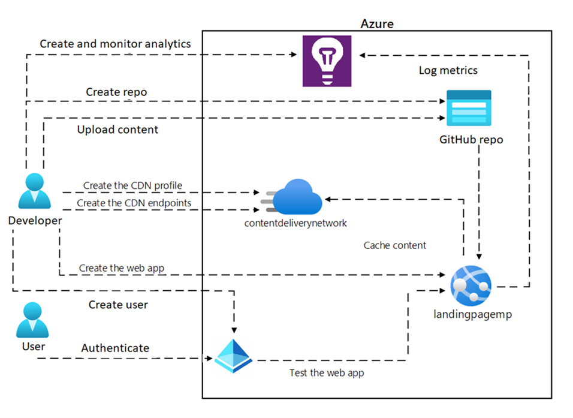

---
lab:
  az204Title: 'Lab 13 (Optional): Create and configure an Azure web app'
  az204Module: Optional lab
---

# Laboratorio 13: Creación y configuración de una aplicación web de Azure

## Interfaz de usuario de Microsoft Azure

Dada la naturaleza dinámica de las herramientas en la nube de Microsoft, puede experimentar cambios en la interfaz de usuario de Azure que se producen después del desarrollo de este contenido de entrenamiento. Como resultado, es posible que las instrucciones y los pasos del laboratorio no se alineen correctamente.

Microsoft actualiza este curso de entrenamiento cuando la comunidad nos alerta de los cambios necesarios. Sin embargo, las actualizaciones en la nube se producen con frecuencia, por lo que es posible que se produzcan cambios en la interfaz de usuario antes de que se actualice este contenido de entrenamiento. **Si esto ocurre, adáptese a los cambios y, a continuación, trabaje con ellos en los laboratorios según sea necesario.**

## Instructions

### Antes de comenzar

#### Inicio de sesión al entorno de laboratorio

Inicie sesión en la máquina virtual (VM) de Windows 10 con las credenciales siguientes:

- Nombre de usuario: `Admin`
- Contraseña: `Pa55w.rd`

> **Nota**: El instructor le proporcionará instrucciones para conectarse al entorno de laboratorio virtual.

#### Revisión de las aplicaciones instaladas

Busque la barra de tareas en el escritorio de Windows 10. La barra de tareas contiene los iconos de las aplicaciones que usará en este laboratorio:

- Microsoft Edge

## Escenario de laboratorio

En este laboratorio, implementará y configurará una aplicación web de Azure que se integre con GitHub. La aplicación web será una implementación sencilla de una aplicación web de página única accesible solo para los empleados internos. El sitio web hospedará contenidos relacionados con las estrategias de la empresa y los objetivos de ventas de la división.

Para crear la aplicación web, usará Azure Portal y lo conectará a un repositorio de GitHub. Para ello, necesitará una cuenta gratuita de GitHub, donde cargará el contenido del sitio web de muestra proporcionado como parte de este laboratorio. Una vez que la aplicación web esté en funcionamiento, realizará cambios en el contenido y observará cómo el contenido de GitHub se sincroniza con la aplicación web, usando la metodología CI/CD.

Dado que se trata de una aplicación web solo para empleados, deberá proteger el acceso a la aplicación web mediante la creación de usuarios en Azure AD e implementar la seguridad de la aplicación web a través de la autenticación de usuario.


## Diagrama de la arquitectura



### Ejercicio 1: Creación de una aplicación web en Azure App Service

#### Tarea 1: Creación de una cuenta de GitHub y carga del código de aplicación web de ejemplo en un repositorio

1. En la barra de tareas, seleccione el icono de **Microsoft Edge**.

1. En la ventana del navegador, navegue hasta el sitio web de GitHub en `https://github.com/` y cree una nueva cuenta si aún no tiene una.

1. Una vez que haya iniciado sesión, cree un nuevo repositorio haciendo clic en el botón **Nuevo** de la página principal.

1. Asigne un nombre y una descripción al repositorio y elija si debe ser público o privado.

1. En la sección **Agregar un archivo README**, seleccione **Agregar un archivo README**.

1. Seleccione **Crear repositorio** para crear el repositorio.

1. En la página del repositorio en GitHub, seleccione la opción **Añadir archivo**, de la lista desplegable seleccione **Cargar archivos**.

1. Abra la ventana **Explorador de archivos**, vaya a **Allfiles (F):\\Allfiles\\Labs\\13\\Starter\\webapp-sam-lab13**, seleccione todos los archivos y use la característica de arrastrar y colocar, para agregarlos al repositorio de GitHub.

1. Agregue un mensaje de confirmación que describa los cambios realizados (por ejemplo, "Confirmación inicial del código de aplicación web de muestra").

1. Seleccione **Confirmar cambios** para cargar el código de aplicación web de ejemplo en el repositorio.

#### Tarea 2: Creación de la aplicación web en Azure Portal y conexión a la cuenta de GitHub

1. En la barra de tareas, seleccione el icono de **Microsoft Edge**.

1. En la ventana del explorador, vaya a Azure Portal en `https://portal.azure.com` y, a continuación, inicie sesión con la cuenta que va a usar para este laboratorio.

1. En el panel de navegación de Azure Portal, seleccione el botón **Crear un recurso** del menú de la izquierda.

1. En la barra de búsqueda, escriba **Aplicación web** y seleccione **Aplicación web** en la lista de opciones.

1. En la hoja **Aplicación web**, haga clic en **Crear**.

1. En la hoja **Crear aplicación web**, en la pestaña **Aspectos básicos**, realice las siguientes acciones. 

    | Configuración | Acción |
    | -- | -- |
    | Lista desplegable de **Suscripción** | Conserve los valores predeterminados |
    | **Grupo de recursos** | Seleccione **Crear nuevo**, escriba **wProject-Sam-RG** y seleccione **Aceptar** |
    | **Nombre**  | Escriba **webapp-sam**_[sunombre]_ |
    | **Publicar**  | Seleccione **Código**. |
    | **Pila del entorno en tiempo de ejecución**  | Seleccionar **.NET 8 (LTS)** |
    | **Sistema operativo**  | Seleccione **Windows** |
    | **Región**  | Seleccionar la región **Este de EE. UU.** |
    | **Plan de Windows (Este de EE. UU.)** | Seleccione **Crear nuevo** y escriba **ManagedPlan** en el **campo Nombre** y, a continuación, seleccione **Aceptar**. |
    | **Plan de precios** | Seleccione **Estándar S1**. |

1. Seleccione la pestaña **Supervisión** y seleccione **Sí** en la sección **Habilitar Application Insights**. Después, seleccione **Revisar y crear**.

1. Revise las opciones que seleccionó durante los pasos anteriores y, a continuación, seleccione **Crear**.

   > **Nota**: Espere a que se cree la aplicación web antes de continuar con este laboratorio.

1. En la hoja **Información general**, seleccione el botón **Ir al recurso** para ir a la aplicación web recién creada.

#### Tarea 3: Implementación de una aplicación web desde GitHub 

<!-- Is step 1 needed since they should already be there if they selected "Go to resource" above? -->

1. Abra Azure Portal y vaya a la aplicación web que creó en la tarea anterior.

1. En la sección **Configuración**, seleccione **Configuración** en el menú de la izquierda.

1. En la hoja **Configuración**, seleccione **Configuración general**.

1. En la pestaña **Configuración general**, seleccione **Activado** para **Credenciales básicas de publicación de autenticación**, seleccione **Guardar** y después seleccione **Continuar**.

   > **Nota**: Espere un minuto para guardar las configuraciones.

1. En la sección **Implementación**, seleccione **Centro de implementación** en el menú de la izquierda.

1. En la pestaña **Configuración**, seleccione **Origen** y en la lista desplegable seleccione **GitHub**.

1. Desplácese hacia abajo en la sección **GitHub** y seleccione el botón **Autorizar** para permitir que Azure acceda a su cuenta de GitHub.

1. Tras autorizar correctamente el acceso a GitHub realice las siguientes acciones y después seleccione **Guardar**:
   
    | Configuración | Acción |
    | -- | -- |
    | Lista desplegable **Organización** | seleccione su organización de GitHub |
    | Lista desplegable **Repositorio** | seleccione el repositorio que creó en la tarea 1 |
    | Lista desplegable **Rama** | seleccione la rama que creó en la tarea 1 |

   > **Nota**: Espere un minuto para guardar las configuraciones.

1. Abra el repositorio de GitHub que creó en la tarea anterior, seleccione las **Acciones** del menú superior.

1. En la pestaña **Acciones**, en **Todos los flujos de trabajo**, seleccione **Agregar o actualizar la configuración del flujo de trabajo de compilación e implementación de Azure App Service** para ver el proceso de compilación e implementación.

1. Después de compilar e implementar correctamente, abra Azure Portal y navegue hasta **App Service**.

1. En la hoja **App Service**, seleccione **Información general** y después seleccione **Examinar**.

1. Revise y pruebe las distintas funciones y características de la aplicación web para asegurarse de que funcionan según lo previsto.

   > **Nota**: Mantenga abierta la ventana del explorador de la aplicación web; la necesitará más adelante. 

#### Tarea 4: Realice cambios en el código de GitHub y compruebe que los cambios se reflejan en la aplicación web.

1. Abra el repositorio de GitHub que contiene el código de la aplicación web.

1. En la carpeta **Páginas** seleccione el archivo **Index.cshtml**, en la vista previa del código, seleccione el **Icono del lápiz** para Editar el archivo.

1. En la pestaña del editor de código del archivo **Index.cshtml** , elimine el código de la línea 9 del archivo existente.

    ```html
    <h1>My Gallery</h1>
    ```

1. Agregue el siguiente código:

    ```html
    <h1>Portfolio Gallery</h1>
    <P>This is a simple .NET web project.</P>
    ```

1. Seleccione **Comprometer cambios**, escriba un **Mensaje de confirmación** y una **Descripción ampliada**, después seleccione **Confirmar cambios** para el archivo **Index.cshtml** .

   > **Nota**: Espere a que los cambios se reflejen en la aplicación web. Esto puede llevar desde unos minutos hasta una hora, dependiendo del proceso de implementación.
 
<!-- Are they opening a new browser or just refreshing their already open browser? -->

1. Abra la ventana del explorador de la aplicación web y actualice la ventana del explorador para ver los cambios.

1. Compruebe que los cambios sean los previstos.

<!-- The above step is the test of the changes, correct? -->

1. Pruebe la funcionalidad afectada por los cambios para asegurarse de que todo funciona según lo previsto.

1. Si los cambios no se reflejan en la aplicación web, compruebe los registros de implementación y solucione los problemas según sea necesario.

<!-- left off-->

1. Si los cambios aún no están visibles, póngase en contacto con el instructor para obtener ayuda.  

   > **Nota**: Recuerde probar siempre los cambios antes de confirmarlos en el repositorio e implementarlos en la aplicación web. Además, es importante seguir los procedimientos recomendados para el control de versiones y la colaboración al trabajar con código en GitHub.

#### Revisar

Este ejercicio trata de crear una aplicación web en Azure Portal y conectarla a un repositorio de GitHub.

### Ejercicio 2: Habilitación del escalado automático para la aplicación web

#### Tarea 1: Habilitación del escalado personalizado

1. Abra Azure Portal y navegue hasta **App Service**, seleccione la aplicación web que creó en el ejercicio anterior.

1. En la hoja **Aplicación web**, seleccione **Escalar horizontalmente (plan App Service)** en la sección **Configuración**.

1. En la página **Escalar horizontalmente (plan App Service)**, seleccione **Basado en reglas** en **Método de escalado**.

1. En la parte inferior de la página, tras el mensaje de alerta *Se ignorará el escalado basado en reglas si está habilitada la escalabilidad automática.* Seleccione el vínculo **Administrar escalado basado en reglas**.

1. En la página **Configuración de escalabilidad automática**, escriba la siguiente información y seleccione **Guardar**:
    
    | Configuración | Información |
    | -- | -- |
    | **Configuración**  | Seleccione **Escalabilidad automática personalizada**. |
    | **Modo de escalado**  | Seleccionar **Escalado basado en una métrica** |
    | **Reglas**  | Seleccione el vínculo **Añadir una regla**, en la hoja **Regla de escalado**, mantenga los valores predeterminados para todas las configuraciones y seleccione **Añadir**. |
    | Cuadro de texto **Mínimo** de la sección **Límites de instancia** | Escriba **1**. |
    | Cuadro de texto **Máximo** de la sección **Límites de instancia** | Escriba **4**. |
    | Cuadro de texto **Predeterminado** de la sección **Límites de instancia** | Escriba **2**. | 

    > **Nota**: Espere a que se complete la operación de guardado antes de continuar con este laboratorio.

#### Tarea 2: Configuración de opciones de escalabilidad horizontal en función del uso de CPU para aumentar el número de instancias

1. En la página **Configuración de escalabilidad automática**, desplácese hacia abajo y seleccione **+ Agregar una regla**.

1. En la página **Regla de escalado**, realice las siguientes acciones, seleccione **Añadir** y a continuación seleccione **Guardar**:
    
    | Configuración | Acción |
    | -- | -- |
    | Lista desplegable **Nombre de la métrica** | Seleccione **Porcentaje de CPU** |
    | Lista desplegable **Operador** | Seleccione **Mayor que** |
    | Cuadro de texto **Umbral de la métrica para desencadenar la acción de escalado** | Escriba **60** |
    | Cuadro de texto **Duración (minutos)** | Escriba **5** |
    | Lista desplegable **Operación** | Seleccione **Aumentar recuento en** | 
    | Cuadro de texto **Tiempo de finalización (minutos)** | Escriba **5** | 
    | Cuadro de texto **Recuento de instancias** | Escriba **1**. | 

1. Pruebe la regla mediante la generación de tráfico que alcance el umbral de CPU establecido.

1.  Compruebe que el grupo de escalabilidad automática escala horizontalmente según lo previsto.

    > **Nota**: Se pueden seguir pasos similares para configurar las opciones de escalado en función del uso de CPU para reducir el número de instancias.


#### Tarea 3: Configuración de opciones de reducción horizontal en función del uso de CPU para reducir el número de instancias

1. En la página **Configuración de escalabilidad automática**, desplácese hacia abajo y seleccione **+ Agregar una regla**.

1. En la página **Regla de escalado**, realice las siguientes acciones, seleccione **Añadir** y a continuación seleccione **Guardar**:
    
    | Configuración | Acción |
    | -- | -- |
    | Lista desplegable **Nombre de la métrica** | Seleccione **Porcentaje de CPU** |
    | Lista desplegable **Operador** | Seleccione **Menor que** |
    | Cuadro de texto **Umbral de la métrica para desencadenar la acción de escalado** | Escriba **40** |
    | Cuadro de texto **Duración (minutos)** | Escriba **5** |
    | Lista desplegable **Operación** | Seleccione **Reducir recuento en** | 
    | Cuadro de texto **Tiempo de finalización (minutos)** | Escribir **3** | 
    | Cuadro de texto **Recuento de instancias** | Escriba **1**. | 

1. Pruebe la regla mediante la generación de tráfico que alcance el umbral de CPU establecido.

1. Compruebe que el grupo de escalabilidad automática se reduce horizontalmente según lo previsto.

   > **Nota**: Se pueden seguir pasos similares para configurar las opciones de escalado horizontal en función de otras métricas, como el uso de memoria o la longitud de la cola HTTP.


#### Tarea 4: Creación de Azure Load Testing

1. En Azure Portal, use el cuadro de texto **Buscar recursos, servicios y documentos** para buscar **Azure Load Testing** y, en la lista de resultados, seleccione **Azure Load Testing**.

1. En la hoja de **Azure Load Testing**, seleccione **+ Crear**.

1. En la ventana **Crear un recurso de prueba de carga** , realice las siguientes acciones y después seleccione **Revisar y crear**:

    | Configuración | Acción |
    | -- | -- |
    | Lista de **suscripciones** | Conserve los valores predeterminados |
    | Lista desplegable del **grupo de recursos** | Seleccione **WebProject-Sam-RG** en la lista. |
    | Cuadro de texto de **nombre** | Escriba **loadtest-sam**_[sunombre]_ |
    | Lista desplegable de **región** | Seleccione una región de Azure en la que quiera probar su aplicación web |

1. Seleccione **Crear** para crear las pruebas de carga de Azure. 

   > **Nota**: Espere a que se creen las pruebas de carga de Azure antes de continuar con este laboratorio.

1. En la hoja **Información general**, seleccione el botón **Ir al recurso** para ir a la hoja de prueba de carga de Azure recién creada.    


#### Tarea 5: Prueba rápida y análisis de las métricas de rendimiento de la aplicación web

1. En la hoja **Azure Load Testing** recién creada, en la sección **Pruebas**, seleccione la opción **Pruebas**.

1. Seleccione **+ Crear** y, en la lista desplegable, seleccione **Crear prueba en URL**.

1. En la hoja **Crear prueba en URL** , realice las siguientes acciones y seleccione **Ejecutar prueba**:

    | Configuración | Acción |
    | -- | -- |
    | Cuadro de texto **Dirección URL de prueba** | Escriba *la URL de su aplicación web que creó en este laboratorio*. |
    | Sección **Especificar carga** | Seleccione **Usuarios virtuales** en la lista. |
    | Cuadro de texto **Número de usuarios virtuales** | Escriba **100** |
    | Cuadro de texto **Duración de la prueba (minutos)** | Escribir **3** |
    | Cuadro de texto **Tiempo de puesta en marcha (minutos)** | Escriba **0** |

   > **Nota**: Espere unos 3 minutos para finalizar las pruebas de carga de Azure.

1. Una vez completada la prueba de carga, analice las métricas de rendimiento e identifique los cuellos de botella de rendimiento.

1. Seleccione los **Resultados de la prueba de carga**, revise las **Estadísticas** y las **Métricas del lado del cliente** de su aplicación web.

1. Seleccione **Estado del motor**, revise las **Métricas de estado del motor de carga** de su aplicación web.

1. Para descargar los resultados de la prueba de carga, seleccione **Descargar**, en la lista desplegable, seleccione **Resultados**.

En esta tarea, ha creado una aplicación web de Azure Load Testing y ha realizado pruebas de carga en una aplicación web de destino. Ha configurado las opciones, ha supervisado las métricas de rendimiento y ha analizado los resultados para identificar los cuellos de botella de rendimiento.

#### Revisar 

En este ejercicio, ha aprendido a habilitar el escalado personalizado para una aplicación web mediante la configuración de reglas basadas en el uso de CPU. También ha realizado pruebas de carga mediante Azure Load Testing y ha analizado las métricas de rendimiento para identificar y abordar los cuellos de botella de rendimiento. Este ejercicio proporcionó experiencia práctica para optimizar la escalabilidad y garantizar un rendimiento óptimo para las aplicaciones web.

### Ejercicio 3: Configuración de la autenticación y autorización del usuario

#### Tarea 1: Configurar la autenticación de una aplicación web

1. Abra Azure Portal y vaya a la aplicación web que desea configurar para la autenticación.

1. En la sección **Configuración**, seleccione **Autenticación** en el menú de la izquierda.

1. En el panel **Autenticación**, seleccione **Añadir proveedor de identidades**.

1. En la página **Añadir un proveedor de identidades**, realice las siguientes acciones y después seleccione **Añadir**:

    | Configuración | Acción |
    | -- | -- |
    | Lista desplegable **Proveedor de identidades** | Seleccione **Microsoft** |
    | Sección **Tipo de inquilino** | Seleccione **Personal** |
    | Sección **Tipo de registro de aplicación** | Seleccione **Crear nuevo registro de aplicaciones** |
    | Cuadro de texto de **nombre** | Escriba *Nombre de aplicación web* |
    | Sección **Tipos de cuenta admitidos** | Seleccione **Inquilino actual: inquilino único** | 
    | Sección **Restringir el acceso** | Seleccione **Requerir autenticación** |
    | Sección **Solicitudes no autenticadas** | Seleccione **HTTP 302 Found redirect: recomendado para sitios web** |

1. Una vez configurado el proveedor de autenticación, puede configurar las opciones de autenticación específicas de la aplicación web. Esto incluye cosas como qué usuarios o grupos pueden acceder a la aplicación, cómo se deben autenticar los usuarios (por ejemplo, a través de una página de inicio de sesión o una ventana emergente) y qué tipo de controles de acceso deben estar en vigor.

1. Abra la ventana del explorador de la aplicación web y actualice la ventana del explorador. Se le pedirá que inicie sesión a través del proveedor de autenticación de Microsoft y, una vez que lo haya hecho, debería poder acceder a la aplicación de la forma normal.

Eso es todo. Con estos pasos, debe poder configurar la autenticación para la aplicación web de Azure y asegurarse de que solo los usuarios autorizados puedan acceder a ella.

#### Tarea 2: Visualización de actividades en registros de inicio de sesión

1. Abra Azure Portal y vaya a **Microsoft Entra ID**.

1. En la página **Microsoft Entra ID**, seleccione **Aplicaciones empresariales** en el menú izquierdo.

1. En la página **Aplicaciones empresariales | Todas las aplicaciones**, busque y seleccione su aplicación web.

1. En la sección **Actividad**, seleccione **Registros** en el menú de la izquierda.

1. Puede filtrar los registros de inicio de sesión en función de criterios específicos, como el nombre del usuario, la aplicación a la que accedió o la fecha y hora del inicio de sesión.

1. También puede exportar los registros de inicio de sesión a un archivo CSV para realizar análisis o informes adicionales.

   > **Nota**: Espere unos minutos para ver los registros de inicio de sesión recientes.

Eso es todo. Con estos pasos, debe poder configurar los registros de inicio de sesión para el servicio web de Azure y asegurarse de que la aplicación sea segura y compatible con las directivas de la organización.

#### Revisar 

Este ejercicio trata sobre la configuración de la autenticación de usuarios y los registros de inicio de sesión para una aplicación web.

### Ejercicio 4: Application Insights para aplicaciones web

#### Tarea 1: Visualización del rendimiento de la aplicación mediante Application Insights

1. Abra Azure Portal y navegue hasta **App Service**, seleccione la aplicación web que creó en el ejercicio anterior.

1. En la hoja **Aplicación web**, seleccione **Application Insights** de la sección **Configuración**.

1. Seleccione **Ver datos de Application Insights**.

1. Debería ver un panel con varias métricas de rendimiento para la aplicación, incluidos los tiempos de respuesta, los tiempos de respuesta del servidor y las vistas de página.

1. Para ver información más detallada sobre una métrica específica, selecciónela para abrir el gráfico correspondiente.

1. Desde aquí, puede ajustar el intervalo de tiempo y la granularidad del gráfico para ver los datos que le interesan.

1. También puede usar la opción **Filtro** para acotar los datos en función de criterios específicos.

1. Si observa algún problema de rendimiento, puede usar la opción **Investigar** para profundizar en los datos e identificar la causa raíz del problema.

1. Además, puede usar la característica de **Alertas** para establecer alertas para métricas de rendimiento específicas, de modo que se le notifique si caen fuera de los rangos aceptables.

Enhorabuena, ya ha visualizado correctamente el rendimiento de su aplicación a través de Application Insights. Ahora puede pasar a configurar la telemetría personalizada en la tarea 3.

#### Tarea 2: Consulta de las métricas de rendimiento web en Log Analytics

1. En la hoja **Application Insights**, seleccione **Registros** en la sección **Supervisión**.

1. Se abrirá el área de trabajo de Log Analytics para el recurso de Application Insights.

1. En el editor de consultas, escriba la siguiente consulta para recuperar las métricas de rendimiento web:

```bash  
requests  
| where timestamp > ago(24h)  
| summarize count() by bin(timestamp, 1h), resultCode   
```

1. Esta consulta recupera el número de solicitudes y el código de estado HTTP de cada hora durante las últimas 24 horas. Puede modificar el intervalo de tiempo y la granularidad de la consulta según sea necesario.

1. Seleccione **Ejecutar** para ejecutar la consulta. Los resultados se mostrarán en una tabla debajo del editor de consultas.

1. También puede visualizar los resultados de la consulta haciendo clic en el botón **Gráfico** del editor de consultas. Se abrirá un gráfico que muestra los datos en un formato más visual.

1. Si quiere guardar la consulta para usarla en el futuro, seleccione el botón **Guardar** y asígnele un nombre y una descripción.

Enhorabuena, ahora ha consultado correctamente las métricas de rendimiento web en Log Analytics. Ahora puede pasar a crear telemetría personalizada en la tarea 4.

#### Tarea 3: Visualización del mapa de aplicación en Azure Web App

1. En la hoja **Application Insights**, seleccione **Mapa de aplicación** de la sección **Investigar**.

1. En la hoja **Mapa de aplicación**, seleccione el círculo del centro de la página Mapa de aplicación.

1. Desde el Mapa de aplicación, puede explorar varios aspectos de su aplicación, como el estado de mantenimiento general, el rendimiento y las dependencias entre los distintos componentes.
   
1. Puede profundizar en componentes específicos haciendo clic en ellos en el mapa, lo que le permite analizar las dependencias individuales y las métricas de rendimiento.

Eso es todo. Ha configurado correctamente Application Insights y ha accedido al mapa de aplicación de la aplicación web de Azure.

#### Tarea 4: Configuración de la característica disponibilidad en Application Insights para una aplicación web

1. En la hoja **Application Insights**, seleccione **Disponibilidad** de la sección **Investigar**.

1. En la hoja **Disponibilidad**, seleccione **Añadir prueba estándar** para crear una nueva prueba de disponibilidad.

1. En la página **Crear prueba estándar**, realice las siguientes acciones y después seleccione **Crear**:
    
    | Configuración | Acción |
    | -- | -- |
    | Cuadro de texto **Nombre de prueba** | Escriba **standardTest** |
    | Cuadro de texto de la **dirección URL** | Escriba la *dirección URL de la aplicación web* |
    | Lista desplegable **Frecuencia de prueba** | Seleccione **5 minutos** |
    | Lista desplegable **Ubicaciones de prueba** | Seleccione la *ubicación desde la que se ejecutará la prueba* |

1. La prueba de disponibilidad se ejecutará ahora según la frecuencia especificada y podrá supervisar los resultados en la sección **Disponibilidad** de su recurso de Application Insights.

   > **Nota**: Espere de 5 a 10 minutos para ver el resultado de la prueba.
 
1. Desde la sección **Disponibilidad**, puede ver los resultados de las pruebas, establecer alertas y analizar la disponibilidad y el rendimiento de su aplicación web.

Eso es todo. Ha configurado correctamente la característica Disponibilidad en Application Insights para su aplicación web en Azure.

#### Revisar 

Este ejercicio trata de habilitar y utilizar el servicio Application Insights en Azure para supervisar y diagnosticar problemas en una aplicación web.

### Ejercicio 5: Habilitación del almacenamiento en caché para la aplicación web

#### Tarea 1: Crear un perfil de CDN

1. En el panel de navegación de Azure Portal, seleccione **Crear un recurso**.

1. En la hoja **Crear un recurso**, en el cuadro de texto **Servicios Search y Marketplace**, escriba **CDN** y, a continuación, seleccione ENTRAR.

1. En la hoja de resultados de búsqueda de **Marketplace**, seleccione el resultado **Perfiles de Front Door y CDN** y, luego, elija **Crear**.

1. En la página **Comparar ofertas**, seleccione **Explorar otras ofertas** y, luego, elija **Azure CDN Estándar de Microsoft (clásico)** y, a continuación, **Continuar**.

1. En la hoja **Perfil de CDN**, en la pestaña **Aspectos básicos**, realice las siguientes acciones y seleccione **Revisar y crear**:

   | Configuración | Acción |
   | -- | -- |
   | Lista desplegable de **Suscripción** | Conserve los valores predeterminados |
   | Lista desplegable del **grupo de recursos** | Seleccione **wProject-Sam-RG** en la lista |
   | Cuadro de texto de **nombre** | Escribir **contentdeliverynetwork** |
   | Cuadro de texto **Región** | Conservar los valores predeterminados (global) |
   | Lista desplegable de **planes de tarifa** | Seleccione **CDN de Microsoft (clásico)** |
   | Cuadro de texto **Crear un punto de conexión de CDN nuevo** | No seleccionado |

1. En la pestaña **Revisar y crear**, revise las opciones que seleccionó durante los pasos anteriores.

1. Seleccione **Crear** para crear el perfil de CDN mediante la configuración especificada.
  
    > **Nota**: Espere a que Azure termine de crear el perfil de CDN antes de avanzar con el laboratorio. Recibirá una notificación cuando se cree la aplicación.

1. En la hoja **Información general**, seleccione el botón **Ir al recurso** para ir al perfil de CDN recién creado.

1. En la hoja del **perfil de CDN**, seleccione **+ Punto de conexión**.

1. En el cuadro de diálogo emergente **Agregar un punto de conexión**, realice las siguientes acciones y, a continuación, seleccione **Agregar**:

   | Configuración | Acción |
   | -- | -- |
   | Cuadro de texto de **nombre** | Escriba **cdn-web-sam**_[sunombre]_ |
   | Lista desplegable del **Tipo de origen** | Seleccione **Aplicación web** |
   | Lista desplegable del **nombre de host de origen** | Seleccione la opción **webapp-sam *[sunombre]*.azurewebsites.net** para la aplicación web que creó anteriormente en este laboratorio. |
   | Cuadro de texto de la **ruta de acceso de origen** | Conserve los valores predeterminados |
   | Cuadro de texto **Encabezado del host de origen** | Conserve los valores predeterminados |
   | Secciones **Protocolo** y **Puerto de origen** | Conserve los valores predeterminados |
   | Lista desplegable **Optimizado para** | Seleccione **Entrega web general** |

Enhorabuena, ya ha creado correctamente un perfil de CDN y un punto de conexión de CDN.

#### Tarea 2: Habilitación del almacenamiento en caché en el punto de conexión de la aplicación web

1. En la hoja  **Perfil de Front Door y CDN** , seleccione los puntos de conexión **cdn-web-sam**_[suNombre]_** que ha creado.

1. En la hoja  **Punto de conexión de CDN** , seleccione **Reglas de almacenamiento en caché** en la sección **Configuración**.

1. En la hoja **Reglas de almacenamiento en caché** , realice las siguientes acciones: 

   | Configuración | Acción |
   | -- | -- |
   | Lista desplegable **Comportamiento de almacenamiento en caché de cadenas de consulta** | Seleccione **Almacenar en caché cada URL única** |

1. Seleccione el botón **Guardar**.

Enhorabuena, ahora ha habilitado correctamente el almacenamiento en caché en el punto de conexión de la aplicación web. La red CDN ahora almacenará en caché los archivos o rutas de acceso especificados, lo que puede mejorar el rendimiento y la escalabilidad de la aplicación web.

#### Revisar

Este ejercicio consiste en habilitar el almacenamiento en caché de una aplicación web usando Azure CDN.
Al completar las tareas, obtendrá experiencia práctica en el registro de un proveedor de CDN, la creación de un perfil de red CDN y la configuración de reglas de almacenamiento en caché.
