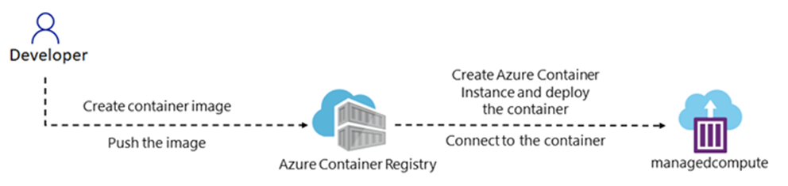

---
lab:
  az204Title: 'Lab 14 (Optional): Implement containerized solutions'
  az204Module: Optional lab
---

# Laboratorio 14: Implementación de soluciones en contenedores

## Interfaz de usuario de Microsoft Azure

Dada la naturaleza dinámica de las herramientas en la nube de Microsoft, puede experimentar cambios en la interfaz de usuario de Azure que se producen después del desarrollo de este contenido de entrenamiento. Como resultado, es posible que las instrucciones y los pasos del laboratorio no se alineen correctamente.

Microsoft actualiza este curso de entrenamiento cuando la comunidad nos alerta de los cambios necesarios. Sin embargo, las actualizaciones en la nube se producen con frecuencia, por lo que es posible que se produzcan cambios en la interfaz de usuario antes de que se actualice este contenido de entrenamiento. **Si esto ocurre, adáptese a los cambios y, a continuación, trabaje con ellos en los laboratorios según sea necesario.**

## Instructions

### Antes de comenzar

#### Inicio de sesión al entorno de laboratorio

Inicie sesión en la máquina virtual (VM) de Windows 11 con las credenciales siguientes:

- Nombre de usuario: `Admin`
- Contraseña: `Pa55w.rd`

> **Nota**: El instructor le proporcionará instrucciones para conectarse al entorno de laboratorio virtual.

#### Revisión de las aplicaciones instaladas

Busque la barra de tareas en el escritorio de Windows 11. La barra de tareas contiene los iconos de las aplicaciones que usará en este laboratorio:

- Microsoft Edge

## Escenario de laboratorio

En este laboratorio, se verá cómo crear e implementar contenedores en la instancia de Container Registry mediante una aplicación .NET y archivos de Docker.


## Diagrama de la arquitectura



### Ejercicio 1: Creación y ejecución de contenedores en Azure

#### Tarea 1: Creación de una instancia de Container Registry

1. En la barra de tareas, seleccione el icono de **Microsoft Edge**.

1. En la ventana del explorador, vaya a Azure Portal en `https://portal.azure.com` y, a continuación, inicie sesión con la cuenta que va a usar para este laboratorio.

1. En la esquina superior izquierda de la página, seleccione **+ Crear un recurso**.

1. En la barra de búsqueda, escriba **Container Registry** y seleccione **Container Registry** en los resultados.

1. Seleccione **Crear**.

1. En la pestaña **Aspectos básicos** de la página **Creación de un registro de contenedor**, rellene la siguiente información (deje el resto con sus valores predeterminados):

    | Configuración | Acción |
    | -- | -- |
    | Cuadro de texto **Suscripción** | Conserve los valores predeterminados |
    | Sección **Grupo de recursos** | Seleccione **Crear nuevo**, escriba **acr-sam-rg**y, luego, elija **Aceptar**. |
    | Sección **Nombre del registro** | escriba **acrsam**_[yourname]_. |
    | Lista desplegable de la **Ubicación** | Seleccione **Este de EE. UU**. |
    | Lista desplegable **Plan de precios** | Seleccione **Básica**. |

1. Seleccione **Revisar y crear** para revisar la configuración y, luego, elija **Crear**.

   > **Nota**: Espere a que la implementación se complete. Esta operación puede tardar unos minutos.

1. En la hoja **Información general**, seleccione el botón **Ir al recurso** para ir a la hoja de la cuenta del registro de contenedor recién creada.

1. En la hoja  **Registro de contenedor** , en la sección  **Configuración** , seleccione **Claves de acceso**.

1. En la hoja  **Claves de acceso** , habilite **Usuario administrador**.

1. Copie el valor del cuadro  **nombre de usuario** en el Portapapeles.
 
1. Abra el Bloc de notas y, luego, pegue el valor copiado en él. Usará este valor más adelante en este laboratorio.

Felicidades. Ha creado correctamente una instancia de Container Registry en Azure.

#### Tarea 2: Creación de un archivo de Docker para compilar una imagen de contenedor

1. Abra la ventana **Explorador de archivos**, vaya a **Allfiles (F):\\Allfiles\\Labs\\14\\Starter\\webapp-lab14** y abra un editor de texto.

1. Cree un nuevo archivo en el directorio del proyecto y llámelo `Dockerfile`.

1. En el archivo **Dockerfile**, agregue el siguiente código:

    ```docker

    FROM mcr.microsoft.com/dotnet/aspnet:8.0 AS base
    WORKDIR /app
    EXPOSE 5151

    ENV ASPNETCORE_URLS=http://+:5151

    # Creates a non-root user with an explicit UID and adds permission to access the /app folder
    # For more info, please refer to https://aka.ms/vscode-docker-dotnet-configure-containers
    RUN adduser -u 5678 --disabled-password --gecos "" appuser && chown -R appuser /app
    USER appuser

    FROM mcr.microsoft.com/dotnet/sdk:8.0 AS build
    ARG configuration=Release
    WORKDIR /src
    COPY ["<web-app-name>.csproj", "./"]
    RUN dotnet restore "<web-app-name>.csproj"
    COPY . .
    WORKDIR "/src/."
    RUN dotnet build "<web-app-name>.csproj" -c $configuration -o /app/build

    FROM build AS publish
    ARG configuration=Release
    RUN dotnet publish "<web-app-name>.csproj" -c $configuration -o /app/publish /p:UseAppHost=false

    FROM base AS final
    WORKDIR /app
    COPY --from=publish /app/publish .
    ENTRYPOINT ["dotnet", "<web-app-name>.dll"]

    ```

1. Asegúrese de reemplazar `<web-app-name>` por el nombre del proyecto de aplicación web de .NET 8.

1. Guarde el archivo **Dockerfile**.

Felicidades. Ha creado correctamente un archivo de Docker.

#### Tarea 3: Creación de un contenedor de Linux en Azure mediante un archivo de Docker

Asegúrese de que tiene instalada la CLI de Docker en la máquina local. Si no la tiene, instálela desde el sitio web de Docker.

1. En la barra de tareas, seleccione el icono **Terminal**.

1. En el símbolo del sistema abierto, escriba el siguiente comando y, a continuación, seleccione ENTRAR para iniciar sesión en la interfaz de la línea de comandos (CLI) de Azure:

    ```
    az login
    ```

1. En la ventana del explorador **Microsoft Edge**, escriba la dirección de correo electrónico y la contraseña de su cuenta Microsoft y, a continuación, seleccione **Iniciar sesión**.

1. Vuelva a la ventana del **símbolo del sistema** de Terminal abierta actualmente. Espere a que finalice el proceso de inicio de sesión.

1. Escriba el siguiente comando y, luego, seleccione Entrar para cambiar el directorio actual al directorio **Allfiles (F):\\Allfiles\\Labs\\14\\Starter\\webapp-lab14** que contiene los archivos de laboratorio:

    ```
    cd 'F:\Allfiles\Labs\14\Starter\webapp-lab14\'
    ```

1. Ejecute el comando siguiente para cargar el código fuente en el registro de contenedor y compilar la imagen de contenedor como una tarea de Container Registry, reemplace <your-registry-name> por el nombre de su instancia de Container Registry y <image-name> por un nuevo nombre para la imagen:

    ```
    az acr build --registry <your-registry-name> --image <image-name>:latest .
    ```
    
    > **Nota**: Espere a que se complete la tarea de compilación antes de continuar con este laboratorio.

2. Cierre el panel de **Terminal**.

3. Abra Azure Portal y vaya a su instancia de Container Registry.

4. En la hoja  **Registro de contenedor **, en la sección **Servicios** , seleccione **Repositorios**.

5. Compruebe que la imagen de Docker aparece en el repositorio.

Felicidades. Ha creado correctamente un contenedor de Linux en Azure mediante un archivo de Docker.

#### Tarea 4: Implementación de la imagen de contenedor de Linux en una instancia de contenedor de Azure

1. En Azure Portal, seleccione **+ Crear un recurso** en la esquina superior izquierda de la página.

1. En la barra de búsqueda, escriba **Container Instances** y seleccione **Container Instances** en los resultados.

1. Seleccione **Crear**.

1. En la pestaña **Aspectos básicos** de la página **Crear instancia de contenedor**, rellene la siguiente información (deje el resto con sus valores predeterminados ) y, luego, elija **Siguiente: Redes**.

    | Configuración | Acción |
    | -- | -- |
    | Cuadro de texto **Suscripción** | Conserve los valores predeterminados |
    | Lista desplegable del **grupo de recursos** | En la lista, seleccione **acr-sam-rg**. |
    | Sección **Nombre del contenedor** | escriba **acisam**_[yourname]_. |
    | Lista desplegable de **Región** | Seleccione **Este de EE. UU**. |
    | Lista desplegable **Zonas de disponibilidad** | Seleccione **1**. |
    | Sección **Origen de la imagen** | Seleccione **Azure Container Registry**. |
    | Lista desplegable de **Registro** | Seleccione **acrsam**_[yourname]_. |
    | Lista desplegable **Imagen** | Seleccione **docker-image-name**. |
    | Lista desplegable **Etiquetas de imagen** | Seleccione **docker-image-tag**. |
    | Sección **tipo de sistema operativo** | Seleccione **Linux**. |

1. En la pestaña **Redes**, rellene la siguiente información:

    | Configuración | Acción |
    | -- | -- |
    | Cuadro de texto **Etiqueta de nombre DNS** | Escriba un valor para **dns-name**. |
    | Cuadro de texto **Puertos** | Escriba un valor para **port-number**, que se encuentra en el archivo Dockerfile. |
    | Lista desplegable **Protocolo de puertos** | En la lista, seleccione **TCP**. |

1. Seleccione **Revisar y crear** para revisar la configuración y, luego, elija **Crear**.

   > **Nota**: Espere a que la implementación se complete. Esta operación puede tardar unos minutos.

1. En la hoja **Información general**, seleccione el botón **Ir al recurso** para ir a la hoja de la cuenta de la instancia de contenedor recién creada.

1. Copie la dirección IP pública del contenedor y péguela en el explorador web con el número de puerto y presione Entrar.

   `<public-IP-number>:<port-number>` o `<DNS-name>:<port-number>`

1. Debería ver la página web de la aplicación web de .NET.

Felicidades. Ha implementado correctamente un contenedor de Linux en la instancia de contenedor.

#### Tarea 5: Consulta de los contenedores existentes en el registro de contenedor

1. Abra Azure Portal y vaya el grupo de recursos que creó anteriormente.

1. Seleccione la instancia de Container Registry que creó en la tarea 4.

1. Seleccione la pestaña **Repositorios** y, luego, elija el repositorio en el que quiere consultar los contenedores existentes.

1. En la sección **Etiquetas**, puede ver la lista de etiquetas del repositorio seleccionado.

1. Seleccione una etiqueta para ver los detalles de la imagen de contenedor. Le mostrará los metadatos de la imagen de contenedor, incluido el tamaño, la fecha de creación y las capas asociadas.

1. También puede buscar imágenes de contenedor específicas mediante la barra de búsqueda de la parte superior de la página. Solo tiene que escribir una palabra clave o un nombre de etiqueta y seleccionar el botón **Buscar**.
   
1. Si quiere eliminar una imagen de contenedor, seleccione la etiqueta y, luego, elija el botón **Eliminar**.
   
   > **Nota**: Esta acción eliminará la imagen de contenedor de forma definitiva y no se podrá recuperar.

Eso es todo. Ha aprendido correctamente a consultar en Container Registry los contenedores existentes.

#### Revisar

Al realizar este ejercicio, ha adquirido experiencia práctica con la creación de una instancia de Container Registry, la creación de un archivo Dockerfile, la compilación de una imagen de contenedor y la implementación de un contenedor de Linux en una instancia de contenedor de Azure.


### Ejercicio 2: Creación y ejecución del servicio Azure Container Apps

En este ejercicio, aprenderá a crear una aplicación de contenedor mediante la imagen de contenedor que creó en el ejercicio uno.

#### Tarea 1: Creación de una aplicación de contenedor en Azure

1. En Azure Portal, seleccione **+ Crear un recurso** en la esquina superior izquierda de la página.

1. En la barra de búsqueda, escriba **Aplicación contenedora** y seleccione **Aplicación contenedora** en los resultados.

1. Seleccione **Crear**.

1. En la pestaña **Aspectos básicos** de la página **Crear aplicación de contenedor**, rellene la siguiente información (deje el resto con sus valores predeterminados) y, luego, elija **Siguiente: Contenedor**:

    | Configuración | Acción |
    | -- | -- |
    | Cuadro de texto **Suscripción** | Conserve los valores predeterminados |
    | Lista desplegable del **grupo de recursos** | En la lista, seleccione **acr-sam-rg**. |
    | Sección **Nombre de la aplicación contenedora** | escriba **acasam**_[yourname]_. |
    | Lista desplegable de **Región** | Seleccione **Este de EE. UU**. |
    | Lista desplegable **Entorno de Container Apps** | Conserve los valores predeterminados |

1. En la pestaña **Contenedor**, rellene la siguiente información y, luego, seleccione la pestaña **Entrada**:

    | Configuración | Acción |
    | -- | -- |
    | Casilla **Usar la imagen de inicio rápido** | Desactivar |
    | Cuadro de texto de **nombre** | Escriba *[nombre]***-container-app** |
    | Lista desplegable **Origen de la imagen** | Seleccione **Azure Container Registry**. |
    | Lista desplegable de **Registro** | Seleccione **acrsam**_[yourname]_. |
    | Lista desplegable **Imagen** | Seleccione **<docker-image-name>**. |
    | Lista desplegable **Etiquetas de imagen** | Seleccione **más reciente** |
    | Lista desplegable **CPU y memoria** | En la lista, seleccione **0,25 núcleos CPU, 0,5 Gi de memoria**. |

1. En la pestaña **Entrada**, rellene la siguiente información:

    | Configuración | Acción |
    | -- | -- |
    | Casilla **Entrada** | Seleccione **Habilitar**. |
    | Cuadro **Tráfico de entrada** | Seleccione **Aceptar tráfico desde cualquier lugar** |
    | Cuadro **Tipo de entrada** | Seleccione **HTTP** |
    | Cuadro **Modo de certificado de cliente** | Seleccione **Omitir**. |
    | Lista desplegable **Transporte** | Seleccione **Automático**. |
    | Cuadro de texto **Puerto de destino** | Escriba **5151** |

1. Seleccione **Revisar y crear** para revisar la configuración y, luego, elija **Crear**.

  > **Nota**: Espere a que la implementación se complete. Esta operación puede tardar unos minutos.

1. En la hoja **Información general**, seleccione el botón **Ir al recurso** para ir a la hoja de la cuenta de la aplicación contenedora recién creada.

1. En la hoja **Aplicación contenedora**, seleccione la **dirección URL de la aplicación** para ver la página web de la aplicación web de .NET.

Felicidades. Ha implementado correctamente un contenedor de Linux en la aplicación contenedora.


#### Revisar

Al realizar este ejercicio, ha adquirido experiencia práctica con la creación de una aplicación contenedora y la implementación de un contenedor de Linux en una aplicación contenedora de Azure.
